# Lesson 9.17: Error Handling in Graphs

> **Duration**: 35 min | **Section**: D - Production Agent Patterns

## 🎯 The Problem (3-5 min)

Agents call external services. External services fail.

> **Scenario**:
> - API timeout: "Connection timed out"
> - Rate limit: "Too many requests"
> - Invalid response: "Unexpected JSON format"
> - Infinite loop: Agent keeps calling same tool forever

Without proper error handling, one failure crashes the whole agent.

## 🔍 Where Agents Break

```mermaid
flowchart LR
    USER["User"] --> AGENT["Agent"]
    
    AGENT --> |"1. API Call"| LLM["LLM API"]
    AGENT --> |"2. Tool Use"| TOOL["External Tool"]
    AGENT --> |"3. Parse"| PARSE["Response Parser"]
    AGENT --> |"4. Loop"| LOOP["Iteration Limit"]
    
    LLM -.->|"Timeout"| FAIL1["❌"]
    TOOL -.->|"Rate Limit"| FAIL2["❌"]
    PARSE -.->|"Bad Format"| FAIL3["❌"]
    LOOP -.->|"Infinite"| FAIL4["❌"]
    
    style FAIL1 fill:#FFCDD2
    style FAIL2 fill:#FFCDD2
    style FAIL3 fill:#FFCDD2
    style FAIL4 fill:#FFCDD2
```



## ✅ Pattern 1: Try-Except in Nodes

```python
from typing import TypedDict, Annotated, Literal
from langgraph.graph import StateGraph, START, END
from langgraph.graph.message import add_messages
from langchain_openai import ChatOpenAI
import httpx

class State(TypedDict):
    messages: Annotated[list, add_messages]
    error: str | None
    retry_count: int

def call_api(state: State) -> State:
    """Node with error handling."""
    try:
        # Risky operation
        response = httpx.get("https://api.example.com/data", timeout=5.0)
        response.raise_for_status()
        data = response.json()
        
        return {
            "messages": [{"role": "assistant", "content": f"Got data: {data}"}],
            "error": None
        }
        
    except httpx.TimeoutException:
        return {
            "error": "API timeout - service may be slow",
            "retry_count": state.get("retry_count", 0) + 1
        }
        
    except httpx.HTTPStatusError as e:
        return {
            "error": f"API error: {e.response.status_code}",
            "retry_count": state.get("retry_count", 0) + 1
        }
        
    except Exception as e:
        return {
            "error": f"Unexpected error: {str(e)}",
            "retry_count": state.get("retry_count", 0) + 1
        }
```

## ✅ Pattern 2: Retry with Routing

```python
def should_retry(state: State) -> Literal["retry", "give_up", "success"]:
    """Decide whether to retry."""
    
    # Success path
    if state.get("error") is None:
        return "success"
    
    # Check retry count
    retry_count = state.get("retry_count", 0)
    max_retries = 3
    
    if retry_count >= max_retries:
        return "give_up"
    
    return "retry"

def handle_error(state: State) -> State:
    """Graceful error response."""
    error = state.get("error", "Unknown error")
    return {
        "messages": [{
            "role": "assistant",
            "content": f"I encountered an issue: {error}. Please try again later."
        }]
    }

# Build with retry loop
graph = StateGraph(State)
graph.add_node("call_api", call_api)
graph.add_node("handle_error", handle_error)

graph.add_edge(START, "call_api")
graph.add_conditional_edges("call_api", should_retry, {
    "retry": "call_api",      # Loop back
    "give_up": "handle_error", # Give up
    "success": END             # Done!
})
graph.add_edge("handle_error", END)

app = graph.compile()
```

## 🔍 Under the Hood: Retry Flow

```mermaid
stateDiagram-v2
    [*] --> call_api
    call_api --> check_result
    
    check_result --> call_api: retry (count < 3)
    check_result --> handle_error: give_up (count >= 3)
    check_result --> [*]: success
    
    handle_error --> [*]
    
    note right of call_api: Try count: 0, 1, 2...
    note right of check_result: Max retries: 3
```

## ✅ Pattern 3: Recursion Limit

LangGraph has built-in protection against infinite loops:

```python
from langgraph.graph import StateGraph
from langgraph.errors import GraphRecursionError

# Compile with recursion limit
app = graph.compile()

# Default is 25 iterations
# Override per invocation:
try:
    result = app.invoke(
        {"messages": [{"role": "user", "content": "Do something"}]},
        {"recursion_limit": 10}  # Stricter limit
    )
except GraphRecursionError:
    print("Agent exceeded maximum iterations!")
```

## ✅ Pattern 4: Tool Error Handling

```python
from langchain_core.tools import tool
from typing import TypedDict, Annotated
from langgraph.prebuilt import ToolNode
from langgraph.graph.message import add_messages
from langchain_openai import ChatOpenAI

# Tool that might fail
@tool
def search_database(query: str) -> str:
    """Search the database for information."""
    if "forbidden" in query.lower():
        raise ValueError("Search query contains forbidden terms")
    if len(query) < 3:
        raise ValueError("Query too short - need at least 3 characters")
    return f"Results for '{query}': [data1, data2, data3]"

# ToolNode handles errors automatically
# It returns error message to LLM instead of crashing
tools = [search_database]
tool_node = ToolNode(tools)

# LLM will see the error and can retry or respond appropriately
llm = ChatOpenAI(model="gpt-4").bind_tools(tools)

class State(TypedDict):
    messages: Annotated[list, add_messages]

def agent(state: State) -> State:
    response = llm.invoke(state["messages"])
    return {"messages": [response]}

# Demo the error handling
from langgraph.graph import StateGraph, START, END

graph = StateGraph(State)
graph.add_node("agent", agent)
graph.add_node("tools", tool_node)

def route(state: State):
    last_message = state["messages"][-1]
    if hasattr(last_message, "tool_calls") and last_message.tool_calls:
        return "tools"
    return END

graph.add_edge(START, "agent")
graph.add_conditional_edges("agent", route, {"tools": "tools", END: END})
graph.add_edge("tools", "agent")  # LLM sees error, can retry

app = graph.compile()

# When tool fails, LLM gets error message and can handle it
result = app.invoke({
    "messages": [{"role": "user", "content": "Search for 'ab'"}]  # Too short
})
# LLM will receive error: "Query too short" and respond appropriately
```

## ✅ Pattern 5: Fallback Nodes

```python
from typing import TypedDict, Annotated, Literal
from langgraph.graph import StateGraph, START, END
from langgraph.graph.message import add_messages
from langchain_openai import ChatOpenAI

class State(TypedDict):
    messages: Annotated[list, add_messages]
    primary_failed: bool
    result: str

# Primary: Fast, might fail
def primary_lookup(state: State) -> State:
    try:
        # Try fast/primary source
        result = fast_api_call()  # Might fail
        return {"result": result, "primary_failed": False}
    except Exception:
        return {"primary_failed": True}

# Fallback: Slower, more reliable
def fallback_lookup(state: State) -> State:
    # Slower but reliable source
    result = reliable_api_call()
    return {"result": result}

def route_after_primary(state: State) -> Literal["fallback", "respond"]:
    if state.get("primary_failed"):
        return "fallback"
    return "respond"

def respond(state: State) -> State:
    return {
        "messages": [{
            "role": "assistant",
            "content": state.get("result", "No result found")
        }]
    }

# Build with fallback
graph = StateGraph(State)
graph.add_node("primary", primary_lookup)
graph.add_node("fallback", fallback_lookup)
graph.add_node("respond", respond)

graph.add_edge(START, "primary")
graph.add_conditional_edges("primary", route_after_primary, {
    "fallback": "fallback",
    "respond": "respond"
})
graph.add_edge("fallback", "respond")
graph.add_edge("respond", END)
```

## 🔍 Fallback Flow


## ✅ Pattern 6: Timeout Wrapper

```python
import asyncio
from typing import TypedDict, Annotated
from langgraph.graph.message import add_messages

class State(TypedDict):
    messages: Annotated[list, add_messages]
    error: str | None

async def slow_operation():
    """Simulates a slow API call."""
    await asyncio.sleep(10)  # Takes 10 seconds
    return "Result"

async def with_timeout_node(state: State) -> State:
    """Node with timeout protection."""
    try:
        # Set 5 second timeout
        result = await asyncio.wait_for(
            slow_operation(),
            timeout=5.0
        )
        return {
            "messages": [{"role": "assistant", "content": result}],
            "error": None
        }
    except asyncio.TimeoutError:
        return {
            "error": "Operation timed out after 5 seconds"
        }

# For sync graphs, use threading timeout:
from concurrent.futures import ThreadPoolExecutor, TimeoutError
import threading

def sync_with_timeout(state: State) -> State:
    """Sync node with timeout."""
    def slow_sync_operation():
        import time
        time.sleep(10)
        return "Result"
    
    with ThreadPoolExecutor() as executor:
        future = executor.submit(slow_sync_operation)
        try:
            result = future.result(timeout=5.0)
            return {"messages": [{"role": "assistant", "content": result}]}
        except TimeoutError:
            return {"error": "Operation timed out"}
```

## 🎯 Practice: Resilient Search Agent

```python
from typing import TypedDict, Annotated, Literal
from langgraph.graph import StateGraph, START, END
from langgraph.graph.message import add_messages
from langchain_openai import ChatOpenAI
from langchain_core.tools import tool
import random

# State
class State(TypedDict):
    messages: Annotated[list, add_messages]
    query: str
    search_result: str
    error: str | None
    retry_count: int
    used_fallback: bool

# Tools that can fail
@tool
def web_search(query: str) -> str:
    """Search the web (unreliable)."""
    # Simulate 50% failure rate
    if random.random() < 0.5:
        raise ConnectionError("Search API unavailable")
    return f"Web results for '{query}': [result1, result2]"

@tool
def local_search(query: str) -> str:
    """Search local knowledge base (reliable but limited)."""
    return f"Local results for '{query}': [cached_data]"

# Nodes
def try_web_search(state: State) -> State:
    """Try primary web search."""
    query = state.get("query", "")
    try:
        result = web_search.invoke(query)
        return {
            "search_result": result,
            "error": None,
            "used_fallback": False
        }
    except Exception as e:
        return {
            "error": str(e),
            "retry_count": state.get("retry_count", 0) + 1
        }

def try_local_search(state: State) -> State:
    """Fallback to local search."""
    query = state.get("query", "")
    result = local_search.invoke(query)
    return {
        "search_result": result,
        "error": None,
        "used_fallback": True
    }

def should_retry_or_fallback(state: State) -> Literal["retry", "fallback", "respond"]:
    """Decide next action."""
    if state.get("error") is None:
        return "respond"
    
    retry_count = state.get("retry_count", 0)
    if retry_count < 2:
        return "retry"
    return "fallback"

llm = ChatOpenAI(model="gpt-4")

def generate_response(state: State) -> State:
    """Generate final response."""
    result = state.get("search_result", "No results found")
    used_fallback = state.get("used_fallback", False)
    
    context = f"Search result: {result}"
    if used_fallback:
        context += " (Note: Used cached local data, may not be current)"
    
    response = llm.invoke([
        {"role": "system", "content": "Summarize search results. Mention if data is from cache."},
        {"role": "user", "content": context}
    ])
    
    return {"messages": [response]}

# Build resilient graph
graph = StateGraph(State)
graph.add_node("web_search", try_web_search)
graph.add_node("local_search", try_local_search)
graph.add_node("respond", generate_response)

graph.add_edge(START, "web_search")
graph.add_conditional_edges("web_search", should_retry_or_fallback, {
    "retry": "web_search",
    "fallback": "local_search",
    "respond": "respond"
})
graph.add_edge("local_search", "respond")
graph.add_edge("respond", END)

search_agent = graph.compile()

# Test
def demo():
    result = search_agent.invoke({
        "messages": [{"role": "user", "content": "Find info about Python"}],
        "query": "Python programming",
        "search_result": "",
        "error": None,
        "retry_count": 0,
        "used_fallback": False
    })
    
    print(f"Response: {result['messages'][-1].content}")
    print(f"Used fallback: {result['used_fallback']}")

# demo()  # Run multiple times to see retry/fallback behavior
```

## 🔑 Key Takeaways

| Pattern | Use Case |
|---------|----------|
| Try-Except | Catch errors, don't crash |
| Retry Loop | Transient failures (timeout, rate limit) |
| Recursion Limit | Prevent infinite loops |
| Fallback | Primary + backup sources |
| Timeout | Protect against slow operations |

## ❓ Common Questions

| Question | Answer |
|----------|--------|
| Default recursion limit? | 25 iterations |
| How to log errors? | Add logging in nodes, track in state |
| Retry with backoff? | Add delay: `time.sleep(2 ** retry_count)` |
| Notify on failure? | Add alerting node before handle_error |

---

## 📚 Further Reading

- [Error Handling Guide](https://langchain-ai.github.io/langgraph/how-tos/subgraph-persistence/) - Subgraph patterns
- [Streaming Errors](https://langchain-ai.github.io/langgraph/concepts/streaming/) - Error handling in streams
- [Production Tips](https://langchain-ai.github.io/langgraph/concepts/application_structure/) - Real-world patterns
