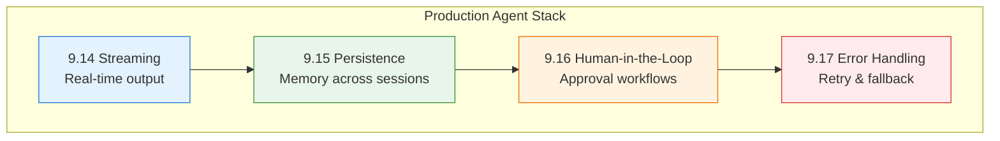
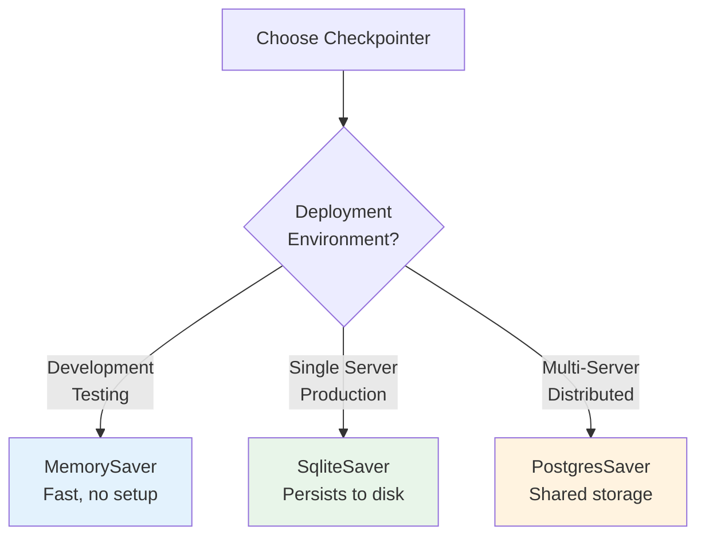
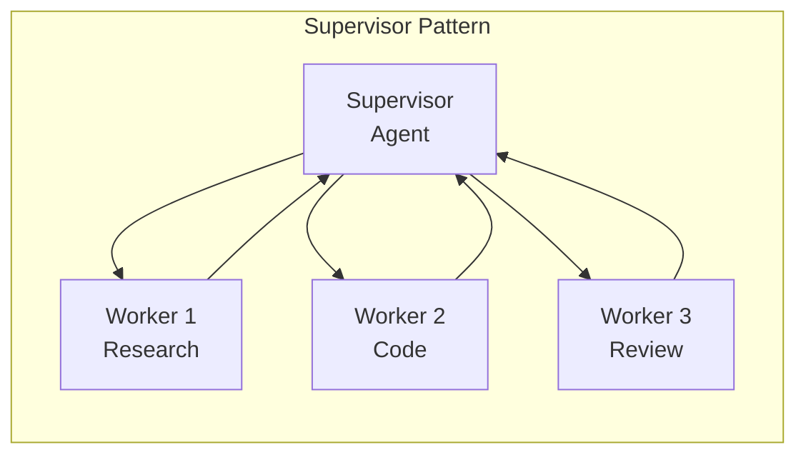

# Lesson 9.18: Production Agent Patterns Q&A

> **Duration**: 30 min | **Section**: D - Production Agent Patterns

## 🎯 Section D Recap

You've learned the production patterns that make agents reliable:



## 📊 Pattern Summary Table

| Pattern | Problem Solved | Key Components |
|---------|----------------|----------------|
| **Streaming** | Slow perceived response | `stream()`, `stream_mode` |
| **Persistence** | Memory across sessions | `MemorySaver`, `thread_id` |
| **Human-in-the-Loop** | Need approval for actions | `interrupt()`, `Command(resume=)` |
| **Error Handling** | External services fail | Try-except, retry, fallback |

## ❓ Q&A: Production Patterns

### Q1: When should I use streaming vs regular invoke?

**Use Streaming When:**
- Response takes > 2 seconds
- User needs progress feedback
- Building chat interfaces
- Long tool execution sequences

**Use Invoke When:**
- Quick operations (< 1 second)
- Background/batch processing
- Simple question-answer
- API backends

```python
# Fast operation - invoke is fine
result = agent.invoke({"query": "What's 2+2?"})

# Slow operation - use streaming
for chunk in agent.stream({"query": "Analyze this 100-page document"}):
    print(chunk, end="", flush=True)
```

### Q2: MemorySaver vs SqliteSaver - which should I use?



| Checkpointer | Persistence | Multi-Server | Use Case |
|--------------|-------------|--------------|----------|
| MemorySaver | No (RAM only) | ❌ | Dev/testing |
| SqliteSaver | Yes (file) | ❌ | Single server |
| PostgresSaver | Yes (database) | ✅ | Production cluster |

### Q3: How do I integrate human-in-the-loop with a web app?

```python
# Backend Pattern

from fastapi import FastAPI
from langgraph.types import Command

app = FastAPI()
# agent = your compiled graph with checkpointer

@app.post("/chat")
async def chat(message: str, thread_id: str):
    config = {"configurable": {"thread_id": thread_id}}
    
    result = agent.invoke(
        {"messages": [{"role": "user", "content": message}]},
        config=config
    )
    
    # Check if waiting for approval
    state = agent.get_state(config)
    if state.next:
        # Return pending state to frontend
        return {
            "status": "pending_approval",
            "thread_id": thread_id,
            "approval_request": state.tasks[0].interrupts[0].value
        }
    
    return {"status": "complete", "response": result["messages"][-1].content}

@app.post("/approve")
async def approve(thread_id: str, decision: dict):
    config = {"configurable": {"thread_id": thread_id}}
    
    # Resume with user's decision
    result = agent.invoke(
        Command(resume=decision),
        config=config
    )
    
    return {"status": "complete", "response": result["messages"][-1].content}
```

### Q4: What's the best retry strategy?

**Exponential Backoff with Jitter:**

```python
import time
import random

def retry_with_backoff(state: State) -> State:
    retry_count = state.get("retry_count", 0)
    
    if retry_count > 0:
        # Exponential backoff: 1s, 2s, 4s, 8s...
        base_delay = 2 ** retry_count
        # Add jitter to prevent thundering herd
        jitter = random.uniform(0, 0.5) * base_delay
        delay = base_delay + jitter
        
        time.sleep(min(delay, 30))  # Cap at 30 seconds
    
    try:
        result = make_api_call()
        return {"result": result, "error": None}
    except Exception as e:
        return {"error": str(e), "retry_count": retry_count + 1}
```

| Attempt | Base Delay | With Jitter |
|---------|------------|-------------|
| 1 | 2s | 2-3s |
| 2 | 4s | 4-6s |
| 3 | 8s | 8-12s |
| 4 | 16s | 16-24s |

### Q5: How do I prevent infinite loops in agents?

**Three Lines of Defense:**

```python
# 1. Recursion limit (built-in)
result = agent.invoke(state, {"recursion_limit": 15})

# 2. Max iterations in state
class State(TypedDict):
    messages: Annotated[list, add_messages]
    iteration_count: int

def agent_node(state: State) -> State:
    count = state.get("iteration_count", 0) + 1
    
    if count > 10:
        return {
            "messages": [{"role": "assistant", "content": "Reached max iterations"}],
            "iteration_count": count
        }
    
    # Normal processing...
    return {"iteration_count": count, ...}

# 3. Tool call limit
def route(state: State) -> str:
    tool_calls = sum(1 for m in state["messages"] if hasattr(m, "tool_calls"))
    if tool_calls > 20:
        return END
    # Normal routing...
```

### Q6: How do I debug a failing graph?

**Step 1: Enable Tracing**

```python
import os
os.environ["LANGCHAIN_TRACING_V2"] = "true"
os.environ["LANGCHAIN_API_KEY"] = "your-key"
# View traces at smith.langchain.com
```

**Step 2: Log Node Execution**

```python
def my_node(state: State) -> State:
    print(f"[my_node] Input state: {state}")
    
    # Processing...
    result = process(state)
    
    print(f"[my_node] Output: {result}")
    return result
```

**Step 3: Inspect State at Breakpoints**

```python
# After each stream chunk
for chunk in agent.stream(state, config):
    print(f"Chunk: {chunk}")
    current_state = agent.get_state(config)
    print(f"State: {current_state}")
```

### Q7: Can I run multiple agents together?

Yes! Multi-agent patterns:



```python
# Simplified multi-agent
def supervisor(state: State) -> State:
    """Decides which worker to call."""
    # Analyze task and route to appropriate worker
    ...

def researcher(state: State) -> State:
    """Research agent - gathers information."""
    ...

def coder(state: State) -> State:
    """Coding agent - writes code."""
    ...

# Connect them in a graph with conditional routing
```

### Q8: What's the cost of using checkpointers?

| Aspect | MemorySaver | SqliteSaver |
|--------|-------------|-------------|
| Speed | ~0ms | ~1-5ms per checkpoint |
| Storage | RAM limited | Disk limited |
| Startup | Instant | ~100ms file open |
| Cost | Free | Free (disk space) |

**Note:** State size affects performance. Large states (many messages) = slower checkpoints.

## 🎯 Production Checklist

Before deploying an agent to production:

- [ ] **Streaming**: Implemented for long operations
- [ ] **Persistence**: Using appropriate checkpointer
- [ ] **Error Handling**: Try-except in all external calls
- [ ] **Retry Logic**: Exponential backoff for transient failures
- [ ] **Fallbacks**: Backup sources for critical data
- [ ] **Recursion Limit**: Set appropriate limit
- [ ] **Human Approval**: For high-risk actions
- [ ] **Logging**: Tracing enabled, errors logged
- [ ] **Timeouts**: Set on all API calls
- [ ] **Rate Limits**: Respected for external APIs

## 🧪 Complete Production Agent Template

```python
from typing import TypedDict, Annotated, Literal
from langgraph.graph import StateGraph, START, END
from langgraph.graph.message import add_messages
from langgraph.checkpoint.memory import MemorySaver
from langgraph.prebuilt import ToolNode
from langgraph.types import interrupt, Command
from langchain_openai import ChatOpenAI
from langchain_core.tools import tool
import logging

# Setup logging
logging.basicConfig(level=logging.INFO)
logger = logging.getLogger(__name__)

# State with error tracking
class State(TypedDict):
    messages: Annotated[list, add_messages]
    error: str | None
    retry_count: int
    requires_approval: bool

# Tools
@tool
def safe_action(query: str) -> str:
    """A safe action that doesn't need approval."""
    return f"Processed: {query}"

@tool  
def risky_action(target: str) -> str:
    """A risky action that needs approval."""
    return f"Modified: {target}"

tools = [safe_action, risky_action]
tool_node = ToolNode(tools)

# LLM
llm = ChatOpenAI(model="gpt-4").bind_tools(tools)

# Nodes
def agent(state: State) -> State:
    """Main agent node with error handling."""
    logger.info(f"Agent called with {len(state['messages'])} messages")
    
    try:
        response = llm.invoke(state["messages"])
        
        # Check if risky tool is being called
        requires_approval = False
        if hasattr(response, "tool_calls"):
            for tc in response.tool_calls:
                if tc["name"] == "risky_action":
                    requires_approval = True
                    break
        
        return {
            "messages": [response],
            "error": None,
            "requires_approval": requires_approval
        }
        
    except Exception as e:
        logger.error(f"Agent error: {e}")
        return {
            "error": str(e),
            "retry_count": state.get("retry_count", 0) + 1
        }

def approval_node(state: State) -> State:
    """Request human approval for risky actions."""
    last_message = state["messages"][-1]
    tool_call = last_message.tool_calls[0]
    
    approval = interrupt({
        "action": "risky_action",
        "details": tool_call,
        "message": "This action requires approval"
    })
    
    if not approval.get("approved"):
        return {
            "messages": [{
                "role": "assistant",
                "content": "Action cancelled by user."
            }],
            "requires_approval": False
        }
    
    return {"requires_approval": False}  # Proceed to tools

def error_handler(state: State) -> State:
    """Handle unrecoverable errors gracefully."""
    error = state.get("error", "Unknown error")
    logger.warning(f"Error handler: {error}")
    
    return {
        "messages": [{
            "role": "assistant",
            "content": f"I encountered an issue and couldn't complete the request. Error: {error}"
        }],
        "error": None
    }

# Routing
def route_agent(state: State) -> Literal["tools", "approve", "error", END]:
    # Check for errors first
    if state.get("error"):
        if state.get("retry_count", 0) < 3:
            return "agent"  # Retry
        return "error"  # Give up
    
    last_message = state["messages"][-1]
    
    # Check for tool calls
    if hasattr(last_message, "tool_calls") and last_message.tool_calls:
        if state.get("requires_approval"):
            return "approve"
        return "tools"
    
    return END

def route_approval(state: State) -> Literal["tools", END]:
    # After approval, either proceed to tools or end (if cancelled)
    last_message = state["messages"][-1]
    if hasattr(last_message, "tool_calls") and last_message.tool_calls:
        return "tools"
    return END

# Build graph
graph = StateGraph(State)
graph.add_node("agent", agent)
graph.add_node("tools", tool_node)
graph.add_node("approve", approval_node)
graph.add_node("error", error_handler)

graph.add_edge(START, "agent")
graph.add_conditional_edges("agent", route_agent, {
    "tools": "tools",
    "approve": "approve",
    "error": "error",
    "agent": "agent",  # Retry loop
    END: END
})
graph.add_conditional_edges("approve", route_approval, {
    "tools": "tools",
    END: END
})
graph.add_edge("tools", "agent")
graph.add_edge("error", END)

# Compile with checkpointer
memory = MemorySaver()
production_agent = graph.compile(checkpointer=memory)

# Usage with streaming
def run_production_agent(message: str, thread_id: str = "default"):
    config = {"configurable": {"thread_id": thread_id}}
    
    # Stream for responsive UI
    for chunk in production_agent.stream(
        {
            "messages": [{"role": "user", "content": message}],
            "error": None,
            "retry_count": 0,
            "requires_approval": False
        },
        config=config,
        stream_mode="updates"
    ):
        print(f"Update: {chunk}")
    
    # Check for pending approval
    state = production_agent.get_state(config)
    if state.next:
        print("Awaiting approval...")
        return {"status": "pending", "thread_id": thread_id}
    
    return {"status": "complete", "messages": state.values["messages"]}
```

## � Common Pitfalls

| Pitfall | Problem | Solution |
|---------|---------|----------|
| No streaming for slow ops | Users think app is frozen | Always stream for >2s operations |
| MemorySaver in production | Data lost on restart | Use SqliteSaver or PostgresSaver |
| Blocking on approval | No feedback to user | Return pending status, poll for state |
| Retry without backoff | Hammers failing service | Exponential backoff with jitter |
| No recursion limit | Agent burns tokens forever | Set `recursion_limit` in config |
| Large state checkpoints | Slow persistence, high memory | Prune old messages, summarize history |

## �🔑 Key Takeaways

1. **Streaming** → Better user experience for slow operations
2. **Persistence** → Memory across sessions and crashes
3. **Human-in-the-Loop** → Safety for high-risk actions
4. **Error Handling** → Graceful degradation, not crashes
5. **Combined** → Production-ready agent architecture

---

## 📚 Further Reading

- [Production Guide](https://langchain-ai.github.io/langgraph/concepts/application_structure/) - Deployment patterns
- [LangSmith](https://docs.smith.langchain.com/) - Tracing & debugging
- [Multi-agent](https://langchain-ai.github.io/langgraph/concepts/multi_agent/) - Supervisor pattern

---

## 🏁 Section Complete!

You now have the patterns to build production-ready agents:
- ✅ Streaming for responsive UIs
- ✅ Persistence for stateful conversations
- ✅ Human approval for safety
- ✅ Error handling for reliability

**Next**: Section E - MCP Integration (connecting agents to external tools via Model Context Protocol)
