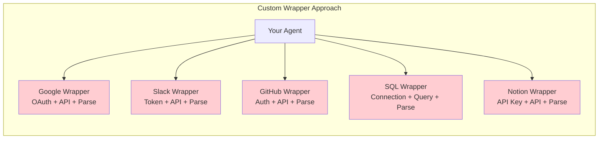
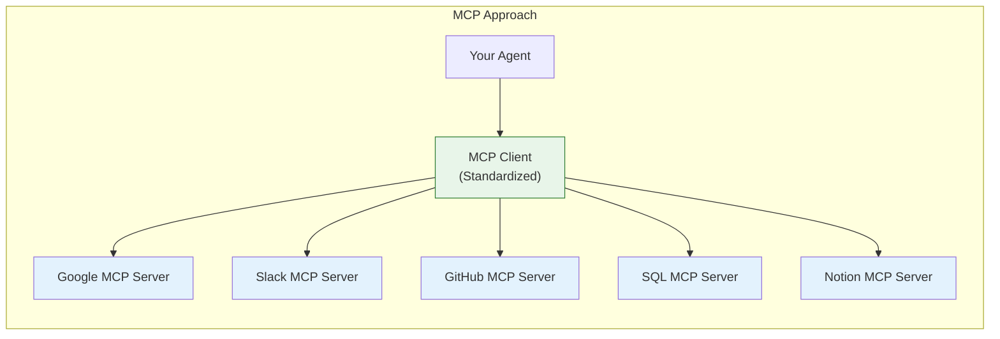

# Lesson 9.19: The Integration Problem

> **Duration**: 5 min | **Section**: E - Model Context Protocol (MCP)

## 🎯 The Problem

Your agent needs data from everywhere:

> **Scenario**:
> - "Read my Google Drive files"
> - "Check Slack for recent messages"
> - "Look up GitHub issues"
> - "Query the SQL database"
> - "Search my Notion workspace"

For each, you need a custom wrapper. That doesn't scale.

## ❌ The Custom Wrapper Nightmare

**Problems:**
1. **Duplication** - Each wrapper has auth, error handling, parsing
2. **Maintenance** - APIs change, each wrapper needs updates
3. **No Standards** - Every wrapper has different interface
4. **Context Bloat** - Agent needs to know every API's quirks

## 🔢 The Numbers

| Integration | Setup Time | Maintenance/Year | Lines of Code |
|-------------|-----------|------------------|---------------|
| Google Drive | 8 hours | 4 hours | 500 |
| Slack | 4 hours | 2 hours | 300 |
| GitHub | 6 hours | 3 hours | 400 |
| PostgreSQL | 3 hours | 2 hours | 200 |
| Notion | 5 hours | 3 hours | 350 |
| **Total** | **26 hours** | **14 hours** | **1,750** |

And that's just 5 integrations. Enterprise systems have 50+.

## ✅ What If: One Protocol For All?

**Benefits:**
1. **One Interface** - Learn once, use everywhere
2. **Pre-built Servers** - Community maintains integrations
3. **Standard Protocol** - JSON-RPC, consistent across all tools
4. **Context Efficient** - Agent sees standardized tool definitions

## 🔑 The Analogy

**Before USB**:
- Different cable for every device
- Printer cable ≠ Camera cable ≠ Phone cable
- Drawer full of cables

**After USB**:
- One cable type
- One protocol
- Any device works

**MCP is USB-C for AI.**

## 🎯 What You'll Learn

| Lesson | Topic |
|--------|-------|
| 9.20 | MCP Under the Hood - How the protocol works |
| 9.21 | MCP Servers - Building and consuming |
| 9.22 | MCP + LangGraph - Integration with agents |
| 9.23 | Code Mode vs Tool Mode - Efficiency patterns |
| 9.24 | MCP Q&A - Security, custom servers |
| 9.25 | Module Review - Complete agent architecture |

---

**Next**: 9.20 - MCP Under the Hood
