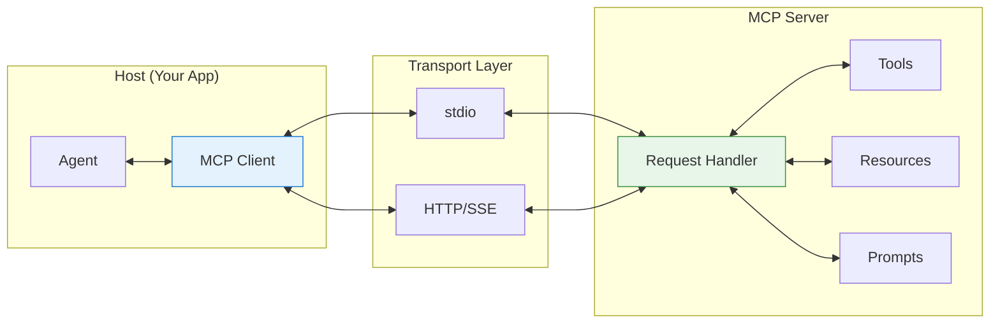
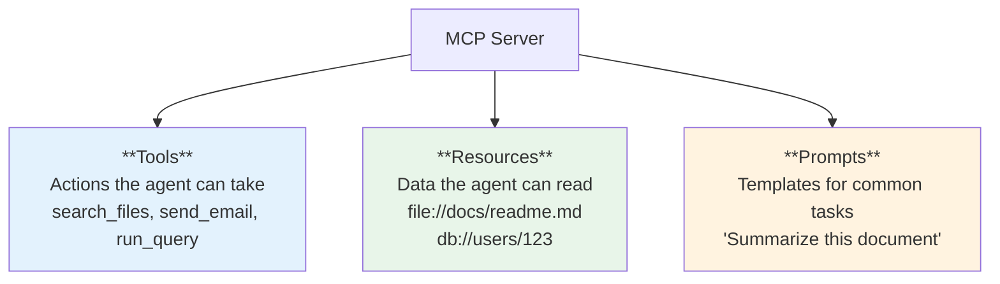
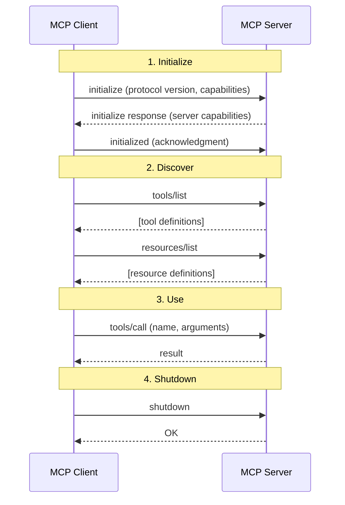
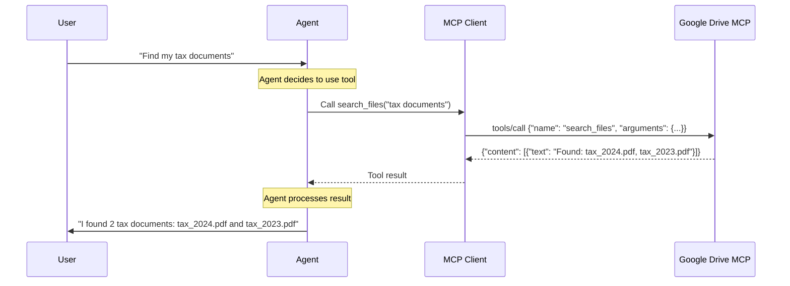
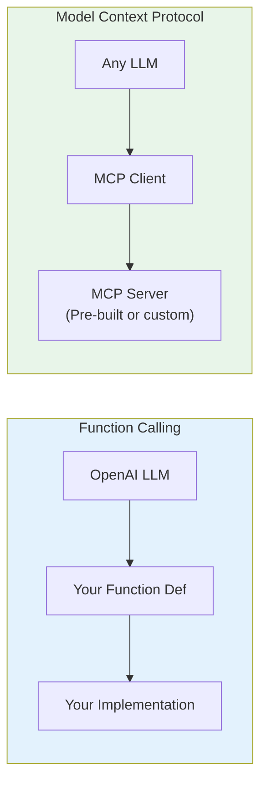

# Lesson 9.20: MCP Under the Hood

> **Duration**: 30 min | **Section**: E - Model Context Protocol (MCP)

## 🎯 The Problem (3-5 min)

You understand the "why" of MCP - standardization. But how does it actually work?

> **Question**: How does an agent talk to a Google Drive MCP server? What messages are exchanged?

## 🔍 MCP Architecture



## 🧩 Core Concepts

### 1. The Protocol

MCP uses **JSON-RPC 2.0** - a simple request/response format:

```json
// Request
{
  "jsonrpc": "2.0",
  "id": 1,
  "method": "tools/call",
  "params": {
    "name": "search_files",
    "arguments": {"query": "project reports"}
  }
}

// Response
{
  "jsonrpc": "2.0",
  "id": 1,
  "result": {
    "content": [
      {"type": "text", "text": "Found 3 files: report1.pdf, report2.pdf, report3.pdf"}
    ]
  }
}
```

### 2. Three Primitives

MCP servers expose three types of capabilities:



| Primitive | What It Is | Example |
|-----------|-----------|---------|
| **Tools** | Functions the agent can call | `search_files(query)`, `send_slack_message(channel, text)` |
| **Resources** | Data sources to read | `file://path/to/doc.pdf`, `notion://page/abc123` |
| **Prompts** | Reusable prompt templates | "Summarize this {document}" |

### 3. Transport Layers

How client and server communicate:

| Transport | Use Case | How It Works |
|-----------|----------|--------------|
| **stdio** | Local processes | Spawn server process, communicate via stdin/stdout |
| **HTTP + SSE** | Remote servers | HTTP POST for requests, Server-Sent Events for streaming |

```python
# stdio transport - local server
# Server runs as child process
# Client writes to stdin, reads from stdout

# HTTP transport - remote server
# Client sends HTTP POST requests
# Server responds with JSON or streams via SSE
```

## 🔄 Connection Lifecycle



## 💡 Tool Definition Schema

Tools are defined with JSON Schema:

```json
{
  "name": "search_files",
  "description": "Search for files matching a query",
  "inputSchema": {
    "type": "object",
    "properties": {
      "query": {
        "type": "string",
        "description": "The search query"
      },
      "max_results": {
        "type": "integer",
        "description": "Maximum results to return",
        "default": 10
      }
    },
    "required": ["query"]
  }
}
```

This is exactly what LLMs need for function calling!

## 🔍 How Agent Uses MCP



## ✅ Python MCP Client Example

```python
from mcp import ClientSession, StdioServerParameters
from mcp.client.stdio import stdio_client
import asyncio

async def main():
    # Connect to an MCP server running locally
    server_params = StdioServerParameters(
        command="python",
        args=["my_mcp_server.py"]
    )
    
    async with stdio_client(server_params) as (read, write):
        async with ClientSession(read, write) as session:
            # Initialize connection
            await session.initialize()
            
            # Discover available tools
            tools = await session.list_tools()
            print("Available tools:")
            for tool in tools.tools:
                print(f"  - {tool.name}: {tool.description}")
            
            # Call a tool
            result = await session.call_tool(
                "search_files",
                arguments={"query": "project reports"}
            )
            
            print(f"Result: {result.content}")

asyncio.run(main())
```

## 🔍 MCP vs OpenAI Function Calling

| Aspect | OpenAI Function Calling | MCP |
|--------|------------------------|-----|
| **Scope** | Single LLM provider | Any LLM, any tool |
| **Discovery** | Define in code | Dynamic from server |
| **Execution** | You implement | Server implements |
| **Ecosystem** | OpenAI only | Growing community |
| **Transport** | API call | stdio, HTTP, SSE |



## 🔑 Key Takeaways

1. **JSON-RPC 2.0** - Standard request/response protocol
2. **Three Primitives** - Tools, Resources, Prompts
3. **Two Transports** - stdio (local), HTTP+SSE (remote)
4. **Dynamic Discovery** - Client queries server for capabilities
5. **Standard Schema** - JSON Schema for tool definitions

## ❓ Common Questions

| Question | Answer |
|----------|--------|
| Who created MCP? | Anthropic, now open standard |
| Is it OpenAI compatible? | Yes, can convert MCP tools to OpenAI format |
| Security? | Servers control access, can require auth |
| Existing servers? | Google, Slack, GitHub, Postgres, and many more |

---

## 📚 Further Reading

- [MCP Specification](https://modelcontextprotocol.io/docs/concepts/architecture) - Official docs
- [MCP SDK](https://github.com/modelcontextprotocol/python-sdk) - Python implementation
- [MCP Servers](https://github.com/modelcontextprotocol/servers) - Pre-built servers

---

**Next**: 9.21 - Building and consuming MCP Servers
