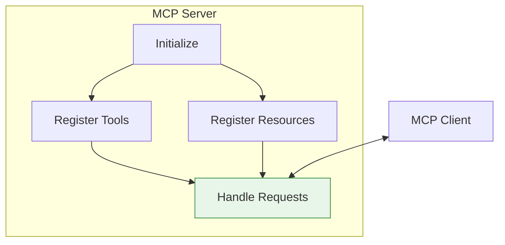
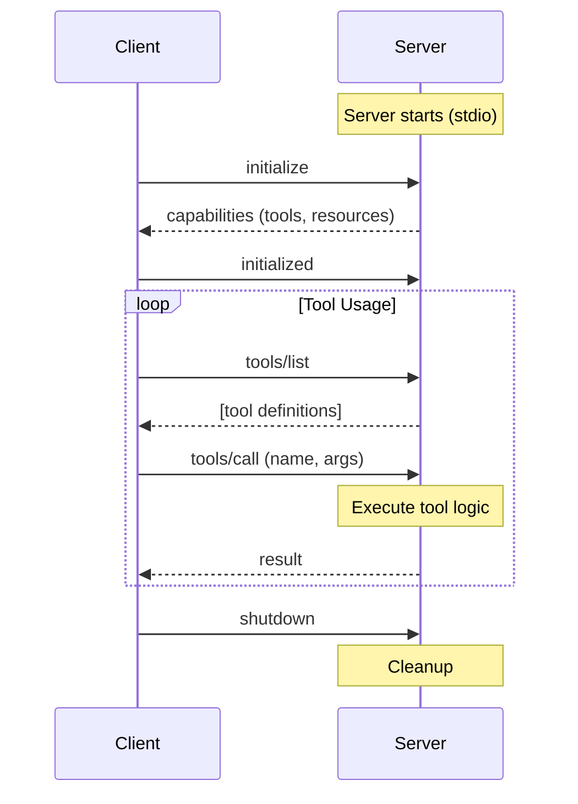

# Lesson 9.21: MCP Servers

> **Duration**: 35 min | **Section**: E - Model Context Protocol (MCP)

## 🎯 The Problem (3-5 min)

You understand the MCP protocol. Now you need to:
1. **Use** existing MCP servers
2. **Build** your own for custom data sources

> **Scenario**: Your company has a proprietary database. There's no pre-built MCP server for it. You need to build one.

## 🔍 Server Architecture



## ✅ Building Your First MCP Server

```python
# my_mcp_server.py
from mcp.server import Server
from mcp.server.stdio import stdio_server
from mcp.types import Tool, TextContent
import asyncio

# Create server instance
server = Server("my-data-server")

# Register tools
@server.list_tools()
async def list_tools() -> list[Tool]:
    """Return available tools."""
    return [
        Tool(
            name="search_database",
            description="Search the company database for records",
            inputSchema={
                "type": "object",
                "properties": {
                    "query": {
                        "type": "string",
                        "description": "Search query"
                    },
                    "table": {
                        "type": "string",
                        "description": "Table to search",
                        "enum": ["customers", "orders", "products"]
                    }
                },
                "required": ["query"]
            }
        ),
        Tool(
            name="get_record",
            description="Get a specific record by ID",
            inputSchema={
                "type": "object",
                "properties": {
                    "table": {"type": "string"},
                    "id": {"type": "integer"}
                },
                "required": ["table", "id"]
            }
        )
    ]

# Handle tool calls
@server.call_tool()
async def call_tool(name: str, arguments: dict) -> list[TextContent]:
    """Execute a tool and return results."""
    
    if name == "search_database":
        # Your actual database search logic here
        query = arguments.get("query", "")
        table = arguments.get("table", "customers")
        
        # Simulated results
        results = [
            {"id": 1, "name": f"Result for '{query}' in {table}"},
            {"id": 2, "name": f"Another match for '{query}'"}
        ]
        
        return [TextContent(
            type="text",
            text=f"Found {len(results)} records:\n{results}"
        )]
    
    elif name == "get_record":
        table = arguments["table"]
        record_id = arguments["id"]
        
        # Simulated lookup
        record = {"id": record_id, "table": table, "data": "..."}
        
        return [TextContent(
            type="text",
            text=f"Record: {record}"
        )]
    
    else:
        return [TextContent(type="text", text=f"Unknown tool: {name}")]

# Run the server
async def main():
    async with stdio_server() as (read, write):
        await server.run(read, write, server.create_initialization_options())

if __name__ == "__main__":
    asyncio.run(main())
```

## 🔍 Under the Hood: Server Lifecycle



## ✅ Adding Resources

Resources are data sources agents can read:

```python
from mcp.types import Resource, TextContent
from mcp.server import Server

server = Server("file-server")

# Register resources
@server.list_resources()
async def list_resources() -> list[Resource]:
    """List available resources."""
    return [
        Resource(
            uri="file://docs/readme.md",
            name="README",
            description="Project documentation",
            mimeType="text/markdown"
        ),
        Resource(
            uri="file://data/config.json",
            name="Config",
            description="Application configuration",
            mimeType="application/json"
        )
    ]

# Read resource content
@server.read_resource()
async def read_resource(uri: str) -> str:
    """Return resource content."""
    
    if uri == "file://docs/readme.md":
        # Read actual file
        with open("docs/readme.md", "r") as f:
            return f.read()
    
    elif uri == "file://data/config.json":
        with open("data/config.json", "r") as f:
            return f.read()
    
    else:
        raise ValueError(f"Unknown resource: {uri}")
```

## ✅ Using Pre-built MCP Servers

Many MCP servers already exist. Here's how to use them:

```python
# Install pre-built server
# pip install mcp-server-sqlite

from mcp import ClientSession, StdioServerParameters
from mcp.client.stdio import stdio_client
import asyncio

async def use_sqlite_server():
    # Connect to SQLite MCP server
    server_params = StdioServerParameters(
        command="mcp-server-sqlite",
        args=["--db-path", "my_database.db"]
    )
    
    async with stdio_client(server_params) as (read, write):
        async with ClientSession(read, write) as session:
            await session.initialize()
            
            # List available tools
            tools = await session.list_tools()
            print("SQLite tools:")
            for tool in tools.tools:
                print(f"  {tool.name}: {tool.description}")
            
            # Execute a query
            result = await session.call_tool(
                "read_query",
                arguments={"query": "SELECT * FROM users LIMIT 5"}
            )
            print(f"Query result: {result.content}")

asyncio.run(use_sqlite_server())
```

## 🔍 Popular Pre-built Servers

| Server | Purpose | Install |
|--------|---------|---------|
| **mcp-server-sqlite** | SQLite database access | `pip install mcp-server-sqlite` |
| **mcp-server-filesystem** | File system operations | `pip install mcp-server-filesystem` |
| **mcp-server-github** | GitHub API access | `pip install mcp-server-github` |
| **mcp-server-slack** | Slack messaging | `pip install mcp-server-slack` |
| **mcp-server-postgres** | PostgreSQL access | `pip install mcp-server-postgres` |

## ✅ Complete Server with Tools + Resources

```python
from mcp.server import Server
from mcp.server.stdio import stdio_server
from mcp.types import Tool, Resource, TextContent
import asyncio
import json

# Create server
server = Server("company-data-server")

# Simulated database
DATABASE = {
    "customers": [
        {"id": 1, "name": "Acme Corp", "revenue": 1000000},
        {"id": 2, "name": "TechStart", "revenue": 500000},
    ],
    "products": [
        {"id": 1, "name": "Widget Pro", "price": 99.99},
        {"id": 2, "name": "Widget Lite", "price": 49.99},
    ]
}

# --- TOOLS ---

@server.list_tools()
async def list_tools() -> list[Tool]:
    return [
        Tool(
            name="query_database",
            description="Query the company database",
            inputSchema={
                "type": "object",
                "properties": {
                    "table": {
                        "type": "string",
                        "enum": ["customers", "products"]
                    },
                    "filter": {
                        "type": "object",
                        "description": "Filter criteria (e.g., {'id': 1})"
                    }
                },
                "required": ["table"]
            }
        ),
        Tool(
            name="calculate_total_revenue",
            description="Calculate total revenue across all customers",
            inputSchema={"type": "object", "properties": {}}
        )
    ]

@server.call_tool()
async def call_tool(name: str, arguments: dict) -> list[TextContent]:
    if name == "query_database":
        table = arguments["table"]
        filter_criteria = arguments.get("filter", {})
        
        results = DATABASE.get(table, [])
        
        # Apply filter if provided
        if filter_criteria:
            results = [
                r for r in results
                if all(r.get(k) == v for k, v in filter_criteria.items())
            ]
        
        return [TextContent(
            type="text",
            text=json.dumps(results, indent=2)
        )]
    
    elif name == "calculate_total_revenue":
        total = sum(c["revenue"] for c in DATABASE["customers"])
        return [TextContent(
            type="text",
            text=f"Total revenue: ${total:,.2f}"
        )]
    
    return [TextContent(type="text", text=f"Unknown tool: {name}")]

# --- RESOURCES ---

@server.list_resources()
async def list_resources() -> list[Resource]:
    return [
        Resource(
            uri="data://schema",
            name="Database Schema",
            description="Schema of available tables",
            mimeType="application/json"
        ),
        Resource(
            uri="data://stats",
            name="Quick Stats",
            description="Summary statistics",
            mimeType="text/plain"
        )
    ]

@server.read_resource()
async def read_resource(uri: str) -> str:
    if uri == "data://schema":
        schema = {
            "customers": ["id", "name", "revenue"],
            "products": ["id", "name", "price"]
        }
        return json.dumps(schema, indent=2)
    
    elif uri == "data://stats":
        customer_count = len(DATABASE["customers"])
        product_count = len(DATABASE["products"])
        total_revenue = sum(c["revenue"] for c in DATABASE["customers"])
        return f"Customers: {customer_count}\nProducts: {product_count}\nTotal Revenue: ${total_revenue:,}"
    
    raise ValueError(f"Unknown resource: {uri}")

# --- RUN ---

async def main():
    async with stdio_server() as (read, write):
        await server.run(read, write, server.create_initialization_options())

if __name__ == "__main__":
    asyncio.run(main())
```

## 🎯 Practice: Build a Notes MCP Server

```python
# notes_server.py
from mcp.server import Server
from mcp.server.stdio import stdio_server
from mcp.types import Tool, Resource, TextContent
import asyncio
import json
from pathlib import Path

server = Server("notes-server")

NOTES_DIR = Path("./notes")
NOTES_DIR.mkdir(exist_ok=True)

# --- TOOLS ---

@server.list_tools()
async def list_tools() -> list[Tool]:
    return [
        Tool(
            name="create_note",
            description="Create a new note",
            inputSchema={
                "type": "object",
                "properties": {
                    "title": {"type": "string"},
                    "content": {"type": "string"}
                },
                "required": ["title", "content"]
            }
        ),
        Tool(
            name="search_notes",
            description="Search notes by keyword",
            inputSchema={
                "type": "object",
                "properties": {
                    "query": {"type": "string"}
                },
                "required": ["query"]
            }
        ),
        Tool(
            name="delete_note",
            description="Delete a note by title",
            inputSchema={
                "type": "object",
                "properties": {
                    "title": {"type": "string"}
                },
                "required": ["title"]
            }
        )
    ]

@server.call_tool()
async def call_tool(name: str, arguments: dict) -> list[TextContent]:
    if name == "create_note":
        title = arguments["title"]
        content = arguments["content"]
        
        # Save note as file
        note_path = NOTES_DIR / f"{title}.md"
        note_path.write_text(content)
        
        return [TextContent(type="text", text=f"Created note: {title}")]
    
    elif name == "search_notes":
        query = arguments["query"].lower()
        matches = []
        
        for note_file in NOTES_DIR.glob("*.md"):
            content = note_file.read_text()
            if query in content.lower() or query in note_file.stem.lower():
                matches.append({
                    "title": note_file.stem,
                    "preview": content[:100] + "..."
                })
        
        return [TextContent(
            type="text",
            text=f"Found {len(matches)} notes:\n{json.dumps(matches, indent=2)}"
        )]
    
    elif name == "delete_note":
        title = arguments["title"]
        note_path = NOTES_DIR / f"{title}.md"
        
        if note_path.exists():
            note_path.unlink()
            return [TextContent(type="text", text=f"Deleted: {title}")]
        else:
            return [TextContent(type="text", text=f"Note not found: {title}")]
    
    return [TextContent(type="text", text=f"Unknown tool: {name}")]

# --- RESOURCES ---

@server.list_resources()
async def list_resources() -> list[Resource]:
    resources = []
    for note_file in NOTES_DIR.glob("*.md"):
        resources.append(Resource(
            uri=f"note://{note_file.stem}",
            name=note_file.stem,
            description=f"Note: {note_file.stem}",
            mimeType="text/markdown"
        ))
    return resources

@server.read_resource()
async def read_resource(uri: str) -> str:
    # Parse URI: note://title
    title = uri.replace("note://", "")
    note_path = NOTES_DIR / f"{title}.md"
    
    if note_path.exists():
        return note_path.read_text()
    raise ValueError(f"Note not found: {title}")

# --- RUN ---

async def main():
    async with stdio_server() as (read, write):
        await server.run(read, write, server.create_initialization_options())

if __name__ == "__main__":
    asyncio.run(main())
```

## 🔑 Key Takeaways

1. **@server.list_tools()** - Defines available tools
2. **@server.call_tool()** - Handles tool execution
3. **@server.list_resources()** - Defines readable data sources
4. **@server.read_resource()** - Returns resource content
5. **stdio_server()** - Standard transport for local servers

## ❓ Common Questions

| Question | Answer |
|----------|--------|
| How to test my server? | Use `mcp` CLI: `mcp dev my_server.py` |
| HTTP instead of stdio? | Use `sse_server()` for remote deployment |
| Authentication? | Implement in your handlers, MCP doesn't enforce |
| Error handling? | Raise exceptions, client receives error response |

---

## 📚 Further Reading

- [Building MCP Servers](https://modelcontextprotocol.io/docs/concepts/servers) - Official guide
- [Python SDK](https://github.com/modelcontextprotocol/python-sdk) - Reference implementation
- [Server Examples](https://github.com/modelcontextprotocol/servers) - Community servers

---

**Next**: 9.22 - Integrating MCP with LangGraph agents
