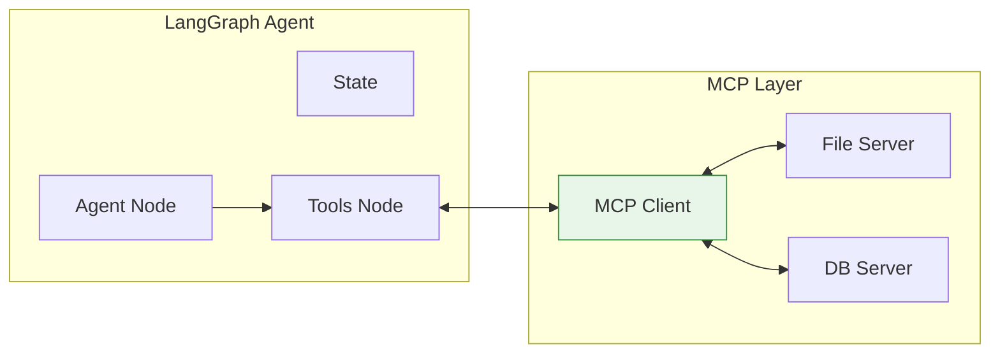
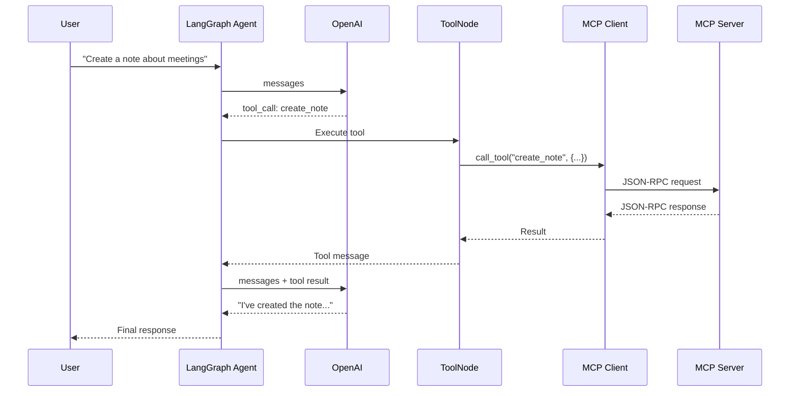
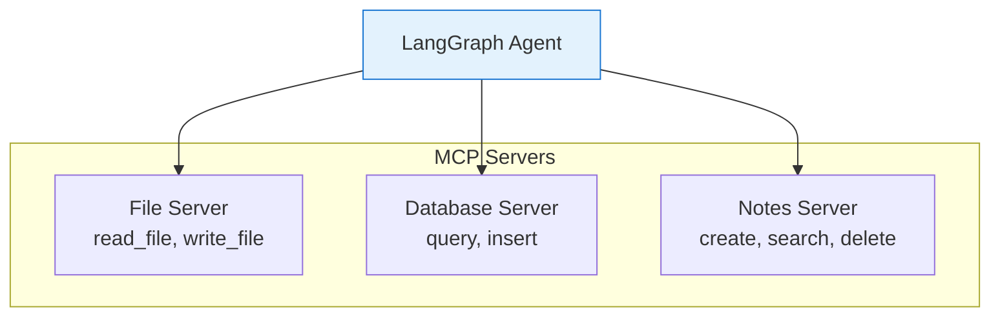

# Lesson 9.22: MCP + LangGraph

> **Duration**: 30 min | **Section**: E - Model Context Protocol (MCP)

## 🎯 The Problem (3-5 min)

You have:
- A LangGraph agent (state machine with LLM)
- MCP servers with tools

How do you connect them?

> **Goal**: Agent uses MCP tools like native LangGraph tools.

## 🔍 The Integration Pattern



## ✅ Step 1: Convert MCP Tools to LangChain Tools

```python
from langchain_core.tools import StructuredTool
from mcp import ClientSession, StdioServerParameters
from mcp.client.stdio import stdio_client
import asyncio

async def get_mcp_tools(server_command: str, server_args: list[str]) -> list[StructuredTool]:
    """Convert MCP server tools to LangChain tools."""
    
    server_params = StdioServerParameters(
        command=server_command,
        args=server_args
    )
    
    async with stdio_client(server_params) as (read, write):
        async with ClientSession(read, write) as session:
            await session.initialize()
            
            # Get MCP tools
            mcp_tools = await session.list_tools()
            
            langchain_tools = []
            for tool in mcp_tools.tools:
                # Create a callable for this tool
                def make_caller(tool_name):
                    async def call_tool(**kwargs):
                        async with stdio_client(server_params) as (r, w):
                            async with ClientSession(r, w) as s:
                                await s.initialize()
                                result = await s.call_tool(tool_name, kwargs)
                                return result.content[0].text
                    return call_tool
                
                # Convert to LangChain tool
                lc_tool = StructuredTool.from_function(
                    func=lambda **kwargs: asyncio.run(make_caller(tool.name)(**kwargs)),
                    name=tool.name,
                    description=tool.description,
                    args_schema=tool.inputSchema  # Already JSON Schema
                )
                langchain_tools.append(lc_tool)
            
            return langchain_tools
```

## ✅ Step 2: Using MCP Adapter (Recommended)

LangChain provides a cleaner adapter:

```python
# pip install langchain-mcp-adapters

from langchain_mcp_adapters import MCPToolkit
from mcp import StdioServerParameters

# Create toolkit from MCP server
toolkit = MCPToolkit(
    server_params=StdioServerParameters(
        command="python",
        args=["my_mcp_server.py"]
    )
)

# Get tools
async def get_tools():
    await toolkit.initialize()
    return toolkit.get_tools()

# Now use with LangGraph
tools = asyncio.run(get_tools())
```

## ✅ Complete Integration Example

```python
from typing import TypedDict, Annotated, Literal
from langgraph.graph import StateGraph, START, END
from langgraph.graph.message import add_messages
from langgraph.prebuilt import ToolNode
from langgraph.checkpoint.memory import MemorySaver
from langchain_openai import ChatOpenAI
from langchain_core.tools import StructuredTool
from mcp import ClientSession, StdioServerParameters
from mcp.client.stdio import stdio_client
import asyncio

# --- MCP Tool Wrapper ---

class MCPToolWrapper:
    """Wraps an MCP server's tools for use with LangChain."""
    
    def __init__(self, server_command: str, server_args: list[str]):
        self.server_params = StdioServerParameters(
            command=server_command,
            args=server_args
        )
        self._tools: list[StructuredTool] = []
    
    async def initialize(self):
        """Connect to server and create tool wrappers."""
        async with stdio_client(self.server_params) as (read, write):
            async with ClientSession(read, write) as session:
                await session.initialize()
                mcp_tools = await session.list_tools()
                
                for mcp_tool in mcp_tools.tools:
                    self._tools.append(
                        self._create_tool(mcp_tool.name, mcp_tool.description)
                    )
    
    def _create_tool(self, name: str, description: str) -> StructuredTool:
        """Create a LangChain tool that calls the MCP server."""
        
        server_params = self.server_params  # Capture for closure
        
        def call_sync(**kwargs):
            return asyncio.run(self._call_mcp_tool(name, kwargs))
        
        return StructuredTool.from_function(
            func=call_sync,
            name=name,
            description=description
        )
    
    async def _call_mcp_tool(self, name: str, arguments: dict) -> str:
        """Actually call the MCP tool."""
        async with stdio_client(self.server_params) as (read, write):
            async with ClientSession(read, write) as session:
                await session.initialize()
                result = await session.call_tool(name, arguments)
                return result.content[0].text if result.content else "No result"
    
    @property
    def tools(self) -> list[StructuredTool]:
        return self._tools

# --- LangGraph Agent with MCP Tools ---

class State(TypedDict):
    messages: Annotated[list, add_messages]

async def create_mcp_agent():
    # Initialize MCP tools
    mcp = MCPToolWrapper(
        server_command="python",
        server_args=["notes_server.py"]
    )
    await mcp.initialize()
    
    # Create LLM with MCP tools
    llm = ChatOpenAI(model="gpt-4")
    llm_with_tools = llm.bind_tools(mcp.tools)
    
    # Agent node
    def agent(state: State) -> State:
        response = llm_with_tools.invoke(state["messages"])
        return {"messages": [response]}
    
    # Router
    def route(state: State) -> Literal["tools", END]:
        last_message = state["messages"][-1]
        if hasattr(last_message, "tool_calls") and last_message.tool_calls:
            return "tools"
        return END
    
    # Build graph
    graph = StateGraph(State)
    graph.add_node("agent", agent)
    graph.add_node("tools", ToolNode(mcp.tools))
    
    graph.add_edge(START, "agent")
    graph.add_conditional_edges("agent", route, {"tools": "tools", END: END})
    graph.add_edge("tools", "agent")
    
    # Compile
    memory = MemorySaver()
    return graph.compile(checkpointer=memory)

# --- Usage ---

async def main():
    agent = await create_mcp_agent()
    
    config = {"configurable": {"thread_id": "mcp-demo"}}
    
    # Use MCP tools through the agent
    result = agent.invoke(
        {"messages": [{"role": "user", "content": "Create a note called 'meeting' with content 'Discuss Q4 goals'"}]},
        config=config
    )
    
    print(result["messages"][-1].content)
    
    # Search notes
    result = agent.invoke(
        {"messages": [{"role": "user", "content": "Search my notes for 'goals'"}]},
        config=config
    )
    
    print(result["messages"][-1].content)

# asyncio.run(main())
```

## 🔍 Under the Hood: Tool Call Flow



## ✅ Multi-Server Setup

Connect to multiple MCP servers:

```python
async def create_multi_mcp_agent():
    # Connect to multiple MCP servers
    file_mcp = MCPToolWrapper("python", ["file_server.py"])
    db_mcp = MCPToolWrapper("python", ["database_server.py"])
    notes_mcp = MCPToolWrapper("python", ["notes_server.py"])
    
    # Initialize all
    await asyncio.gather(
        file_mcp.initialize(),
        db_mcp.initialize(),
        notes_mcp.initialize()
    )
    
    # Combine all tools
    all_tools = file_mcp.tools + db_mcp.tools + notes_mcp.tools
    
    # Create agent with all tools
    llm = ChatOpenAI(model="gpt-4").bind_tools(all_tools)
    
    # ... rest of graph setup
```



## 🎯 Practice: Research Agent with MCP

```python
from typing import TypedDict, Annotated, Literal
from langgraph.graph import StateGraph, START, END
from langgraph.graph.message import add_messages
from langgraph.prebuilt import ToolNode
from langchain_openai import ChatOpenAI
from langchain_core.tools import tool

# Simulated MCP tools (in real app, these come from MCP servers)
@tool
def web_search(query: str) -> str:
    """Search the web for information."""
    return f"Web results for '{query}': [result1, result2, result3]"

@tool
def read_file(path: str) -> str:
    """Read a file from the filesystem."""
    return f"Contents of {path}: [file content here]"

@tool
def save_summary(title: str, content: str) -> str:
    """Save a research summary to notes."""
    return f"Saved summary '{title}' with {len(content)} characters"

# State
class ResearchState(TypedDict):
    messages: Annotated[list, add_messages]
    topic: str
    sources: list[str]
    summary: str

# Nodes
tools = [web_search, read_file, save_summary]
llm = ChatOpenAI(model="gpt-4").bind_tools(tools)

def research_agent(state: ResearchState) -> ResearchState:
    """Agent that researches a topic using MCP tools."""
    
    # Build system prompt
    system = f"""You are a research assistant. 
    Topic: {state.get('topic', 'Unknown')}
    
    Use tools to:
    1. Search the web for information
    2. Read relevant files
    3. Save your summary when done
    
    Be thorough but concise."""
    
    messages = [{"role": "system", "content": system}] + state["messages"]
    response = llm.invoke(messages)
    
    return {"messages": [response]}

def route(state: ResearchState) -> Literal["tools", "summarize", END]:
    last_message = state["messages"][-1]
    
    if hasattr(last_message, "tool_calls") and last_message.tool_calls:
        # Check if saving summary
        for tc in last_message.tool_calls:
            if tc["name"] == "save_summary":
                return "summarize"
        return "tools"
    
    return END

def extract_summary(state: ResearchState) -> ResearchState:
    """Extract summary from the conversation."""
    # In real app, parse the save_summary call
    messages = state["messages"]
    summary = "Research summary extracted from conversation"
    return {"summary": summary}

# Build graph
graph = StateGraph(ResearchState)
graph.add_node("agent", research_agent)
graph.add_node("tools", ToolNode(tools))
graph.add_node("summarize", extract_summary)

graph.add_edge(START, "agent")
graph.add_conditional_edges("agent", route, {
    "tools": "tools",
    "summarize": "tools",  # Execute save_summary first
    END: END
})
graph.add_edge("tools", "agent")
graph.add_edge("summarize", END)

research_app = graph.compile()

# Use
def research_topic(topic: str):
    result = research_app.invoke({
        "messages": [{"role": "user", "content": f"Research this topic: {topic}"}],
        "topic": topic,
        "sources": [],
        "summary": ""
    })
    
    return result["messages"][-1].content

# print(research_topic("AI trends 2025"))
```

## 🔑 Key Takeaways

1. **MCPToolWrapper** - Converts MCP tools to LangChain format
2. **ToolNode** - Executes tools (MCP or native) automatically
3. **Multi-server** - Connect to multiple MCP servers
4. **Standard flow** - Agent → LLM → Tool call → MCP → Result → LLM → Response

## ❓ Common Questions

| Question | Answer |
|----------|--------|
| Connection overhead? | Keep session open for multiple calls if possible |
| Async vs sync? | MCP is async, wrap for sync LangGraph nodes |
| Error handling? | Wrap MCP calls in try-except, return error messages |
| Tool discovery? | Call `list_tools()` at startup, cache results |

---

## 📚 Further Reading

- [LangChain MCP Adapters](https://python.langchain.com/docs/integrations/tools/mcp) - Official integration
- [LangGraph + Tools](https://langchain-ai.github.io/langgraph/how-tos/tool-calling/) - Tool patterns
- [MCP Client SDK](https://github.com/modelcontextprotocol/python-sdk) - Python SDK

---

**Next**: 9.23 - Code Mode vs Tool Mode (98.7% context reduction)
