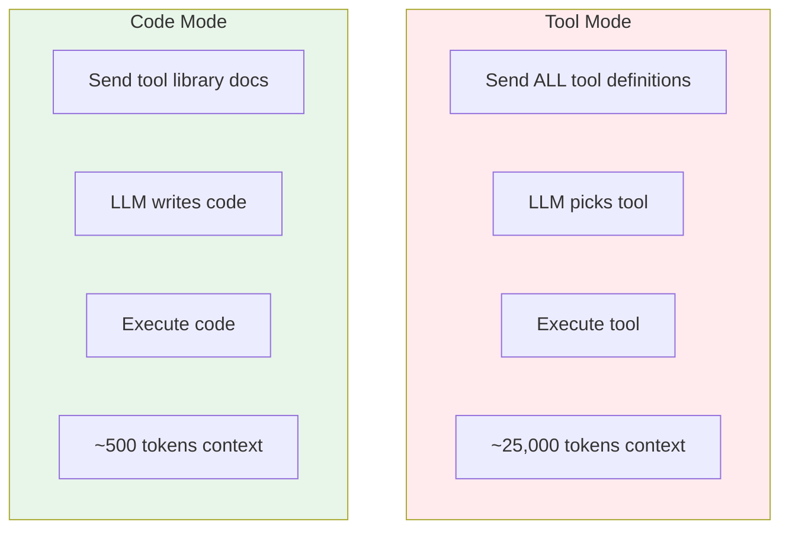
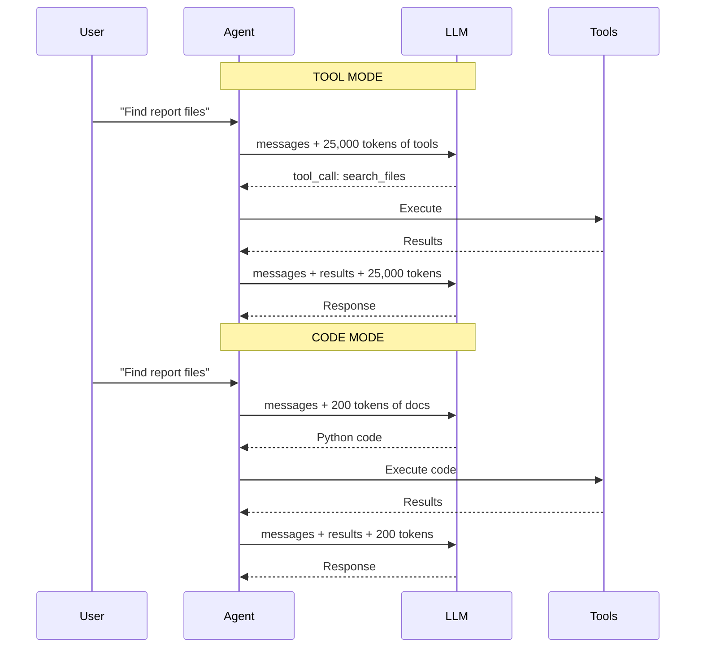
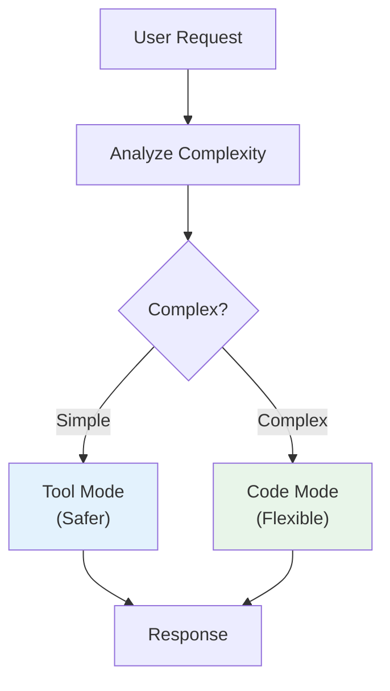

# Lesson 9.23: Code Mode vs Tool Mode

> **Duration**: 25 min | **Section**: E - Model Context Protocol (MCP)

## 🎯 The Problem (3-5 min)

Your agent has 50 MCP tools available. Each tool definition is ~500 tokens.

> **Math**: 50 tools × 500 tokens = **25,000 tokens** just for tool definitions!

That's expensive and fills up context fast.

## 🔍 The Two Approaches



## 📊 The Numbers (Real Example)

| Metric | Tool Mode | Code Mode | Difference |
|--------|-----------|-----------|------------|
| Context Size | 25,000 tokens | 500 tokens | **98% reduction** |
| Cost per call | $0.25 | $0.005 | **50x cheaper** |
| Flexibility | Limited to defined tools | Any logic possible | ∞ |
| Safety | Sandboxed tools | Needs sandboxing | Tool mode safer |

## 🔍 Tool Mode in Detail

Agent receives ALL tool definitions:

```python
# What the LLM sees in context (Tool Mode)
tools = [
    {
        "name": "search_files",
        "description": "Search for files matching a query",
        "parameters": {
            "type": "object",
            "properties": {
                "query": {"type": "string", "description": "Search query"},
                "max_results": {"type": "integer", "default": 10}
            },
            "required": ["query"]
        }
    },
    {
        "name": "read_file",
        "description": "Read contents of a file",
        "parameters": {
            "type": "object",
            "properties": {
                "path": {"type": "string", "description": "File path"}
            },
            "required": ["path"]
        }
    },
    # ... 48 more tools, each ~500 tokens
]

# Total: ~25,000 tokens of tool definitions
```

## 🔍 Code Mode in Detail

Agent receives a library reference:

```python
# What the LLM sees in context (Code Mode)
"""
Available library: `mcp_tools`

Functions:
- search_files(query: str, max_results: int = 10) -> list[str]
- read_file(path: str) -> str
- write_file(path: str, content: str) -> bool
- query_database(sql: str) -> list[dict]
- send_message(channel: str, text: str) -> bool

Write Python code using these functions.
"""

# Total: ~200 tokens
```

Agent writes executable code:

```python
# LLM generates this code
files = mcp_tools.search_files("quarterly report", max_results=5)
contents = []
for f in files:
    content = mcp_tools.read_file(f)
    contents.append(content)
result = "\n---\n".join(contents)
```

## ✅ Implementing Code Mode

```python
from typing import TypedDict, Annotated
from langgraph.graph import StateGraph, START, END
from langgraph.graph.message import add_messages
from langchain_openai import ChatOpenAI

# State
class State(TypedDict):
    messages: Annotated[list, add_messages]
    generated_code: str
    execution_result: str

# MCP Tools Library (exposed to generated code)
class MCPToolsLibrary:
    """Library of MCP tools for code execution."""
    
    def search_files(self, query: str, max_results: int = 10) -> list[str]:
        # Would call MCP server
        return [f"file_{i}.txt" for i in range(min(3, max_results))]
    
    def read_file(self, path: str) -> str:
        # Would call MCP server
        return f"Contents of {path}"
    
    def query_database(self, sql: str) -> list[dict]:
        # Would call MCP server
        return [{"id": 1, "name": "Example"}]

mcp_tools = MCPToolsLibrary()

# System prompt with library documentation
LIBRARY_DOCS = """
You have access to the `mcp_tools` library with these functions:

- search_files(query: str, max_results: int = 10) -> list[str]
  Search for files matching the query.

- read_file(path: str) -> str
  Read the contents of a file.

- query_database(sql: str) -> list[dict]
  Execute a SQL query and return results.

Write Python code to accomplish the user's request.
Assign the final result to a variable called `result`.
"""

# Nodes
llm = ChatOpenAI(model="gpt-4")

def generate_code(state: State) -> State:
    """LLM generates code to accomplish task."""
    
    response = llm.invoke([
        {"role": "system", "content": LIBRARY_DOCS + "\nOutput only Python code, no explanation."},
        *state["messages"]
    ])
    
    code = response.content.strip()
    # Remove markdown code blocks if present
    if code.startswith("```python"):
        code = code[9:]
    if code.startswith("```"):
        code = code[3:]
    if code.endswith("```"):
        code = code[:-3]
    
    return {"generated_code": code.strip()}

def execute_code(state: State) -> State:
    """Execute the generated code safely."""
    
    code = state["generated_code"]
    
    # Create safe execution environment
    safe_globals = {
        "mcp_tools": mcp_tools,
        "__builtins__": {
            "len": len,
            "str": str,
            "int": int,
            "list": list,
            "dict": dict,
            "range": range,
            "min": min,
            "max": max,
            "sum": sum,
            "print": print,  # For debugging
        }
    }
    safe_locals = {}
    
    try:
        exec(code, safe_globals, safe_locals)
        result = safe_locals.get("result", "Code executed successfully")
        return {"execution_result": str(result)}
    except Exception as e:
        return {"execution_result": f"Error: {str(e)}"}

def format_response(state: State) -> State:
    """Format final response for user."""
    
    response = llm.invoke([
        {"role": "system", "content": "Summarize the result for the user."},
        {"role": "user", "content": f"Code executed:\n{state['generated_code']}\n\nResult:\n{state['execution_result']}"}
    ])
    
    return {"messages": [response]}

# Build graph
graph = StateGraph(State)
graph.add_node("generate", generate_code)
graph.add_node("execute", execute_code)
graph.add_node("respond", format_response)

graph.add_edge(START, "generate")
graph.add_edge("generate", "execute")
graph.add_edge("execute", "respond")
graph.add_edge("respond", END)

code_agent = graph.compile()

# Use
def ask_code_agent(question: str):
    result = code_agent.invoke({
        "messages": [{"role": "user", "content": question}],
        "generated_code": "",
        "execution_result": ""
    })
    
    print("Generated Code:")
    print(result["generated_code"])
    print("\nResult:")
    print(result["execution_result"])
    print("\nResponse:")
    print(result["messages"][-1].content)

# ask_code_agent("Find all files about reports and count them")
```

## 🔍 Flow Comparison



## ✅ Hybrid Approach: Best of Both

```python
from typing import Literal

def route_by_complexity(state: State) -> Literal["tool_mode", "code_mode"]:
    """Use tool mode for simple, code mode for complex."""
    
    message = state["messages"][-1].content.lower()
    
    # Simple single-action tasks → Tool Mode (safer)
    simple_patterns = ["search for", "read file", "send message"]
    if any(p in message for p in simple_patterns):
        return "tool_mode"
    
    # Complex multi-step tasks → Code Mode (flexible)
    complex_patterns = ["and then", "for each", "combine", "analyze all"]
    if any(p in message for p in complex_patterns):
        return "code_mode"
    
    # Default to tool mode (safer)
    return "tool_mode"
```



## 🔒 Safety Considerations

| Concern | Tool Mode | Code Mode |
|---------|-----------|-----------|
| **Sandbox** | Tools are pre-defined | Must sandbox exec() |
| **Injection** | Low risk | Higher risk |
| **Scope** | Limited to tools | Arbitrary code |
| **Audit** | Easy to log tool calls | Harder to audit |

**Code Mode Safety Measures:**

```python
# 1. Restricted builtins
safe_builtins = {
    "len", "str", "int", "list", "dict",
    "range", "min", "max", "sum"
    # NO: open, eval, exec, import, __import__
}

# 2. Timeout execution
import signal

def timeout_handler(signum, frame):
    raise TimeoutError("Code execution timed out")

signal.signal(signal.SIGALRM, timeout_handler)
signal.alarm(5)  # 5 second timeout

try:
    exec(code, safe_globals, safe_locals)
finally:
    signal.alarm(0)

# 3. Memory limits
import resource
resource.setrlimit(resource.RLIMIT_AS, (100 * 1024 * 1024, -1))  # 100MB
```

## 🔑 Key Takeaways

| Aspect | Tool Mode | Code Mode |
|--------|-----------|-----------|
| Context | 25,000+ tokens | ~500 tokens |
| Flexibility | Fixed tools | Any logic |
| Safety | Sandboxed | Needs restrictions |
| Best for | Simple tasks | Complex multi-step |

**Use Tool Mode when:**
- Single action tasks
- Security is critical
- Need auditability

**Use Code Mode when:**
- Multi-step reasoning
- Many tools available
- Cost is a concern

## ❓ Common Questions

| Question | Answer |
|----------|--------|
| Is Code Mode safe? | With proper sandboxing, yes |
| Which is faster? | Similar - both call MCP |
| Can I mix them? | Yes, route by complexity |
| Production ready? | Tool Mode safer for production |

---

## 📚 Further Reading

- [Code Execution](https://python.langchain.com/docs/concepts/tool_calling/) - LangChain patterns
- [Sandboxing Python](https://docs.python.org/3/library/subprocess.html) - Safe execution
- [RestrictedPython](https://restrictedpython.readthedocs.io/) - Python sandbox library

---

**Next**: 9.24 - MCP Q&A (Security, Custom Servers, vs Function Calling)
