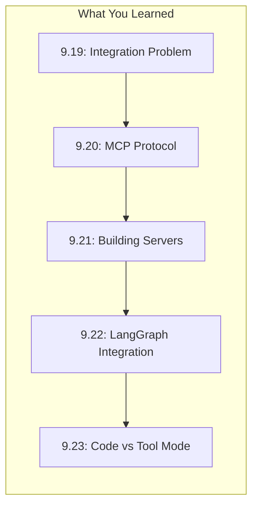
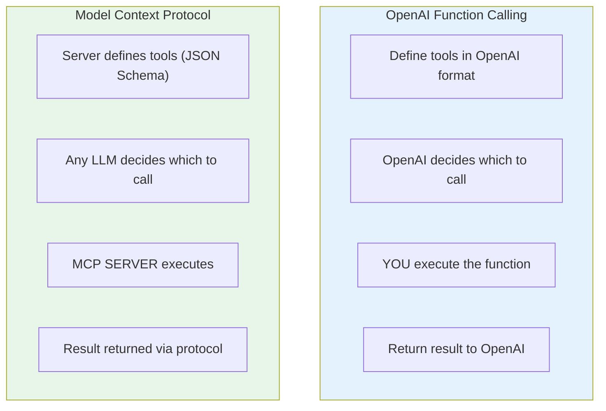
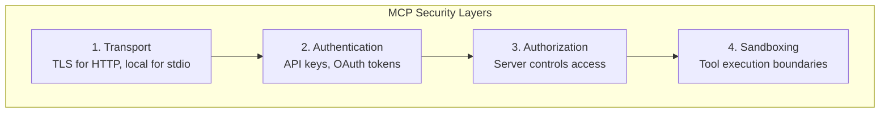
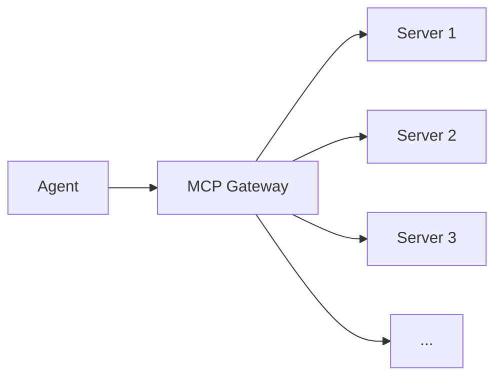

# Lesson 9.24: MCP Q&A

> **Duration**: 10 min | **Section**: E - Model Context Protocol (MCP)

## 🎯 Section E Recap

You've learned MCP - the universal protocol for agent-tool integration:



## ❓ Frequently Asked Questions

### Q1: MCP vs OpenAI Function Calling - What's the Difference?



| Aspect | OpenAI Functions | MCP |
|--------|------------------|-----|
| **Provider** | OpenAI only | Any LLM |
| **Execution** | You implement | Server implements |
| **Discovery** | Hardcoded | Dynamic from server |
| **Ecosystem** | Limited | Growing community |
| **Transport** | HTTP API | stdio, HTTP, SSE |
| **Reusability** | Per-project | Across projects |

**Key Insight**: OpenAI function calling is *how the LLM requests actions*. MCP is *how tools are discovered and executed*. They complement each other!

### Q2: Is MCP Secure?

**Layers of Security:**



| Layer | How to Implement |
|-------|------------------|
| **Transport** | Use HTTPS for remote servers |
| **Auth** | Pass tokens via environment/config |
| **Authz** | Server checks permissions per tool |
| **Sandbox** | Limit file paths, network access |

```python
# Example: Server with authorization
@server.call_tool()
async def call_tool(name: str, arguments: dict) -> list[TextContent]:
    # Check authorization
    user = get_current_user()  # From session/context
    if name == "delete_all" and not user.is_admin:
        raise PermissionError("Admin required")
    
    # Proceed with authorized call
    ...
```

### Q3: How Do I Build a Custom MCP Server?

**Minimal template:**

```python
from mcp.server import Server
from mcp.server.stdio import stdio_server
from mcp.types import Tool, TextContent
import asyncio

server = Server("my-server")

@server.list_tools()
async def list_tools() -> list[Tool]:
    return [
        Tool(
            name="my_tool",
            description="What it does",
            inputSchema={
                "type": "object",
                "properties": {
                    "arg1": {"type": "string"}
                },
                "required": ["arg1"]
            }
        )
    ]

@server.call_tool()
async def call_tool(name: str, arguments: dict) -> list[TextContent]:
    if name == "my_tool":
        result = do_something(arguments["arg1"])
        return [TextContent(type="text", text=result)]
    raise ValueError(f"Unknown: {name}")

async def main():
    async with stdio_server() as (read, write):
        await server.run(read, write, server.create_initialization_options())

if __name__ == "__main__":
    asyncio.run(main())
```

### Q4: Can I Use Existing APIs as MCP Servers?

Yes! Wrap any API:

```python
import httpx

@server.call_tool()
async def call_tool(name: str, arguments: dict) -> list[TextContent]:
    if name == "weather":
        city = arguments["city"]
        
        # Wrap existing API
        async with httpx.AsyncClient() as client:
            response = await client.get(
                f"https://api.weather.com/v1/{city}",
                headers={"Authorization": f"Bearer {API_KEY}"}
            )
            data = response.json()
        
        return [TextContent(type="text", text=f"Weather: {data}")]
```

### Q5: How Many MCP Servers Can I Connect?

No hard limit! Practical considerations:

| Servers | Latency | Recommendation |
|---------|---------|----------------|
| 1-5 | Minimal | Standard setup |
| 5-20 | Noticeable | Use connection pooling |
| 20+ | Significant | Consider gateway pattern |

**Gateway Pattern:**



### Q6: stdio vs HTTP - Which Should I Use?

| Transport | Use Case | Pros | Cons |
|-----------|----------|------|------|
| **stdio** | Local server | Fast, simple | Same machine only |
| **HTTP+SSE** | Remote server | Network access | More setup |

```python
# stdio - local development
server_params = StdioServerParameters(
    command="python",
    args=["my_server.py"]
)

# HTTP - production
# Server exposes HTTP endpoint
# Client connects via httpx/aiohttp
```

### Q7: How Do I Debug MCP Connections?

```python
# 1. Enable verbose logging
import logging
logging.basicConfig(level=logging.DEBUG)

# 2. Test server standalone
# python my_server.py
# Then use mcp CLI to test

# 3. Check connection
async with stdio_client(server_params) as (read, write):
    async with ClientSession(read, write) as session:
        result = await session.initialize()
        print(f"Server capabilities: {result.capabilities}")
        
        tools = await session.list_tools()
        print(f"Tools: {[t.name for t in tools.tools]}")
```

### Q8: What Pre-built Servers Exist?

| Server | Source | Purpose |
|--------|--------|---------|
| **mcp-server-filesystem** | Official | File operations |
| **mcp-server-sqlite** | Official | SQLite queries |
| **mcp-server-github** | Community | GitHub API |
| **mcp-server-postgres** | Community | PostgreSQL |
| **mcp-server-slack** | Community | Slack messaging |
| **mcp-server-notion** | Community | Notion API |

Find more: [github.com/modelcontextprotocol/servers](https://github.com/modelcontextprotocol/servers)

### Q9: How Does MCP Compare to LangChain Tools?

| Aspect | LangChain Tools | MCP |
|--------|----------------|-----|
| **Definition** | Python functions | JSON Schema + server |
| **Execution** | In-process | Separate process/server |
| **Sharing** | Code copy | Server reuse |
| **Ecosystem** | LangChain only | Universal |

**Best practice**: Use MCP for shared tools, LangChain for app-specific.

### Q10: What About Prompt Templates in MCP?

MCP supports prompts as a third primitive:

```python
from mcp.types import Prompt, PromptArgument

@server.list_prompts()
async def list_prompts() -> list[Prompt]:
    return [
        Prompt(
            name="summarize",
            description="Summarize a document",
            arguments=[
                PromptArgument(
                    name="document",
                    description="The document to summarize",
                    required=True
                ),
                PromptArgument(
                    name="style",
                    description="Summary style (brief/detailed)",
                    required=False
                )
            ]
        )
    ]

@server.get_prompt()
async def get_prompt(name: str, arguments: dict) -> str:
    if name == "summarize":
        doc = arguments["document"]
        style = arguments.get("style", "brief")
        
        return f"""Summarize the following document in a {style} style:

{doc}

Summary:"""
```

## � Common Pitfalls

| Pitfall | Problem | Solution |
|---------|---------|----------|
| stdio for remote servers | Can't connect across network | Use HTTP+SSE transport for remote |
| No authentication | Anyone can call your tools | Add API key/OAuth validation |
| Blocking tool execution | Server hangs on slow operations | Use async, add timeouts |
| Too many servers | High latency, connection overhead | Use gateway pattern for 20+ servers |
| Hardcoded tool schemas | Can't update without redeployment | Dynamic schema from `list_tools()` |
| No error messages | Client can't debug failures | Return descriptive error text content |

## �🔑 Key Takeaways

1. **MCP complements** function calling, doesn't replace it
2. **Security** is layered (transport, auth, authz, sandbox)
3. **Custom servers** are straightforward to build
4. **stdio** for local, **HTTP** for remote
5. **Growing ecosystem** of pre-built servers

## 📊 Decision Matrix

| Scenario | Solution |
|----------|----------|
| Single LLM, simple tools | OpenAI functions |
| Multiple LLMs, shared tools | MCP |
| Team reusable integrations | MCP servers |
| Quick prototype | LangChain tools |
| Production, multi-service | MCP with gateway |

---

## 📚 Further Reading

- [MCP Specification](https://modelcontextprotocol.io/) - Official docs
- [Server Registry](https://github.com/modelcontextprotocol/servers) - Pre-built servers
- [Python SDK](https://github.com/modelcontextprotocol/python-sdk) - Implementation

---

**Next**: 9.25 - Module 9 Review (Complete Agent Architecture)
