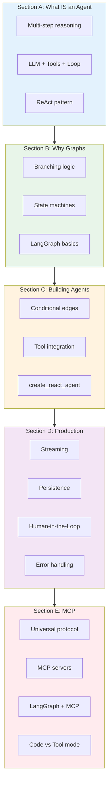
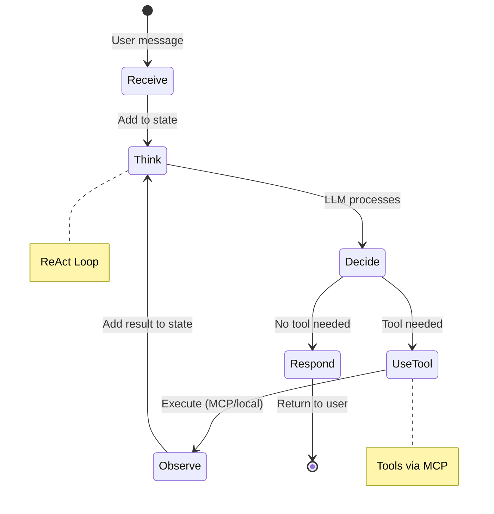

# Lesson 9.25: Module 9 Review

> **Duration**: 15 min | **Section**: Module Review

## 🎯 What You've Learned

You've completed the journey from "what's an agent?" to production-ready agentic systems:



## 🧠 The Complete Mental Model

An agent is a **state machine** that uses an **LLM to decide** what to do next:



## 📊 Concept Summary

### Section A: Agent Fundamentals

| Concept | Definition |
|---------|------------|
| **Agent** | LLM + Tools + Loop |
| **ReAct** | Reasoning + Acting pattern |
| **Tool** | Function LLM can call |
| **Loop** | Think → Act → Observe → Repeat |

### Section B: Graph Architecture

| Concept | Definition |
|---------|------------|
| **StateGraph** | Container for nodes and edges |
| **Node** | Function that transforms state |
| **Edge** | Connection between nodes |
| **State** | TypedDict carrying data |

### Section C: Building Agents

| Concept | Definition |
|---------|------------|
| **Conditional Edge** | Routes based on state |
| **ToolNode** | Prebuilt node for tool execution |
| **add_messages** | Reducer for message lists |
| **create_react_agent** | Prebuilt complete agent |

### Section D: Production Patterns

| Concept | Definition |
|---------|------------|
| **Streaming** | Real-time output with `stream()` |
| **Persistence** | Memory with `MemorySaver` |
| **interrupt()** | Pause for human approval |
| **Retry/Fallback** | Error handling patterns |

### Section E: MCP Integration

| Concept | Definition |
|---------|------------|
| **MCP** | Universal agent-tool protocol |
| **MCP Server** | Tool provider |
| **MCP Client** | Tool consumer |
| **Code Mode** | LLM writes code (98% context reduction) |

## ✅ Complete Agent Architecture

```python
from typing import TypedDict, Annotated, Literal
from langgraph.graph import StateGraph, START, END
from langgraph.graph.message import add_messages
from langgraph.prebuilt import ToolNode
from langgraph.checkpoint.memory import MemorySaver
from langgraph.types import interrupt
from langchain_openai import ChatOpenAI
from langchain_core.tools import tool

# 1. STATE
class AgentState(TypedDict):
    messages: Annotated[list, add_messages]
    requires_approval: bool

# 2. TOOLS (or MCP)
@tool
def search(query: str) -> str:
    """Search for information."""
    return f"Results for: {query}"

@tool
def execute_action(action: str) -> str:
    """Execute a potentially risky action."""
    return f"Executed: {action}"

tools = [search, execute_action]
llm = ChatOpenAI(model="gpt-4").bind_tools(tools)

# 3. NODES
def agent(state: AgentState) -> AgentState:
    """Main reasoning node."""
    response = llm.invoke(state["messages"])
    
    # Check for risky actions
    requires_approval = False
    if hasattr(response, "tool_calls"):
        for tc in response.tool_calls:
            if tc["name"] == "execute_action":
                requires_approval = True
    
    return {"messages": [response], "requires_approval": requires_approval}

def approval_node(state: AgentState) -> AgentState:
    """Human-in-the-loop approval."""
    approval = interrupt({
        "message": "This action requires approval",
        "action": state["messages"][-1].tool_calls[0]
    })
    
    if not approval.get("approved"):
        return {
            "messages": [{"role": "assistant", "content": "Action cancelled."}],
            "requires_approval": False
        }
    return {"requires_approval": False}

# 4. ROUTING
def route_agent(state: AgentState) -> Literal["tools", "approve", END]:
    last = state["messages"][-1]
    
    if not hasattr(last, "tool_calls") or not last.tool_calls:
        return END
    
    if state.get("requires_approval"):
        return "approve"
    
    return "tools"

def route_approval(state: AgentState) -> Literal["tools", END]:
    last = state["messages"][-1]
    if hasattr(last, "tool_calls") and last.tool_calls:
        return "tools"
    return END

# 5. BUILD GRAPH
graph = StateGraph(AgentState)
graph.add_node("agent", agent)
graph.add_node("tools", ToolNode(tools))
graph.add_node("approve", approval_node)

graph.add_edge(START, "agent")
graph.add_conditional_edges("agent", route_agent, {
    "tools": "tools",
    "approve": "approve",
    END: END
})
graph.add_conditional_edges("approve", route_approval, {
    "tools": "tools",
    END: END
})
graph.add_edge("tools", "agent")

# 6. COMPILE WITH PERSISTENCE
memory = MemorySaver()
agent_app = graph.compile(checkpointer=memory)

# 7. USE WITH STREAMING
def run_agent(message: str, thread_id: str = "default"):
    config = {"configurable": {"thread_id": thread_id}}
    
    for chunk in agent_app.stream(
        {
            "messages": [{"role": "user", "content": message}],
            "requires_approval": False
        },
        config=config,
        stream_mode="updates"
    ):
        print(chunk)
```

## 🎯 Independence Check

### Level 1: Know (Recall)
- What is an agent?
- What does ReAct stand for?
- Name the three MCP primitives.

### Level 2: Understand (Explain)
- Why do agents need loops?
- Why are graphs better than chains for agents?
- Why does MCP reduce context size?

### Level 3: Apply (Implement)
- Build a StateGraph with conditional routing
- Add human-in-the-loop to an agent
- Connect an MCP server to LangGraph

### Level 4: Analyze (Evaluate)
- When should you use streaming vs invoke?
- When is Code Mode better than Tool Mode?
- What are the tradeoffs of MemorySaver vs SqliteSaver?

### Level 5: Create (Design)
- Design a multi-agent system with supervisor
- Create a custom MCP server for your use case
- Build a production-ready agent with all patterns

## 📊 Skills Checklist

| Skill | Status |
|-------|--------|
| Understand agent = LLM + Tools + Loop | ☐ |
| Explain ReAct pattern | ☐ |
| Build a StateGraph with nodes and edges | ☐ |
| Use TypedDict for state | ☐ |
| Implement conditional routing | ☐ |
| Use ToolNode for tool execution | ☐ |
| Use create_react_agent shortcut | ☐ |
| Stream agent output | ☐ |
| Add persistence with MemorySaver | ☐ |
| Implement human-in-the-loop with interrupt() | ☐ |
| Handle errors with retry and fallback | ☐ |
| Understand MCP protocol | ☐ |
| Build an MCP server | ☐ |
| Integrate MCP with LangGraph | ☐ |
| Choose between Code Mode and Tool Mode | ☐ |

## 🚀 What's Next

**Module 10: AWS Production Deployment**

You'll deploy your agent to the cloud:
- ECS Fargate for containerized agents
- RDS for persistent storage
- API Gateway for public access
- CI/CD with GitHub Actions

---

## 📚 Module 9 Resources

### Official Documentation
- [LangGraph Docs](https://langchain-ai.github.io/langgraph/)
- [MCP Specification](https://modelcontextprotocol.io/)
- [LangChain Tools](https://python.langchain.com/docs/modules/tools/)

### Code Examples
- [LangGraph Examples](https://github.com/langchain-ai/langgraph/tree/main/examples)
- [MCP Servers](https://github.com/modelcontextprotocol/servers)

### Deep Dives
- [ReAct Paper](https://arxiv.org/abs/2210.03629)
- [Agent Architectures](https://www.anthropic.com/research/building-effective-agents)

---

## 🏁 Module Complete!

You've mastered LangGraph and MCP:
- ✅ Agent fundamentals (ReAct, tools, loops)
- ✅ Graph architecture (state, nodes, edges)
- ✅ Production patterns (streaming, persistence, HITL)
- ✅ MCP integration (servers, clients, code mode)

**Next Module**: Deploy your agent to AWS! 🚀
