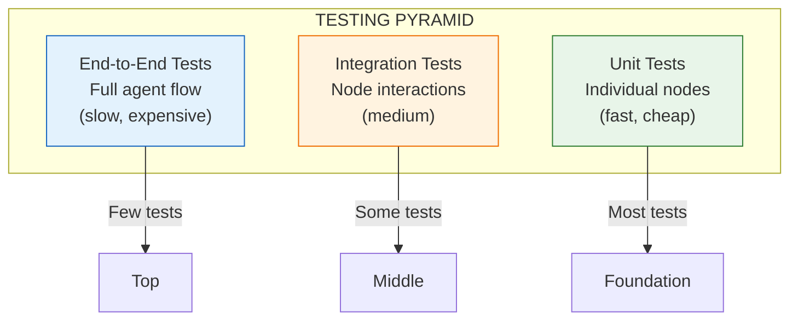

# Lesson 9.26: Testing LangGraph Agents

> **Duration**: 35 min | **Section**: E - Production Agents

## 🎯 The Problem

Your LangGraph agent works in demos. You ship it. Then:

```
User: "Book me a flight to Paris"
Agent: "I've booked you a flight to Paris, Texas" 🤦
```

Or worse:
```
User: "Cancel my subscription"
Agent: *Actually cancels the subscription*
Agent: *Also cancels 47 other users' subscriptions*
```

You have no tests. No way to catch these before production.

> **Scenario**: Your customer support agent has 5 nodes, 3 tools, and 15 edge conditions. You make a "small change" to the routing logic. It breaks 3 edge cases you didn't know existed. Users see infinite loops. You only find out from angry support tickets.

## 🧪 Try It: The Naive Approach

```python
# Manual testing (the "run and pray" method)
def test_agent():
    agent = create_support_agent()
    result = agent.invoke({"query": "Help me"})
    print(result)  # "Looks good to me!" 👀

# Problems:
# - Not automated
# - Doesn't cover edge cases
# - Can't prevent regressions
# - No CI/CD integration
```

## 🔍 Under the Hood: Testing Layers



### What to Test in LangGraph

| Layer | Tests | Example |
|-------|-------|---------|
| **Unit** | Individual nodes, tools | Does `search_tool` return valid results? |
| **Integration** | Node transitions | Does `route_query` → correct next node? |
| **End-to-End** | Full graph execution | Does refund flow complete correctly? |

---

## ✅ The Fix: Comprehensive Testing Strategy

### Project Structure

```
src/
├── agents/
│   ├── support_agent.py
│   └── tools/
│       ├── search.py
│       └── actions.py
tests/
├── unit/
│   ├── test_nodes.py
│   └── test_tools.py
├── integration/
│   ├── test_routing.py
│   └── test_state.py
├── e2e/
│   └── test_full_flows.py
├── fixtures/
│   └── mock_responses.py
└── conftest.py
```

### Layer 1: Unit Testing Nodes

```python
# tests/unit/test_nodes.py
import pytest
from unittest.mock import Mock, patch
from src.agents.support_agent import (
    classify_intent,
    search_knowledge_base,
    generate_response,
    AgentState
)

class TestClassifyIntent:
    """Test the intent classification node."""
    
    def test_refund_intent(self):
        """Refund-related queries should be classified correctly."""
        state = AgentState(
            messages=[{"role": "user", "content": "I want a refund"}],
            intent=None
        )
        
        with patch('src.agents.support_agent.llm') as mock_llm:
            mock_llm.invoke.return_value.content = "refund"
            result = classify_intent(state)
        
        assert result["intent"] == "refund"
    
    def test_billing_intent(self):
        """Billing queries should route to billing intent."""
        state = AgentState(
            messages=[{"role": "user", "content": "Why was I charged twice?"}],
            intent=None
        )
        
        with patch('src.agents.support_agent.llm') as mock_llm:
            mock_llm.invoke.return_value.content = "billing"
            result = classify_intent(state)
        
        assert result["intent"] == "billing"
    
    def test_unknown_intent_defaults_to_general(self):
        """Unknown intents should default to general support."""
        state = AgentState(
            messages=[{"role": "user", "content": "asdfghjkl"}],
            intent=None
        )
        
        with patch('src.agents.support_agent.llm') as mock_llm:
            mock_llm.invoke.return_value.content = "unknown"
            result = classify_intent(state)
        
        assert result["intent"] == "general"


class TestSearchKnowledgeBase:
    """Test the knowledge base search node."""
    
    def test_returns_relevant_docs(self):
        """Search should return relevant documents."""
        state = AgentState(
            messages=[{"role": "user", "content": "refund policy"}],
            intent="refund",
            context=None
        )
        
        with patch('src.agents.support_agent.vectorstore') as mock_vs:
            mock_vs.similarity_search.return_value = [
                Mock(page_content="Refunds are available within 30 days")
            ]
            result = search_knowledge_base(state)
        
        assert "30 days" in result["context"]
    
    def test_empty_results_handled(self):
        """Empty search results should not crash."""
        state = AgentState(
            messages=[{"role": "user", "content": "xyz123"}],
            intent="general",
            context=None
        )
        
        with patch('src.agents.support_agent.vectorstore') as mock_vs:
            mock_vs.similarity_search.return_value = []
            result = search_knowledge_base(state)
        
        assert result["context"] == ""  # or default message
```

### Layer 2: Unit Testing Tools

```python
# tests/unit/test_tools.py
import pytest
from unittest.mock import Mock, patch
from src.agents.tools.actions import (
    process_refund,
    cancel_subscription,
    get_order_status
)

class TestProcessRefund:
    """Test the refund processing tool."""
    
    def test_valid_refund_request(self):
        """Valid order should process refund."""
        with patch('src.agents.tools.actions.payment_api') as mock_api:
            mock_api.refund.return_value = {"status": "success", "amount": 29.99}
            
            result = process_refund(order_id="ORD-123", reason="changed_mind")
        
        assert result["status"] == "success"
        assert result["amount"] == 29.99
        mock_api.refund.assert_called_once_with("ORD-123", "changed_mind")
    
    def test_invalid_order_returns_error(self):
        """Invalid order ID should return error, not crash."""
        with patch('src.agents.tools.actions.payment_api') as mock_api:
            mock_api.refund.side_effect = ValueError("Order not found")
            
            result = process_refund(order_id="INVALID", reason="test")
        
        assert result["status"] == "error"
        assert "not found" in result["message"].lower()
    
    def test_already_refunded_order(self):
        """Already refunded orders should be handled gracefully."""
        with patch('src.agents.tools.actions.payment_api') as mock_api:
            mock_api.refund.return_value = {"status": "already_refunded"}
            
            result = process_refund(order_id="ORD-456", reason="test")
        
        assert result["status"] == "already_refunded"


class TestCancelSubscription:
    """Test subscription cancellation - CRITICAL to test thoroughly."""
    
    def test_cancellation_requires_confirmation(self):
        """Cancellation should require explicit confirmation."""
        result = cancel_subscription(
            user_id="USER-123",
            confirmed=False
        )
        
        assert result["status"] == "pending_confirmation"
        assert "confirm" in result["message"].lower()
    
    def test_confirmed_cancellation(self):
        """Confirmed cancellation should proceed."""
        with patch('src.agents.tools.actions.subscription_api') as mock_api:
            mock_api.cancel.return_value = {"status": "cancelled"}
            
            result = cancel_subscription(
                user_id="USER-123",
                confirmed=True
            )
        
        assert result["status"] == "cancelled"
    
    def test_cannot_cancel_other_users_subscription(self):
        """Tool should not allow cancelling other users' subscriptions."""
        # This is a security test!
        with pytest.raises(PermissionError):
            cancel_subscription(
                user_id="USER-456",  # Different from authenticated user
                authenticated_user_id="USER-123",
                confirmed=True
            )
```

### Layer 3: Integration Testing Routing

```python
# tests/integration/test_routing.py
import pytest
from src.agents.support_agent import create_agent, AgentState

class TestRouting:
    """Test that routing logic correctly directs flow."""
    
    @pytest.fixture
    def agent(self):
        return create_agent()
    
    def test_refund_query_routes_to_refund_node(self, agent):
        """Refund queries should route to refund handling."""
        # Get the router function
        router = agent.get_conditional_edge("classify_intent")
        
        state = AgentState(
            messages=[{"role": "user", "content": "I want my money back"}],
            intent="refund"
        )
        
        next_node = router(state)
        assert next_node == "handle_refund"
    
    def test_billing_routes_to_billing_node(self, agent):
        """Billing queries should route to billing handling."""
        router = agent.get_conditional_edge("classify_intent")
        
        state = AgentState(
            messages=[{"role": "user", "content": "Check my invoice"}],
            intent="billing"
        )
        
        next_node = router(state)
        assert next_node == "handle_billing"
    
    def test_dangerous_actions_route_to_confirmation(self, agent):
        """Dangerous actions should require confirmation."""
        router = agent.get_conditional_edge("check_action_safety")
        
        state = AgentState(
            messages=[],
            pending_action="cancel_subscription",
            confirmed=False
        )
        
        next_node = router(state)
        assert next_node == "request_confirmation"


class TestStateTransitions:
    """Test that state is correctly updated between nodes."""
    
    def test_state_accumulates_context(self, agent):
        """Context should accumulate, not replace."""
        state = AgentState(
            messages=[{"role": "user", "content": "refund policy"}],
            context="Previous context"
        )
        
        # Run search node
        new_state = agent.nodes["search_kb"](state)
        
        # Should have both old and new context
        assert "Previous context" in new_state["context"] or \
               len(new_state["context"]) > 0
    
    def test_message_history_preserved(self, agent):
        """Message history should be preserved through nodes."""
        initial_messages = [
            {"role": "user", "content": "Hello"},
            {"role": "assistant", "content": "Hi there!"}
        ]
        
        state = AgentState(messages=initial_messages, intent=None)
        
        # Run through multiple nodes
        state = agent.nodes["classify_intent"](state)
        state = agent.nodes["search_kb"](state)
        
        # Original messages should still be there
        assert len(state["messages"]) >= 2
```

### Layer 4: End-to-End Testing

```python
# tests/e2e/test_full_flows.py
import pytest
from unittest.mock import patch, Mock
from src.agents.support_agent import create_agent

class TestRefundFlow:
    """Test complete refund flow from start to finish."""
    
    @pytest.fixture
    def agent(self):
        return create_agent()
    
    @pytest.fixture
    def mock_services(self):
        """Mock all external services."""
        with patch('src.agents.support_agent.llm') as mock_llm, \
             patch('src.agents.support_agent.vectorstore') as mock_vs, \
             patch('src.agents.tools.actions.payment_api') as mock_payment:
            
            # Setup default mock behaviors
            mock_llm.invoke.return_value = Mock(content="refund")
            mock_vs.similarity_search.return_value = [
                Mock(page_content="Refunds available within 30 days")
            ]
            mock_payment.refund.return_value = {"status": "success"}
            
            yield {
                "llm": mock_llm,
                "vectorstore": mock_vs,
                "payment": mock_payment
            }
    
    def test_successful_refund_flow(self, agent, mock_services):
        """Complete refund flow should succeed."""
        result = agent.invoke({
            "messages": [{"role": "user", "content": "I want a refund for order ORD-123"}],
            "user_id": "USER-456"
        })
        
        # Check final state
        assert result["completed"] == True
        assert "refund" in result["final_response"].lower()
        assert result["action_taken"] == "refund_processed"
    
    def test_refund_outside_window_rejected(self, agent, mock_services):
        """Refunds outside 30-day window should be rejected gracefully."""
        mock_services["payment"].refund.side_effect = ValueError("Outside refund window")
        
        result = agent.invoke({
            "messages": [{"role": "user", "content": "Refund for old order ORD-001"}],
            "user_id": "USER-456"
        })
        
        assert "cannot" in result["final_response"].lower() or \
               "outside" in result["final_response"].lower()
        assert result["action_taken"] is None


class TestEdgeCases:
    """Test edge cases and error conditions."""
    
    def test_empty_message_handled(self, agent):
        """Empty messages should not crash agent."""
        result = agent.invoke({
            "messages": [{"role": "user", "content": ""}],
            "user_id": "USER-123"
        })
        
        assert result["completed"] == True
        assert "help" in result["final_response"].lower()
    
    def test_very_long_message_handled(self, agent):
        """Very long messages should be handled (truncated if needed)."""
        long_message = "refund " * 10000  # 70,000 characters
        
        result = agent.invoke({
            "messages": [{"role": "user", "content": long_message}],
            "user_id": "USER-123"
        })
        
        # Should complete without crashing
        assert result["completed"] == True
    
    def test_concurrent_requests_isolated(self, agent):
        """Concurrent requests should not interfere with each other."""
        import asyncio
        
        async def make_request(user_id, query):
            return agent.invoke({
                "messages": [{"role": "user", "content": query}],
                "user_id": user_id
            })
        
        results = asyncio.run(asyncio.gather(
            make_request("USER-1", "refund"),
            make_request("USER-2", "billing"),
            make_request("USER-3", "cancel")
        ))
        
        # Each should get appropriate response
        assert "refund" in results[0]["intent"]
        assert "billing" in results[1]["intent"]
        assert "cancel" in results[2]["intent"]
```

---

## 🔧 Test Fixtures and Mocks

```python
# tests/conftest.py
import pytest
from unittest.mock import Mock

@pytest.fixture
def mock_llm():
    """Reusable mock LLM."""
    mock = Mock()
    mock.invoke.return_value = Mock(content="default response")
    return mock

@pytest.fixture
def sample_state():
    """Sample agent state for testing."""
    return {
        "messages": [
            {"role": "user", "content": "I need help with a refund"}
        ],
        "intent": None,
        "context": "",
        "pending_action": None,
        "confirmed": False,
        "user_id": "TEST-USER"
    }

@pytest.fixture
def mock_vectorstore():
    """Mock vector store with sample documents."""
    mock = Mock()
    mock.similarity_search.return_value = [
        Mock(page_content="Refunds are processed within 5-7 business days."),
        Mock(page_content="You can request a refund within 30 days of purchase.")
    ]
    return mock
```

---

## 🔍 Debugging with Visualization

```python
# tests/debug/test_with_visualization.py
from langgraph.graph import StateGraph
import json

def visualize_execution(agent, initial_state):
    """Trace execution path for debugging."""
    execution_trace = []
    
    def trace_wrapper(node_name, node_func):
        def wrapper(state):
            execution_trace.append({
                "node": node_name,
                "input_state": dict(state),
            })
            result = node_func(state)
            execution_trace[-1]["output_state"] = dict(result) if result else None
            return result
        return wrapper
    
    # Wrap all nodes
    for name, func in agent.nodes.items():
        agent.nodes[name] = trace_wrapper(name, func)
    
    # Run agent
    result = agent.invoke(initial_state)
    
    # Print trace
    print("\n=== EXECUTION TRACE ===")
    for step in execution_trace:
        print(f"\n→ {step['node']}")
        print(f"  Input: {json.dumps(step['input_state'], indent=2, default=str)[:200]}...")
    
    return result, execution_trace
```

---

## 📊 CI Integration

```yaml
# .github/workflows/test-agents.yml
name: Test LangGraph Agents

on: [push, pull_request]

jobs:
  test:
    runs-on: ubuntu-latest
    steps:
      - uses: actions/checkout@v4
      
      - name: Set up Python
        uses: actions/setup-python@v5
        with:
          python-version: '3.11'
      
      - name: Install dependencies
        run: |
          pip install -r requirements.txt
          pip install pytest pytest-cov pytest-asyncio
      
      - name: Run unit tests
        run: pytest tests/unit/ -v --cov=src/agents/
      
      - name: Run integration tests
        run: pytest tests/integration/ -v
      
      - name: Run E2E tests (limited)
        run: pytest tests/e2e/ -v -k "not slow"
        env:
          OPENAI_API_KEY: ${{ secrets.OPENAI_API_KEY }}
```

---

## 🎯 Practice

1. **Write unit tests** for one node in your agent
2. **Create mock fixtures** for LLM and vector store
3. **Test routing logic** with different intent scenarios
4. **Add edge case tests** (empty input, very long input)
5. **Run with coverage** to find untested code

```bash
# Run with coverage
pytest tests/ -v --cov=src/agents/ --cov-report=html

# View coverage report
open htmlcov/index.html
```

## 🔑 Key Takeaways

- **Test pyramid** - many unit tests, fewer integration, few E2E
- **Mock external services** - don't call real LLMs in unit tests
- **Test routing thoroughly** - edge conditions are where bugs hide
- **Test dangerous actions** - cancellations, deletions need extra coverage
- **Use fixtures** - DRY test code with pytest fixtures
- **Visualize for debugging** - trace execution path when tests fail

## ❓ Common Questions

| Question | Answer |
|----------|--------|
| Should I call real LLMs in tests? | Only in E2E tests, and limit them for cost |
| How much coverage is enough? | Aim for 80%+ on critical paths |
| How do I test non-deterministic LLM output? | Assert on structure/intent, not exact text |
| What about testing tool side effects? | Mock external APIs, verify calls were made correctly |

## 🔗 Further Reading

- [LangGraph Testing Guide](https://langchain-ai.github.io/langgraph/)
- [Pytest Documentation](https://docs.pytest.org/)
- [Mocking in Python](https://docs.python.org/3/library/unittest.mock.html)
- [Testing LLM Applications](https://www.deeplearning.ai/short-courses/building-evaluating-advanced-rag/)

---

**Next**: [Module 9 Review](Lesson-25-Module-Review.md) | **Up**: [Module 9 README](README.md)
