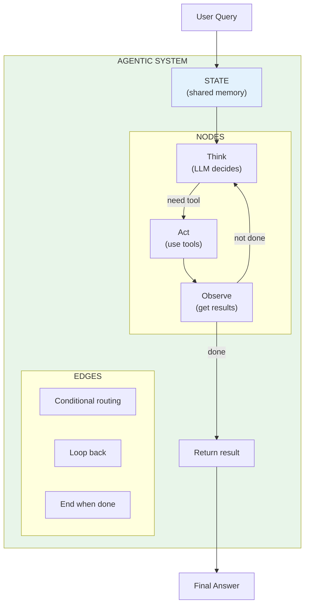
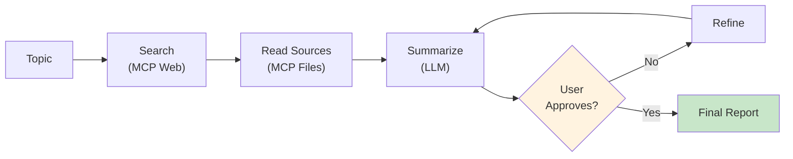

# Module 9: LangGraph - Agentic Systems

> **Duration**: 1 Week | **Lessons**: 26

## 🎯 Module Overview

RAG answers questions. **Agents take actions**. This module teaches you to build autonomous systems that think, decide, use tools, and self-correct. You'll master LangGraph for state machine-based agent orchestration and Model Context Protocol (MCP) for standardized tool integration.

## 🧠 Mental Model

## 📋 Prerequisites

- Module 7: LLM APIs (function calling)
- Module 8: RAG (retrieval chains)
- Python classes and async basics
- Understanding of state machines helpful

## 🗂️ Module Structure

| Section | Lessons | Focus |
|---------|:-------:|-------|
| A: What IS an Agent? | 9.0 - 9.4 | Agent concepts, ReAct pattern, agents vs chains |
| B: Why Graphs? | 9.5 - 9.9 | Graph-based orchestration, state management |
| C: Building Agents | 9.10 - 9.13 | LangGraph core: conditional edges, tools, ReAct |
| D: Production Patterns | 9.14 - 9.18 | Streaming, persistence, human-in-the-loop |
| E: MCP Integration | 9.19 - 9.25 | Model Context Protocol for standardized tools |

---

## 📚 Lessons

### Section A: What IS an Agent?

| # | Lesson | Duration | What We're Solving |
|:-:|--------|:--------:|-------------------|
| 9.0 | The Multi-Step Problem | 15 min | Complex tasks need multiple steps, decisions, and loops |
| 9.1 | Agents = LLM + Tools + Loop | 25 min | How agents combine thinking with tool execution |
| 9.2 | The ReAct Pattern | 30 min | Thought → Action → Observation → Repeat |
| 9.3 | Agent vs Chain | 20 min | When dynamic decisions beat fixed sequences |
| 9.4 | Agent Fundamentals Q&A | 10 min | Loops, step limits, when to use agents |

### Section B: Why Graphs?

| # | Lesson | Duration | What We're Solving |
|:-:|--------|:--------:|-------------------|
| 9.5 | The Branching Problem | 5 min | Chains can't loop or branch - we need graphs |
| 9.6 | Graphs Under the Hood | 30 min | Nodes, edges, conditional routing |
| 9.7 | State & TypedDict | 25 min | Shared state that persists between nodes |
| 9.8 | Building Your First Graph | 30 min | StateGraph, add_node, add_edge, compile |
| 9.9 | Graph Q&A | 10 min | State management, node communication |

### Section C: Building Agents with LangGraph

| # | Lesson | Duration | What We're Solving |
|:-:|--------|:--------:|-------------------|
| 9.10 | Conditional Edges | 35 min | Dynamic routing based on LLM decisions |
| 9.11 | Messages State | 30 min | Chat history in graph, message reducers |
| 9.12 | Tool Integration | 40 min | ToolNode, @tool decorator, LLM tool calls |
| 9.13 | The ReAct Agent | 35 min | Complete agent with create_react_agent() |

### Section D: Production Agent Patterns

| # | Lesson | Duration | What We're Solving |
|:-:|--------|:--------:|-------------------|
| 9.14 | Streaming Graph Output | 30 min | Real-time token and node streaming |
| 9.15 | Persistence & Memory | 30 min | MemorySaver, checkpointing, thread_id |
| 9.16 | Human-in-the-Loop | 35 min | interrupt() for approval workflows |
| 9.17 | Error Handling in Graphs | 25 min | Retry nodes, fallbacks, max iterations |
| 9.18 | Agent Patterns Q&A | 10 min | Multi-agent systems, when NOT to use agents |

### Section E: Model Context Protocol (MCP)

| # | Lesson | Duration | What We're Solving |
|:-:|--------|:--------:|-------------------|
| 9.19 | The Integration Problem | 5 min | Custom wrappers for every tool don't scale |
| 9.20 | MCP Under the Hood | 30 min | The "USB-C for AI" - standardized protocol |
| 9.21 | MCP Servers | 35 min | Building and consuming MCP servers |
| 9.22 | MCP + LangGraph | 30 min | Integrating MCP tools into agent graphs |
| 9.23 | Code Mode vs Tool Mode | 25 min | 98.7% context reduction with code mode |
| 9.24 | MCP Q&A | 10 min | Security, custom servers, vs function calling |
| 9.25 | Module Review | 15 min | Agent mental model and MCP integration |

---

## 🎯 Module Project

**Multi-Step Research Agent with MCP**

Build a research agent that:
1. Takes a topic from the user
2. Uses MCP to search the web and read files
3. Summarizes findings
4. Asks user for approval before finalizing
5. Implements self-correction loop

---

## ✅ Independence Check

After this module, you should be able to:

| Level | Question |
|-------|----------|
| **Know** | What are the components of an agent? (LLM + Tools + Loop) |
| **Understand** | Why use graphs instead of chains for complex workflows? |
| **Apply** | How do you add a new tool to a LangGraph agent? |
| **Analyze** | When does an agent loop forever and how do you prevent it? |
| **Create** | Build a multi-step agent with human approval and MCP tools |

---

## 🔗 References

- [LangGraph Documentation](https://langchain-ai.github.io/langgraph/) - Official LangGraph docs
- [LangGraph Tutorials](https://langchain-ai.github.io/langgraph/tutorials/) - Step-by-step guides
- [ReAct Paper](https://arxiv.org/abs/2210.03629) - Original ReAct pattern research
- [Model Context Protocol](https://modelcontextprotocol.io/) - MCP specification
- [MCP Python SDK](https://github.com/modelcontextprotocol/python-sdk) - Python MCP implementation
- [LangGraph Examples](https://github.com/langchain-ai/langgraph/tree/main/examples) - GitHub examples

---

## 🔗 Next Module

→ [Module 10: AWS Production Deployment](../Module-10-AWS-Deployment/README.md)
