# Lesson 10.0: The "It Only Works Locally" Problem

> **Duration**: 15 min | **Section**: A - Cloud Computing Under the Hood

## 🎯 The Problem

You built something amazing. It runs on your laptop.

> **Scenario**:
> - Your RAG chatbot answers questions perfectly
> - Your FastAPI server responds in milliseconds
> - Your Docker containers run flawlessly
> - Everything works on `localhost:8000`

**But...**

- How do 1,000 users access it?
- What happens when you close your laptop?
- What if your laptop crashes?
- How do users in Tokyo access your app in New York?

## 🔍 The Localhost Trap

```mermaid
flowchart TD
    subgraph Local["YOUR LAPTOP"]
        APP["Your App<br>localhost:8000"]
        DB[("PostgreSQL<br>localhost:5432")]
    end
    
    USER1["👤 You"] --> APP
    USER2["👤 Friend"] -.->|"❌ Can't reach"| APP
    USER3["👤 Customer"] -.->|"❌ Can't reach"| APP
    
    APP --> DB
    
    style APP fill:#FFCDD2
    style DB fill:#FFCDD2
```

**Localhost means "this computer only".**

No one else can access it. Not your friend. Not your customer. Not anyone.

## 💥 The Problems With Local Development

| Problem | Impact |
|---------|--------|
| **Not accessible** | Only you can use it |
| **Not reliable** | Laptop sleeps, crashes, needs updates |
| **Not scalable** | Can't handle 1000 concurrent users |
| **Not secure** | Home network isn't designed for this |
| **No backups** | Hard drive dies = everything gone |

## 🔍 What We Actually Need

```mermaid
flowchart TD
    subgraph Internet["THE INTERNET"]
        U1["👤 User (Tokyo)"]
        U2["👤 User (NYC)"]
        U3["👤 User (London)"]
    end
    
    subgraph Cloud["CLOUD SERVER"]
        LB["Load Balancer"]
        C1["Container 1"]
        C2["Container 2"]
        C3["Container 3"]
        DB[("Database<br>with backups")]
        
        LB --> C1
        LB --> C2
        LB --> C3
        C1 --> DB
        C2 --> DB
        C3 --> DB
    end
    
    U1 --> LB
    U2 --> LB
    U3 --> LB
    
    style LB fill:#EF6C00,color:#fff
    style DB fill:#1565C0,color:#fff
```

**What production requires:**

| Requirement | Solution |
|-------------|----------|
| **Accessible** | Public IP address, domain name |
| **Reliable** | Auto-restart on crash, multiple copies |
| **Scalable** | Add more containers when traffic spikes |
| **Secure** | Firewalls, encryption, private networks |
| **Backed up** | Automated database backups |

## 🤔 Why Not Just Rent a Server?

You could rent a VPS (Virtual Private Server) and SSH into it. But then:

- **You** manage security patches
- **You** configure firewalls
- **You** set up SSL certificates
- **You** handle backups
- **You** scale manually
- **You** wake up at 3am when it crashes

This is "pet" infrastructure. You treat each server like a pet.

## ✅ The Cloud Way: Cattle, Not Pets

Cloud platforms like AWS treat servers as **cattle, not pets**:

| Pets | Cattle |
|------|--------|
| Unique names | Numbered instances |
| Manually configured | Automated configuration |
| Repaired when sick | Replaced when sick |
| Hard to replace | Trivial to replace |
| You wake up at 3am | AWS wakes up at 3am |

## 🎯 What You'll Learn in This Module

| Lesson | Topic |
|--------|-------|
| 10.1-10.3 | AWS fundamentals and setup |
| 10.4-10.6 | Security, VPCs, secrets |
| 10.7-10.10 | RDS PostgreSQL (managed database) |
| 10.11-10.16 | ECS Fargate (managed containers) |
| 10.17-10.22 | Load balancers, domains, CI/CD |

By the end, your app will:
- ✅ Be accessible from anywhere
- ✅ Run 24/7 without your laptop
- ✅ Auto-restart on crashes
- ✅ Scale to handle traffic
- ✅ Deploy automatically on git push

---

**Next**: 10.1 - What IS "The Cloud"?
