# Lesson 10.1: What IS "The Cloud"?

> **Duration**: 20 min | **Section**: A - Cloud Computing Under the Hood

## 🎯 The Problem (3-5 min)

"The cloud" sounds magical and abstract. But it's not.

> **Question**: Where do cloud apps actually run? What is "the cloud" made of?

## 🔍 Under the Hood: It's Just Computers

```mermaid
flowchart TD
    subgraph Magic["WHAT PEOPLE IMAGINE ☁️"]
        CLOUD["Fluffy cloud<br>somewhere in the sky"]
    end
    
    subgraph Reality["WHAT IT ACTUALLY IS 🏢"]
        DC["DATA CENTER"]
        
        subgraph Racks["Server Racks"]
            R1["Rack 1<br>1000+ servers"]
            R2["Rack 2<br>1000+ servers"]
            R3["Rack 3<br>1000+ servers"]
        end
        
        POWER["Power Systems"]
        COOL["Cooling Systems"]
        NET["Network Equipment"]
    end
    
    style Magic fill:#E3F2FD
    style Reality fill:#E8F5E9
```



**The cloud = someone else's computers in a warehouse.**

That's it. Amazon, Google, and Microsoft own massive warehouses filled with servers. You rent pieces of them.

## 🔍 Traditional vs Cloud: The Analogy

**Traditional Hosting** = Buying a car
- You pay upfront
- You maintain it
- You pay whether you use it or not
- You need a bigger one? Buy another car

**Cloud Computing** = Uber/Lyft
- Pay per ride (per minute/hour)
- Someone else maintains it
- Don't pay when not using
- Need 10 cars? Just request them


## 🔍 What Makes Cloud Different

The key innovation isn't the servers. It's the **APIs**.

```python
# Traditional: Call a salesperson, wait 2 weeks for server
# Cloud: Run a command, get a server in 60 seconds

# Create a virtual server (EC2 instance)
aws ec2 run-instances \
    --image-id ami-0123456789 \
    --instance-type t3.micro \
    --count 1

# Result: Running server in ~60 seconds
```

**Everything is an API call.**

| Action | Traditional | Cloud |
|--------|-------------|-------|
| Create server | Call vendor, 2 weeks | API call, 60 seconds |
| Add storage | Buy hard drive, ship, install | API call, instant |
| Scale to 100 servers | Buy 99 more, months | API call, minutes |
| Delete everything | Sell equipment, weeks | API call, instant |

## 🔍 Cloud Computing Models


| Model | What You Manage | Examples |
|-------|-----------------|----------|
| **IaaS** | VMs, OS, everything | EC2, Google Compute |
| **PaaS** | Just your code | Heroku, App Engine |
| **SaaS** | Nothing (just use it) | Gmail, Dropbox |

**We'll use a mix:**
- **PaaS** for containers (ECS Fargate - we don't manage VMs)
- **Managed services** for database (RDS - we don't manage backups)

## 🔍 Major Cloud Providers

| Provider | Market Share | Known For |
|----------|--------------|-----------|
| **AWS** (Amazon) | ~32% | Most services, most mature |
| **Azure** (Microsoft) | ~22% | Enterprise, Windows |
| **GCP** (Google) | ~10% | Data/ML, Kubernetes |

We use **AWS** because:
1. Largest ecosystem
2. Most job postings require it
3. Free tier for learning
4. Best documentation

## 🔑 Key AWS Concepts


| Concept | What It Is | Analogy |
|---------|-----------|---------|
| **Region** | Geographic location (us-east-1 = Virginia) | City |
| **Availability Zone** | Independent data center in a region | Neighborhood |
| **Service** | Something AWS offers (EC2, RDS, S3) | Utility (power, water) |

## ❓ Common Questions

| Question | Answer |
|----------|--------|
| Is cloud more expensive? | Depends - pay for what you use |
| Is it secure? | More secure than most companies can achieve |
| Can I move away later? | Yes, but takes effort (vendor lock-in) |
| Why so many services? | AWS has 200+ services for every use case |

## 🔑 Key Takeaways

1. **Cloud = computers in warehouses** you rent via APIs
2. **Pay per use** like Uber, not like buying a car
3. **APIs for everything** - create/destroy resources in seconds
4. **Regions and AZs** provide geographic redundancy
5. **AWS** is the most common, we'll use it

---

## 📚 Further Reading

- [AWS Regions and Availability Zones](https://aws.amazon.com/about-aws/global-infrastructure/)
- [Cloud Computing Concepts](https://aws.amazon.com/what-is-cloud-computing/)

---

**Next**: 10.2 - AWS Overview (EC2, RDS, ECS - why so many services?)
