# Lesson 10.2: AWS Overview

> **Duration**: 25 min | **Section**: A - Cloud Computing Under the Hood

## 🎯 The Problem (3-5 min)

AWS has 200+ services. That's overwhelming.

> **Question**: Which services do I actually need? Why are there so many?

## 🔍 The Services We'll Use

Out of 200+ services, we need about **10** for a production deployment:

## 🔍 Service Categories Explained

### Compute: Where Code Runs

| Service | What It Does | Analogy |
|---------|--------------|---------|
| **EC2** | Virtual machines you manage | Renting an apartment |
| **ECS** | Container orchestration | Hotel with room service |
| **Lambda** | Serverless functions | Vending machine |
| **Fargate** | Serverless containers | AirBnB (no maintenance) |

**We'll use ECS with Fargate**: Run containers without managing servers.

### Database: Where Data Lives

| Service | What It Does | Analogy |
|---------|--------------|---------|
| **RDS** | Managed relational DB (Postgres, MySQL) | Managed apartment |
| **DynamoDB** | Managed NoSQL | Key-value storage locker |
| **ElastiCache** | Managed Redis/Memcached | Speed boost cache |

**We'll use RDS PostgreSQL**: Managed PostgreSQL with automatic backups.

### Networking: How Traffic Flows

| Service | What It Does | Analogy |
|---------|--------------|---------|
| **VPC** | Private network in AWS | Your own neighborhood |
| **Subnets** | Subdivisions of VPC | Streets in neighborhood |
| **ALB** | Load balancer | Traffic cop |
| **Route 53** | DNS management | Phone book |

```mermaid
flowchart TD
    INTERNET["🌐 Internet"]
    
    subgraph VPC["VPC (Your Private Network)"]
        subgraph Public["Public Subnet"]
            ALB["ALB<br>Load Balancer"]
        end
        
        subgraph Private["Private Subnet"]
            ECS["ECS Containers"]
            RDS["RDS Database"]
        end
    end
    
    INTERNET --> ALB
    ALB --> ECS
    ECS --> RDS
    
    style Public fill:#E3F2FD
    style Private fill:#FFF3E0
```

### Security: Who Can Do What

| Service | What It Does | Analogy |
|---------|--------------|---------|
| **IAM** | Users, roles, permissions | Building access cards |
| **Security Groups** | Network firewalls | Door locks |
| **Secrets Manager** | Store API keys securely | Vault |
| **ACM** | SSL certificates | ID verification |

### Monitoring: What's Happening

| Service | What It Does | Analogy |
|---------|--------------|---------|
| **CloudWatch Logs** | Application logs | Security cameras |
| **CloudWatch Metrics** | Performance data | Dashboard gauges |
| **CloudWatch Alarms** | Alerts on thresholds | Smoke detector |

## 🔍 How Services Connect

```mermaid
flowchart TD
    USER["👤 User"] --> R53["Route 53<br>myapp.com → ALB IP"]
    R53 --> ALB["ALB<br>Load Balancer"]
    
    ALB --> ECS1["Container 1"]
    ALB --> ECS2["Container 2"]
    
    ECS1 --> SM["Secrets Manager<br>(Get DB password)"]
    ECS2 --> SM
    
    ECS1 --> RDS["RDS PostgreSQL"]
    ECS2 --> RDS
    
    ECS1 --> CW["CloudWatch<br>(Logs)"]
    ECS2 --> CW
```

**Request flow:**
1. User visits `myapp.com`
2. Route 53 resolves to Load Balancer
3. ALB picks a healthy container
4. Container fetches secrets from Secrets Manager
5. Container queries RDS database
6. Container logs to CloudWatch
7. Response returns to user

## 🔍 Why So Many Services?

AWS follows **Unix philosophy**: Do one thing well.

| Approach | Pros | Cons |
|----------|------|------|
| **One mega-service** | Simple to understand | Limited flexibility |
| **Many small services** | Pick exactly what you need | Learning curve |

**Example**: Instead of "Server with Database"
- EC2 (compute) + RDS (database) + S3 (storage)
- Each can scale independently
- Each has specialized features

## 📊 Cost Model

**Most services**: Pay per use

| Service | Pricing Model |
|---------|---------------|
| **ECS Fargate** | Per vCPU-hour and GB-hour |
| **RDS** | Per instance-hour + storage |
| **ALB** | Per hour + per connection |
| **Data Transfer** | Per GB (outbound) |

**Free Tier** (12 months):
- 750 hours EC2 t2.micro
- 750 hours RDS t2.micro
- 5 GB S3 storage
- 1 million Lambda requests

## ❓ Common Questions

| Question | Answer |
|----------|--------|
| Why not just use EC2 for everything? | More work - you manage OS, scaling, patching |
| Is Fargate more expensive than EC2? | Per-hour yes, but less ops work |
| Do I need all these services? | For production, yes. For learning, start minimal |
| What about Lambda? | Great for small functions, not for APIs |

## 🔑 Key Takeaways

| Service | Purpose | We Use It For |
|---------|---------|---------------|
| **ECS + Fargate** | Run containers | Our FastAPI app |
| **ECR** | Store Docker images | Push our images |
| **RDS** | Managed database | PostgreSQL |
| **ALB** | Load balancing | Traffic distribution, HTTPS |
| **VPC** | Networking | Isolate our resources |
| **IAM** | Permissions | Secure access |
| **Secrets Manager** | Store secrets | API keys, DB passwords |
| **CloudWatch** | Monitoring | Logs, metrics, alerts |

---

## 📚 Further Reading

- [AWS Services Overview](https://aws.amazon.com/products/)
- [AWS Free Tier](https://aws.amazon.com/free/)
- [AWS Architecture Icons](https://aws.amazon.com/architecture/icons/)

---

**Next**: 10.3 - AWS Setup (Account, IAM, CLI)
