# Lesson 10.4: Security Fundamentals

> **Duration**: 30 min | **Section**: A - Cloud Computing Under the Hood

## 🎯 The Problem (3-5 min)

Your database has customer data. Anyone on the internet shouldn't be able to access it.

> **Scenario**: You deploy a PostgreSQL database to AWS. You make it publicly accessible "just for testing." A bot finds it in 15 minutes. Your data is stolen or ransomed.

This happens constantly. Let's understand AWS networking security.

## 🔍 The Three Layers of AWS Security


## 🔍 Layer 1: VPC (Virtual Private Cloud)

A VPC is your **own private network** inside AWS.


**Key concepts:**
- Each VPC has an IP range (CIDR block): `10.0.0.0/16` = 65,536 addresses
- Resources in different VPCs can't talk to each other (by default)
- You can have multiple VPCs (dev, staging, prod)

**Analogy**: VPC = Your gated community. Others can't just walk in.

## 🔍 Layer 2: Subnets

Subnets divide your VPC into sections:

```mermaid
flowchart TD
    INET["🌐 Internet"]
    
    subgraph VPC["VPC (10.0.0.0/16)"]
        IGW["Internet Gateway"]
        
        subgraph Public["Public Subnets"]
            PUB1["10.0.1.0/24<br>AZ-A"]
            PUB2["10.0.2.0/24<br>AZ-B"]
        end
        
        subgraph Private["Private Subnets"]
            PRIV1["10.0.10.0/24<br>AZ-A"]
            PRIV2["10.0.20.0/24<br>AZ-B"]
        end
    end
    
    INET <--> IGW
    IGW <--> PUB1
    IGW <--> PUB2
    PUB1 --> PRIV1
    PUB2 --> PRIV2
    
    style Public fill:#E8F5E9
    style Private fill:#FFF3E0
```



| Subnet Type | Internet Access | Use For |
|-------------|-----------------|---------|
| **Public** | Yes (via Internet Gateway) | Load balancers, bastion hosts |
| **Private** | No | Databases, app servers, secrets |

**Why private subnets?**
- Database in private subnet = not accessible from internet
- Must go through your app (in public/private subnet) to reach it
- Attackers can't directly connect to your database

## 🔍 Layer 3: Security Groups

Security Groups are **firewalls** for individual resources.


**Security Group Rules:**

```
# ALB Security Group
Inbound:
  - Port 443 (HTTPS) from 0.0.0.0/0 (anywhere)
  - Port 80 (HTTP) from 0.0.0.0/0 (for redirect)

# App Security Group  
Inbound:
  - Port 8000 from ALB Security Group only

# Database Security Group
Inbound:
  - Port 5432 from App Security Group only
```

**Key principle**: **Least privilege**. Only allow exactly what's needed.

## 🔍 Visual: Complete Secure Architecture

```mermaid
flowchart TD
    INET["🌐 Internet"]
    
    subgraph VPC["VPC"]
        IGW["Internet Gateway"]
        
        subgraph AZ1["Availability Zone A"]
            subgraph Pub1["Public Subnet"]
                ALB1["ALB"]
            end
            subgraph Priv1["Private Subnet"]
                ECS1["Container"]
                RDS1[("RDS Primary")]
            end
        end
        
        subgraph AZ2["Availability Zone B"]
            subgraph Pub2["Public Subnet"]
                ALB2["ALB"]
            end
            subgraph Priv2["Private Subnet"]
                ECS2["Container"]
                RDS2[("RDS Standby")]
            end
        end
    end
    
    INET --> IGW
    IGW --> ALB1
    IGW --> ALB2
    ALB1 --> ECS1
    ALB2 --> ECS2
    ECS1 --> RDS1
    ECS2 --> RDS1
    RDS1 -.-> RDS2
    
    style Pub1 fill:#E8F5E9
    style Pub2 fill:#E8F5E9
    style Priv1 fill:#FFF3E0
    style Priv2 fill:#FFF3E0
```



**What's happening:**
1. Internet traffic hits Internet Gateway
2. Routed to ALB in public subnets
3. ALB forwards to containers in private subnets
4. Containers connect to RDS in private subnets
5. RDS replicates across availability zones

## ✅ Creating a Secure VPC (AWS Console)

1. **VPC Dashboard** → "Create VPC"
2. Select "VPC and more" (creates subnets automatically)
3. Configure:
   - Name: `myapp-vpc`
   - IPv4 CIDR: `10.0.0.0/16`
   - Availability Zones: 2
   - Public subnets: 2
   - Private subnets: 2
   - NAT gateways: 1 (for private subnet internet access)
4. Create VPC

**Or with CLI:**

```bash
# Create VPC
aws ec2 create-vpc --cidr-block 10.0.0.0/16 --tag-specifications 'ResourceType=vpc,Tags=[{Key=Name,Value=myapp-vpc}]'

# Create subnets, route tables, etc...
# (In practice, use CloudFormation or Terraform)
```

## ✅ Creating Security Groups

```bash
# Create security group for ALB
aws ec2 create-security-group \
    --group-name myapp-alb-sg \
    --description "Allow HTTPS from anywhere" \
    --vpc-id vpc-0123456789abcdef0

# Add inbound rule: HTTPS from anywhere
aws ec2 authorize-security-group-ingress \
    --group-id sg-0123456789abcdef0 \
    --protocol tcp \
    --port 443 \
    --cidr 0.0.0.0/0
```

## 🔍 NAT Gateway: Private Subnet Internet Access

Private subnets can't receive internet traffic. But they might need to **make** requests (download packages, call APIs).


**NAT Gateway**:
- Allows outbound internet access from private subnets
- Blocks inbound connections from internet
- Costs ~$32/month + data transfer

## 🎯 Practice: Security Group Audit

For any resource, ask:
1. What ports does it need open?
2. Who needs to access it?
3. Can I restrict the source?

| Resource | Ports | Source | Reason |
|----------|-------|--------|--------|
| ALB | 443, 80 | 0.0.0.0/0 | Public users |
| App | 8000 | ALB SG | Only from load balancer |
| RDS | 5432 | App SG | Only from app |

## 🔑 Key Takeaways

| Concept | What It Does | Analogy |
|---------|--------------|---------|
| **VPC** | Isolated network | Gated community |
| **Public Subnet** | Internet accessible | Front yard |
| **Private Subnet** | No internet access | Backyard |
| **Security Group** | Firewall rules | Door locks |
| **NAT Gateway** | Outbound internet for private | One-way mirror |

## ❓ Common Questions

| Question | Answer |
|----------|--------|
| Can I change security groups later? | Yes, changes apply immediately |
| Default VPC? | AWS creates one, but don't use for production |
| Multiple security groups? | Yes, rules are combined (union) |
| Cost? | VPC free, NAT Gateway ~$32/month |

---

## 📚 Further Reading

- [VPC User Guide](https://docs.aws.amazon.com/vpc/latest/userguide/)
- [Security Groups](https://docs.aws.amazon.com/vpc/latest/userguide/VPC_SecurityGroups.html)
- [Public vs Private Subnets](https://docs.aws.amazon.com/vpc/latest/userguide/configure-subnets.html)

---

**Next**: 10.5 - Secrets Management (AWS Secrets Manager)
