# Lesson 10.6: AWS Basics Q&A

> **Duration**: 20 min | **Section**: A - Cloud Computing Under the Hood (Recap)

## 📚 Section A Recap

We covered the foundations of AWS and cloud computing:


## ❓ Common Questions & Answers

### Architecture Questions

| Question | Answer |
|----------|--------|
| **Why AWS and not Azure/GCP?** | AWS has the largest market share (~32%), most documentation, and most job postings. Skills transfer to other clouds. |
| **Do I need all these services?** | For production GenAI apps: yes. For learning: start with ECS + RDS, add others as needed. |
| **What's the minimum for production?** | VPC + ECS + RDS + ALB. You can skip some security features for MVPs, but don't. |
| **Can I use EC2 instead of ECS?** | Yes, but you become the babysitter. ECS handles container restarts, scaling, and deployments. |

### Cost Questions

| Question | Answer |
|----------|--------|
| **How much will this cost?** | ~$50-100/month for a small production app. See breakdown below. |
| **Is there a free tier?** | Yes! First 12 months: 750 hrs EC2, 750 hrs RDS, etc. Not enough for production though. |
| **What's the biggest cost?** | Usually RDS or NAT Gateway. RDS db.t3.micro is $12/month minimum. |
| **How do I avoid surprise bills?** | Set up billing alerts, use AWS Budgets, turn off unused resources. |

### Estimated Monthly Costs (Small App)

| Service | Spec | Cost/Month |
|---------|------|------------|
| ECS Fargate | 0.25 vCPU, 0.5GB | ~$10 |
| RDS PostgreSQL | db.t3.micro | ~$15 |
| ALB | Base + traffic | ~$20 |
| NAT Gateway | Per hour + data | ~$35 |
| Secrets Manager | 5 secrets | ~$2 |
| ECR | 5GB images | ~$0.50 |
| **Total** | | **~$82/month** |

> **💡 Tip**: NAT Gateway is expensive. For learning, you can skip it and put ECS in public subnet (less secure but cheaper).

### Security Questions

| Question | Answer |
|----------|--------|
| **What if my secrets leak?** | Rotate them immediately. Assume they're already being used maliciously. |
| **Is public subnet safe for ALB?** | Yes, that's what it's designed for. ALB handles TLS termination. |
| **Do I need a WAF?** | For production: recommended. Blocks common attacks. Adds ~$5/month base. |
| **What about DDoS protection?** | AWS Shield Standard is free and automatic. Shield Advanced is $3000/month (enterprise). |

### Complexity Questions

| Question | Answer |
|----------|--------|
| **This seems complex. Is there an easier way?** | Yes: Railway, Render, Fly.io. But they cost more and you learn less. |
| **When should I use a PaaS instead?** | MVPs, small projects, when you don't want to manage infrastructure. |
| **Will I break things?** | Probably! That's how you learn. Use separate dev/prod accounts. |
| **How long to learn AWS?** | Basics: 1-2 weeks. Comfortable: 2-3 months. Expert: years. |

## 🗺️ Mental Model: AWS Services Map


## 🔄 Services We'll Use (Quick Reference)

| Service | Purpose | Analogy |
|---------|---------|---------|
| **VPC** | Isolated network | Your gated community |
| **Subnet** | Network segment | Neighborhoods in the community |
| **Security Group** | Firewall rules | Door locks |
| **ECS** | Container orchestrator | Container babysitter |
| **ECR** | Container registry | Docker Hub, but AWS |
| **RDS** | Managed database | Database as a service |
| **ALB** | Load balancer | Traffic cop |
| **Secrets Manager** | Secret storage | Secure vault |
| **CloudWatch** | Monitoring | Security cameras |
| **Route 53** | DNS | Phone book |

## ✅ Self-Check: Section A

Before moving on, make sure you can answer:

| Level | Question | Can You Answer? |
|-------|----------|-----------------|
| **Know** | What's the difference between VPC and subnet? | ⬜ |
| **Know** | What does ECS do? | ⬜ |
| **Understand** | Why do we use private subnets for databases? | ⬜ |
| **Understand** | Why use Secrets Manager instead of .env files? | ⬜ |
| **Apply** | Can you create an IAM user with CLI access? | ⬜ |
| **Apply** | Can you create a secret and retrieve it? | ⬜ |

## 🎯 What's Next: Section B

Now that you understand AWS basics, we'll set up our first real resource:

```mermaid
flowchart LR
    A["Section A<br/>✅ Foundations"] --> B["Section B<br/>📍 Database"]
    B --> C["Section C<br/>Containers"]
    C --> D["Section D<br/>Networking"]
    
    style A fill:#E8F5E9
    style B fill:#FFF3E0
```



**Section B: Database on AWS**
- 10.7: The Database Problem (why not SQLite in production)
- 10.8: RDS PostgreSQL Setup
- 10.9: Database Security (private subnet, security groups)
- 10.10: Running Migrations (Alembic in production)

## 📋 AWS CLI Commands Cheat Sheet

```bash
# IAM - Who am I?
aws sts get-caller-identity

# Secrets Manager
aws secretsmanager list-secrets
aws secretsmanager get-secret-value --secret-id NAME

# VPC
aws ec2 describe-vpcs
aws ec2 describe-subnets

# Security Groups
aws ec2 describe-security-groups

# Regions
aws ec2 describe-regions --query 'Regions[].RegionName'
```

## � Common Pitfalls

| Pitfall | Problem | Solution |
|---------|---------|----------|
| Root account for daily work | Security nightmare, no audit trail | Create IAM user, enable MFA |
| Hardcoding secrets | Leaks in git history | Use Secrets Manager, never commit secrets |
| Public RDS | Database exposed to internet | Always use private subnet + security groups |
| Overly permissive SGs | 0.0.0.0/0 on all ports | Least privilege: specific IPs and ports only |
| Ignoring costs | Surprise $1000+ bill | Set billing alerts, use AWS Budgets |
| Wrong region | Latency, data residency issues | Choose region close to users, check compliance |

## �🔑 Key Takeaways from Section A

1. **Cloud** = Computers in warehouses, accessible via APIs
2. **AWS** = Leading cloud provider with 200+ services
3. **VPC** = Your isolated network in AWS
4. **Public subnet** = Internet-accessible (ALB, NAT)
5. **Private subnet** = No direct internet (ECS, RDS)
6. **Security Groups** = Firewall rules (allow, not deny)
7. **Secrets Manager** = Store secrets, never in code
8. **IAM** = Control who can do what

---

## 📚 Resources

- [AWS Free Tier](https://aws.amazon.com/free/)
- [AWS Pricing Calculator](https://calculator.aws/)
- [AWS Well-Architected Framework](https://aws.amazon.com/architecture/well-architected/)

---

**Next**: 10.7 - The Database Problem (Section B begins)
