# Lesson 10.10: Running Migrations

> **Duration**: 30 min | **Section**: B - Database on AWS

## 🎯 The Problem (3-5 min)

Your database schema needs to change. You need to add a column, create a table, or modify an index.

> **Scenario**:
> - You develop locally with SQLite
> - You add a new column: `users.profile_picture`
> - You run `alembic upgrade head` locally ✅
> - You deploy to ECS... but RDS still has the old schema
> - Your app crashes: `column users.profile_picture does not exist`

**How do you run migrations against a database you can't directly access?**

## 🔍 The Challenge

```mermaid
flowchart TD
    subgraph Local["💻 Local Development"]
        YOU["You"]
        ALEMBIC["alembic upgrade head"]
        SQLITE["SQLite"]
    end
    
    subgraph AWS["☁️ AWS (Private Subnet)"]
        RDS["🗄️ RDS PostgreSQL"]
    end
    
    YOU --> ALEMBIC --> SQLITE
    YOU -.->|"❓ How?"| RDS
    
    style RDS fill:#E8F5E9
```



**Problem**: RDS is in a private subnet. You can't connect from your laptop.

## 🔍 Solution Options

| Option | Complexity | Security | Use Case |
|--------|------------|----------|----------|
| **1. ECS Task** | Medium | ✅ Best | Automated CI/CD |
| **2. Bastion Host** | Medium | ⚠️ Good | Manual migrations |
| **3. SSM Session** | Low | ✅ Best | One-off commands |
| **4. VPN** | High | ✅ Best | Full access |

## ✅ Option 1: Run Migrations in ECS (Recommended)

Run Alembic as a one-off ECS task before deploying the new app version.

### The Flow


### Create Migration Task Definition

```json
{
  "family": "myapp-migration",
  "networkMode": "awsvpc",
  "requiresCompatibilities": ["FARGATE"],
  "cpu": "256",
  "memory": "512",
  "executionRoleArn": "arn:aws:iam::xxx:role/ecsTaskExecutionRole",
  "taskRoleArn": "arn:aws:iam::xxx:role/myapp-task-role",
  "containerDefinitions": [
    {
      "name": "migration",
      "image": "xxx.dkr.ecr.us-east-1.amazonaws.com/myapp:latest",
      "command": ["alembic", "upgrade", "head"],
      "logConfiguration": {
        "logDriver": "awslogs",
        "options": {
          "awslogs-group": "/ecs/myapp-migration",
          "awslogs-region": "us-east-1",
          "awslogs-stream-prefix": "ecs"
        }
      },
      "secrets": [
        {
          "name": "DATABASE_URL",
          "valueFrom": "arn:aws:secretsmanager:us-east-1:xxx:secret:myapp/production/database"
        }
      ]
    }
  ]
}
```

### Run Migration Task

```bash
# Run the migration task
aws ecs run-task \
    --cluster myapp-cluster \
    --task-definition myapp-migration \
    --launch-type FARGATE \
    --network-configuration '{
        "awsvpcConfiguration": {
            "subnets": ["subnet-private-1", "subnet-private-2"],
            "securityGroups": ["sg-ecs"],
            "assignPublicIp": "DISABLED"
        }
    }'

# Wait for task to complete
aws ecs wait tasks-stopped \
    --cluster myapp-cluster \
    --tasks arn:aws:ecs:us-east-1:xxx:task/xxx

# Check logs in CloudWatch
aws logs tail /ecs/myapp-migration --follow
```

### In GitHub Actions

```yaml
# .github/workflows/deploy.yml
- name: Run database migrations
  run: |
    TASK_ARN=$(aws ecs run-task \
      --cluster ${{ env.ECS_CLUSTER }} \
      --task-definition myapp-migration \
      --launch-type FARGATE \
      --network-configuration '...' \
      --query 'tasks[0].taskArn' \
      --output text)
    
    echo "Waiting for migration task to complete..."
    aws ecs wait tasks-stopped \
      --cluster ${{ env.ECS_CLUSTER }} \
      --tasks $TASK_ARN
    
    # Check exit code
    EXIT_CODE=$(aws ecs describe-tasks \
      --cluster ${{ env.ECS_CLUSTER }} \
      --tasks $TASK_ARN \
      --query 'tasks[0].containers[0].exitCode' \
      --output text)
    
    if [ "$EXIT_CODE" != "0" ]; then
      echo "Migration failed!"
      exit 1
    fi
```

## ✅ Option 2: Bastion Host

A bastion (jump box) is an EC2 instance in a public subnet that you SSH into, then connect to RDS.

```mermaid
flowchart LR
    subgraph Your["Your Network"]
        YOU["💻 You"]
    end
    
    subgraph AWS["AWS VPC"]
        subgraph Public["Public Subnet"]
            BASTION["🖥️ Bastion Host"]
        end
        subgraph Private["Private Subnet"]
            RDS["🗄️ RDS"]
        end
    end
    
    YOU -->|"SSH"| BASTION
    BASTION -->|"psql"| RDS
```



### Create Bastion Host

```bash
# Launch a small EC2 instance in public subnet
aws ec2 run-instances \
    --image-id ami-xxx  # Amazon Linux 2 AMI \
    --instance-type t3.micro \
    --key-name your-key-pair \
    --subnet-id subnet-public \
    --security-group-ids sg-bastion \
    --associate-public-ip-address

# Security group for bastion: allow SSH from your IP only
aws ec2 authorize-security-group-ingress \
    --group-id sg-bastion \
    --protocol tcp \
    --port 22 \
    --cidr YOUR_IP/32
```

### Connect and Run Migrations

```bash
# SSH into bastion
ssh -i your-key.pem ec2-user@bastion-public-ip

# Install PostgreSQL client
sudo yum install postgresql -y

# Connect to RDS
psql -h myapp-db.xxx.us-east-1.rds.amazonaws.com \
     -U postgres \
     -d myapp

# Or run migrations
pip install alembic psycopg2-binary
export DATABASE_URL="postgresql://..."
alembic upgrade head
```

## ✅ Option 3: SSM Session Manager

No SSH keys needed! AWS SSM lets you connect to instances without opening port 22.

```bash
# Start session to an instance with SSM agent
aws ssm start-session --target i-xxx

# Or port forward to RDS through an instance
aws ssm start-session \
    --target i-xxx \
    --document-name AWS-StartPortForwardingSessionToRemoteHost \
    --parameters '{
        "host": ["myapp-db.xxx.rds.amazonaws.com"],
        "portNumber": ["5432"],
        "localPortNumber": ["5432"]
    }'

# Now connect locally!
psql -h localhost -p 5432 -U postgres -d myapp
```

## 🔍 Migration Best Practices

### 1. Always Test Migrations First

```bash
# Generate SQL without executing
alembic upgrade head --sql > migration.sql

# Review the SQL
cat migration.sql

# Then apply
alembic upgrade head
```

### 2. Make Migrations Reversible

```python
# alembic/versions/xxx_add_profile_picture.py

def upgrade():
    op.add_column('users', sa.Column('profile_picture', sa.String(255)))

def downgrade():
    op.drop_column('users', 'profile_picture')
```

### 3. Handle Long-Running Migrations

```python
# For large tables, add columns as nullable first
def upgrade():
    # Step 1: Add nullable column (fast)
    op.add_column('users', sa.Column('email_verified', sa.Boolean(), nullable=True))
    
    # Step 2: Backfill in batches (separate script or next migration)
    # Don't do this in migration for large tables:
    # op.execute("UPDATE users SET email_verified = false")
    
    # Step 3: Make non-nullable (after backfill)
    # op.alter_column('users', 'email_verified', nullable=False)
```

### 4. Lock Timeout for Safety

```python
# In migration, set lock timeout to avoid blocking
def upgrade():
    # Don't wait forever for locks
    op.execute("SET lock_timeout = '10s'")
    op.add_column('users', sa.Column('new_col', sa.String(255)))
```

## 🔍 Migration Flow in CI/CD


## ⚠️ Common Mistakes

| Mistake | Risk | Fix |
|---------|------|-----|
| Deploy before migrate | App crashes | Always migrate first |
| No downgrade path | Can't rollback | Always write `downgrade()` |
| Long-running migration | Database locks | Batch large updates |
| No test run | Breaking production | Test with `--sql` first |

## 🎯 Practice: Create Migration Setup

1. Create a migration task definition
2. Set up the IAM role with Secrets Manager access
3. Test running the task manually
4. Add to CI/CD pipeline

## 🔑 Key Takeaways

| Approach | When to Use |
|----------|-------------|
| ECS Task | Automated deployments (recommended) |
| Bastion Host | Manual access, debugging |
| SSM Session | Quick access, no SSH keys |
| Local + VPN | Full development access |

---

## 📚 Section B Complete!

You've learned:
- ✅ Why SQLite fails in production
- ✅ Setting up RDS PostgreSQL
- ✅ Database security (layers of defense)
- ✅ Running migrations in production

**Next Section**: C - Containers on AWS (Docker → ECR → ECS)

---

**Next**: 10.11 - Docker for Production
