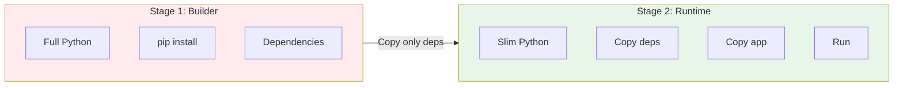

# Lesson 10.11: Docker for Production

> **Duration**: 30 min | **Section**: C - Containers on AWS

## 🎯 The Problem (3-5 min)

Your Dockerfile works locally. But production has different needs:

> **Scenario**:
> - Development: `docker run myapp` - works great
> - Production: Image is 2GB, startup takes 30 seconds
> - Each ECS instance costs money based on resources
> - Large images = slow deployments = unhappy users

**Production Dockerfiles need to be optimized.**

## ❌ Development vs Production Dockerfile

```dockerfile
# ❌ Development Dockerfile (BAD for production)
FROM python:3.11

WORKDIR /app

COPY . .

RUN pip install -r requirements.txt

CMD ["uvicorn", "main:app", "--reload", "--host", "0.0.0.0"]
```

**Problems:**
- Full Python image (1GB+)
- Copies everything (including .git, tests, etc.)
- `--reload` is for development only
- No multi-stage build

## ✅ Production Dockerfile

```dockerfile
# ✅ Production Dockerfile (GOOD)

# Stage 1: Build
FROM python:3.11-slim as builder

WORKDIR /app

# Install dependencies first (better caching)
COPY requirements.txt .
RUN pip install --no-cache-dir --target=/app/deps -r requirements.txt

# Stage 2: Runtime
FROM python:3.11-slim

WORKDIR /app

# Create non-root user
RUN useradd --create-home --shell /bin/bash appuser

# Copy dependencies from builder
COPY --from=builder /app/deps /usr/local/lib/python3.11/site-packages

# Copy application code
COPY --chown=appuser:appuser ./src .

# Switch to non-root user
USER appuser

# Expose port
EXPOSE 8000

# Run with production server
CMD ["uvicorn", "main:app", "--host", "0.0.0.0", "--port", "8000", "--workers", "2"]
```

## 🔍 Multi-Stage Builds



**Result**: Build tools stay in Stage 1, only runtime files in final image.

## 🔍 Base Image Comparison

| Image | Size | Security | Use Case |
|-------|------|----------|----------|
| `python:3.11` | ~900MB | More packages to patch | Development |
| `python:3.11-slim` | ~120MB | Fewer vulnerabilities | Production ✅ |
| `python:3.11-alpine` | ~50MB | May have compatibility issues | Advanced |

**Recommendation**: Use `slim` for production (good balance of size and compatibility).

## 🔍 Production Optimizations

### 1. Layer Caching

```dockerfile
# ✅ GOOD: Dependencies first (cache if unchanged)
COPY requirements.txt .
RUN pip install -r requirements.txt
COPY ./src .

# ❌ BAD: Bust cache every time code changes
COPY . .
RUN pip install -r requirements.txt
```

### 2. Non-Root User

```dockerfile
# Create and use non-root user
RUN useradd --create-home appuser
USER appuser
```

**Why?** If container is compromised, attacker doesn't have root access.

### 3. No Cache for pip

```dockerfile
# Don't store pip cache in image
RUN pip install --no-cache-dir -r requirements.txt
```

### 4. Production Uvicorn Settings

```dockerfile
# Development (auto-reload, single worker)
CMD ["uvicorn", "main:app", "--reload", "--host", "0.0.0.0"]

# Production (multiple workers, no reload)
CMD ["uvicorn", "main:app", "--host", "0.0.0.0", "--port", "8000", "--workers", "2"]
```

## 🔍 Complete Production Dockerfile

```dockerfile
# Dockerfile
FROM python:3.11-slim as builder

WORKDIR /build

# Install build dependencies
RUN apt-get update && apt-get install -y --no-install-recommends \
    gcc \
    libpq-dev \
    && rm -rf /var/lib/apt/lists/*

# Install Python dependencies
COPY requirements.txt .
RUN pip wheel --no-cache-dir --no-deps --wheel-dir /build/wheels -r requirements.txt

# ---

FROM python:3.11-slim

WORKDIR /app

# Install runtime dependencies
RUN apt-get update && apt-get install -y --no-install-recommends \
    libpq5 \
    && rm -rf /var/lib/apt/lists/* \
    && useradd --create-home --shell /bin/bash appuser

# Copy wheels and install
COPY --from=builder /build/wheels /wheels
RUN pip install --no-cache-dir /wheels/* && rm -rf /wheels

# Copy application
COPY --chown=appuser:appuser ./src /app

USER appuser

EXPOSE 8000

# Health check for ECS
HEALTHCHECK --interval=30s --timeout=3s --start-period=5s --retries=3 \
    CMD python -c "import urllib.request; urllib.request.urlopen('http://localhost:8000/health')"

CMD ["uvicorn", "main:app", "--host", "0.0.0.0", "--port", "8000", "--workers", "2"]
```

## 🔍 .dockerignore

Don't copy unnecessary files:

```dockerignore
# .dockerignore
.git
.gitignore
.env
.env.*
__pycache__
*.pyc
*.pyo
.pytest_cache
.mypy_cache
.coverage
htmlcov
tests/
docs/
*.md
!README.md
Dockerfile
docker-compose*.yml
.vscode
.idea
```

## 🔍 Health Checks

ECS needs to know if your container is healthy:

```dockerfile
HEALTHCHECK --interval=30s --timeout=3s --start-period=5s --retries=3 \
    CMD python -c "import urllib.request; urllib.request.urlopen('http://localhost:8000/health')"
```

```python
# main.py
from fastapi import FastAPI

app = FastAPI()

@app.get("/health")
def health_check():
    return {"status": "healthy"}
```

## 🔍 Build and Test

```bash
# Build production image
docker build -t myapp:latest .

# Check image size
docker images myapp:latest

# Test locally
docker run -p 8000:8000 myapp:latest

# Test health endpoint
curl http://localhost:8000/health
```

## 🔍 Image Size Comparison

| Approach | Image Size |
|----------|------------|
| `FROM python:3.11` + everything | ~1.5 GB |
| `FROM python:3.11-slim` | ~400 MB |
| Multi-stage + slim | ~200 MB |
| With .dockerignore | ~150 MB |

## ⚠️ Common Mistakes

| Mistake | Impact | Fix |
|---------|--------|-----|
| Using `:latest` tag | Unpredictable deploys | Use version tags |
| Running as root | Security risk | Use non-root user |
| Including dev deps | Larger image | Separate requirements |
| No .dockerignore | Slower builds, larger image | Add .dockerignore |
| No health check | ECS can't detect failures | Add HEALTHCHECK |

## 🎯 Practice: Optimize Your Dockerfile

1. Take your current Dockerfile
2. Switch to `python:3.11-slim`
3. Add multi-stage build
4. Add non-root user
5. Add health check
6. Add .dockerignore
7. Compare image sizes

```bash
# Before optimization
docker build -t myapp:before .
docker images myapp:before

# After optimization
docker build -t myapp:after .
docker images myapp:after
```

## 🔑 Key Takeaways

| Practice | Why |
|----------|-----|
| Use slim base | Smaller, fewer vulnerabilities |
| Multi-stage builds | Smaller final image |
| Non-root user | Security |
| Layer caching | Faster builds |
| Health checks | ECS monitoring |
| .dockerignore | Exclude unnecessary files |

---

**Next**: 10.12 - ECR (Elastic Container Registry)
