# Lesson 10.12: ECR (Elastic Container Registry)

> **Duration**: 25 min | **Section**: C - Containers on AWS

## 🎯 The Problem (3-5 min)

You built a Docker image. Where do you store it so ECS can pull it?

> **Scenario**:
> - Locally: `docker images` shows your image
> - ECS: "Where's the image? I can't find it!"
> - Docker Hub: Public, rate limits, not AWS-integrated
> - You need a private container registry

## 🔍 What is ECR?

**ECR** = Elastic Container Registry

It's like Docker Hub, but:
- Private by default
- Integrated with AWS (IAM, ECS, etc.)
- No rate limits
- Vulnerability scanning

```mermaid
flowchart LR
    subgraph Local["💻 Local"]
        BUILD["docker build"]
    end
    
    subgraph ECR["📦 ECR"]
        REPO["myapp repository"]
        IMG1["myapp:v1"]
        IMG2["myapp:v2"]
        IMG3["myapp:latest"]
    end
    
    subgraph ECS["☁️ ECS"]
        TASK["ECS Task"]
    end
    
    BUILD -->|"docker push"| ECR
    ECR -->|"docker pull"| TASK
    
    style ECR fill:#E8F5E9
```



## ✅ Step 1: Create a Repository

```bash
# Create an ECR repository
aws ecr create-repository \
    --repository-name myapp \
    --image-scanning-configuration scanOnPush=true \
    --encryption-configuration encryptionType=AES256

# Output includes:
# repositoryUri: 123456789.dkr.ecr.us-east-1.amazonaws.com/myapp
```

**Repository URI format:**
```
<account-id>.dkr.ecr.<region>.amazonaws.com/<repo-name>
```

## ✅ Step 2: Authenticate Docker to ECR

Docker needs to login to ECR to push images:

```bash
# Get login password and pipe to docker login
aws ecr get-login-password --region us-east-1 | \
    docker login --username AWS --password-stdin \
    123456789.dkr.ecr.us-east-1.amazonaws.com
```

**Note**: This login is valid for 12 hours.

## ✅ Step 3: Tag and Push Image

```bash
# Build your image locally
docker build -t myapp:latest .

# Tag for ECR (must match repository URI)
docker tag myapp:latest \
    123456789.dkr.ecr.us-east-1.amazonaws.com/myapp:latest

# Also tag with version
docker tag myapp:latest \
    123456789.dkr.ecr.us-east-1.amazonaws.com/myapp:v1.0.0

# Push to ECR
docker push 123456789.dkr.ecr.us-east-1.amazonaws.com/myapp:latest
docker push 123456789.dkr.ecr.us-east-1.amazonaws.com/myapp:v1.0.0
```

## 🔍 Complete Push Flow


## 🔍 View Images in ECR

```bash
# List repositories
aws ecr describe-repositories \
    --query 'repositories[*].repositoryName'

# List images in a repository
aws ecr describe-images \
    --repository-name myapp \
    --query 'imageDetails[*].[imageTags,imagePushedAt,imageSizeInBytes]' \
    --output table
```

## 🔍 Image Tagging Strategy

| Tag | Purpose | When |
|-----|---------|------|
| `latest` | Most recent build | Every push |
| `v1.0.0` | Semantic version | Releases |
| `abc123f` | Git commit SHA | Every push |
| `main` | Branch name | CI/CD |

**Recommended: Always push with git SHA + semantic version**

```bash
# Get current git SHA
GIT_SHA=$(git rev-parse --short HEAD)

# Tag with both
docker tag myapp:latest ECR_URI/myapp:${GIT_SHA}
docker tag myapp:latest ECR_URI/myapp:v1.2.3

# Push both
docker push ECR_URI/myapp:${GIT_SHA}
docker push ECR_URI/myapp:v1.2.3
```

## 🔍 Lifecycle Policies

Prevent ECR from filling up with old images:

```bash
# Create lifecycle policy
aws ecr put-lifecycle-policy \
    --repository-name myapp \
    --lifecycle-policy-text '{
        "rules": [
            {
                "rulePriority": 1,
                "description": "Keep last 10 images",
                "selection": {
                    "tagStatus": "any",
                    "countType": "imageCountMoreThan",
                    "countNumber": 10
                },
                "action": {
                    "type": "expire"
                }
            }
        ]
    }'
```

## 🔍 Vulnerability Scanning

ECR can scan images for known vulnerabilities:

```bash
# Enable on repository creation (already done above)
--image-scanning-configuration scanOnPush=true

# Manual scan
aws ecr start-image-scan \
    --repository-name myapp \
    --image-id imageTag=latest

# Check results
aws ecr describe-image-scan-findings \
    --repository-name myapp \
    --image-id imageTag=latest \
    --query 'imageScanFindings.findingSeverityCounts'
```

## 🔍 IAM Permissions for ECR

### For Developers (Push/Pull)

```json
{
    "Version": "2012-10-17",
    "Statement": [
        {
            "Effect": "Allow",
            "Action": [
                "ecr:GetAuthorizationToken"
            ],
            "Resource": "*"
        },
        {
            "Effect": "Allow",
            "Action": [
                "ecr:BatchCheckLayerAvailability",
                "ecr:GetDownloadUrlForLayer",
                "ecr:BatchGetImage",
                "ecr:PutImage",
                "ecr:InitiateLayerUpload",
                "ecr:UploadLayerPart",
                "ecr:CompleteLayerUpload"
            ],
            "Resource": "arn:aws:ecr:us-east-1:123456789:repository/myapp"
        }
    ]
}
```

### For ECS (Pull Only)

```json
{
    "Version": "2012-10-17",
    "Statement": [
        {
            "Effect": "Allow",
            "Action": [
                "ecr:GetAuthorizationToken",
                "ecr:BatchCheckLayerAvailability",
                "ecr:GetDownloadUrlForLayer",
                "ecr:BatchGetImage"
            ],
            "Resource": "*"
        }
    ]
}
```

## 🔍 ECR in Architecture

```mermaid
flowchart TD
    subgraph CI["CI/CD Pipeline"]
        GH["GitHub Actions"]
        BUILD["Build Image"]
    end
    
    subgraph ECR["📦 ECR"]
        REPO["myapp repository"]
    end
    
    subgraph ECS["☁️ ECS"]
        TASK1["Task 1"]
        TASK2["Task 2"]
    end
    
    GH --> BUILD --> REPO
    REPO --> TASK1
    REPO --> TASK2
    
    style ECR fill:#E8F5E9
```



## 💰 ECR Pricing

| Resource | Cost |
|----------|------|
| Storage | $0.10/GB/month |
| Data transfer (to ECS same region) | Free |
| Data transfer (to internet) | $0.09/GB |

**Example**: 10 images × 200MB = 2GB = $0.20/month

## 🎯 Practice: Push Your First Image

```bash
# 1. Create repository
aws ecr create-repository --repository-name myapp-test

# 2. Get the URI
REPO_URI=$(aws ecr describe-repositories \
    --repository-name myapp-test \
    --query 'repositories[0].repositoryUri' \
    --output text)

# 3. Login
aws ecr get-login-password | docker login --username AWS --password-stdin $REPO_URI

# 4. Build and push
docker build -t $REPO_URI:v1 .
docker push $REPO_URI:v1

# 5. Verify
aws ecr describe-images --repository-name myapp-test

# 6. Cleanup
aws ecr delete-repository --repository-name myapp-test --force
```

## ⚠️ Common Mistakes

| Mistake | Error | Fix |
|---------|-------|-----|
| Not logged in | "no basic auth credentials" | Run `aws ecr get-login-password` |
| Wrong tag | "repository not found" | Tag must match ECR URI exactly |
| Expired login | "denied" after 12 hours | Re-authenticate |
| Wrong region | Can't find repository | Check region in URI |

## 🔑 Key Takeaways

| Concept | Details |
|---------|---------|
| ECR | Private Docker registry in AWS |
| Repository | Container for image versions |
| Authentication | `aws ecr get-login-password` (12 hours) |
| Tags | Use git SHA + semantic version |
| Lifecycle | Auto-delete old images |
| Scanning | Find vulnerabilities on push |

---

**Next**: 10.13 - ECS Fundamentals
