# Lesson 10.13: ECS Fundamentals

> **Duration**: 30 min | **Section**: C - Containers on AWS

## 🎯 The Problem (3-5 min)

You have a Docker image in ECR. Now what?

> **Scenario**:
> - You could SSH into an EC2 instance and run `docker run`
> - But what if the container crashes? You restart it manually?
> - What if you need 3 containers for traffic? Update each manually?
> - What about deployments? SSH into each server?

**You need an orchestrator** - something to manage containers for you.

## 🔍 What is ECS?

**ECS** = Elastic Container Service

It's a container orchestrator. Think of it as a "container babysitter":


## 🔍 ECS vs Kubernetes (EKS)

| Feature | ECS | Kubernetes (EKS) |
|---------|-----|------------------|
| Complexity | Simpler | More complex |
| Learning curve | Days | Weeks/Months |
| Flexibility | AWS-only | Multi-cloud |
| Cost | Lower | Higher |
| Best for | Most AWS apps | Complex needs |

**For 90% of apps, ECS is sufficient and simpler.**

## 🔍 ECS Concepts

```mermaid
flowchart TD
    CLUSTER["🏠 Cluster<br/>(logical grouping)"]
    
    subgraph Services["Services"]
        SVC1["📋 Service: API<br/>(keeps 2 tasks running)"]
        SVC2["📋 Service: Worker<br/>(keeps 1 task running)"]
    end
    
    subgraph Tasks["Tasks"]
        T1["🐳 Task 1"]
        T2["🐳 Task 2"]
        T3["🐳 Task 3"]
    end
    
    CLUSTER --> Services
    SVC1 --> T1
    SVC1 --> T2
    SVC2 --> T3
    
    style CLUSTER fill:#E3F2FD
    style SVC1 fill:#FFF3E0
    style SVC2 fill:#FFF3E0
```



| Concept | What It Is | Analogy |
|---------|------------|---------|
| **Cluster** | Logical grouping of resources | A school |
| **Service** | Manages task count and deployments | A classroom with X students |
| **Task** | Running container(s) | A student |
| **Task Definition** | Template for tasks | Student enrollment form |

## 🔍 Task Definition

A task definition is a JSON blueprint for running containers:

```json
{
  "family": "myapp",
  "networkMode": "awsvpc",
  "requiresCompatibilities": ["FARGATE"],
  "cpu": "256",
  "memory": "512",
  "executionRoleArn": "arn:aws:iam::xxx:role/ecsTaskExecutionRole",
  "containerDefinitions": [
    {
      "name": "api",
      "image": "123456789.dkr.ecr.us-east-1.amazonaws.com/myapp:latest",
      "portMappings": [
        {
          "containerPort": 8000,
          "protocol": "tcp"
        }
      ],
      "logConfiguration": {
        "logDriver": "awslogs",
        "options": {
          "awslogs-group": "/ecs/myapp",
          "awslogs-region": "us-east-1",
          "awslogs-stream-prefix": "ecs"
        }
      }
    }
  ]
}
```

## 🔍 Fargate vs EC2 Launch Type

| Feature | Fargate | EC2 |
|---------|---------|-----|
| Server management | None (serverless) | You manage EC2 instances |
| Pricing | Per vCPU/memory/second | EC2 instance pricing |
| Scaling | Automatic | Manual scaling of EC2 |
| Complexity | Simpler | More control |
| Best for | Most apps ✅ | Cost optimization, GPU |

**Recommendation: Start with Fargate (simpler)**


## 🔍 Service

A service ensures the right number of tasks are always running:

```mermaid
flowchart TD
    SVC["Service: myapp<br/>Desired: 2 tasks"]
    
    T1["Task 1 ✅"]
    T2["Task 2 ✅"]
    T3["Task 3 💀 crashed"]
    
    SVC --> T1
    SVC --> T2
    SVC -.->|"Restart!"| T3
    
    SVC -->|"Detects crash"| NEW["New Task 3 ✅"]
```



**Service capabilities:**
- Maintain desired task count
- Rolling deployments
- Load balancer integration
- Auto-scaling

## 🔍 ECS Architecture

```mermaid
flowchart TD
    subgraph VPC["VPC"]
        subgraph Public["Public Subnet"]
            ALB["Application Load Balancer"]
        end
        
        subgraph Private["Private Subnet"]
            subgraph ECS["ECS Cluster"]
                SVC["Service: myapp"]
                T1["Task 1<br/>10.0.1.10"]
                T2["Task 2<br/>10.0.1.11"]
            end
        end
    end
    
    USER["Users"] --> ALB
    ALB --> T1
    ALB --> T2
    
    ECR["📦 ECR"] -.->|"Pull image"| T1
    ECR -.-> T2
    
    style ECS fill:#E8F5E9
    style Private fill:#E3F2FD
```



## 🔍 IAM Roles for ECS

Two important roles:

| Role | Purpose | Used By |
|------|---------|---------|
| **Execution Role** | Pull images, write logs | ECS agent |
| **Task Role** | Access AWS services (S3, Secrets) | Your app |


### Execution Role Policy

```json
{
  "Version": "2012-10-17",
  "Statement": [
    {
      "Effect": "Allow",
      "Action": [
        "ecr:GetAuthorizationToken",
        "ecr:BatchCheckLayerAvailability",
        "ecr:GetDownloadUrlForLayer",
        "ecr:BatchGetImage",
        "logs:CreateLogStream",
        "logs:PutLogEvents"
      ],
      "Resource": "*"
    }
  ]
}
```

### Task Role Policy (example with Secrets Manager)

```json
{
  "Version": "2012-10-17",
  "Statement": [
    {
      "Effect": "Allow",
      "Action": [
        "secretsmanager:GetSecretValue"
      ],
      "Resource": "arn:aws:secretsmanager:us-east-1:xxx:secret:myapp/*"
    }
  ]
}
```

## 🔍 Resource Allocation (Fargate)

| CPU | Memory Options |
|-----|----------------|
| 256 (.25 vCPU) | 512MB, 1GB, 2GB |
| 512 (.5 vCPU) | 1GB - 4GB |
| 1024 (1 vCPU) | 2GB - 8GB |
| 2048 (2 vCPU) | 4GB - 16GB |
| 4096 (4 vCPU) | 8GB - 30GB |

**For a typical FastAPI app**: 256 CPU, 512MB memory

## 💰 Fargate Pricing (us-east-1)

| Resource | Cost per hour |
|----------|--------------|
| vCPU | $0.04048 |
| Memory (GB) | $0.004445 |

**Example**: 0.25 vCPU + 0.5GB memory = ~$0.012/hour = ~$9/month

## 🎯 Practice: Understand ECS Components

Match the concept to its purpose:

| Concept | Purpose |
|---------|---------|
| Cluster | ? |
| Service | ? |
| Task | ? |
| Task Definition | ? |
| Fargate | ? |

**Answers:**
- Cluster → Logical grouping of resources
- Service → Maintains desired number of tasks
- Task → Running container(s)
- Task Definition → Blueprint/template for tasks
- Fargate → Serverless launch type (no server management)

## 🔑 Key Takeaways

| Concept | Remember |
|---------|----------|
| ECS | Container orchestrator (babysitter) |
| Cluster | Logical grouping |
| Service | Keeps N tasks running |
| Task | Running container |
| Task Definition | JSON blueprint |
| Fargate | Serverless, simpler |
| EC2 | More control, more work |

---

**Next**: 10.14 - Creating ECS Resources
