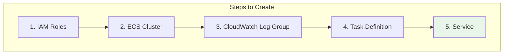
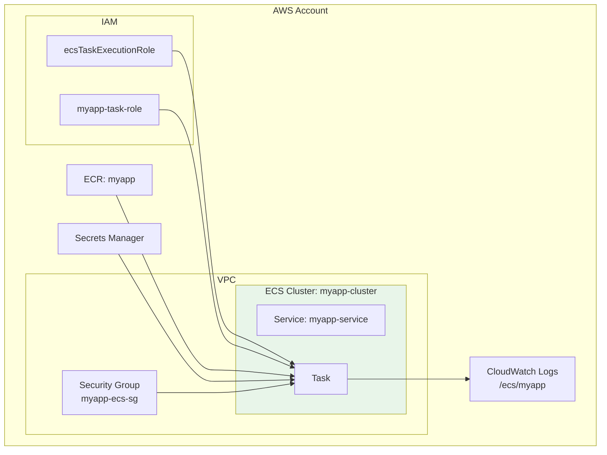

# Lesson 10.14: Creating ECS Resources

> **Duration**: 35 min | **Section**: C - Containers on AWS

## 🎯 The Problem (3-5 min)

You understand ECS concepts. Now let's create real resources.

> **Goal**: 
> - Create an ECS cluster
> - Create a task definition
> - Create a service
> - See your container running!

## 🔧 Prerequisites

Before starting, ensure you have:
- ✅ Docker image in ECR
- ✅ VPC with subnets
- ✅ Security groups created
- ✅ IAM roles (we'll create them)

## 🔍 What We're Building



## ✅ Step 1: Create IAM Roles

### 1a. ECS Task Execution Role

This role allows ECS to pull images and write logs:

```bash
# Create trust policy
cat > ecs-tasks-trust-policy.json << 'EOF'
{
  "Version": "2012-10-17",
  "Statement": [
    {
      "Effect": "Allow",
      "Principal": {
        "Service": "ecs-tasks.amazonaws.com"
      },
      "Action": "sts:AssumeRole"
    }
  ]
}
EOF

# Create the role
aws iam create-role \
    --role-name ecsTaskExecutionRole \
    --assume-role-policy-document file://ecs-tasks-trust-policy.json

# Attach the managed policy
aws iam attach-role-policy \
    --role-name ecsTaskExecutionRole \
    --policy-arn arn:aws:iam::aws:policy/service-role/AmazonECSTaskExecutionRolePolicy
```

### 1b. Task Role (for your app)

This role allows your app to access AWS services:

```bash
# Create the role
aws iam create-role \
    --role-name myapp-task-role \
    --assume-role-policy-document file://ecs-tasks-trust-policy.json

# Create policy for Secrets Manager access
cat > myapp-task-policy.json << 'EOF'
{
    "Version": "2012-10-17",
    "Statement": [
        {
            "Effect": "Allow",
            "Action": [
                "secretsmanager:GetSecretValue"
            ],
            "Resource": "arn:aws:secretsmanager:us-east-1:*:secret:myapp/*"
        }
    ]
}
EOF

# Attach the policy
aws iam put-role-policy \
    --role-name myapp-task-role \
    --policy-name SecretsAccess \
    --policy-document file://myapp-task-policy.json
```

## ✅ Step 2: Create ECS Cluster

```bash
# Create cluster with Fargate capacity provider
aws ecs create-cluster \
    --cluster-name myapp-cluster \
    --capacity-providers FARGATE FARGATE_SPOT \
    --default-capacity-provider-strategy \
        capacityProvider=FARGATE,weight=1

# Verify
aws ecs describe-clusters --clusters myapp-cluster
```

## ✅ Step 3: Create CloudWatch Log Group

```bash
# Create log group for container logs
aws logs create-log-group --log-group-name /ecs/myapp

# Set retention (optional, saves money)
aws logs put-retention-policy \
    --log-group-name /ecs/myapp \
    --retention-in-days 14
```

## ✅ Step 4: Create Task Definition

```bash
# Get your AWS account ID
ACCOUNT_ID=$(aws sts get-caller-identity --query Account --output text)

# Create task definition file
cat > task-definition.json << EOF
{
    "family": "myapp",
    "networkMode": "awsvpc",
    "requiresCompatibilities": ["FARGATE"],
    "cpu": "256",
    "memory": "512",
    "executionRoleArn": "arn:aws:iam::${ACCOUNT_ID}:role/ecsTaskExecutionRole",
    "taskRoleArn": "arn:aws:iam::${ACCOUNT_ID}:role/myapp-task-role",
    "containerDefinitions": [
        {
            "name": "api",
            "image": "${ACCOUNT_ID}.dkr.ecr.us-east-1.amazonaws.com/myapp:latest",
            "essential": true,
            "portMappings": [
                {
                    "containerPort": 8000,
                    "protocol": "tcp"
                }
            ],
            "environment": [
                {
                    "name": "ENVIRONMENT",
                    "value": "production"
                }
            ],
            "secrets": [
                {
                    "name": "DATABASE_URL",
                    "valueFrom": "arn:aws:secretsmanager:us-east-1:${ACCOUNT_ID}:secret:myapp/production/database:DATABASE_URL::"
                }
            ],
            "logConfiguration": {
                "logDriver": "awslogs",
                "options": {
                    "awslogs-group": "/ecs/myapp",
                    "awslogs-region": "us-east-1",
                    "awslogs-stream-prefix": "ecs"
                }
            },
            "healthCheck": {
                "command": ["CMD-SHELL", "curl -f http://localhost:8000/health || exit 1"],
                "interval": 30,
                "timeout": 5,
                "retries": 3,
                "startPeriod": 60
            }
        }
    ]
}
EOF

# Register the task definition
aws ecs register-task-definition \
    --cli-input-json file://task-definition.json
```

## ✅ Step 5: Create Security Group for ECS

```bash
# Get your VPC ID
VPC_ID=$(aws ec2 describe-vpcs \
    --filters "Name=isDefault,Values=true" \
    --query 'Vpcs[0].VpcId' --output text)

# Create security group
aws ec2 create-security-group \
    --group-name myapp-ecs-sg \
    --description "Security group for MyApp ECS tasks" \
    --vpc-id $VPC_ID

# Get the security group ID
ECS_SG_ID=$(aws ec2 describe-security-groups \
    --filters "Name=group-name,Values=myapp-ecs-sg" \
    --query 'SecurityGroups[0].GroupId' --output text)

# Allow inbound on port 8000 (from ALB later)
# For now, allow from anywhere for testing
aws ec2 authorize-security-group-ingress \
    --group-id $ECS_SG_ID \
    --protocol tcp \
    --port 8000 \
    --cidr 0.0.0.0/0
```

## ✅ Step 6: Create ECS Service

```bash
# Get subnet IDs (use private subnets for production)
SUBNET_IDS=$(aws ec2 describe-subnets \
    --filters "Name=vpc-id,Values=$VPC_ID" \
    --query 'Subnets[*].SubnetId' --output text | tr '\t' ',')

# Create the service
aws ecs create-service \
    --cluster myapp-cluster \
    --service-name myapp-service \
    --task-definition myapp \
    --desired-count 1 \
    --launch-type FARGATE \
    --network-configuration "awsvpcConfiguration={
        subnets=[${SUBNET_IDS}],
        securityGroups=[$ECS_SG_ID],
        assignPublicIp=ENABLED
    }"
```

**Note**: `assignPublicIp=ENABLED` for testing. In production, use a load balancer.

## 🔍 Verify Everything is Running

```bash
# Check service status
aws ecs describe-services \
    --cluster myapp-cluster \
    --services myapp-service \
    --query 'services[0].{Status:status,Running:runningCount,Desired:desiredCount}'

# List tasks
aws ecs list-tasks \
    --cluster myapp-cluster \
    --service-name myapp-service

# Get task details (including public IP)
TASK_ARN=$(aws ecs list-tasks \
    --cluster myapp-cluster \
    --service-name myapp-service \
    --query 'taskArns[0]' --output text)

aws ecs describe-tasks \
    --cluster myapp-cluster \
    --tasks $TASK_ARN \
    --query 'tasks[0].attachments[0].details'
```

## 🔍 View Logs

```bash
# Get recent logs
aws logs tail /ecs/myapp --follow

# Or filter by time
aws logs tail /ecs/myapp --since 1h
```

## 🔍 What We Created



## ⚠️ Common Errors and Fixes

| Error | Cause | Fix |
|-------|-------|-----|
| "Unable to pull image" | ECR permissions | Check ecsTaskExecutionRole has ECR access |
| "Essential container exited" | App crashed | Check CloudWatch logs |
| "ResourceInitializationError" | Network issues | Check security groups, subnet |
| "CannotPullContainerError" | Wrong image URI | Verify ECR image exists |

## 🎯 Cleanup (if testing)

```bash
# Delete service
aws ecs update-service \
    --cluster myapp-cluster \
    --service myapp-service \
    --desired-count 0

aws ecs delete-service \
    --cluster myapp-cluster \
    --service myapp-service

# Delete cluster
aws ecs delete-cluster --cluster myapp-cluster

# Deregister task definition
aws ecs deregister-task-definition --task-definition myapp:1
```

## 🔑 Key Takeaways

| Step | Purpose |
|------|---------|
| IAM Roles | Permissions for ECS and app |
| Cluster | Logical grouping |
| Log Group | Container logs |
| Task Definition | Container blueprint |
| Security Group | Network firewall |
| Service | Keeps tasks running |

---

**Next**: 10.15 - ECS Deployments
