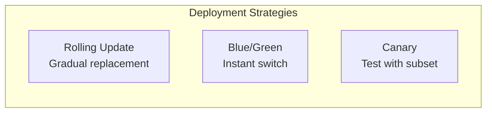
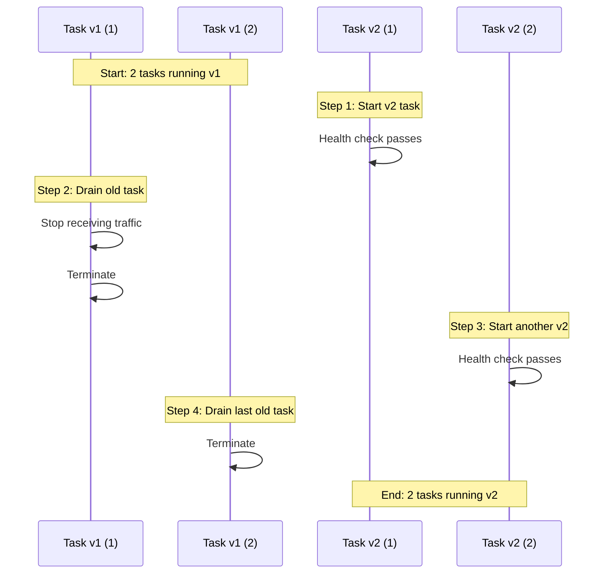
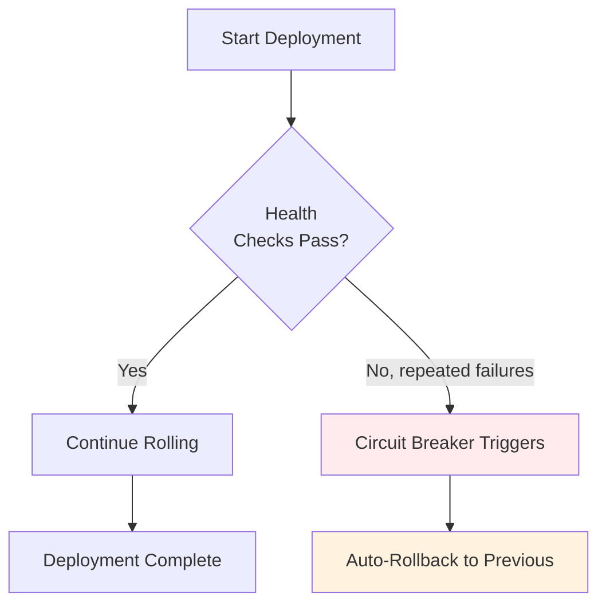
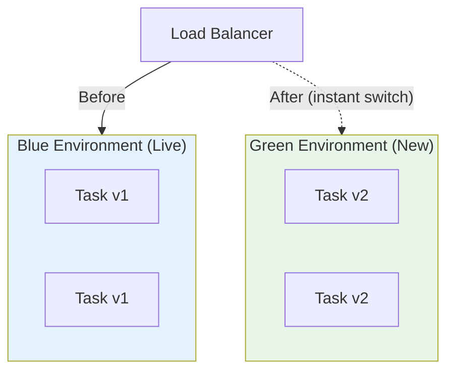
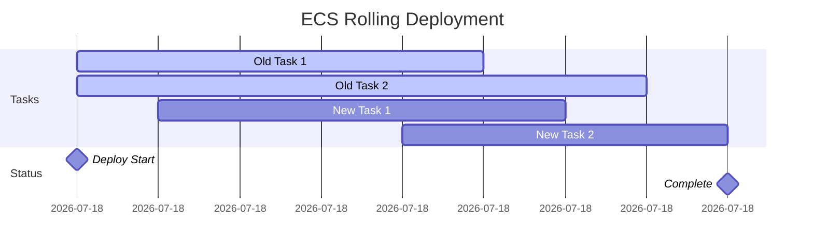

# Lesson 10.15: ECS Deployments

> **Duration**: 25 min | **Section**: C - Containers on AWS

## 🎯 The Problem (3-5 min)

Your app is running on ECS. Now you need to deploy a new version.

> **Scenario**:
> - You fixed a bug and pushed a new Docker image
> - 100 users are currently using the app
> - You can't just "stop and restart" - users would see errors
> - You need zero-downtime deployments

## 🔍 Deployment Strategies



| Strategy | Downtime | Risk | Rollback | Complexity |
|----------|----------|------|----------|------------|
| **Rolling** | Zero | Medium | Slow | Simple ✅ |
| **Blue/Green** | Zero | Low | Instant | Medium |
| **Canary** | Zero | Lowest | Instant | Complex |

## 🔍 Rolling Update (Default)

ECS gradually replaces old tasks with new ones:



## ✅ Configure Deployment Settings

```bash
# Update service with deployment configuration
aws ecs update-service \
    --cluster myapp-cluster \
    --service myapp-service \
    --deployment-configuration '{
        "deploymentCircuitBreaker": {
            "enable": true,
            "rollback": true
        },
        "minimumHealthyPercent": 50,
        "maximumPercent": 200
    }'
```

### Deployment Parameters

| Parameter | Value | Meaning |
|-----------|-------|---------|
| `minimumHealthyPercent` | 50 | Keep at least 50% running during deploy |
| `maximumPercent` | 200 | Can temporarily have 200% of desired count |
| `deploymentCircuitBreaker` | enabled | Auto-rollback on failures |

**Example** with 2 desired tasks:
- Minimum healthy: 50% × 2 = 1 task must stay running
- Maximum: 200% × 2 = 4 tasks can run temporarily

## ✅ Trigger a Deployment

### Option 1: Update Service (Force New Deployment)

```bash
# Force new deployment of the same task definition
aws ecs update-service \
    --cluster myapp-cluster \
    --service myapp-service \
    --force-new-deployment
```

### Option 2: Update Task Definition

```bash
# Register new task definition with new image
aws ecs register-task-definition \
    --cli-input-json file://task-definition-v2.json

# Update service to use new task definition
aws ecs update-service \
    --cluster myapp-cluster \
    --service myapp-service \
    --task-definition myapp:2  # New revision
```

## 🔍 Monitor Deployment Progress

```bash
# Watch deployment in real-time
watch -n 5 "aws ecs describe-services \
    --cluster myapp-cluster \
    --services myapp-service \
    --query 'services[0].deployments'"

# Check events
aws ecs describe-services \
    --cluster myapp-cluster \
    --services myapp-service \
    --query 'services[0].events[:5]'
```

### Deployment States

| State | Meaning |
|-------|---------|
| `PRIMARY` | Target deployment (new) |
| `ACTIVE` | Current running deployment |
| `DRAINING` | Old tasks being removed |

## 🔍 Deployment Circuit Breaker

Automatically rolls back if deployment fails:



## ✅ Blue/Green Deployment with CodeDeploy

For instant rollback capability:



**Benefits:**
- Instant rollback (just switch back)
- Full testing before switch
- No mixed versions

## 🔍 Deployment Best Practices

### 1. Always Use Health Checks

```json
{
  "healthCheck": {
    "command": ["CMD-SHELL", "curl -f http://localhost:8000/health || exit 1"],
    "interval": 30,
    "timeout": 5,
    "retries": 3,
    "startPeriod": 60
  }
}
```

### 2. Set Proper Start Period

Give your app time to initialize:

```json
{
  "startPeriod": 60  // 60 seconds before health checks start
}
```

### 3. Enable Circuit Breaker

```bash
aws ecs update-service \
    --cluster myapp-cluster \
    --service myapp-service \
    --deployment-configuration '{
        "deploymentCircuitBreaker": {
            "enable": true,
            "rollback": true
        }
    }'
```

### 4. Use Image Tags (Not :latest)

```bash
# ❌ Bad: Can't track versions
image: myapp:latest

# ✅ Good: Know exactly what's deployed
image: myapp:v1.2.3
image: myapp:abc123f  # Git SHA
```

## 🔍 Rollback

### Manual Rollback

```bash
# Update service to previous task definition
aws ecs update-service \
    --cluster myapp-cluster \
    --service myapp-service \
    --task-definition myapp:1  # Previous revision
```

### View Task Definition History

```bash
# List all revisions
aws ecs list-task-definitions \
    --family-prefix myapp \
    --sort DESC

# Output:
# myapp:3  (newest)
# myapp:2
# myapp:1  (oldest)
```

## 🔍 Deployment Timeline



## ⚠️ Common Deployment Issues

| Issue | Cause | Fix |
|-------|-------|-----|
| Deployment stuck | Health checks failing | Check container logs, health endpoint |
| Tasks keep restarting | App crashing | Check logs, increase `startPeriod` |
| Slow deployment | Low resources | Increase `maximumPercent` |
| Service unavailable | All tasks unhealthy | Fix app, manual rollback |

## 🎯 Practice: Deploy a New Version

```bash
# 1. Push new image to ECR
docker build -t myapp:v2 .
docker tag myapp:v2 ECR_URI/myapp:v2
docker push ECR_URI/myapp:v2

# 2. Update task definition with new image
# (edit task-definition.json to use :v2)

# 3. Register new task definition
aws ecs register-task-definition --cli-input-json file://task-definition.json

# 4. Update service
aws ecs update-service \
    --cluster myapp-cluster \
    --service myapp-service \
    --task-definition myapp:2

# 5. Monitor
aws ecs describe-services \
    --cluster myapp-cluster \
    --services myapp-service \
    --query 'services[0].deployments'
```

## 🔑 Key Takeaways

| Concept | Details |
|---------|---------|
| Rolling Update | Gradual replacement, zero downtime |
| `minimumHealthyPercent` | Tasks that must stay running |
| `maximumPercent` | Temporary extra capacity |
| Circuit Breaker | Auto-rollback on failure |
| Health Checks | Required for safe deployments |
| Rollback | Update to previous task definition |

---

**Next**: 10.16 - Container Q&A
