# Lesson 10.16: Containers Q&A

> **Duration**: 20 min | **Section**: C - Containers on AWS (Recap)

## 📚 Section C Recap

We covered Docker and container orchestration on AWS:


## ❓ Common Questions & Answers

### Docker Questions

| Question | Answer |
|----------|--------|
| **Why slim images?** | Smaller size, fewer vulnerabilities, faster deploys |
| **Why multi-stage builds?** | Keep build tools out of final image |
| **Why non-root user?** | Security: if compromised, attacker has limited access |
| **How small can my image be?** | Python apps typically 100-200MB with slim base |

### ECR Questions

| Question | Answer |
|----------|--------|
| **Is ECR free?** | Storage: $0.10/GB/month. Transfers to ECS same region: free |
| **Why not Docker Hub?** | Rate limits, not AWS-integrated, less secure for private images |
| **How long is login valid?** | 12 hours. Re-authenticate in CI/CD |
| **Image tag strategy?** | Use git SHA + semantic version (v1.2.3) |

### ECS Questions

| Question | Answer |
|----------|--------|
| **Fargate vs EC2?** | Fargate: simpler, no server management. EC2: more control, can be cheaper |
| **How many tasks should I run?** | Start with 2 for high availability, scale based on load |
| **What if a task crashes?** | ECS automatically restarts it |
| **How long to deploy?** | Depends on health check timing. Usually 2-5 minutes |

## 🔍 Container Architecture Overview


## 🔍 Quick Reference: Key Commands

### Docker

```bash
# Build production image
docker build -t myapp:latest .

# Check image size
docker images myapp:latest

# Run locally
docker run -p 8000:8000 myapp:latest
```

### ECR

```bash
# Login
aws ecr get-login-password | docker login --username AWS --password-stdin ECR_URI

# Push
docker tag myapp:latest ECR_URI/myapp:v1.0.0
docker push ECR_URI/myapp:v1.0.0

# List images
aws ecr describe-images --repository-name myapp
```

### ECS

```bash
# Create cluster
aws ecs create-cluster --cluster-name myapp-cluster

# Register task definition
aws ecs register-task-definition --cli-input-json file://task-definition.json

# Create service
aws ecs create-service --cluster myapp-cluster --service-name myapp --task-definition myapp --desired-count 2

# Update service (deploy)
aws ecs update-service --cluster myapp-cluster --service myapp-service --force-new-deployment

# View logs
aws logs tail /ecs/myapp --follow
```

## 🔍 Troubleshooting Guide

| Symptom | Check | Fix |
|---------|-------|-----|
| Image won't pull | ECR login, image URI | Re-authenticate, verify tag |
| Task won't start | CloudWatch logs | Check app startup errors |
| Health check fails | `/health` endpoint | Verify endpoint works |
| Service stuck at 0 | Task errors | Check logs, IAM roles |
| Slow deployments | Health check config | Adjust `startPeriod`, intervals |

## 🔍 Cost Summary

| Service | Small App (monthly) |
|---------|---------------------|
| ECR (2GB) | ~$0.20 |
| ECS Fargate (2 tasks, 0.25 vCPU, 0.5GB) | ~$18 |
| CloudWatch Logs (5GB) | ~$2.50 |
| **Total** | ~$21/month |

## ✅ Self-Check: Section C

Before moving on, make sure you can:

| Task | Can You? |
|------|----------|
| Build a production Docker image | ⬜ |
| Push an image to ECR | ⬜ |
| Explain Cluster vs Service vs Task | ⬜ |
| Create an ECS service | ⬜ |
| Deploy a new version | ⬜ |
| View container logs | ⬜ |
| Roll back a deployment | ⬜ |

## 🎯 What's Next: Section D

Now that containers are running, we need to expose them to the internet:

```mermaid
flowchart LR
    A["Section A<br/>✅ Foundations"] --> B["Section B<br/>✅ Database"]
    B --> C["Section C<br/>✅ Containers"]
    C --> D["Section D<br/>📍 Networking"]
    
    style C fill:#E8F5E9
    style D fill:#FFF3E0
```



**Section D: Networking & CI/CD**
- 10.17: Application Load Balancer (ALB)
- 10.18: Custom Domains (Route 53)
- 10.19: SSL/TLS Certificates
- 10.20: GitHub Actions for CI/CD
- 10.21: Complete Pipeline
- 10.22: Module 10 Q&A

## 🔍 Architecture So Far


## � Common Pitfalls

| Pitfall | Problem | Solution |
|---------|---------|----------|
| Fat Docker images | Slow deploys, larger attack surface | Multi-stage builds, slim base images |
| Running as root | Security vulnerability | Add USER in Dockerfile |
| No health checks | ECS can't detect crashes | Add `/health` endpoint, configure ALB |
| Expired ECR login | Pushes fail after 12 hours | Re-authenticate in CI/CD scripts |
| Using `latest` tag | Can't rollback, unclear versioning | Use git SHA + semver for tags |
| Insufficient memory | OOMKilled tasks | Monitor usage, set appropriate limits |

## �🔑 Key Takeaways from Section C

1. **Docker**: Use slim base, multi-stage builds, non-root user
2. **ECR**: AWS's private Docker registry, integrated with ECS
3. **ECS Cluster**: Logical grouping of resources
4. **ECS Service**: Maintains desired number of tasks
5. **ECS Task**: Running container instance
6. **Deployments**: Rolling updates with automatic rollback
7. **Monitoring**: CloudWatch Logs for container output

---

## 📚 Resources

- [ECS Best Practices](https://docs.aws.amazon.com/AmazonECS/latest/bestpracticesguide/)
- [ECS Workshop](https://ecsworkshop.com/)
- [Docker Best Practices](https://docs.docker.com/develop/develop-images/dockerfile_best-practices/)

---

**Next**: 10.17 - Application Load Balancer (Section D begins)
