# Lesson 10.17: Application Load Balancer

> **Duration**: 30 min | **Section**: D - Networking & CI/CD

## 🎯 The Problem (3-5 min)

Your ECS tasks are running. But users can't reach them yet.

> **Scenario**:
> - Each ECS task has a private IP (10.0.1.10, 10.0.1.11)
> - Tasks can crash and restart with new IPs
> - You have 2 tasks - which one should users connect to?
> - You need SSL/HTTPS - should each container handle it?

**You need a Load Balancer** - a single entry point that distributes traffic.

## 🔍 What is a Load Balancer?

```mermaid
flowchart TD
    USERS["👥 Users"]
    
    subgraph AWS["AWS"]
        ALB["⚖️ Application Load Balancer<br/>myapp.example.com"]
        
        subgraph ECS["ECS Tasks"]
            T1["Task 1<br/>10.0.1.10"]
            T2["Task 2<br/>10.0.1.11"]
            T3["Task 3<br/>10.0.1.12"]
        end
    end
    
    USERS --> ALB
    ALB --> T1
    ALB --> T2
    ALB --> T3
    
    style ALB fill:#FFF3E0
```



**Load Balancer benefits:**
- Single stable endpoint
- Distributes traffic across tasks
- Health checks (doesn't send traffic to dead tasks)
- SSL/TLS termination
- Path-based routing

## 🔍 AWS Load Balancer Types

| Type | Layer | Use Case |
|------|-------|----------|
| **ALB** (Application) | Layer 7 (HTTP/S) | Web apps, APIs ✅ |
| **NLB** (Network) | Layer 4 (TCP/UDP) | High performance, gaming |
| **CLB** (Classic) | Legacy | Don't use for new apps |

**For FastAPI/web apps: Use ALB**

## 🔍 ALB Components

```mermaid
flowchart TD
    subgraph ALB["Application Load Balancer"]
        LB["Load Balancer<br/>(myapp-alb)"]
        
        subgraph Listeners["Listeners"]
            L80["Listener :80<br/>(HTTP)"]
            L443["Listener :443<br/>(HTTPS)"]
        end
        
        subgraph Rules["Rules"]
            R1["Path: /api/* → API Target"]
            R2["Path: /* → Web Target"]
        end
        
        subgraph TGs["Target Groups"]
            TG1["API Targets<br/>(ECS Tasks)"]
            TG2["Web Targets<br/>(ECS Tasks)"]
        end
    end
    
    LB --> Listeners
    Listeners --> Rules
    Rules --> TGs
```



| Component | Purpose |
|-----------|---------|
| **Load Balancer** | Entry point with DNS name |
| **Listener** | Listens on a port (80, 443) |
| **Rules** | Route requests based on path, host |
| **Target Group** | Collection of targets (ECS tasks) |

## ✅ Step 1: Create Target Group

```bash
# Get VPC ID
VPC_ID=$(aws ec2 describe-vpcs \
    --filters "Name=isDefault,Values=true" \
    --query 'Vpcs[0].VpcId' --output text)

# Create target group
aws elbv2 create-target-group \
    --name myapp-tg \
    --protocol HTTP \
    --port 8000 \
    --vpc-id $VPC_ID \
    --target-type ip \
    --health-check-path /health \
    --health-check-interval-seconds 30 \
    --health-check-timeout-seconds 5 \
    --healthy-threshold-count 2 \
    --unhealthy-threshold-count 3

# Note the Target Group ARN returned
```

**Important**: `target-type: ip` for Fargate (not `instance`)

## ✅ Step 2: Create Security Group for ALB

```bash
# Create ALB security group
aws ec2 create-security-group \
    --group-name myapp-alb-sg \
    --description "Security group for MyApp ALB" \
    --vpc-id $VPC_ID

ALB_SG_ID=$(aws ec2 describe-security-groups \
    --filters "Name=group-name,Values=myapp-alb-sg" \
    --query 'SecurityGroups[0].GroupId' --output text)

# Allow HTTP from anywhere
aws ec2 authorize-security-group-ingress \
    --group-id $ALB_SG_ID \
    --protocol tcp \
    --port 80 \
    --cidr 0.0.0.0/0

# Allow HTTPS from anywhere
aws ec2 authorize-security-group-ingress \
    --group-id $ALB_SG_ID \
    --protocol tcp \
    --port 443 \
    --cidr 0.0.0.0/0
```

## ✅ Step 3: Update ECS Security Group

ECS should only accept traffic from ALB:

```bash
ECS_SG_ID=$(aws ec2 describe-security-groups \
    --filters "Name=group-name,Values=myapp-ecs-sg" \
    --query 'SecurityGroups[0].GroupId' --output text)

# Remove old rule (0.0.0.0/0 if you had it for testing)
# Add rule: allow from ALB security group only
aws ec2 authorize-security-group-ingress \
    --group-id $ECS_SG_ID \
    --protocol tcp \
    --port 8000 \
    --source-group $ALB_SG_ID
```

## ✅ Step 4: Create Load Balancer

```bash
# Get public subnet IDs
SUBNET_IDS=$(aws ec2 describe-subnets \
    --filters "Name=vpc-id,Values=$VPC_ID" \
    --query 'Subnets[?MapPublicIpOnLaunch==`true`].SubnetId' \
    --output text | tr '\t' ' ')

# Create ALB
aws elbv2 create-load-balancer \
    --name myapp-alb \
    --subnets $SUBNET_IDS \
    --security-groups $ALB_SG_ID \
    --scheme internet-facing \
    --type application

# Note the ALB ARN and DNS name returned
```

## ✅ Step 5: Create Listener

```bash
# Get ARNs
ALB_ARN=$(aws elbv2 describe-load-balancers \
    --names myapp-alb \
    --query 'LoadBalancers[0].LoadBalancerArn' --output text)

TG_ARN=$(aws elbv2 describe-target-groups \
    --names myapp-tg \
    --query 'TargetGroups[0].TargetGroupArn' --output text)

# Create HTTP listener (we'll add HTTPS later)
aws elbv2 create-listener \
    --load-balancer-arn $ALB_ARN \
    --protocol HTTP \
    --port 80 \
    --default-actions Type=forward,TargetGroupArn=$TG_ARN
```

## ✅ Step 6: Connect ECS to ALB

Update ECS service to register with the target group:

```bash
aws ecs update-service \
    --cluster myapp-cluster \
    --service myapp-service \
    --load-balancers "targetGroupArn=$TG_ARN,containerName=api,containerPort=8000"
```

Or create service with ALB from the start:

```bash
aws ecs create-service \
    --cluster myapp-cluster \
    --service-name myapp-service \
    --task-definition myapp \
    --desired-count 2 \
    --launch-type FARGATE \
    --network-configuration '...' \
    --load-balancers "targetGroupArn=$TG_ARN,containerName=api,containerPort=8000"
```

## 🔍 Traffic Flow


## 🔍 Health Checks

ALB checks if targets are healthy:

```bash
# View target health
aws elbv2 describe-target-health \
    --target-group-arn $TG_ARN

# Output example:
# {
#   "TargetHealthDescriptions": [
#     {
#       "Target": {"Id": "10.0.1.10", "Port": 8000},
#       "HealthCheckPort": "8000",
#       "TargetHealth": {"State": "healthy"}
#     }
#   ]
# }
```

### Health Check Settings

| Setting | Recommended | Why |
|---------|-------------|-----|
| Path | `/health` | Dedicated health endpoint |
| Interval | 30s | Check every 30 seconds |
| Timeout | 5s | Fail if no response in 5s |
| Healthy threshold | 2 | 2 passes = healthy |
| Unhealthy threshold | 3 | 3 failures = unhealthy |

## 🔍 Get Your ALB URL

```bash
# Get DNS name
aws elbv2 describe-load-balancers \
    --names myapp-alb \
    --query 'LoadBalancers[0].DNSName' --output text

# Example output:
# myapp-alb-123456789.us-east-1.elb.amazonaws.com

# Test it!
curl http://myapp-alb-123456789.us-east-1.elb.amazonaws.com/health
```

## 💰 ALB Pricing

| Component | Cost |
|-----------|------|
| Per hour | $0.0225 |
| Per LCU | $0.008 |

**LCU** = Load Balancer Capacity Unit (based on connections, bandwidth, rules)

**Typical small app**: ~$20-30/month

## ⚠️ Common Issues

| Issue | Cause | Fix |
|-------|-------|-----|
| 502 Bad Gateway | No healthy targets | Check ECS tasks, health endpoint |
| 503 Service Unavailable | Target group empty | Check ECS service is registered |
| Connection refused | Security group | Allow ALB SG → ECS SG on port 8000 |
| Slow responses | Health check too aggressive | Increase intervals |

## 🎯 Practice: Verify Setup

```bash
# 1. Check ALB is active
aws elbv2 describe-load-balancers \
    --names myapp-alb \
    --query 'LoadBalancers[0].State'

# 2. Check targets are healthy
aws elbv2 describe-target-health \
    --target-group-arn $TG_ARN

# 3. Test the endpoint
curl -v http://YOUR_ALB_DNS/health
```

## 🔑 Key Takeaways

| Component | Purpose |
|-----------|---------|
| ALB | Single entry point, distributes traffic |
| Target Group | Collection of ECS tasks |
| Listener | Port + protocol configuration |
| Health Checks | Only route to healthy targets |
| Security Groups | ALB public, ECS from ALB only |

---

**Next**: 10.18 - Custom Domains (Route 53)
