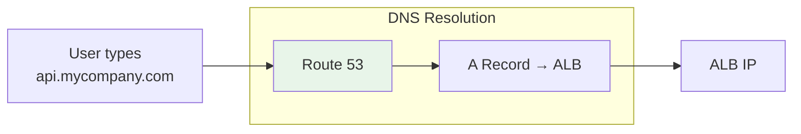
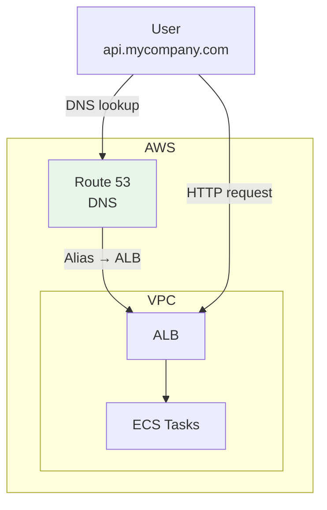

# Lesson 10.18: Custom Domains (Route 53)

> **Duration**: 25 min | **Section**: D - Networking & CI/CD

## 🎯 The Problem (3-5 min)

Your ALB has a URL, but it's ugly:

> **Current**: `myapp-alb-123456789.us-east-1.elb.amazonaws.com`
> **Wanted**: `api.mycompany.com`

Nobody wants to type (or remember) that AWS-generated domain.

## 🔍 What is Route 53?

Route 53 is AWS's DNS (Domain Name System) service:



**DNS** = Phone book for the internet (names → IP addresses)

## 🔍 Domain Name Basics

```
https://api.mycompany.com:443/users
└─────────┬───────────────┘
        Domain

api.mycompany.com
 │     │        │
 │     │        └── TLD (Top Level Domain)
 │     └── Domain (you buy this)
 └── Subdomain (you create these)
```

## 🔍 Option 1: Buy Domain from Route 53

Simplest option - everything in AWS:

```bash
# Check if domain is available
aws route53domains check-domain-availability \
    --domain-name mycompany.com

# Register domain (around $12/year for .com)
aws route53domains register-domain \
    --domain-name mycompany.com \
    --duration-in-years 1 \
    --admin-contact file://contact.json \
    --registrant-contact file://contact.json \
    --tech-contact file://contact.json
```

## 🔍 Option 2: Use Existing Domain

If you bought your domain elsewhere (GoDaddy, Namecheap, etc.):

1. Create a Hosted Zone in Route 53
2. Update nameservers at your registrar

```bash
# Create hosted zone
aws route53 create-hosted-zone \
    --name mycompany.com \
    --caller-reference $(date +%s)

# Get nameservers
aws route53 get-hosted-zone \
    --id ZONE_ID \
    --query 'DelegationSet.NameServers'

# Output:
# [
#   "ns-123.awsdns-45.com",
#   "ns-678.awsdns-90.net",
#   ...
# ]
```

Then update these nameservers at your domain registrar.

## ✅ Create DNS Record for ALB

### Get Your Hosted Zone ID

```bash
# List hosted zones
aws route53 list-hosted-zones \
    --query 'HostedZones[*].[Id,Name]' --output table

# Note the zone ID (e.g., /hostedzone/Z1234567890)
```

### Create an Alias Record

Route 53 has special "Alias" records for AWS resources (free, no additional queries):

```bash
# Get ALB DNS name and hosted zone
ALB_DNS=$(aws elbv2 describe-load-balancers \
    --names myapp-alb \
    --query 'LoadBalancers[0].DNSName' --output text)

ALB_ZONE=$(aws elbv2 describe-load-balancers \
    --names myapp-alb \
    --query 'LoadBalancers[0].CanonicalHostedZoneId' --output text)

# Create the record
cat > change-batch.json << EOF
{
  "Changes": [
    {
      "Action": "CREATE",
      "ResourceRecordSet": {
        "Name": "api.mycompany.com",
        "Type": "A",
        "AliasTarget": {
          "HostedZoneId": "${ALB_ZONE}",
          "DNSName": "${ALB_DNS}",
          "EvaluateTargetHealth": true
        }
      }
    }
  ]
}
EOF

# Apply the change
aws route53 change-resource-record-sets \
    --hosted-zone-id YOUR_ZONE_ID \
    --change-batch file://change-batch.json
```

## 🔍 Record Types

| Type | Purpose | Example |
|------|---------|---------|
| **A** | Domain → IPv4 address | `mycompany.com → 1.2.3.4` |
| **AAAA** | Domain → IPv6 address | `mycompany.com → 2001:...` |
| **CNAME** | Domain → Another domain | `www → mycompany.com` |
| **Alias** | Domain → AWS resource | `api → ALB` (AWS-specific) |
| **MX** | Email servers | Mail routing |
| **TXT** | Text data | Domain verification |

**For ALB: Use Alias A record** (free, supports apex domain)

## 🔍 Common DNS Configurations

### API Subdomain

```
api.mycompany.com → ALB
```

### Multiple Subdomains

```
api.mycompany.com → API ALB
www.mycompany.com → Web ALB  (or S3/CloudFront)
staging.mycompany.com → Staging ALB
```

### Apex Domain (mycompany.com)

```
mycompany.com → ALB (Alias record required)
www.mycompany.com → CNAME → mycompany.com
```

## 🔍 Verify DNS is Working

```bash
# Check DNS propagation
dig api.mycompany.com

# Or use nslookup
nslookup api.mycompany.com

# Test the endpoint
curl http://api.mycompany.com/health
```

**Note**: DNS changes can take up to 48 hours to propagate worldwide, but usually complete in 5-15 minutes.

## 🔍 Architecture with Custom Domain



## 💰 Route 53 Pricing

| Resource | Cost |
|----------|------|
| Hosted zone | $0.50/month |
| Standard queries | $0.40/million |
| Alias queries to AWS | Free |
| Domain registration | $12-50/year (depends on TLD) |

## ⚠️ Common Issues

| Issue | Cause | Fix |
|-------|-------|-----|
| DNS not resolving | Propagation delay | Wait 5-15 minutes |
| "Server not found" | Wrong nameservers | Update at registrar |
| Works in some locations, not others | Propagation in progress | Wait or flush local DNS |
| Alias record fails | Wrong ALB zone ID | Use ALB's CanonicalHostedZoneId |

## 🎯 Practice: Set Up Custom Domain

1. **Create or use existing hosted zone**
2. **Create Alias A record pointing to ALB**
3. **Verify with `dig` or `nslookup`**
4. **Test with `curl`**

```bash
# Quick verification
dig +short api.mycompany.com
# Should return ALB IP addresses
```

## 🔑 Key Takeaways

| Concept | Details |
|---------|---------|
| Route 53 | AWS DNS service |
| Hosted Zone | Container for DNS records |
| Alias Record | AWS-specific, free queries to AWS resources |
| Propagation | DNS changes take 5 min to 48 hours |
| Nameservers | Update at registrar if domain bought elsewhere |

---

**Next**: 10.19 - SSL/TLS Certificates (HTTPS)
