# Lesson 10.19: SSL/TLS Certificates

> **Duration**: 25 min | **Section**: D - Networking & CI/CD

## 🎯 The Problem (3-5 min)

Your API is accessible via HTTP. But:

> **Scenario**:
> - User sends: `POST /login {"password": "secret123"}`
> - Over HTTP, this is sent in **plain text**
> - Anyone on the network can read it
> - Google Chrome shows "Not Secure" warning
> - Users don't trust your site

**You need HTTPS** - encrypted connections.

## 🔍 HTTP vs HTTPS

```mermaid
flowchart LR
    subgraph HTTP["❌ HTTP (Port 80)"]
        H1["Password: secret123"]
        H2["📖 Anyone can read"]
    end
    
    subgraph HTTPS["✅ HTTPS (Port 443)"]
        S1["🔐 Encrypted data"]
        S2["Only recipient can read"]
    end
    
    style HTTP fill:#FFEBEE
    style HTTPS fill:#E8F5E9
```



## 🔍 How HTTPS Works


**Key point**: ALB handles SSL/TLS. Traffic between ALB and ECS can be HTTP (inside your VPC).

## 🔍 AWS Certificate Manager (ACM)

ACM provides **free** SSL certificates for AWS resources:


**Note**: ACM certificates only work with AWS services (not EC2 directly).

## ✅ Step 1: Request a Certificate

```bash
# Request certificate for your domain
aws acm request-certificate \
    --domain-name api.mycompany.com \
    --validation-method DNS \
    --subject-alternative-names "*.mycompany.com"

# Note the CertificateArn returned
# arn:aws:acm:us-east-1:123456789:certificate/abc-123-xyz
```

### Validation Methods

| Method | How It Works | Best For |
|--------|--------------|----------|
| **DNS** | Add CNAME record to prove ownership | Recommended ✅ |
| **Email** | AWS emails domain contacts | Legacy |

## ✅ Step 2: Validate with DNS

ACM gives you a CNAME record to add:

```bash
# Get validation CNAME
aws acm describe-certificate \
    --certificate-arn YOUR_CERT_ARN \
    --query 'Certificate.DomainValidationOptions[0].ResourceRecord'

# Output:
# {
#   "Name": "_abc123.api.mycompany.com.",
#   "Type": "CNAME",
#   "Value": "_xyz789.acm-validations.aws."
# }
```

### Add the CNAME to Route 53

```bash
# Create CNAME record for validation
cat > validation-record.json << EOF
{
  "Changes": [
    {
      "Action": "CREATE",
      "ResourceRecordSet": {
        "Name": "_abc123.api.mycompany.com",
        "Type": "CNAME",
        "TTL": 300,
        "ResourceRecords": [
          {
            "Value": "_xyz789.acm-validations.aws."
          }
        ]
      }
    }
  ]
}
EOF

aws route53 change-resource-record-sets \
    --hosted-zone-id YOUR_ZONE_ID \
    --change-batch file://validation-record.json
```

### Wait for Validation

```bash
# Check certificate status
aws acm describe-certificate \
    --certificate-arn YOUR_CERT_ARN \
    --query 'Certificate.Status'

# Wait until status is "ISSUED" (usually 5-30 minutes)
```

## ✅ Step 3: Add HTTPS Listener to ALB

```bash
# Get ARNs
ALB_ARN=$(aws elbv2 describe-load-balancers \
    --names myapp-alb \
    --query 'LoadBalancers[0].LoadBalancerArn' --output text)

TG_ARN=$(aws elbv2 describe-target-groups \
    --names myapp-tg \
    --query 'TargetGroups[0].TargetGroupArn' --output text)

# Create HTTPS listener
aws elbv2 create-listener \
    --load-balancer-arn $ALB_ARN \
    --protocol HTTPS \
    --port 443 \
    --certificates CertificateArn=YOUR_CERT_ARN \
    --default-actions Type=forward,TargetGroupArn=$TG_ARN \
    --ssl-policy ELBSecurityPolicy-TLS13-1-2-2021-06
```

## ✅ Step 4: Redirect HTTP to HTTPS

Don't just serve HTTP - redirect to HTTPS:

```bash
# Get HTTP listener ARN
HTTP_LISTENER=$(aws elbv2 describe-listeners \
    --load-balancer-arn $ALB_ARN \
    --query 'Listeners[?Port==`80`].ListenerArn' --output text)

# Modify to redirect
aws elbv2 modify-listener \
    --listener-arn $HTTP_LISTENER \
    --default-actions '[{
        "Type": "redirect",
        "RedirectConfig": {
            "Protocol": "HTTPS",
            "Port": "443",
            "StatusCode": "HTTP_301"
        }
    }]'
```

## 🔍 Complete HTTPS Flow


## 🔍 SSL Security Policies

| Policy | TLS Versions | Use Case |
|--------|--------------|----------|
| `ELBSecurityPolicy-TLS13-1-2-2021-06` | TLS 1.2, 1.3 | Recommended ✅ |
| `ELBSecurityPolicy-2016-08` | TLS 1.0, 1.1, 1.2 | Legacy clients |
| `ELBSecurityPolicy-FS-1-2-Res-2020-10` | TLS 1.2 + Forward Secrecy | High security |

**Recommendation**: Use TLS 1.2+ policy unless you need legacy support.

## 🔍 Verify HTTPS is Working

```bash
# Test HTTPS
curl -v https://api.mycompany.com/health

# Test HTTP redirect
curl -v http://api.mycompany.com/health
# Should show 301 redirect to HTTPS

# Check certificate details
echo | openssl s_client -connect api.mycompany.com:443 2>/dev/null | openssl x509 -noout -dates
```

## 🔍 Certificate Renewal

ACM certificates **auto-renew** if:
- Certificate is in use (attached to ALB, etc.)
- DNS validation record still exists
- Domain is still in your control

**No action needed** - AWS handles it automatically.

## 💰 ACM Pricing

| Resource | Cost |
|----------|------|
| Public certificates | **Free** |
| Private CA | $400/month |

Yes, SSL certificates are free with ACM! 🎉

## ⚠️ Common Issues

| Issue | Cause | Fix |
|-------|-------|-----|
| Certificate stuck "Pending" | DNS validation not found | Add CNAME record, wait |
| "Certificate not valid" | Wrong domain or expired | Check domain match, renewal |
| Mixed content warnings | Page loads HTTP resources | Update all URLs to HTTPS |
| Certificate in wrong region | ACM is regional | Request cert in ALB's region |

## 🎯 Practice: Enable HTTPS

1. **Request certificate** from ACM
2. **Add DNS validation** CNAME record
3. **Wait for "Issued"** status
4. **Add HTTPS listener** to ALB
5. **Redirect HTTP** to HTTPS
6. **Test** with curl and browser

```bash
# Final test
curl -I https://api.mycompany.com/health
# Should return 200 OK with no SSL errors
```

## 🔑 Key Takeaways

| Concept | Details |
|---------|---------|
| ACM | Free SSL certificates for AWS |
| DNS Validation | Add CNAME to prove domain ownership |
| HTTPS Listener | Port 443 with certificate attached |
| HTTP Redirect | 301 redirect to HTTPS |
| Auto-Renewal | ACM renews automatically |
| TLS 1.2+ | Modern security policy |

---

**Next**: 10.20 - GitHub Actions CI/CD
