# Lesson 10.20: GitHub Actions CI/CD

> **Duration**: 35 min | **Section**: D - Networking & CI/CD

## 🎯 The Problem (3-5 min)

Your app is deployed. But every deployment requires:

> **Manual Deployment**:
> 1. Run tests locally
> 2. Build Docker image
> 3. Push to ECR
> 4. Run migrations
> 5. Update ECS service
> 6. Monitor deployment
> 7. Hope nothing breaks at 3 AM

**Humans make mistakes. Automate everything.**

## 🔍 What is CI/CD?


| Term | Meaning |
|------|---------|
| **CI** | Automatically test and build on every push |
| **CD** | Automatically deploy to production |

## 🔍 GitHub Actions

GitHub Actions runs workflows in response to events:

```mermaid
flowchart TD
    EVENT["🎯 Event: Push to main"]
    
    subgraph Workflow["Workflow: .github/workflows/deploy.yml"]
        JOB1["Job: test"]
        JOB2["Job: build"]
        JOB3["Job: deploy"]
    end
    
    EVENT --> JOB1 --> JOB2 --> JOB3
```



## ✅ Step 1: Create AWS Credentials

GitHub needs permission to deploy to AWS:

```bash
# Create IAM user for GitHub Actions
aws iam create-user --user-name github-actions

# Attach policies
aws iam attach-user-policy \
    --user-name github-actions \
    --policy-arn arn:aws:iam::aws:policy/AmazonEC2ContainerRegistryPowerUser

aws iam attach-user-policy \
    --user-name github-actions \
    --policy-arn arn:aws:iam::aws:policy/AmazonECS_FullAccess

# Create custom policy for Secrets Manager (if needed)
# ... (similar to ECS task role)

# Create access keys
aws iam create-access-key --user-name github-actions
# Save the AccessKeyId and SecretAccessKey!
```

## ✅ Step 2: Add Secrets to GitHub

1. Go to your repository on GitHub
2. Settings → Secrets and variables → Actions
3. Add these secrets:

| Secret Name | Value |
|-------------|-------|
| `AWS_ACCESS_KEY_ID` | From step 1 |
| `AWS_SECRET_ACCESS_KEY` | From step 1 |
| `AWS_REGION` | us-east-1 |
| `ECR_REPOSITORY` | myapp |
| `ECS_CLUSTER` | myapp-cluster |
| `ECS_SERVICE` | myapp-service |

## ✅ Step 3: Create Workflow File

```yaml
# .github/workflows/deploy.yml
name: Deploy to AWS ECS

on:
  push:
    branches: [main]
  pull_request:
    branches: [main]

env:
  AWS_REGION: ${{ secrets.AWS_REGION }}
  ECR_REPOSITORY: ${{ secrets.ECR_REPOSITORY }}
  ECS_CLUSTER: ${{ secrets.ECS_CLUSTER }}
  ECS_SERVICE: ${{ secrets.ECS_SERVICE }}

jobs:
  test:
    runs-on: ubuntu-latest
    steps:
      - name: Checkout code
        uses: actions/checkout@v4

      - name: Set up Python
        uses: actions/setup-python@v5
        with:
          python-version: '3.11'

      - name: Install dependencies
        run: |
          pip install -r requirements.txt
          pip install pytest pytest-cov

      - name: Run tests
        run: pytest --cov=src tests/

  build-and-push:
    needs: test
    runs-on: ubuntu-latest
    if: github.ref == 'refs/heads/main'
    outputs:
      image: ${{ steps.build.outputs.image }}
    
    steps:
      - name: Checkout code
        uses: actions/checkout@v4

      - name: Configure AWS credentials
        uses: aws-actions/configure-aws-credentials@v4
        with:
          aws-access-key-id: ${{ secrets.AWS_ACCESS_KEY_ID }}
          aws-secret-access-key: ${{ secrets.AWS_SECRET_ACCESS_KEY }}
          aws-region: ${{ env.AWS_REGION }}

      - name: Login to Amazon ECR
        id: login-ecr
        uses: aws-actions/amazon-ecr-login@v2

      - name: Build, tag, and push image
        id: build
        env:
          ECR_REGISTRY: ${{ steps.login-ecr.outputs.registry }}
          IMAGE_TAG: ${{ github.sha }}
        run: |
          docker build -t $ECR_REGISTRY/$ECR_REPOSITORY:$IMAGE_TAG .
          docker build -t $ECR_REGISTRY/$ECR_REPOSITORY:latest .
          docker push $ECR_REGISTRY/$ECR_REPOSITORY:$IMAGE_TAG
          docker push $ECR_REGISTRY/$ECR_REPOSITORY:latest
          echo "image=$ECR_REGISTRY/$ECR_REPOSITORY:$IMAGE_TAG" >> $GITHUB_OUTPUT

  deploy:
    needs: build-and-push
    runs-on: ubuntu-latest
    
    steps:
      - name: Configure AWS credentials
        uses: aws-actions/configure-aws-credentials@v4
        with:
          aws-access-key-id: ${{ secrets.AWS_ACCESS_KEY_ID }}
          aws-secret-access-key: ${{ secrets.AWS_SECRET_ACCESS_KEY }}
          aws-region: ${{ env.AWS_REGION }}

      - name: Deploy to ECS
        run: |
          aws ecs update-service \
            --cluster ${{ env.ECS_CLUSTER }} \
            --service ${{ env.ECS_SERVICE }} \
            --force-new-deployment

      - name: Wait for deployment
        run: |
          aws ecs wait services-stable \
            --cluster ${{ env.ECS_CLUSTER }} \
            --services ${{ env.ECS_SERVICE }}
```

## 🔍 Workflow Breakdown

```mermaid
flowchart TD
    subgraph Trigger["Trigger"]
        PUSH["Push to main"]
    end
    
    subgraph Jobs["Jobs"]
        TEST["1️⃣ test<br/>pytest"]
        BUILD["2️⃣ build-and-push<br/>Docker → ECR"]
        DEPLOY["3️⃣ deploy<br/>ECS update"]
    end
    
    PUSH --> TEST
    TEST -->|"Success"| BUILD
    BUILD -->|"Success"| DEPLOY
    
    TEST -->|"Fail"| STOP["❌ Stop"]
    
    style DEPLOY fill:#E8F5E9
```



## 🔍 Key Workflow Concepts

### Triggers

```yaml
on:
  push:
    branches: [main]      # Deploy on push to main
  pull_request:
    branches: [main]      # Test on PRs to main
```

### Job Dependencies

```yaml
jobs:
  build:
    needs: test           # Wait for test to pass
```

### Conditional Execution

```yaml
if: github.ref == 'refs/heads/main'  # Only on main branch
```

### Outputs

```yaml
outputs:
  image: ${{ steps.build.outputs.image }}  # Pass to next job
```

## 🔍 Adding Migrations

Update the deploy job to run migrations first:

```yaml
deploy:
  needs: build-and-push
  runs-on: ubuntu-latest
  
  steps:
    - name: Configure AWS credentials
      uses: aws-actions/configure-aws-credentials@v4
      with:
        aws-access-key-id: ${{ secrets.AWS_ACCESS_KEY_ID }}
        aws-secret-access-key: ${{ secrets.AWS_SECRET_ACCESS_KEY }}
        aws-region: ${{ env.AWS_REGION }}

    - name: Run database migrations
      run: |
        # Run migration as ECS task
        TASK_ARN=$(aws ecs run-task \
          --cluster ${{ env.ECS_CLUSTER }} \
          --task-definition myapp-migration \
          --launch-type FARGATE \
          --network-configuration '{"awsvpcConfiguration":{"subnets":["subnet-xxx"],"securityGroups":["sg-xxx"]}}' \
          --query 'tasks[0].taskArn' \
          --output text)
        
        echo "Waiting for migration..."
        aws ecs wait tasks-stopped \
          --cluster ${{ env.ECS_CLUSTER }} \
          --tasks $TASK_ARN
        
        # Check exit code
        EXIT_CODE=$(aws ecs describe-tasks \
          --cluster ${{ env.ECS_CLUSTER }} \
          --tasks $TASK_ARN \
          --query 'tasks[0].containers[0].exitCode' \
          --output text)
        
        if [ "$EXIT_CODE" != "0" ]; then
          echo "Migration failed!"
          exit 1
        fi
        echo "Migration complete!"

    - name: Deploy to ECS
      run: |
        aws ecs update-service \
          --cluster ${{ env.ECS_CLUSTER }} \
          --service ${{ env.ECS_SERVICE }} \
          --force-new-deployment
```

## 🔍 Environment Protection

For production safety, add environment protection rules:

1. Go to Settings → Environments
2. Create "production" environment
3. Add required reviewers
4. Add wait timer (optional)

```yaml
deploy:
  environment: production  # Requires approval
```

## 🔍 Notification on Failure

Add Slack notification:

```yaml
- name: Notify on failure
  if: failure()
  uses: 8398a7/action-slack@v3
  with:
    status: failure
    fields: repo,message,commit,author
  env:
    SLACK_WEBHOOK_URL: ${{ secrets.SLACK_WEBHOOK }}
```

## 🔍 Complete Pipeline Visualization


## ⚠️ Common Issues

| Issue | Cause | Fix |
|-------|-------|-----|
| "Credentials not valid" | Wrong secrets | Check AWS keys in GitHub secrets |
| "Repository not found" | ECR permissions | Check IAM policy |
| "Service not found" | Wrong cluster/service name | Verify names in secrets |
| Deployment timeout | Health checks failing | Check ECS task logs |

## 🎯 Practice: Set Up CI/CD

1. Create `.github/workflows/deploy.yml`
2. Add AWS secrets to GitHub
3. Push to main branch
4. Watch the workflow run
5. Verify deployment in ECS

## 🔑 Key Takeaways

| Concept | Details |
|---------|---------|
| CI | Automated testing on every push |
| CD | Automated deployment to production |
| GitHub Secrets | Store AWS credentials securely |
| Job Dependencies | `needs:` ensures order |
| Environment Protection | Require approval for production |
| Notifications | Alert on failure |

---

**Next**: 10.21 - Complete Pipeline
