# Lesson 10.21: Complete Pipeline

> **Duration**: 30 min | **Section**: D - Networking & CI/CD

## 🎯 The Goal

Let's put everything together - a complete, production-ready deployment pipeline.

> **The Dream**:
> - Push code to GitHub
> - Tests run automatically
> - Image builds and pushes to ECR
> - Migrations run safely
> - ECS deploys with zero downtime
> - Rollback if anything fails
> - You get notified of success/failure

## 🔍 Complete Architecture

```mermaid
flowchart TD
    subgraph Dev["Development"]
        CODE["👨‍💻 Push to main"]
    end
    
    subgraph CI["CI (GitHub Actions)"]
        TEST["1. Run tests"]
        LINT["2. Lint & format check"]
        BUILD["3. Build Docker image"]
        SCAN["4. Security scan"]
        PUSH["5. Push to ECR"]
    end
    
    subgraph CD["CD (AWS)"]
        MIGRATE["6. Run migrations"]
        DEPLOY["7. Deploy to ECS"]
        HEALTH["8. Health checks"]
        STABLE["9. Wait for stable"]
    end
    
    subgraph Notify["Notifications"]
        SUCCESS["✅ Slack: Success"]
        FAIL["❌ Slack: Failure"]
    end
    
    CODE --> TEST --> LINT --> BUILD --> SCAN --> PUSH
    PUSH --> MIGRATE --> DEPLOY --> HEALTH --> STABLE
    STABLE --> SUCCESS
    TEST -->|Fail| FAIL
    MIGRATE -->|Fail| FAIL
    HEALTH -->|Fail| FAIL
```



## ✅ Complete Workflow File

```yaml
# .github/workflows/deploy.yml
name: CI/CD Pipeline

on:
  push:
    branches: [main]
  pull_request:
    branches: [main]

env:
  AWS_REGION: us-east-1
  ECR_REPOSITORY: myapp
  ECS_CLUSTER: myapp-cluster
  ECS_SERVICE: myapp-service
  ECS_TASK_DEFINITION: myapp
  PYTHON_VERSION: '3.11'

jobs:
  # ============================================
  # 1. TEST & LINT
  # ============================================
  test:
    name: Test & Lint
    runs-on: ubuntu-latest
    
    steps:
      - name: Checkout code
        uses: actions/checkout@v4

      - name: Set up Python
        uses: actions/setup-python@v5
        with:
          python-version: ${{ env.PYTHON_VERSION }}
          cache: 'pip'

      - name: Install dependencies
        run: |
          pip install -r requirements.txt
          pip install pytest pytest-cov ruff mypy

      - name: Lint with Ruff
        run: ruff check src/

      - name: Type check with MyPy
        run: mypy src/ --ignore-missing-imports

      - name: Run tests
        run: pytest tests/ -v --cov=src --cov-report=xml

      - name: Upload coverage
        uses: codecov/codecov-action@v4
        with:
          files: coverage.xml

  # ============================================
  # 2. BUILD & PUSH
  # ============================================
  build:
    name: Build & Push
    needs: test
    runs-on: ubuntu-latest
    if: github.ref == 'refs/heads/main' && github.event_name == 'push'
    
    outputs:
      image: ${{ steps.build.outputs.image }}
      image-tag: ${{ github.sha }}
    
    steps:
      - name: Checkout code
        uses: actions/checkout@v4

      - name: Configure AWS credentials
        uses: aws-actions/configure-aws-credentials@v4
        with:
          aws-access-key-id: ${{ secrets.AWS_ACCESS_KEY_ID }}
          aws-secret-access-key: ${{ secrets.AWS_SECRET_ACCESS_KEY }}
          aws-region: ${{ env.AWS_REGION }}

      - name: Login to Amazon ECR
        id: login-ecr
        uses: aws-actions/amazon-ecr-login@v2

      - name: Build and push Docker image
        id: build
        env:
          ECR_REGISTRY: ${{ steps.login-ecr.outputs.registry }}
          IMAGE_TAG: ${{ github.sha }}
        run: |
          # Build with cache
          docker build \
            --cache-from $ECR_REGISTRY/$ECR_REPOSITORY:latest \
            -t $ECR_REGISTRY/$ECR_REPOSITORY:$IMAGE_TAG \
            -t $ECR_REGISTRY/$ECR_REPOSITORY:latest \
            .
          
          # Push both tags
          docker push $ECR_REGISTRY/$ECR_REPOSITORY:$IMAGE_TAG
          docker push $ECR_REGISTRY/$ECR_REPOSITORY:latest
          
          echo "image=$ECR_REGISTRY/$ECR_REPOSITORY:$IMAGE_TAG" >> $GITHUB_OUTPUT

      - name: Run Trivy vulnerability scan
        uses: aquasecurity/trivy-action@master
        with:
          image-ref: ${{ steps.login-ecr.outputs.registry }}/${{ env.ECR_REPOSITORY }}:${{ github.sha }}
          format: 'table'
          exit-code: '0'  # Don't fail on vulnerabilities (warning only)
          severity: 'CRITICAL,HIGH'

  # ============================================
  # 3. MIGRATE
  # ============================================
  migrate:
    name: Run Migrations
    needs: build
    runs-on: ubuntu-latest
    environment: production
    
    steps:
      - name: Configure AWS credentials
        uses: aws-actions/configure-aws-credentials@v4
        with:
          aws-access-key-id: ${{ secrets.AWS_ACCESS_KEY_ID }}
          aws-secret-access-key: ${{ secrets.AWS_SECRET_ACCESS_KEY }}
          aws-region: ${{ env.AWS_REGION }}

      - name: Run migration task
        id: migration
        run: |
          echo "Starting migration..."
          
          TASK_ARN=$(aws ecs run-task \
            --cluster ${{ env.ECS_CLUSTER }} \
            --task-definition ${{ env.ECS_TASK_DEFINITION }}-migration \
            --launch-type FARGATE \
            --network-configuration '${{ secrets.ECS_NETWORK_CONFIG }}' \
            --overrides '{"containerOverrides":[{"name":"migration","command":["alembic","upgrade","head"]}]}' \
            --query 'tasks[0].taskArn' \
            --output text)
          
          echo "Migration task: $TASK_ARN"
          echo "task-arn=$TASK_ARN" >> $GITHUB_OUTPUT
          
          # Wait for completion
          aws ecs wait tasks-stopped \
            --cluster ${{ env.ECS_CLUSTER }} \
            --tasks $TASK_ARN
          
          # Check exit code
          EXIT_CODE=$(aws ecs describe-tasks \
            --cluster ${{ env.ECS_CLUSTER }} \
            --tasks $TASK_ARN \
            --query 'tasks[0].containers[0].exitCode' \
            --output text)
          
          if [ "$EXIT_CODE" != "0" ]; then
            echo "❌ Migration failed with exit code: $EXIT_CODE"
            
            # Get logs
            LOG_STREAM=$(aws ecs describe-tasks \
              --cluster ${{ env.ECS_CLUSTER }} \
              --tasks $TASK_ARN \
              --query 'tasks[0].containers[0].logConfiguration.options."awslogs-stream-prefix"' \
              --output text)
            
            echo "Check CloudWatch logs for details"
            exit 1
          fi
          
          echo "✅ Migration complete!"

  # ============================================
  # 4. DEPLOY
  # ============================================
  deploy:
    name: Deploy to ECS
    needs: [build, migrate]
    runs-on: ubuntu-latest
    environment: production
    
    steps:
      - name: Checkout code
        uses: actions/checkout@v4

      - name: Configure AWS credentials
        uses: aws-actions/configure-aws-credentials@v4
        with:
          aws-access-key-id: ${{ secrets.AWS_ACCESS_KEY_ID }}
          aws-secret-access-key: ${{ secrets.AWS_SECRET_ACCESS_KEY }}
          aws-region: ${{ env.AWS_REGION }}

      - name: Download task definition
        run: |
          aws ecs describe-task-definition \
            --task-definition ${{ env.ECS_TASK_DEFINITION }} \
            --query 'taskDefinition' \
            > task-definition.json

      - name: Update task definition with new image
        id: task-def
        uses: aws-actions/amazon-ecs-render-task-definition@v1
        with:
          task-definition: task-definition.json
          container-name: api
          image: ${{ needs.build.outputs.image }}

      - name: Register new task definition
        id: register
        run: |
          NEW_TASK_DEF=$(aws ecs register-task-definition \
            --cli-input-json file://${{ steps.task-def.outputs.task-definition }} \
            --query 'taskDefinition.taskDefinitionArn' \
            --output text)
          echo "task-definition=$NEW_TASK_DEF" >> $GITHUB_OUTPUT

      - name: Deploy to ECS
        run: |
          aws ecs update-service \
            --cluster ${{ env.ECS_CLUSTER }} \
            --service ${{ env.ECS_SERVICE }} \
            --task-definition ${{ steps.register.outputs.task-definition }}

      - name: Wait for deployment
        run: |
          echo "Waiting for ECS service to stabilize..."
          aws ecs wait services-stable \
            --cluster ${{ env.ECS_CLUSTER }} \
            --services ${{ env.ECS_SERVICE }}
          echo "✅ Deployment complete!"

  # ============================================
  # 5. VERIFY
  # ============================================
  verify:
    name: Verify Deployment
    needs: deploy
    runs-on: ubuntu-latest
    
    steps:
      - name: Health check
        run: |
          # Wait a bit for DNS propagation
          sleep 30
          
          # Hit the health endpoint
          HTTP_STATUS=$(curl -s -o /dev/null -w "%{http_code}" \
            https://${{ secrets.APP_DOMAIN }}/health)
          
          if [ "$HTTP_STATUS" != "200" ]; then
            echo "❌ Health check failed: HTTP $HTTP_STATUS"
            exit 1
          fi
          
          echo "✅ Health check passed: HTTP $HTTP_STATUS"

      - name: Smoke test
        run: |
          # Test a critical endpoint
          RESPONSE=$(curl -s https://${{ secrets.APP_DOMAIN }}/api/v1/status)
          echo "Response: $RESPONSE"

  # ============================================
  # 6. NOTIFY
  # ============================================
  notify-success:
    name: Notify Success
    needs: [verify]
    runs-on: ubuntu-latest
    if: success()
    
    steps:
      - name: Slack notification
        uses: 8398a7/action-slack@v3
        with:
          status: success
          fields: repo,message,commit,author,took
          text: '🚀 Deployment successful!'
        env:
          SLACK_WEBHOOK_URL: ${{ secrets.SLACK_WEBHOOK }}

  notify-failure:
    name: Notify Failure
    needs: [test, build, migrate, deploy, verify]
    runs-on: ubuntu-latest
    if: failure()
    
    steps:
      - name: Slack notification
        uses: 8398a7/action-slack@v3
        with:
          status: failure
          fields: repo,message,commit,author,took
          text: '❌ Deployment failed!'
        env:
          SLACK_WEBHOOK_URL: ${{ secrets.SLACK_WEBHOOK }}
```

## 🔍 Secrets Required

| Secret | Description |
|--------|-------------|
| `AWS_ACCESS_KEY_ID` | AWS access key |
| `AWS_SECRET_ACCESS_KEY` | AWS secret key |
| `ECS_NETWORK_CONFIG` | JSON with subnets/security groups |
| `APP_DOMAIN` | Your app domain (e.g., api.mycompany.com) |
| `SLACK_WEBHOOK` | Slack incoming webhook URL |

### ECS Network Config Format

```json
{
  "awsvpcConfiguration": {
    "subnets": ["subnet-xxx", "subnet-yyy"],
    "securityGroups": ["sg-xxx"],
    "assignPublicIp": "DISABLED"
  }
}
```

## 🔍 Pipeline Timeline


**Typical total time: 8-12 minutes**

## 🔍 Rollback Strategy

If deployment fails, you have options:

### Automatic (Circuit Breaker)

ECS deployment circuit breaker automatically rolls back:

```bash
aws ecs update-service \
    --cluster myapp-cluster \
    --service myapp-service \
    --deployment-configuration '{
        "deploymentCircuitBreaker": {
            "enable": true,
            "rollback": true
        }
    }'
```

### Manual Rollback

```bash
# Find previous task definition
aws ecs list-task-definitions \
    --family-prefix myapp \
    --sort DESC

# Deploy previous version
aws ecs update-service \
    --cluster myapp-cluster \
    --service myapp-service \
    --task-definition myapp:PREVIOUS_REVISION
```

## 🔍 Production Checklist

Before going live:

| Category | Item | ✓ |
|----------|------|---|
| **Security** | IAM role has minimal permissions | ⬜ |
| | Secrets in GitHub Secrets, not code | ⬜ |
| | ECR image scanning enabled | ⬜ |
| **Testing** | All tests passing | ⬜ |
| | Coverage above threshold | ⬜ |
| **Deployment** | Health checks configured | ⬜ |
| | Circuit breaker enabled | ⬜ |
| | Rollback tested | ⬜ |
| **Monitoring** | CloudWatch alarms set | ⬜ |
| | Slack notifications working | ⬜ |
| | Logs accessible | ⬜ |

## 🔑 Key Takeaways

| Stage | Purpose |
|-------|---------|
| Test & Lint | Catch issues before build |
| Build & Push | Create immutable Docker image |
| Security Scan | Find vulnerabilities |
| Migrate | Update database schema |
| Deploy | Rolling update to ECS |
| Verify | Confirm deployment works |
| Notify | Keep team informed |

---

**Next**: 10.22 - Module 10 Q&A
