# Lesson 10.22: Module 10 Q&A

> **Duration**: 25 min | **Section**: D - Networking & CI/CD (Module Recap)

## 📚 Module 10 Complete Recap

We covered everything needed to deploy a production FastAPI app to AWS:


## 🔍 Complete Production Architecture


## ❓ Frequently Asked Questions

### Architecture Questions

| Question | Answer |
|----------|--------|
| **Is this the only way?** | No. You could use Lambda, EC2, App Runner, etc. This is a solid, scalable pattern. |
| **Do I need all these services?** | For production: yes. For MVP: you could skip NAT Gateway, use simpler networking. |
| **What about serverless?** | Lambda + API Gateway is great for simple APIs. ECS is better for complex apps. |
| **Multi-region?** | Add later when you need global presence. Start with one region. |

### Cost Questions

| Question | Answer |
|----------|--------|
| **Total monthly cost?** | $80-150/month for small production app |
| **What's the biggest cost?** | Usually NAT Gateway (~$35) or RDS (~$15-50) |
| **How to reduce costs?** | Use Fargate Spot, smaller RDS, skip NAT for dev |
| **Free tier?** | 12 months free tier helps, but not enough for production |

### Estimated Monthly Costs (Revisited)

| Service | Small App | Notes |
|---------|-----------|-------|
| ECS Fargate (2 tasks) | $18 | 0.25 vCPU, 0.5 GB each |
| RDS (db.t3.micro) | $15 | Single AZ |
| ALB | $25 | Base + LCUs |
| NAT Gateway | $35 | Most expensive! |
| ECR (5 GB) | $0.50 | |
| Secrets Manager (5) | $2 | |
| CloudWatch | $5 | Logs + metrics |
| Route 53 | $1 | Hosted zone + queries |
| **Total** | **~$102** | |

### Security Questions

| Question | Answer |
|----------|--------|
| **Is this secure enough?** | Yes for most apps. Add WAF for extra protection. |
| **What about DDoS?** | AWS Shield Standard (free) provides basic protection. |
| **Pen testing allowed?** | Yes, with prior AWS approval for some tests. |
| **Compliance (HIPAA, SOC2)?** | Possible with additional configuration. |

### Operations Questions

| Question | Answer |
|----------|--------|
| **How to debug production?** | CloudWatch Logs, X-Ray tracing, SSM Session Manager |
| **How to scale?** | ECS auto-scaling, RDS read replicas, caching |
| **Backup strategy?** | RDS automated backups, ECR image retention |
| **Disaster recovery?** | Multi-AZ RDS, cross-region backups |

## 🔍 Quick Reference: CLI Commands

### Deployment Commands

```bash
# Check service status
aws ecs describe-services \
    --cluster myapp-cluster \
    --services myapp-service

# View logs
aws logs tail /ecs/myapp --follow

# Force new deployment
aws ecs update-service \
    --cluster myapp-cluster \
    --service myapp-service \
    --force-new-deployment

# Rollback to previous version
aws ecs update-service \
    --cluster myapp-cluster \
    --service myapp-service \
    --task-definition myapp:PREVIOUS
```

### Debugging Commands

```bash
# Check target health (ALB)
aws elbv2 describe-target-health \
    --target-group-arn YOUR_TG_ARN

# Get task details
aws ecs describe-tasks \
    --cluster myapp-cluster \
    --tasks TASK_ARN

# Check RDS status
aws rds describe-db-instances \
    --query 'DBInstances[*].[DBInstanceIdentifier,DBInstanceStatus]'
```

## 🔍 Troubleshooting Guide

| Symptom | Check | Likely Fix |
|---------|-------|------------|
| 502 Bad Gateway | Target group health | Container crashing, check logs |
| Slow response | CloudWatch metrics | Scale up resources |
| Can't connect to RDS | Security groups | Allow ECS SG → RDS SG |
| Deployment stuck | ECS events | Health check failing |
| Secrets not loading | Task role IAM | Add SecretsManager permissions |
| Images won't pull | Execution role IAM | Add ECR permissions |

## ✅ Independence Check

Before moving on, confirm you understand:

| Level | Question | ✓ |
|-------|----------|---|
| **Know** | What's the difference between ECS and ECR? | ⬜ |
| **Know** | What does ALB do? | ⬜ |
| **Understand** | Why use private subnets for RDS and ECS? | ⬜ |
| **Understand** | Why use Secrets Manager instead of .env? | ⬜ |
| **Apply** | Can you deploy a FastAPI app to ECS? | ⬜ |
| **Apply** | Can you set up CI/CD with GitHub Actions? | ⬜ |
| **Analyze** | When would you use Lambda instead of ECS? | ⬜ |
| **Create** | Can you design infrastructure for a new app? | ⬜ |

## 🔍 What's Next?

You now have a production-deployed GenAI application!

```mermaid
flowchart LR
    M10["Module 10<br/>✅ AWS Deployment"] --> M11["Module 11<br/>LLMOps"]
    
    M11 --> TOPICS["Security<br/>Monitoring<br/>Evaluation<br/>Cost Control"]
    
    style M10 fill:#E8F5E9
    style M11 fill:#FFF3E0
```



**Module 11: LLMOps** covers:
- LLM security (prompt injection, OWASP Top 10)
- Input validation and guardrails
- Tracing and observability
- RAG evaluation metrics
- Cost monitoring
- A/B testing prompts

## 📚 Resources

### AWS Documentation
- [ECS Best Practices Guide](https://docs.aws.amazon.com/AmazonECS/latest/bestpracticesguide/)
- [Well-Architected Framework](https://aws.amazon.com/architecture/well-architected/)
- [AWS Security Best Practices](https://docs.aws.amazon.com/wellarchitected/latest/security-pillar/)

### Tutorials
- [ECS Workshop](https://ecsworkshop.com/)
- [Containers on AWS](https://containersonaws.com/)

### Tools
- [AWS CLI Reference](https://docs.aws.amazon.com/cli/latest/)
- [GitHub Actions for AWS](https://github.com/aws-actions)

## � Common Pitfalls

| Pitfall | Problem | Solution |
|---------|---------|----------|
| No CI/CD | Manual deploys = human error | Automate with GitHub Actions |
| No rollback plan | Stuck with broken deployment | Keep previous task definitions, test rollback |
| Missing environment variables | Container crashes on start | Check logs immediately after deploy |
| ALB health check mismatch | Tasks marked unhealthy | Match healthCheckPath and app endpoint |
| NAT Gateway always on | $35+/month even when idle | Consider NAT instance for dev environments |
| No monitoring alerts | Find out issues from users | Set up CloudWatch alarms for errors |

## �🔑 Module 10 Key Takeaways

| Section | Key Learning |
|---------|--------------|
| **A: Foundations** | Cloud = someone else's computers with APIs |
| **B: Database** | RDS in private subnet, never expose to internet |
| **C: Containers** | ECS orchestrates, ECR stores, Fargate runs |
| **D: Networking** | ALB handles traffic, ACM provides free SSL |
| **CI/CD** | Automate everything, fail fast, rollback safely |

---

## 🎉 Congratulations!

You can now deploy production-grade GenAI applications to AWS!

**Next Module**: 11 - LLMOps (Security, Monitoring, and Evaluation)
