# Lesson 10.23: ML CI/CD Pipeline with GitHub Actions

> **Duration**: 40 min | **Section**: E - Advanced Deployment

## 🎯 The Problem

Your RAG app works locally. Your model performs well in testing. You push to main:

```bash
git push origin main
# ... pray it works in production 🙏
```

Two hours later, Slack explodes:
- "The chatbot is giving wrong answers"
- "Response times went from 200ms to 3 seconds"
- "Embedding model seems broken"

You have CI/CD for code, but your ML components have no automated testing. Model quality changes slip through.

> **Scenario**: You update your embedding model from `text-embedding-ada-002` to `text-embedding-3-small`. The new model is cheaper and faster. But you didn't notice: your retrieval recall dropped from 92% to 78%. Users are getting worse answers, and you only find out from complaints.

## 🧪 Try It: The Naive Approach

```yaml
# .github/workflows/deploy.yml - Basic CI
name: Deploy
on:
  push:
    branches: [main]

jobs:
  deploy:
    runs-on: ubuntu-latest
    steps:
      - uses: actions/checkout@v4
      - name: Run tests
        run: pytest tests/
      - name: Deploy
        run: ./deploy.sh
```

**Problems**:
- ❌ No model quality checks
- ❌ No performance benchmarks
- ❌ No cost estimation
- ❌ No rollback if model degrades

## 🔍 Under the Hood: ML-Aware CI/CD


### What ML CI/CD Should Test

| Test Type | What It Checks | Example |
|-----------|----------------|---------|
| **Unit Tests** | Code logic | Chunking, parsing functions |
| **Integration Tests** | API connectivity | LLM/embedding API calls work |
| **Quality Tests** | Model performance | Recall@10 ≥ 85% on test set |
| **Performance Tests** | Speed/latency | P95 latency < 500ms |
| **Cost Tests** | Token usage | Average query < 2000 tokens |

---

## ✅ The Fix: Complete ML CI/CD Pipeline

### Step 1: Create Test Dataset

```python
# tests/fixtures/test_queries.json
{
    "queries": [
        {
            "query": "What is the refund policy?",
            "expected_doc_ids": ["doc_123", "doc_456"],
            "expected_keywords": ["refund", "30 days", "return"]
        },
        {
            "query": "How do I reset my password?",
            "expected_doc_ids": ["doc_789"],
            "expected_keywords": ["password", "reset", "email"]
        }
    ]
}
```

### Step 2: Model Quality Tests

```python
# tests/test_model_quality.py
import pytest
import json
from app.rag import RAGPipeline

@pytest.fixture
def test_queries():
    with open("tests/fixtures/test_queries.json") as f:
        return json.load(f)["queries"]

@pytest.fixture
def rag_pipeline():
    return RAGPipeline()

class TestRetrievalQuality:
    """Test retrieval quality metrics."""
    
    def test_recall_at_10(self, rag_pipeline, test_queries):
        """Retrieval should find relevant docs in top 10."""
        hits = 0
        total = 0
        
        for query_data in test_queries:
            results = rag_pipeline.retrieve(query_data["query"], k=10)
            result_ids = [r.id for r in results]
            
            for expected_id in query_data["expected_doc_ids"]:
                total += 1
                if expected_id in result_ids:
                    hits += 1
        
        recall = hits / total
        assert recall >= 0.85, f"Recall@10 too low: {recall:.2%}"
    
    def test_keyword_coverage(self, rag_pipeline, test_queries):
        """Retrieved docs should contain expected keywords."""
        for query_data in test_queries:
            results = rag_pipeline.retrieve(query_data["query"], k=5)
            combined_text = " ".join([r.content for r in results]).lower()
            
            for keyword in query_data["expected_keywords"]:
                assert keyword.lower() in combined_text, \
                    f"Missing keyword '{keyword}' in results for: {query_data['query']}"

class TestGenerationQuality:
    """Test LLM response quality."""
    
    def test_response_relevance(self, rag_pipeline, test_queries):
        """LLM response should address the query."""
        for query_data in test_queries:
            response = rag_pipeline.query(query_data["query"])
            
            # Check response contains at least one expected keyword
            found = any(
                kw.lower() in response.lower() 
                for kw in query_data["expected_keywords"]
            )
            assert found, f"Response doesn't address query: {query_data['query']}"
    
    def test_no_hallucination_markers(self, rag_pipeline, test_queries):
        """Response should not have hallucination indicators."""
        hallucination_markers = [
            "I don't have information",
            "I cannot find",
            "As an AI",
            "I'm not sure but",
        ]
        
        for query_data in test_queries:
            response = rag_pipeline.query(query_data["query"])
            
            for marker in hallucination_markers:
                assert marker.lower() not in response.lower(), \
                    f"Possible hallucination in response to: {query_data['query']}"
```

### Step 3: Performance Tests

```python
# tests/test_performance.py
import pytest
import time
import statistics

class TestPerformance:
    """Test latency and throughput."""
    
    def test_retrieval_latency(self, rag_pipeline, test_queries):
        """Retrieval should complete within latency budget."""
        latencies = []
        
        for query_data in test_queries:
            start = time.perf_counter()
            rag_pipeline.retrieve(query_data["query"], k=10)
            latencies.append(time.perf_counter() - start)
        
        p95 = statistics.quantiles(latencies, n=20)[18]  # 95th percentile
        assert p95 < 0.5, f"P95 retrieval latency too high: {p95:.3f}s"
    
    def test_full_query_latency(self, rag_pipeline, test_queries):
        """Full RAG query should complete within budget."""
        latencies = []
        
        for query_data in test_queries[:5]:  # Limit to avoid API costs
            start = time.perf_counter()
            rag_pipeline.query(query_data["query"])
            latencies.append(time.perf_counter() - start)
        
        p95 = statistics.quantiles(latencies, n=20)[18]
        assert p95 < 3.0, f"P95 query latency too high: {p95:.3f}s"
```

### Step 4: Cost Estimation Tests

```python
# tests/test_cost.py
import pytest

class TestCostEstimation:
    """Test token usage stays within budget."""
    
    def test_average_tokens_per_query(self, rag_pipeline, test_queries):
        """Average tokens should be within budget."""
        total_tokens = 0
        
        for query_data in test_queries[:10]:
            result = rag_pipeline.query_with_usage(query_data["query"])
            total_tokens += result.usage.total_tokens
        
        avg_tokens = total_tokens / 10
        max_allowed = 3000  # Budget: $0.003 per query at $1/1M tokens
        
        assert avg_tokens < max_allowed, \
            f"Average tokens ({avg_tokens}) exceeds budget ({max_allowed})"
    
    def test_context_window_efficiency(self, rag_pipeline, test_queries):
        """Context should not waste tokens on irrelevant content."""
        for query_data in test_queries[:5]:
            context = rag_pipeline.get_context(query_data["query"])
            context_tokens = len(context.split()) * 1.3  # Rough estimate
            
            # Context should be < 50% of model's window
            assert context_tokens < 4000, \
                f"Context too large: {context_tokens} tokens"
```

### Step 5: Complete GitHub Actions Workflow

```yaml
# .github/workflows/ml-ci-cd.yml
name: ML CI/CD Pipeline

on:
  push:
    branches: [main, develop]
  pull_request:
    branches: [main]

env:
  OPENAI_API_KEY: ${{ secrets.OPENAI_API_KEY }}
  DATABASE_URL: ${{ secrets.DATABASE_URL }}

jobs:
  # Stage 1: Code Quality
  code-quality:
    runs-on: ubuntu-latest
    steps:
      - uses: actions/checkout@v4
      
      - name: Set up Python
        uses: actions/setup-python@v5
        with:
          python-version: '3.11'
      
      - name: Install dependencies
        run: |
          pip install -r requirements.txt
          pip install pytest pytest-cov black mypy
      
      - name: Code formatting check
        run: black --check .
      
      - name: Type checking
        run: mypy src/ --ignore-missing-imports
      
      - name: Unit tests
        run: pytest tests/unit/ -v --cov=src/

  # Stage 2: Model Quality (only on main/develop)
  model-quality:
    needs: code-quality
    runs-on: ubuntu-latest
    if: github.ref == 'refs/heads/main' || github.ref == 'refs/heads/develop'
    steps:
      - uses: actions/checkout@v4
      
      - name: Set up Python
        uses: actions/setup-python@v5
        with:
          python-version: '3.11'
      
      - name: Install dependencies
        run: pip install -r requirements.txt
      
      - name: Run retrieval quality tests
        run: pytest tests/test_model_quality.py -v
      
      - name: Run performance tests
        run: pytest tests/test_performance.py -v
      
      - name: Run cost estimation tests
        run: pytest tests/test_cost.py -v
      
      - name: Generate quality report
        run: |
          python scripts/generate_quality_report.py > quality_report.md
          cat quality_report.md >> $GITHUB_STEP_SUMMARY

  # Stage 3: Build and Push
  build:
    needs: model-quality
    runs-on: ubuntu-latest
    if: github.ref == 'refs/heads/main'
    steps:
      - uses: actions/checkout@v4
      
      - name: Configure AWS credentials
        uses: aws-actions/configure-aws-credentials@v4
        with:
          aws-access-key-id: ${{ secrets.AWS_ACCESS_KEY_ID }}
          aws-secret-access-key: ${{ secrets.AWS_SECRET_ACCESS_KEY }}
          aws-region: us-east-1
      
      - name: Login to ECR
        uses: aws-actions/amazon-ecr-login@v2
      
      - name: Build and push Docker image
        run: |
          docker build -t $ECR_REGISTRY/rag-api:${{ github.sha }} .
          docker push $ECR_REGISTRY/rag-api:${{ github.sha }}

  # Stage 4: Canary Deployment
  canary-deploy:
    needs: build
    runs-on: ubuntu-latest
    environment: production
    steps:
      - uses: actions/checkout@v4
      
      - name: Deploy canary (10% traffic)
        run: |
          aws ecs update-service \
            --cluster rag-cluster \
            --service rag-api-canary \
            --task-definition rag-api:${{ github.sha }}
      
      - name: Wait for canary health
        run: sleep 300  # 5 minutes
      
      - name: Check canary metrics
        run: |
          python scripts/check_canary_metrics.py \
            --error-threshold 0.01 \
            --latency-threshold 500

  # Stage 5: Full Rollout
  full-deploy:
    needs: canary-deploy
    runs-on: ubuntu-latest
    steps:
      - name: Full deployment
        run: |
          aws ecs update-service \
            --cluster rag-cluster \
            --service rag-api \
            --task-definition rag-api:${{ github.sha }}
      
      - name: Notify success
        run: |
          curl -X POST ${{ secrets.SLACK_WEBHOOK }} \
            -H 'Content-type: application/json' \
            -d '{"text": "✅ RAG API deployed: ${{ github.sha }}"}'

  # Rollback job (manual trigger)
  rollback:
    runs-on: ubuntu-latest
    if: github.event_name == 'workflow_dispatch'
    steps:
      - name: Rollback to previous version
        run: |
          PREV_TASK=$(aws ecs describe-services \
            --cluster rag-cluster \
            --services rag-api \
            --query 'services[0].deployments[1].taskDefinition' \
            --output text)
          
          aws ecs update-service \
            --cluster rag-cluster \
            --service rag-api \
            --task-definition $PREV_TASK
```

---

## 🔍 Pipeline Visualization

```mermaid
flowchart LR
    subgraph PR["Pull Request"]
        A["Code Quality<br/>black, mypy, unit tests"]
    end
    
    subgraph Main["Push to Main"]
        B["Model Quality<br/>recall, latency, cost"]
        C["Build & Push<br/>Docker → ECR"]
        D["Canary Deploy<br/>10% traffic"]
        E["Monitor<br/>5 min watch"]
        F["Full Deploy<br/>100% traffic"]
    end
    
    A --> |"merge"| B --> C --> D --> E --> F
    
    E --> |"errors > 1%"| ROLLBACK["Rollback"]
    
    style ROLLBACK fill:#FFEBEE,stroke:#C62828
    style F fill:#E8F5E9,stroke:#2E7D32
```



---

## 📊 Quality Report Script

```python
# scripts/generate_quality_report.py
import json
import subprocess

def run_tests_with_metrics():
    """Run tests and collect metrics."""
    result = subprocess.run(
        ["pytest", "tests/", "-v", "--json-report", "--json-report-file=report.json"],
        capture_output=True
    )
    
    with open("report.json") as f:
        report = json.load(f)
    
    return report

def generate_report():
    report = run_tests_with_metrics()
    
    passed = report["summary"]["passed"]
    failed = report["summary"]["failed"]
    total = passed + failed
    
    print("# ML Quality Report")
    print()
    print(f"**Tests Passed**: {passed}/{total}")
    print()
    print("## Metrics Summary")
    print()
    print("| Metric | Value | Threshold | Status |")
    print("|--------|-------|-----------|--------|")
    print(f"| Recall@10 | 87% | ≥85% | ✅ |")
    print(f"| P95 Latency | 420ms | <500ms | ✅ |")
    print(f"| Avg Tokens | 2,100 | <3,000 | ✅ |")
    print()
    
    if failed > 0:
        print("## ❌ Failed Tests")
        for test in report["tests"]:
            if test["outcome"] == "failed":
                print(f"- {test['nodeid']}")

if __name__ == "__main__":
    generate_report()
```

---

## 🎯 Practice

1. **Create test fixtures**: Build a `test_queries.json` with 10 query/expected pairs
2. **Write quality tests**: Implement recall@10 and keyword coverage tests
3. **Add to CI**: Create `.github/workflows/ml-ci.yml` with model quality stage
4. **Test locally**: Run `pytest tests/test_model_quality.py -v`
5. **Simulate failure**: Change threshold to fail, verify CI catches it

## 🔑 Key Takeaways

- **ML CI/CD ≠ regular CI/CD** - must test model quality, not just code
- **Test on real queries** - maintain a curated test dataset
- **Monitor metrics** - recall, latency, token cost
- **Canary deployments** - don't go 0→100%, use gradual rollout
- **Automate rollback** - fast recovery when quality drops
- **Cost gates** - prevent expensive models from shipping accidentally

## ❓ Common Questions

| Question | Answer |
|----------|--------|
| How many test queries do I need? | Start with 20-50 diverse queries, expand over time |
| Should I call real LLM APIs in CI? | Yes for quality tests, but limit to avoid high costs |
| How often should I update test fixtures? | After every significant model/prompt change |
| What if canary fails? | Auto-rollback + alert, investigate before retrying |

## 🔗 Further Reading

- [GitHub Actions ML Workflows](https://docs.github.com/en/actions)
- [AWS CodePipeline for ML](https://aws.amazon.com/codepipeline/)
- [Continuous Delivery for ML](https://martinfowler.com/articles/cd4ml.html)
- [LLM Evaluation Best Practices](https://www.deeplearning.ai/short-courses/building-evaluating-advanced-rag/)

---

**Next**: [Lesson 10.24: Cost Monitoring](Lesson-24-Cost-Monitoring.md) | **Up**: [Module 10 README](README.md)
