# Lesson 10.24: Cost Monitoring for LLM Applications

> **Duration**: 35 min | **Section**: E - Advanced Deployment

## 🎯 The Problem

Your RAG app launches. Users love it. Month ends. AWS bill arrives:

```
OpenAI API:        $4,200  (expected: $500)
AWS ECS:           $890    (expected: $200)
RDS PostgreSQL:    $340    (expected: $100)
Data Transfer:     $180    (expected: $50)
───────────────────────────────────
Total:             $5,610  (budget: $850)
```

You have no idea which users or features caused this. No alerts fired. You only found out when the invoice came.

> **Scenario**: One user discovered they could paste entire books into your chatbot. They processed 500 documents in a week. That single user consumed $2,000 in embedding + LLM costs. You had no usage limits, no alerts, no visibility.

## 🧪 Try It: The Naive Approach

```python
# Just check the bill at month end
def check_costs():
    # Login to AWS Console
    # Click Billing
    # Cry
    pass
```

**Problems**:
- ❌ No real-time visibility
- ❌ No alerts before budget exceeded
- ❌ No per-user/per-feature breakdown
- ❌ Reactive, not proactive

## 🔍 Under the Hood: Cost Monitoring Architecture


---

## ✅ The Fix: Multi-Layer Cost Monitoring

### Layer 1: Request-Level Tracking

```python
# app/monitoring/cost_tracker.py
from dataclasses import dataclass
from datetime import datetime
import json
import boto3

@dataclass
class UsageRecord:
    timestamp: datetime
    user_id: str
    endpoint: str
    prompt_tokens: int
    completion_tokens: int
    embedding_tokens: int
    model: str
    estimated_cost: float

class CostTracker:
    """Track LLM costs per request."""
    
    # Pricing (per 1M tokens)
    PRICING = {
        "gpt-4": {"input": 30.0, "output": 60.0},
        "gpt-4-turbo": {"input": 10.0, "output": 30.0},
        "gpt-3.5-turbo": {"input": 0.5, "output": 1.5},
        "text-embedding-3-small": {"input": 0.02, "output": 0.0},
        "text-embedding-3-large": {"input": 0.13, "output": 0.0},
    }
    
    def __init__(self):
        self.cloudwatch = boto3.client('cloudwatch')
    
    def calculate_cost(
        self, 
        model: str, 
        prompt_tokens: int, 
        completion_tokens: int
    ) -> float:
        """Calculate cost for a single request."""
        pricing = self.PRICING.get(model, {"input": 0, "output": 0})
        
        input_cost = (prompt_tokens / 1_000_000) * pricing["input"]
        output_cost = (completion_tokens / 1_000_000) * pricing["output"]
        
        return input_cost + output_cost
    
    def track_usage(
        self,
        user_id: str,
        endpoint: str,
        model: str,
        usage: dict
    ) -> UsageRecord:
        """Track usage and push to CloudWatch."""
        
        prompt_tokens = usage.get("prompt_tokens", 0)
        completion_tokens = usage.get("completion_tokens", 0)
        
        cost = self.calculate_cost(model, prompt_tokens, completion_tokens)
        
        record = UsageRecord(
            timestamp=datetime.utcnow(),
            user_id=user_id,
            endpoint=endpoint,
            prompt_tokens=prompt_tokens,
            completion_tokens=completion_tokens,
            embedding_tokens=usage.get("embedding_tokens", 0),
            model=model,
            estimated_cost=cost
        )
        
        # Push to CloudWatch
        self._push_metrics(record)
        
        return record
    
    def _push_metrics(self, record: UsageRecord):
        """Push metrics to CloudWatch."""
        self.cloudwatch.put_metric_data(
            Namespace='RAG-App/Costs',
            MetricData=[
                {
                    'MetricName': 'EstimatedCost',
                    'Value': record.estimated_cost,
                    'Unit': 'None',
                    'Dimensions': [
                        {'Name': 'UserId', 'Value': record.user_id},
                        {'Name': 'Endpoint', 'Value': record.endpoint},
                        {'Name': 'Model', 'Value': record.model},
                    ]
                },
                {
                    'MetricName': 'TotalTokens',
                    'Value': record.prompt_tokens + record.completion_tokens,
                    'Unit': 'Count',
                    'Dimensions': [
                        {'Name': 'Model', 'Value': record.model},
                    ]
                }
            ]
        )
```

### Layer 2: FastAPI Middleware Integration

```python
# app/middleware/cost_tracking.py
from fastapi import Request
from starlette.middleware.base import BaseHTTPMiddleware
from app.monitoring.cost_tracker import CostTracker

class CostTrackingMiddleware(BaseHTTPMiddleware):
    def __init__(self, app):
        super().__init__(app)
        self.tracker = CostTracker()
    
    async def dispatch(self, request: Request, call_next):
        response = await call_next(request)
        
        # Extract usage from response headers (set by route handlers)
        if "X-LLM-Usage" in response.headers:
            usage = json.loads(response.headers["X-LLM-Usage"])
            user_id = request.state.user_id or "anonymous"
            
            self.tracker.track_usage(
                user_id=user_id,
                endpoint=request.url.path,
                model=usage.get("model", "unknown"),
                usage=usage
            )
        
        return response

# In your FastAPI app
app.add_middleware(CostTrackingMiddleware)
```

### Layer 3: Route-Level Usage Headers

```python
# app/routes/chat.py
from fastapi import APIRouter, Response
import json

router = APIRouter()

@router.post("/chat")
async def chat(query: str, response: Response, user: User = Depends(get_user)):
    # Call LLM
    result = await llm_service.chat(query)
    
    # Set usage header for middleware
    response.headers["X-LLM-Usage"] = json.dumps({
        "model": result.model,
        "prompt_tokens": result.usage.prompt_tokens,
        "completion_tokens": result.usage.completion_tokens,
    })
    
    return {"response": result.content}
```

---

## 📊 AWS Budget Alerts

### Create Budget via AWS CLI

```bash
# Create a monthly budget with alerts
aws budgets create-budget \
  --account-id 123456789012 \
  --budget '{
    "BudgetName": "RAG-App-Monthly",
    "BudgetLimit": {
      "Amount": "1000",
      "Unit": "USD"
    },
    "TimeUnit": "MONTHLY",
    "BudgetType": "COST"
  }' \
  --notifications-with-subscribers '[
    {
      "Notification": {
        "NotificationType": "ACTUAL",
        "ComparisonOperator": "GREATER_THAN",
        "Threshold": 50,
        "ThresholdType": "PERCENTAGE"
      },
      "Subscribers": [
        {
          "SubscriptionType": "EMAIL",
          "Address": "alerts@company.com"
        }
      ]
    },
    {
      "Notification": {
        "NotificationType": "ACTUAL",
        "ComparisonOperator": "GREATER_THAN",
        "Threshold": 80,
        "ThresholdType": "PERCENTAGE"
      },
      "Subscribers": [
        {
          "SubscriptionType": "SNS",
          "Address": "arn:aws:sns:us-east-1:123456789012:budget-alerts"
        }
      ]
    }
  ]'
```

### Budget Alert Architecture

```mermaid
flowchart LR
    BUDGET["AWS Budget"]
    
    BUDGET --> |"50% threshold"| EMAIL["📧 Email Alert"]
    BUDGET --> |"80% threshold"| SNS["SNS Topic"]
    BUDGET --> |"100% threshold"| LAMBDA["Lambda: Kill Switch"]
    
    SNS --> SLACK["Slack"]
    SNS --> PAGER["PagerDuty"]
    
    LAMBDA --> |"Disable API keys"| API["OpenAI API"]
    
    style LAMBDA fill:#FFEBEE,stroke:#C62828
```



---

## 🛡️ Rate Limiting & Cost Protection

```python
# app/middleware/rate_limiter.py
from fastapi import HTTPException
import redis

class CostBasedRateLimiter:
    """Limit users by estimated cost, not just requests."""
    
    def __init__(self, redis_client: redis.Redis):
        self.redis = redis_client
        self.daily_limit_usd = 10.0  # $10/day per user
    
    async def check_limit(self, user_id: str, estimated_cost: float):
        """Check if user has exceeded daily cost limit."""
        key = f"cost:daily:{user_id}"
        
        # Get current daily spend
        current = float(self.redis.get(key) or 0)
        
        if current + estimated_cost > self.daily_limit_usd:
            raise HTTPException(
                status_code=429,
                detail=f"Daily cost limit exceeded. Limit: ${self.daily_limit_usd}"
            )
        
        # Increment spend
        pipe = self.redis.pipeline()
        pipe.incrbyfloat(key, estimated_cost)
        pipe.expire(key, 86400)  # Reset daily
        pipe.execute()
    
    def estimate_request_cost(self, query: str, model: str) -> float:
        """Pre-estimate cost before making LLM call."""
        # Rough estimate: query tokens + expected completion
        estimated_tokens = len(query.split()) * 1.3 + 500  # avg completion
        
        pricing = CostTracker.PRICING.get(model, {})
        return (estimated_tokens / 1_000_000) * pricing.get("input", 0)
```

```python
# Usage in route
@router.post("/chat")
async def chat(
    query: str, 
    rate_limiter: CostBasedRateLimiter = Depends(),
    user: User = Depends(get_user)
):
    # Pre-check cost limit
    estimated = rate_limiter.estimate_request_cost(query, "gpt-4")
    await rate_limiter.check_limit(user.id, estimated)
    
    # Proceed with request
    result = await llm_service.chat(query)
    return result
```

---

## 📈 CloudWatch Dashboard

```python
# scripts/create_cost_dashboard.py
import boto3
import json

cloudwatch = boto3.client('cloudwatch')

dashboard_body = {
    "widgets": [
        {
            "type": "metric",
            "x": 0, "y": 0,
            "width": 12, "height": 6,
            "properties": {
                "title": "Daily LLM Costs",
                "metrics": [
                    ["RAG-App/Costs", "EstimatedCost", {"stat": "Sum", "period": 86400}]
                ],
                "view": "timeSeries"
            }
        },
        {
            "type": "metric",
            "x": 12, "y": 0,
            "width": 12, "height": 6,
            "properties": {
                "title": "Cost by Model",
                "metrics": [
                    ["RAG-App/Costs", "EstimatedCost", "Model", "gpt-4"],
                    ["...", "gpt-3.5-turbo"],
                    ["...", "text-embedding-3-small"]
                ],
                "view": "pie"
            }
        },
        {
            "type": "metric",
            "x": 0, "y": 6,
            "width": 24, "height": 6,
            "properties": {
                "title": "Top Users by Cost",
                "metrics": [
                    ["RAG-App/Costs", "EstimatedCost", "UserId", "*", {"stat": "Sum"}]
                ],
                "view": "bar"
            }
        },
        {
            "type": "alarm",
            "x": 0, "y": 12,
            "width": 12, "height": 4,
            "properties": {
                "title": "Cost Alarms",
                "alarms": [
                    "arn:aws:cloudwatch:us-east-1:123456789012:alarm:HighDailyCost",
                    "arn:aws:cloudwatch:us-east-1:123456789012:alarm:BudgetExceeded"
                ]
            }
        }
    ]
}

cloudwatch.put_dashboard(
    DashboardName='RAG-App-Costs',
    DashboardBody=json.dumps(dashboard_body)
)
```

---

## 🚨 Alert Examples

### CloudWatch Alarm for Daily Spend

```python
# Create alarm for daily cost spike
cloudwatch.put_metric_alarm(
    AlarmName='HighDailyCost',
    MetricName='EstimatedCost',
    Namespace='RAG-App/Costs',
    Statistic='Sum',
    Period=86400,  # Daily
    EvaluationPeriods=1,
    Threshold=100.0,  # $100/day
    ComparisonOperator='GreaterThanThreshold',
    AlarmActions=[
        'arn:aws:sns:us-east-1:123456789012:cost-alerts'
    ],
    AlarmDescription='Daily LLM costs exceeded $100'
)
```

### Slack Alert Lambda

```python
# lambda/cost_alert.py
import json
import urllib.request

def handler(event, context):
    """Send cost alert to Slack."""
    message = json.loads(event['Records'][0]['Sns']['Message'])
    
    slack_message = {
        "text": f"🚨 *Cost Alert*: {message['AlarmName']}",
        "attachments": [{
            "color": "danger",
            "fields": [
                {"title": "Threshold", "value": f"${message['Trigger']['Threshold']}", "short": True},
                {"title": "Current", "value": f"${message['Trigger']['MetricValue']:.2f}", "short": True},
            ]
        }]
    }
    
    req = urllib.request.Request(
        SLACK_WEBHOOK_URL,
        data=json.dumps(slack_message).encode(),
        headers={'Content-Type': 'application/json'}
    )
    urllib.request.urlopen(req)
```

---

## 🎯 Practice

1. **Implement CostTracker**: Create the usage tracking class with CloudWatch integration
2. **Add middleware**: Integrate cost tracking into your FastAPI app
3. **Create budget**: Set up AWS Budget with 50%/80%/100% alerts
4. **Build dashboard**: Create CloudWatch dashboard with cost widgets
5. **Test alerts**: Trigger a test alert and verify Slack notification

```bash
# Quick test: Push a test metric
aws cloudwatch put-metric-data \
  --namespace "RAG-App/Costs" \
  --metric-name "EstimatedCost" \
  --value 150.0 \
  --unit None

# Check if alarm triggers
aws cloudwatch describe-alarms --alarm-names "HighDailyCost"
```

## 🔑 Key Takeaways

- **Track per-request** - know exactly which users/endpoints cost money
- **Alert before disaster** - 50%, 80%, 100% thresholds
- **Rate limit by cost** - not just request count
- **Visualize in dashboards** - daily trends, model breakdown, top users
- **Have a kill switch** - auto-disable on budget breach
- **Pre-estimate costs** - reject expensive requests before calling LLM

## ❓ Common Questions

| Question | Answer |
|----------|--------|
| How accurate are cost estimates? | ~95% accurate using token counts × published pricing |
| Should I track embedding costs too? | Yes, they add up for high-volume RAG apps |
| What's a good daily limit per user? | Start with $5-10, adjust based on business model |
| How do I handle cost spikes? | Alert → investigate → rate limit → upgrade plan |

## 🔗 Further Reading

- [AWS Budgets Documentation](https://docs.aws.amazon.com/cost-management/latest/userguide/budgets-managing-costs.html)
- [CloudWatch Custom Metrics](https://docs.aws.amazon.com/AmazonCloudWatch/latest/monitoring/publishingMetrics.html)
- [OpenAI Token Pricing](https://openai.com/pricing)
- [Cost Optimization for LLMs](https://www.anthropic.com/research/measuring-model-persuasiveness)

---

**Next**: [Lesson 10.25: Terraform Basics](Lesson-25-Terraform-Basics.md) | **Up**: [Module 10 README](README.md)
