# Lesson 10.25: Infrastructure as Code with Terraform

> **Duration**: 40 min | **Section**: E - Advanced Deployment

## 🎯 The Problem

You spent 3 hours clicking through AWS Console to set up your production environment:
- VPC with subnets
- RDS PostgreSQL with pgvector
- ECS cluster with task definitions
- Load balancer with SSL
- Security groups

Next week, you need to set up a staging environment. Another 3 hours. Then QA wants their own environment...

> **Scenario**: You're onboarding a new team member. They ask "How do I set up the dev environment?" You send them a 47-step Google Doc with screenshots. Half the screenshots are outdated. They get stuck at step 23. You spend 2 hours on a call debugging. This repeats for every new team member.

## 🧪 Try It: The Naive Approach

```bash
# The "ClickOps" approach
1. Open AWS Console
2. Click EC2 → Launch Instance
3. Configure 47 settings manually
4. Forget to document step 12
5. Repeat for every environment
6. Wonder why staging != production
```

**Problems**:
- ❌ Not reproducible
- ❌ No version control
- ❌ Drift between environments
- ❌ Can't review changes before applying
- ❌ No rollback

## 🔍 Under the Hood: Infrastructure as Code

```mermaid
flowchart LR
    subgraph ClickOps["❌ CLICKOPS"]
        HUMAN["Human"] --> CONSOLE["AWS Console"]
        CONSOLE --> INFRA1["Infrastructure<br/>(hope it's right)"]
    end
    
    subgraph IaC["✅ INFRASTRUCTURE AS CODE"]
        CODE["Terraform Code"] --> VCS["Git"]
        VCS --> REVIEW["Code Review"]
        REVIEW --> PLAN["terraform plan"]
        PLAN --> APPLY["terraform apply"]
        APPLY --> INFRA2["Infrastructure<br/>(reproducible)"]
    end
    
    style ClickOps fill:#FFEBEE,stroke:#C62828
    style IaC fill:#E8F5E9,stroke:#2E7D32
```



### What is Terraform?

Terraform is an **Infrastructure as Code** tool by HashiCorp:
- Declarative: describe WHAT you want, not HOW to create it
- Multi-cloud: AWS, GCP, Azure, and more
- State management: tracks what exists vs. what's defined
- Plan before apply: see changes before making them

---

## ✅ The Fix: Terraform for RAG Infrastructure

### Project Structure

```
terraform/
├── main.tf              # Main configuration
├── variables.tf         # Input variables
├── outputs.tf           # Output values
├── providers.tf         # AWS provider config
├── vpc.tf               # VPC and networking
├── rds.tf               # PostgreSQL + pgvector
├── ecs.tf               # ECS cluster and services
├── alb.tf               # Load balancer
├── security_groups.tf   # Network security
├── terraform.tfvars     # Variable values (not in git!)
└── environments/
    ├── dev.tfvars
    ├── staging.tfvars
    └── prod.tfvars
```

### Step 1: Provider Configuration

```hcl
# providers.tf
terraform {
  required_version = ">= 1.0"
  
  required_providers {
    aws = {
      source  = "hashicorp/aws"
      version = "~> 5.0"
    }
  }
  
  # Remote state storage (recommended for teams)
  backend "s3" {
    bucket         = "my-terraform-state"
    key            = "rag-app/terraform.tfstate"
    region         = "us-east-1"
    encrypt        = true
    dynamodb_table = "terraform-locks"
  }
}

provider "aws" {
  region = var.aws_region
  
  default_tags {
    tags = {
      Project     = "rag-app"
      Environment = var.environment
      ManagedBy   = "terraform"
    }
  }
}
```

### Step 2: Variables

```hcl
# variables.tf
variable "aws_region" {
  description = "AWS region"
  type        = string
  default     = "us-east-1"
}

variable "environment" {
  description = "Environment name (dev, staging, prod)"
  type        = string
}

variable "app_name" {
  description = "Application name"
  type        = string
  default     = "rag-app"
}

variable "db_password" {
  description = "Database password"
  type        = string
  sensitive   = true  # Won't show in logs
}

variable "container_image" {
  description = "Docker image for the app"
  type        = string
}

variable "desired_count" {
  description = "Number of ECS tasks"
  type        = number
  default     = 2
}
```

### Step 3: VPC and Networking

```hcl
# vpc.tf
resource "aws_vpc" "main" {
  cidr_block           = "10.0.0.0/16"
  enable_dns_hostnames = true
  enable_dns_support   = true
  
  tags = {
    Name = "${var.app_name}-${var.environment}-vpc"
  }
}

resource "aws_subnet" "public" {
  count                   = 2
  vpc_id                  = aws_vpc.main.id
  cidr_block              = "10.0.${count.index + 1}.0/24"
  availability_zone       = data.aws_availability_zones.available.names[count.index]
  map_public_ip_on_launch = true
  
  tags = {
    Name = "${var.app_name}-${var.environment}-public-${count.index + 1}"
  }
}

resource "aws_subnet" "private" {
  count             = 2
  vpc_id            = aws_vpc.main.id
  cidr_block        = "10.0.${count.index + 10}.0/24"
  availability_zone = data.aws_availability_zones.available.names[count.index]
  
  tags = {
    Name = "${var.app_name}-${var.environment}-private-${count.index + 1}"
  }
}

resource "aws_internet_gateway" "main" {
  vpc_id = aws_vpc.main.id
}

resource "aws_nat_gateway" "main" {
  allocation_id = aws_eip.nat.id
  subnet_id     = aws_subnet.public[0].id
}

resource "aws_eip" "nat" {
  domain = "vpc"
}
```

### Step 4: RDS PostgreSQL with pgvector

```hcl
# rds.tf
resource "aws_db_subnet_group" "main" {
  name       = "${var.app_name}-${var.environment}"
  subnet_ids = aws_subnet.private[*].id
}

resource "aws_db_instance" "postgres" {
  identifier = "${var.app_name}-${var.environment}"
  
  # Engine
  engine         = "postgres"
  engine_version = "15.4"
  instance_class = var.environment == "prod" ? "db.r6g.large" : "db.t3.medium"
  
  # Storage
  allocated_storage     = 100
  max_allocated_storage = 500
  storage_type          = "gp3"
  storage_encrypted     = true
  
  # Database
  db_name  = "ragapp"
  username = "ragadmin"
  password = var.db_password
  port     = 5432
  
  # Network
  db_subnet_group_name   = aws_db_subnet_group.main.name
  vpc_security_group_ids = [aws_security_group.rds.id]
  publicly_accessible    = false
  
  # Backup
  backup_retention_period = var.environment == "prod" ? 30 : 7
  backup_window          = "03:00-04:00"
  maintenance_window     = "Mon:04:00-Mon:05:00"
  
  # Performance
  performance_insights_enabled = var.environment == "prod"
  
  # Deletion protection (prod only)
  deletion_protection = var.environment == "prod"
  skip_final_snapshot = var.environment != "prod"
  
  tags = {
    Name = "${var.app_name}-${var.environment}-postgres"
  }
}

# Enable pgvector extension via null_resource
resource "null_resource" "enable_pgvector" {
  depends_on = [aws_db_instance.postgres]
  
  provisioner "local-exec" {
    command = <<-EOT
      PGPASSWORD=${var.db_password} psql \
        -h ${aws_db_instance.postgres.address} \
        -U ragadmin \
        -d ragapp \
        -c "CREATE EXTENSION IF NOT EXISTS vector;"
    EOT
  }
}
```

### Step 5: ECS Cluster and Service

```hcl
# ecs.tf
resource "aws_ecs_cluster" "main" {
  name = "${var.app_name}-${var.environment}"
  
  setting {
    name  = "containerInsights"
    value = "enabled"
  }
}

resource "aws_ecs_task_definition" "app" {
  family                   = "${var.app_name}-${var.environment}"
  requires_compatibilities = ["FARGATE"]
  network_mode             = "awsvpc"
  cpu                      = 512
  memory                   = 1024
  execution_role_arn       = aws_iam_role.ecs_execution.arn
  task_role_arn            = aws_iam_role.ecs_task.arn
  
  container_definitions = jsonencode([
    {
      name  = "app"
      image = var.container_image
      
      portMappings = [
        {
          containerPort = 8000
          protocol      = "tcp"
        }
      ]
      
      environment = [
        {
          name  = "ENVIRONMENT"
          value = var.environment
        }
      ]
      
      secrets = [
        {
          name      = "DATABASE_URL"
          valueFrom = aws_secretsmanager_secret.db_url.arn
        },
        {
          name      = "OPENAI_API_KEY"
          valueFrom = aws_secretsmanager_secret.openai_key.arn
        }
      ]
      
      logConfiguration = {
        logDriver = "awslogs"
        options = {
          "awslogs-group"         = aws_cloudwatch_log_group.app.name
          "awslogs-region"        = var.aws_region
          "awslogs-stream-prefix" = "ecs"
        }
      }
      
      healthCheck = {
        command     = ["CMD-SHELL", "curl -f http://localhost:8000/health || exit 1"]
        interval    = 30
        timeout     = 5
        retries     = 3
        startPeriod = 60
      }
    }
  ])
}

resource "aws_ecs_service" "app" {
  name            = "${var.app_name}-${var.environment}"
  cluster         = aws_ecs_cluster.main.id
  task_definition = aws_ecs_task_definition.app.arn
  desired_count   = var.desired_count
  launch_type     = "FARGATE"
  
  network_configuration {
    subnets          = aws_subnet.private[*].id
    security_groups  = [aws_security_group.ecs.id]
    assign_public_ip = false
  }
  
  load_balancer {
    target_group_arn = aws_lb_target_group.app.arn
    container_name   = "app"
    container_port   = 8000
  }
  
  deployment_circuit_breaker {
    enable   = true
    rollback = true
  }
}
```

### Step 6: Outputs

```hcl
# outputs.tf
output "alb_dns_name" {
  description = "DNS name of the load balancer"
  value       = aws_lb.main.dns_name
}

output "rds_endpoint" {
  description = "RDS endpoint"
  value       = aws_db_instance.postgres.address
}

output "ecs_cluster_name" {
  description = "ECS cluster name"
  value       = aws_ecs_cluster.main.name
}

output "vpc_id" {
  description = "VPC ID"
  value       = aws_vpc.main.id
}
```

---

## 🚀 Terraform Workflow


### Basic Commands

```bash
# Initialize (download providers, set up backend)
terraform init

# Format code
terraform fmt

# Validate syntax
terraform validate

# Preview changes (DRY RUN)
terraform plan -var-file=environments/dev.tfvars

# Apply changes
terraform apply -var-file=environments/dev.tfvars

# Show current state
terraform show

# List resources
terraform state list

# Destroy everything (careful!)
terraform destroy -var-file=environments/dev.tfvars
```

### Environment-Specific Deployment

```bash
# Deploy to dev
terraform apply -var-file=environments/dev.tfvars

# Deploy to staging
terraform apply -var-file=environments/staging.tfvars

# Deploy to prod (with extra confirmation)
terraform apply -var-file=environments/prod.tfvars
```

```hcl
# environments/dev.tfvars
environment    = "dev"
desired_count  = 1
db_password    = "dev-password-here"

# environments/prod.tfvars
environment    = "prod"
desired_count  = 3
# db_password set via environment variable
```

---

## 🔒 Security Best Practices

```hcl
# NEVER commit secrets to git!

# Option 1: Environment variables
variable "db_password" {
  type      = string
  sensitive = true
}
# Set: export TF_VAR_db_password="secret"

# Option 2: AWS Secrets Manager
data "aws_secretsmanager_secret_version" "db_password" {
  secret_id = "rag-app/db-password"
}

# Option 3: Terraform Cloud variables
# (encrypted in Terraform Cloud UI)
```

---

## 📊 State Management

```mermaid
flowchart TD
    LOCAL["Local State<br/>(terraform.tfstate)"]
    REMOTE["Remote State<br/>(S3 + DynamoDB)"]
    
    LOCAL --> |"Single developer"| OK1["✅ OK for learning"]
    REMOTE --> |"Team"| OK2["✅ Required for teams"]
    
    REMOTE --> |"Locking"| LOCK["DynamoDB prevents<br/>concurrent changes"]
    REMOTE --> |"Encryption"| ENC["S3 encryption<br/>at rest"]
    
    style REMOTE fill:#E8F5E9,stroke:#2E7D32
```



```bash
# Create state backend (one-time)
aws s3 mb s3://my-terraform-state --region us-east-1

aws dynamodb create-table \
  --table-name terraform-locks \
  --attribute-definitions AttributeName=LockID,AttributeType=S \
  --key-schema AttributeName=LockID,KeyType=HASH \
  --billing-mode PAY_PER_REQUEST
```

---

## 🎯 Practice

1. **Install Terraform**: Download from terraform.io
2. **Create basic VPC**: Start with just vpc.tf
3. **Plan changes**: Run `terraform plan` before apply
4. **Add RDS**: Extend with PostgreSQL database
5. **Use variables**: Create dev.tfvars and prod.tfvars

```bash
# Quick start
brew install terraform  # macOS
# or download from https://terraform.io

# Initialize
mkdir terraform-practice && cd terraform-practice
terraform init

# Create simple resource
cat > main.tf << 'EOF'
provider "aws" {
  region = "us-east-1"
}

resource "aws_s3_bucket" "test" {
  bucket = "my-test-bucket-${random_id.suffix.hex}"
}

resource "random_id" "suffix" {
  byte_length = 4
}
EOF

terraform init
terraform plan
terraform apply
terraform destroy
```

## 🔑 Key Takeaways

- **Infrastructure as Code** - version control for your cloud
- **Declarative** - describe what you want, Terraform figures out how
- **Plan before apply** - always preview changes
- **Use remote state** - S3 + DynamoDB for team collaboration
- **Separate environments** - dev/staging/prod via .tfvars files
- **Never commit secrets** - use environment variables or secrets manager

## ❓ Common Questions

| Question | Answer |
|----------|--------|
| Terraform vs CloudFormation? | Terraform is multi-cloud, CF is AWS-only |
| What if I change something in Console? | Terraform will detect drift and try to fix it |
| How do I import existing resources? | `terraform import aws_instance.example i-1234567890` |
| What's the learning curve? | 1-2 days for basics, weeks for advanced patterns |

## 🔗 Further Reading

- [Terraform Documentation](https://developer.hashicorp.com/terraform/docs)
- [Terraform AWS Provider](https://registry.terraform.io/providers/hashicorp/aws/latest/docs)
- [Terraform Best Practices](https://www.terraform-best-practices.com/)
- [Terragrunt](https://terragrunt.gruntwork.io/) - DRY Terraform configurations

---

**Next**: [Module 10 Review](Lesson-22-Module-10-QA.md) | **Up**: [Module 10 README](README.md)
