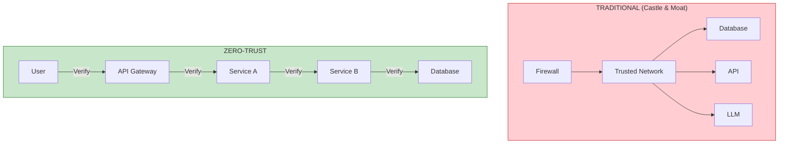
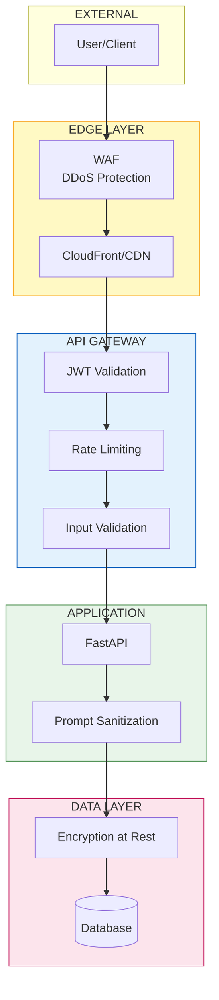

# Lesson 10.26: Zero-Trust Security for AI APIs

> **Duration**: 40 min | **Section**: E - Security

## 🎯 The Problem

Your RAG API is deployed. You added API keys. You feel secure.

Then:
- An API key leaks in a GitHub commit
- An attacker accesses internal services via a compromised container
- Someone exfiltrates your entire document database through the API
- A prompt injection tricks your LLM into revealing system prompts

> **Scenario**: Your intern commits `.env` to a public repo. By the time you notice, someone has used your OpenAI key to generate $5,000 in API calls. And they've been querying your RAG system for "company financial data" for hours.

## 🧪 Try It: The Naive Approach

```python
# "API key in header" security
@app.get("/query")
def query(api_key: str = Header(...)):
    if api_key != os.getenv("API_KEY"):
        raise HTTPException(401, "Unauthorized")
    return {"answer": "..."}

# Problems:
# - Single key for all users (no audit trail)
# - Key rotation = downtime
# - No rate limiting
# - No scope restrictions
# - Internal services trusted by default
```

## 🔍 Under the Hood: Zero-Trust Model



**Zero-Trust Principles**:
1. **Never trust, always verify** - Every request is authenticated
2. **Least privilege** - Minimum permissions needed
3. **Assume breach** - Design as if attackers are inside
4. **Encrypt everywhere** - TLS for all traffic, even internal

---

## ✅ The Fix: Multi-Layer Security

### Layer 1: API Gateway with JWT

```python
# app/auth/jwt_auth.py
from fastapi import Depends, HTTPException, Security
from fastapi.security import HTTPBearer, HTTPAuthorizationCredentials
import jwt
from datetime import datetime, timedelta

security = HTTPBearer()

JWT_SECRET = os.getenv("JWT_SECRET")
JWT_ALGORITHM = "HS256"

def create_token(user_id: str, scopes: list[str], expires_hours: int = 24) -> str:
    """Create a JWT token with specific scopes."""
    payload = {
        "sub": user_id,
        "scopes": scopes,
        "exp": datetime.utcnow() + timedelta(hours=expires_hours),
        "iat": datetime.utcnow(),
    }
    return jwt.encode(payload, JWT_SECRET, algorithm=JWT_ALGORITHM)


def verify_token(credentials: HTTPAuthorizationCredentials = Security(security)) -> dict:
    """Verify JWT token and return claims."""
    try:
        payload = jwt.decode(
            credentials.credentials, 
            JWT_SECRET, 
            algorithms=[JWT_ALGORITHM]
        )
        return payload
    except jwt.ExpiredSignatureError:
        raise HTTPException(401, "Token expired")
    except jwt.InvalidTokenError:
        raise HTTPException(401, "Invalid token")


def require_scope(required_scope: str):
    """Decorator to require specific scope."""
    def dependency(token: dict = Depends(verify_token)):
        if required_scope not in token.get("scopes", []):
            raise HTTPException(403, f"Missing required scope: {required_scope}")
        return token
    return dependency
```

```python
# app/main.py
from app.auth.jwt_auth import verify_token, require_scope

@app.get("/query")
async def query(
    request: QueryRequest,
    token: dict = Depends(require_scope("query:read"))
):
    """Query endpoint - requires 'query:read' scope."""
    user_id = token["sub"]
    # Log who's querying what
    logger.info(f"User {user_id} querying: {request.query[:50]}...")
    
    return await process_query(request, user_id)


@app.post("/documents")
async def upload_document(
    doc: Document,
    token: dict = Depends(require_scope("documents:write"))
):
    """Upload endpoint - requires 'documents:write' scope."""
    return await store_document(doc, token["sub"])


@app.delete("/documents/{doc_id}")
async def delete_document(
    doc_id: str,
    token: dict = Depends(require_scope("admin"))
):
    """Delete endpoint - requires 'admin' scope."""
    return await remove_document(doc_id)
```

### Layer 2: Rate Limiting by User

```python
# app/middleware/rate_limit.py
import redis
from fastapi import Request, HTTPException
from datetime import datetime

r = redis.Redis(host="localhost", port=6379, db=2)

class RateLimiter:
    def __init__(self, requests_per_minute: int = 60):
        self.rpm = requests_per_minute
    
    async def __call__(self, request: Request, token: dict = Depends(verify_token)):
        user_id = token["sub"]
        tier = token.get("tier", "free")
        
        # Different limits per tier
        limits = {
            "free": 10,
            "pro": 100,
            "enterprise": 1000
        }
        limit = limits.get(tier, 10)
        
        # Sliding window rate limiting
        key = f"ratelimit:{user_id}:{datetime.utcnow().strftime('%Y%m%d%H%M')}"
        
        current = r.incr(key)
        if current == 1:
            r.expire(key, 60)
        
        if current > limit:
            raise HTTPException(
                429, 
                f"Rate limit exceeded. {limit} requests/minute for {tier} tier"
            )
        
        # Add remaining to response headers
        request.state.rate_limit_remaining = limit - current
        return token

# Usage
@app.get("/query")
async def query(
    request: QueryRequest,
    token: dict = Depends(RateLimiter(requests_per_minute=60))
):
    ...
```

### Layer 3: Input Validation & Sanitization

```python
# app/security/input_validation.py
import re
from pydantic import BaseModel, field_validator, Field

class QueryRequest(BaseModel):
    query: str = Field(..., min_length=1, max_length=10000)
    top_k: int = Field(default=5, ge=1, le=100)
    
    @field_validator("query")
    @classmethod
    def sanitize_query(cls, v: str) -> str:
        # Remove potential prompt injection patterns
        dangerous_patterns = [
            r"ignore previous instructions",
            r"disregard all prior",
            r"system prompt",
            r"you are now",
            r"pretend to be",
        ]
        
        for pattern in dangerous_patterns:
            if re.search(pattern, v, re.IGNORECASE):
                raise ValueError("Query contains disallowed patterns")
        
        # Limit special characters
        v = re.sub(r'[<>{}|\\^`]', '', v)
        
        return v.strip()


class DocumentUpload(BaseModel):
    title: str = Field(..., min_length=1, max_length=500)
    content: str = Field(..., min_length=1, max_length=1_000_000)  # 1MB limit
    
    @field_validator("content")
    @classmethod
    def validate_content(cls, v: str) -> str:
        # Check for embedded scripts, etc.
        if "<script" in v.lower():
            raise ValueError("Content contains disallowed HTML")
        return v
```

### Layer 4: Secrets Management

```python
# app/config/secrets.py
import boto3
from functools import lru_cache
import json

class SecretsManager:
    def __init__(self):
        self.client = boto3.client(
            "secretsmanager",
            region_name="ap-south-1"
        )
        self._cache = {}
    
    @lru_cache(maxsize=100)
    def get_secret(self, secret_name: str) -> dict:
        """Fetch secret from AWS Secrets Manager."""
        response = self.client.get_secret_value(SecretId=secret_name)
        return json.loads(response["SecretString"])
    
    def rotate_secret(self, secret_name: str):
        """Trigger secret rotation."""
        self.client.rotate_secret(SecretId=secret_name)
        self.get_secret.cache_clear()

secrets = SecretsManager()

# Usage - never hardcode secrets
OPENAI_KEY = secrets.get_secret("prod/openai")["api_key"]
DB_PASSWORD = secrets.get_secret("prod/database")["password"]
```

```yaml
# kubernetes secret with external-secrets-operator
apiVersion: external-secrets.io/v1beta1
kind: ExternalSecret
metadata:
  name: rag-api-secrets
spec:
  refreshInterval: 1h
  secretStoreRef:
    name: aws-secrets-manager
    kind: ClusterSecretStore
  target:
    name: rag-api-secrets
  data:
    - secretKey: OPENAI_API_KEY
      remoteRef:
        key: prod/openai
        property: api_key
    - secretKey: DATABASE_URL
      remoteRef:
        key: prod/database
        property: connection_string
```

---

## 🔒 Defense in Depth Architecture



---

## 📝 Audit Logging

```python
# app/middleware/audit.py
import logging
import json
from datetime import datetime
from fastapi import Request

audit_logger = logging.getLogger("audit")
audit_logger.setLevel(logging.INFO)
handler = logging.FileHandler("/var/log/rag-api/audit.log")
handler.setFormatter(logging.Formatter('%(message)s'))
audit_logger.addHandler(handler)


async def audit_middleware(request: Request, call_next):
    """Log all API requests for security audit."""
    start_time = datetime.utcnow()
    
    # Get user info from token if available
    user_id = getattr(request.state, "user_id", "anonymous")
    
    response = await call_next(request)
    
    duration = (datetime.utcnow() - start_time).total_seconds()
    
    audit_entry = {
        "timestamp": start_time.isoformat(),
        "user_id": user_id,
        "method": request.method,
        "path": request.url.path,
        "status_code": response.status_code,
        "duration_seconds": duration,
        "ip_address": request.client.host,
        "user_agent": request.headers.get("user-agent", ""),
    }
    
    audit_logger.info(json.dumps(audit_entry))
    
    return response

# Add to FastAPI
app.middleware("http")(audit_middleware)
```

---

## 🎯 Practice

1. **Implement JWT authentication** with scopes
2. **Add rate limiting** per user tier
3. **Create input validation** for your query endpoint
4. **Set up AWS Secrets Manager** for API keys
5. **Add audit logging** for all requests
6. **Test with security scanner** (OWASP ZAP)

```bash
# Quick security checklist
# 1. Check for hardcoded secrets
grep -r "sk-" --include="*.py" .
grep -r "password" --include="*.py" .

# 2. Run bandit (Python security linter)
pip install bandit
bandit -r app/

# 3. Check dependencies for vulnerabilities
pip install safety
safety check

# 4. Test rate limiting
for i in {1..20}; do curl -H "Authorization: Bearer $TOKEN" http://localhost:8000/query; done
```

## 🔑 Key Takeaways

- **Never trust, always verify** - Authenticate every request
- **JWT with scopes** - Fine-grained permission control
- **Rate limit by user** - Not just by IP
- **Secrets Manager** - Never hardcode credentials
- **Input validation** - Sanitize before processing
- **Audit everything** - Know who did what when

## ❓ Common Questions

| Question | Answer |
|----------|--------|
| JWT vs API keys? | JWT for users with scopes, API keys for simple service-to-service |
| Where to store JWT secret? | Secrets Manager, rotated regularly |
| How to handle token refresh? | Short-lived access tokens + refresh tokens |
| What about internal services? | Use mTLS or service mesh (Istio) |

## 🔗 Further Reading

- [OWASP API Security Top 10](https://owasp.org/API-Security/)
- [Zero Trust Architecture](https://www.nist.gov/publications/zero-trust-architecture)
- [AWS Secrets Manager](https://docs.aws.amazon.com/secretsmanager/)
- [FastAPI Security](https://fastapi.tiangolo.com/tutorial/security/)
- [Prompt Injection Prevention](https://learnprompting.org/docs/prompt_hacking/defensive_measures)

---

**Previous**: [Lesson 25 - Terraform Basics](Lesson-25-Terraform-Basics.md) | **Up**: [Module 10 README](README.md)
