# Module 10: AWS Production Deployment

> **Duration**: 2 Weeks | **Lessons**: 23

## 🎯 Module Overview

Your app works on localhost. That's useless. Real users need to access it over the internet, 24/7, without your laptop being on. This module teaches you to deploy containerized applications to AWS using industry-standard practices: ECS Fargate, RDS PostgreSQL, load balancers, and CI/CD pipelines.

## 🧠 Mental Model

```mermaid
flowchart LR
    subgraph Local["YOUR LAPTOP"]
        CODE["Code"]
        DOCKER["Docker Image"]
    end
    
    subgraph Pipeline["CI/CD PIPELINE"]
        GH["GitHub Actions"]
    end
    
    subgraph AWS["AWS CLOUD"]
        ECR["ECR<br>(Image Registry)"]
        
        subgraph VPC["Virtual Private Cloud"]
            subgraph Public["Public Subnet"]
                ALB["Load Balancer<br>(ALB)"]
            end
            
            subgraph Private["Private Subnet"]
                ECS["ECS Fargate<br>(Containers)"]
                RDS[("RDS PostgreSQL")]
            end
        end
    end
    
    subgraph Internet["INTERNET"]
        USERS["👥 Users"]
    end
    
    CODE --> GH
    GH --> ECR
    ECR --> ECS
    ECS --> RDS
    USERS --> ALB
    ALB --> ECS
    
    style ALB fill:#EF6C00,color:#fff
    style ECS fill:#2E7D32,color:#fff
    style RDS fill:#1565C0,color:#fff
    style ECR fill:#7B1FA2,color:#fff
```

**The Flow**: Code → GitHub → Docker Image → ECR → ECS Containers → Load Balancer → Users

## 📋 Prerequisites

- Docker fundamentals (Module 5)
- FastAPI basics (Module 6)
- PostgreSQL understanding (Module 4)
- Basic terminal/CLI skills (Module 1)

## 🗂️ Module Structure

| Section | Lessons | Focus |
|---------|:-------:|-------|
| A: Cloud Computing Under the Hood | 10.0 - 10.6 | AWS fundamentals, security, IAM |
| B: Database on AWS | 10.7 - 10.10 | RDS PostgreSQL, private networking |
| C: Container Deployment | 10.11 - 10.16 | ECR, ECS Fargate, task definitions |
| D: Networking & Production | 10.17 - 10.22 | Load balancers, domains, CI/CD |

## 📚 Lessons

### Section A: Cloud Computing Under the Hood

| # | Lesson | Duration | What We're Solving |
|:-:|--------|:--------:|-------------------|
| 10.0 | The "It Only Works Locally" Problem | 15 min | Why localhost isn't enough |
| 10.1 | What IS "The Cloud"? | 20 min | Someone else's computers with APIs |
| 10.2 | AWS Overview | 25 min | EC2, RDS, ECS, Lambda - why so many? |
| 10.3 | AWS Setup | 30 min | Account, IAM, MFA, CLI |
| 10.4 | Security Fundamentals | 30 min | VPCs, Security Groups, subnets |
| 10.5 | Secrets Management | 25 min | AWS Secrets Manager |
| 10.6 | AWS Basics Q&A | 10 min | Regions, costs, complexity |

### Section B: Database on AWS

| # | Lesson | Duration | What We're Solving |
|:-:|--------|:--------:|-------------------|
| 10.7 | The Database Problem | 5 min | Local DB can't scale or backup |
| 10.8 | RDS PostgreSQL | 35 min | Managed database creation |
| 10.9 | Database Security | 25 min | Private subnets, security groups |
| 10.10 | Running Migrations | 25 min | Alembic with RDS, bastion access |

### Section C: Container Deployment

| # | Lesson | Duration | What We're Solving |
|:-:|--------|:--------:|-------------------|
| 10.11 | The Container Problem | 5 min | Getting Docker to AWS |
| 10.12 | ECR (Container Registry) | 30 min | Push images to AWS |
| 10.13 | ECS Cluster | 35 min | Fargate serverless containers |
| 10.14 | Task Definitions | 35 min | CPU, memory, ports, secrets |
| 10.15 | ECS Service | 30 min | Keep containers running |
| 10.16 | Container Q&A | 10 min | Fargate vs EC2, scaling |

### Section D: Networking & Production

| # | Lesson | Duration | What We're Solving |
|:-:|--------|:--------:|-------------------|
| 10.17 | Load Balancer | 40 min | ALB, traffic routing, HTTPS |
| 10.18 | Custom Domain | 30 min | Route 53, SSL certificates |
| 10.19 | Monitoring & Logs | 30 min | CloudWatch metrics and alarms |
| 10.20 | CI/CD Pipeline | 45 min | GitHub Actions → ECR → ECS |
| 10.21 | Deployment Q&A | 10 min | Zero-downtime, rollback, costs |
| 10.22 | Module 10 Review | 15 min | Complete deployment mental model |

## 🎯 Capstone Project

Deploy your Agentic RAG system to AWS:
- Custom domain with HTTPS
- CI/CD pipeline with GitHub Actions
- CloudWatch monitoring and alerts
- Auto-scaling ECS service
- Secure RDS PostgreSQL

## ✅ Independence Check

| Level | Question |
|-------|----------|
| **Know** | What are ECR, ECS, RDS, ALB? |
| **Understand** | Why use private subnets for databases? |
| **Apply** | Deploy a new app to AWS from scratch |
| **Analyze** | When to use Fargate vs EC2? Cost tradeoffs? |
| **Create** | Design a multi-region deployment architecture |

## 📚 External Resources

- [AWS Well-Architected Framework](https://aws.amazon.com/architecture/well-architected/)
- [ECS Best Practices](https://docs.aws.amazon.com/AmazonECS/latest/bestpracticesguide/)
- [AWS CLI Documentation](https://docs.aws.amazon.com/cli/)
