# Lesson 11.4: Output Filtering

> **Duration**: 30 min | **Section**: A - Security & Safety

## 🎯 The Problem (3-5 min)

You've validated input. Great! But what about what the LLM *outputs*?

> **Scenario**:
> - User asks a seemingly innocent question
> - LLM generates harmful content (jailbreak succeeded)
> - You display it directly to the user
> - Result: Harmful content on your platform

**Input validation is necessary but not sufficient.** You need output filtering too.

---

## 🔍 The Output Filtering Layer

```mermaid
flowchart LR
    LLM["LLM Response"] --> F1["Content Check"]
    F1 --> F2["PII Detection"]
    F2 --> F3["Format Validation"]
    F3 --> F4["Sanitization"]
    F4 --> OUTPUT["Safe Output"]
    
    F1 -->|"Harmful"| BLOCK["❌ Block"]
    F2 -->|"PII Found"| REDACT["🔒 Redact"]
    F3 -->|"Invalid"| FIX["🔧 Fix/Reject"]
    
    style BLOCK fill:#FFEBEE
    style OUTPUT fill:#E8F5E9
```



---

## 🔍 Defense 1: Content Checking

**Why**: The LLM might generate harmful content despite input validation.

```python
from openai import OpenAI

client = OpenAI()

def check_output_content(text: str) -> dict:
    """Check LLM output for harmful content."""
    response = client.moderations.create(input=text)
    result = response.results[0]
    
    if result.flagged:
        flagged_categories = [
            cat for cat, flagged in result.categories.model_dump().items()
            if flagged
        ]
        return {
            "safe": False,
            "reason": f"Output contains: {', '.join(flagged_categories)}",
            "action": "block"
        }
    
    return {"safe": True}

# Usage
llm_response = generate_response(user_input)
content_check = check_output_content(llm_response)

if not content_check["safe"]:
    # Don't show this to user!
    log_blocked_response(llm_response, content_check["reason"])
    return {"response": "I'm sorry, I can't provide that information."}
```

---

## 🔍 Defense 2: PII Detection and Redaction

**Why**: LLM might leak PII from training data or context.


### Using Regular Expressions

```python
import re
from typing import NamedTuple

class PIIPattern(NamedTuple):
    name: str
    pattern: str
    replacement: str

PII_PATTERNS = [
    PIIPattern(
        name="email",
        pattern=r'\b[A-Za-z0-9._%+-]+@[A-Za-z0-9.-]+\.[A-Z|a-z]{2,}\b',
        replacement="[EMAIL]"
    ),
    PIIPattern(
        name="phone_us",
        pattern=r'\b\d{3}[-.]?\d{3}[-.]?\d{4}\b',
        replacement="[PHONE]"
    ),
    PIIPattern(
        name="ssn",
        pattern=r'\b\d{3}-\d{2}-\d{4}\b',
        replacement="[SSN]"
    ),
    PIIPattern(
        name="credit_card",
        pattern=r'\b\d{4}[-\s]?\d{4}[-\s]?\d{4}[-\s]?\d{4}\b',
        replacement="[CREDIT_CARD]"
    ),
    PIIPattern(
        name="ip_address",
        pattern=r'\b\d{1,3}\.\d{1,3}\.\d{1,3}\.\d{1,3}\b',
        replacement="[IP_ADDRESS]"
    ),
]

def redact_pii(text: str) -> tuple[str, list[str]]:
    """Redact PII from text, return redacted text and found types."""
    found_pii = []
    
    for pattern in PII_PATTERNS:
        if re.search(pattern.pattern, text):
            found_pii.append(pattern.name)
            text = re.sub(pattern.pattern, pattern.replacement, text)
    
    return text, found_pii

# Usage
clean_output, pii_found = redact_pii(llm_response)
if pii_found:
    log_pii_detection(llm_response, pii_found)
    
return {"response": clean_output}
```

### Using Presidio (Microsoft)

```python
from presidio_analyzer import AnalyzerEngine
from presidio_anonymizer import AnonymizerEngine

# Initialize once
analyzer = AnalyzerEngine()
anonymizer = AnonymizerEngine()

def redact_pii_presidio(text: str) -> str:
    """Use Presidio for more sophisticated PII detection."""
    # Analyze
    results = analyzer.analyze(
        text=text,
        entities=["EMAIL_ADDRESS", "PHONE_NUMBER", "PERSON", 
                  "CREDIT_CARD", "US_SSN", "LOCATION"],
        language="en"
    )
    
    # Anonymize
    anonymized = anonymizer.anonymize(text=text, analyzer_results=results)
    
    return anonymized.text

# Usage
clean_output = redact_pii_presidio(llm_response)
```

---

## 🔍 Defense 3: System Prompt Leakage Detection

**Why**: Attackers try to extract your system prompt.

```python
def detect_system_prompt_leak(
    output: str,
    system_prompt: str,
    threshold: float = 0.7
) -> bool:
    """Check if output contains parts of the system prompt."""
    # Split system prompt into chunks
    system_words = set(system_prompt.lower().split())
    output_words = set(output.lower().split())
    
    # Check overlap (simple approach)
    overlap = len(system_words & output_words) / len(system_words)
    
    if overlap > threshold:
        return True  # Likely leak
    
    # Check for exact substring matches (more reliable)
    system_sentences = system_prompt.split('.')
    for sentence in system_sentences:
        if len(sentence) > 20 and sentence.strip().lower() in output.lower():
            return True
    
    return False

# Better approach: Use embedding similarity
from openai import OpenAI

client = OpenAI()

def detect_leak_embeddings(output: str, system_prompt: str, threshold: float = 0.9) -> bool:
    """Use embeddings to detect semantic similarity to system prompt."""
    response = client.embeddings.create(
        model="text-embedding-3-small",
        input=[output, system_prompt]
    )
    
    # Calculate cosine similarity
    import numpy as np
    
    emb1 = np.array(response.data[0].embedding)
    emb2 = np.array(response.data[1].embedding)
    
    similarity = np.dot(emb1, emb2) / (np.linalg.norm(emb1) * np.linalg.norm(emb2))
    
    return similarity > threshold
```

---

## 🔍 Defense 4: Format Validation

**Why**: Ensure output matches expected format before using.

```mermaid
flowchart TD
    subgraph Validation["Format Validation"]
        JSON["Expected: JSON"]
        SQL["Expected: Safe SQL"]
        HTML["Expected: Safe HTML"]
        CODE["Expected: Safe Code"]
    end
    
    OUTPUT["LLM Output"] --> Validation
    Validation -->|"Valid"| USE["✅ Use"]
    Validation -->|"Invalid"| REJECT["❌ Reject/Fix"]
```



### JSON Validation

```python
import json
from pydantic import BaseModel, ValidationError

class ExpectedResponse(BaseModel):
    """Define expected response structure."""
    answer: str
    confidence: float
    sources: list[str]

def validate_json_response(output: str) -> dict:
    """Validate LLM output matches expected JSON structure."""
    try:
        # Parse JSON
        data = json.loads(output)
        
        # Validate against schema
        validated = ExpectedResponse(**data)
        
        return {"valid": True, "data": validated.model_dump()}
        
    except json.JSONDecodeError as e:
        return {"valid": False, "error": f"Invalid JSON: {e}"}
        
    except ValidationError as e:
        return {"valid": False, "error": f"Schema mismatch: {e}"}

# Usage
result = validate_json_response(llm_output)
if not result["valid"]:
    # Request regeneration or return error
    return {"error": "Failed to generate valid response"}
```

### SQL Output Validation (Dangerous!)

```python
import sqlparse

DANGEROUS_KEYWORDS = ['DROP', 'DELETE', 'TRUNCATE', 'ALTER', 'INSERT', 'UPDATE', 'GRANT']

def validate_sql_output(sql: str) -> dict:
    """Validate SQL is safe (SELECT only)."""
    # Parse SQL
    parsed = sqlparse.parse(sql)
    
    if not parsed:
        return {"valid": False, "error": "Could not parse SQL"}
    
    statement = parsed[0]
    
    # Check statement type
    if statement.get_type() != 'SELECT':
        return {"valid": False, "error": f"Only SELECT allowed, got {statement.get_type()}"}
    
    # Check for dangerous keywords
    sql_upper = sql.upper()
    for keyword in DANGEROUS_KEYWORDS:
        if keyword in sql_upper:
            return {"valid": False, "error": f"Dangerous keyword: {keyword}"}
    
    return {"valid": True, "sql": sql}

# ⚠️ WARNING: Even with validation, executing LLM-generated SQL is risky!
# Consider: parameterized queries, allowlisted tables, read-only connection
```

---

## 🔍 Defense 5: Output Sanitization

**Why**: Clean output before displaying to users.

```python
import html
import re

def sanitize_output(text: str, context: str = "web") -> str:
    """Sanitize output based on display context."""
    
    if context == "web":
        # Escape HTML to prevent XSS
        text = html.escape(text)
        
    elif context == "markdown":
        # Allow safe markdown, escape dangerous elements
        # Remove script tags if somehow present
        text = re.sub(r'<script.*?</script>', '', text, flags=re.DOTALL | re.IGNORECASE)
        # Remove on* event handlers
        text = re.sub(r'\bon\w+\s*=', '', text, flags=re.IGNORECASE)
        
    elif context == "plaintext":
        # Strip all HTML/markdown
        text = re.sub(r'<[^>]+>', '', text)
        text = re.sub(r'\[([^\]]+)\]\([^\)]+\)', r'\1', text)  # [text](url) -> text
    
    return text

# Usage
safe_output = sanitize_output(llm_response, context="web")
```

---

## 🔍 Complete Output Filter Pipeline

```python
from dataclasses import dataclass
from typing import Optional
import logging

logger = logging.getLogger(__name__)

@dataclass
class OutputFilterResult:
    safe: bool
    filtered_text: Optional[str] = None
    actions_taken: list[str] = None
    blocked_reason: Optional[str] = None

class OutputFilter:
    """Complete output filtering pipeline."""
    
    def __init__(
        self,
        system_prompt: str = "",
        check_content: bool = True,
        redact_pii: bool = True,
        detect_leak: bool = True,
        sanitize: bool = True,
        context: str = "web"
    ):
        self.system_prompt = system_prompt
        self.check_content = check_content
        self.redact_pii = redact_pii
        self.detect_leak = detect_leak
        self.sanitize = sanitize
        self.context = context
    
    def filter(self, text: str) -> OutputFilterResult:
        """Run complete output filtering pipeline."""
        actions = []
        
        # Step 1: Content moderation
        if self.check_content:
            content_result = check_output_content(text)
            if not content_result["safe"]:
                logger.warning(f"Blocked harmful output: {content_result['reason']}")
                return OutputFilterResult(
                    safe=False,
                    blocked_reason=content_result["reason"]
                )
        
        # Step 2: System prompt leak detection
        if self.detect_leak and self.system_prompt:
            if detect_system_prompt_leak(text, self.system_prompt):
                logger.warning("Blocked: system prompt leak detected")
                return OutputFilterResult(
                    safe=False,
                    blocked_reason="Response may contain system information"
                )
        
        # Step 3: PII redaction
        if self.redact_pii:
            text, pii_found = redact_pii(text)
            if pii_found:
                actions.append(f"redacted_pii: {pii_found}")
        
        # Step 4: Sanitization
        if self.sanitize:
            text = sanitize_output(text, self.context)
            actions.append(f"sanitized_for: {self.context}")
        
        return OutputFilterResult(
            safe=True,
            filtered_text=text,
            actions_taken=actions or None
        )

# Usage
output_filter = OutputFilter(
    system_prompt=system_prompt,
    context="web"
)

result = output_filter.filter(llm_response)

if not result.safe:
    return {"response": "I apologize, but I cannot provide that response."}

return {"response": result.filtered_text}
```

---

## 🔍 Fallback Responses

When you block output, what do you say?

```python
FALLBACK_RESPONSES = {
    "harmful_content": "I'm not able to provide that information.",
    "pii_leak": "I cannot share personal information.",
    "system_leak": "I can't discuss my internal configuration.",
    "format_error": "I encountered an error. Please try rephrasing.",
    "generic": "I apologize, but I cannot complete that request."
}

def get_fallback_response(reason: str) -> str:
    """Get appropriate fallback response for blocked content."""
    for key, response in FALLBACK_RESPONSES.items():
        if key in reason.lower():
            return response
    return FALLBACK_RESPONSES["generic"]
```

---

## 💻 Practice: Build Your Output Filter

```python
# Exercise: Create output filter for a financial advice bot

class FinancialOutputFilter(OutputFilter):
    """Custom filter for financial advice context."""
    
    def __init__(self, system_prompt: str):
        super().__init__(
            system_prompt=system_prompt,
            check_content=True,
            redact_pii=True,
            detect_leak=True,
            sanitize=True,
            context="web"
        )
        
        # Financial-specific patterns to catch
        self.risky_patterns = [
            r"guaranteed\s+returns",
            r"risk[\s-]free\s+investment",
            r"get\s+rich\s+quick",
        ]
    
    def filter(self, text: str) -> OutputFilterResult:
        # First, run standard filtering
        result = super().filter(text)
        if not result.safe:
            return result
        
        # Then, check for financial disclaimers/risky claims
        # TODO: Implement additional checks
        
        return result

# Test cases
test_outputs = [
    "Based on your risk profile, I recommend diversifying...",  # Good
    "This is a guaranteed 50% return investment!",  # Risky claim
    "Contact John Smith at 555-1234 for more info.",  # PII
]

filter = FinancialOutputFilter("You are a financial advisor...")
for output in test_outputs:
    result = filter.filter(output)
    print(f"{'✅' if result.safe else '❌'} {output[:50]}...")
```

---

## 🔑 Key Takeaways

| Filter Layer | Purpose | Blocks |
|--------------|---------|--------|
| **Content check** | Harmful content | Violence, hate, etc. |
| **PII detection** | Privacy protection | Emails, phones, SSN |
| **Leak detection** | Prompt security | System prompt exposure |
| **Format validation** | Data integrity | Malformed JSON/SQL |
| **Sanitization** | Display safety | XSS, injection |

---

## ❓ Common Questions

| Question | Answer |
|----------|--------|
| Filter input AND output? | Yes. Both are necessary. |
| What if filtering is slow? | Cache, batch, use fast checks first. |
| Won't users notice blocked responses? | Yes, but better than harmful content. |

---

**Next**: 11.5 - Guardrails Implementation
