# Lesson 11.6: Rate Limiting

> **Duration**: 25 min | **Section**: A - Security & Safety

## 🎯 The Problem (3-5 min)

Your LLM API is working great. Then:

> **Scenario**:
> - Attacker writes a script: `for i in range(100000): call_your_api()`
> - Each call costs $0.02
> - Your monthly bill: **$2,000** (and counting)
> - Your service: **Down** (rate limited by OpenAI)

Without rate limiting, anyone can abuse your service.

---

## 🔍 What Rate Limiting Protects

```mermaid
flowchart TD
    subgraph Threats["Without Rate Limiting"]
        T1["💸 Cost Explosion<br/>Attackers run up your bill"]
        T2["⚡ DoS Attack<br/>Exhaust your API quota"]
        T3["🔓 Brute Force<br/>Try millions of injection attempts"]
        T4["📊 Data Extraction<br/>Query everything in your system"]
    end
    
    LIMIT["Rate Limiting"] --> PROTECT["Protects Against All"]
    
    style T1 fill:#FFEBEE
    style T2 fill:#FFEBEE
    style T3 fill:#FFEBEE
    style T4 fill:#FFEBEE
    style PROTECT fill:#E8F5E9
```



---

## 🔍 Rate Limiting Strategies

| Strategy | Description | Use Case |
|----------|-------------|----------|
| **Requests per minute** | X requests in time window | Basic protection |
| **Tokens per minute** | X tokens in time window | Cost control |
| **Concurrent requests** | X simultaneous requests | Resource protection |
| **Daily/monthly caps** | Hard limits per period | Budget control |
| **User-based limits** | Different limits per tier | Tiered service |

---

## 🔍 Strategy 1: In-Memory Rate Limiting

Simple but doesn't scale across servers.

```python
import time
from collections import defaultdict
from dataclasses import dataclass
from typing import Optional

@dataclass
class RateLimitResult:
    allowed: bool
    remaining: int
    reset_in: float
    retry_after: Optional[float] = None

class InMemoryRateLimiter:
    """Simple in-memory rate limiter."""
    
    def __init__(
        self,
        max_requests: int = 10,
        window_seconds: int = 60
    ):
        self.max_requests = max_requests
        self.window_seconds = window_seconds
        self.requests = defaultdict(list)  # user_id -> [timestamps]
    
    def check(self, user_id: str) -> RateLimitResult:
        """Check if request is allowed."""
        now = time.time()
        window_start = now - self.window_seconds
        
        # Clean old requests
        self.requests[user_id] = [
            ts for ts in self.requests[user_id]
            if ts > window_start
        ]
        
        current_count = len(self.requests[user_id])
        remaining = max(0, self.max_requests - current_count)
        
        if current_count >= self.max_requests:
            # Calculate when oldest request expires
            oldest = min(self.requests[user_id])
            retry_after = oldest + self.window_seconds - now
            
            return RateLimitResult(
                allowed=False,
                remaining=0,
                reset_in=retry_after,
                retry_after=retry_after
            )
        
        # Allow and record
        self.requests[user_id].append(now)
        
        return RateLimitResult(
            allowed=True,
            remaining=remaining - 1,
            reset_in=self.window_seconds
        )

# Usage
limiter = InMemoryRateLimiter(max_requests=10, window_seconds=60)

def handle_request(user_id: str, message: str):
    result = limiter.check(user_id)
    
    if not result.allowed:
        return {
            "error": "Rate limit exceeded",
            "retry_after": result.retry_after
        }
    
    # Process request
    return {"response": call_llm(message)}
```

---

## 🔍 Strategy 2: Redis Rate Limiting

Scalable across multiple servers.


```python
import redis
import time

class RedisRateLimiter:
    """Redis-based rate limiter for distributed systems."""
    
    def __init__(
        self,
        redis_url: str = "redis://localhost:6379",
        max_requests: int = 10,
        window_seconds: int = 60
    ):
        self.redis = redis.from_url(redis_url)
        self.max_requests = max_requests
        self.window_seconds = window_seconds
    
    def check(self, user_id: str) -> RateLimitResult:
        """Check rate limit using sliding window."""
        key = f"ratelimit:{user_id}"
        now = time.time()
        window_start = now - self.window_seconds
        
        pipe = self.redis.pipeline()
        
        # Remove old entries
        pipe.zremrangebyscore(key, 0, window_start)
        
        # Count current requests
        pipe.zcard(key)
        
        # Add current request (optimistically)
        pipe.zadd(key, {str(now): now})
        
        # Set expiry
        pipe.expire(key, self.window_seconds)
        
        _, count, _, _ = pipe.execute()
        
        if count >= self.max_requests:
            # Remove the optimistic add
            self.redis.zrem(key, str(now))
            
            # Get oldest timestamp
            oldest = self.redis.zrange(key, 0, 0, withscores=True)
            retry_after = oldest[0][1] + self.window_seconds - now if oldest else self.window_seconds
            
            return RateLimitResult(
                allowed=False,
                remaining=0,
                reset_in=retry_after,
                retry_after=retry_after
            )
        
        return RateLimitResult(
            allowed=True,
            remaining=self.max_requests - count - 1,
            reset_in=self.window_seconds
        )

# Usage
limiter = RedisRateLimiter(
    redis_url="redis://localhost:6379",
    max_requests=100,
    window_seconds=60
)
```

---

## 🔍 Strategy 3: Token-Based Rate Limiting

Limit by tokens, not requests (for cost control).

```python
import tiktoken

class TokenRateLimiter:
    """Rate limit by token usage, not request count."""
    
    def __init__(
        self,
        redis_url: str,
        max_tokens: int = 10000,
        window_seconds: int = 60
    ):
        self.redis = redis.from_url(redis_url)
        self.max_tokens = max_tokens
        self.window_seconds = window_seconds
        self.encoder = tiktoken.encoding_for_model("gpt-4")
    
    def check(self, user_id: str, input_text: str, estimated_output: int = 500) -> RateLimitResult:
        """Check if request is within token budget."""
        input_tokens = len(self.encoder.encode(input_text))
        estimated_total = input_tokens + estimated_output
        
        key = f"tokens:{user_id}"
        now = time.time()
        
        # Get current usage
        current_usage = self._get_usage(key, now)
        
        if current_usage + estimated_total > self.max_tokens:
            return RateLimitResult(
                allowed=False,
                remaining=max(0, self.max_tokens - current_usage),
                reset_in=self.window_seconds,
                retry_after=self.window_seconds
            )
        
        # Record usage (will update with actual after response)
        self._record_usage(key, estimated_total, now)
        
        return RateLimitResult(
            allowed=True,
            remaining=self.max_tokens - current_usage - estimated_total,
            reset_in=self.window_seconds
        )
    
    def record_actual_usage(self, user_id: str, actual_tokens: int, estimated_tokens: int):
        """Update with actual token usage after LLM call."""
        key = f"tokens:{user_id}"
        now = time.time()
        
        # Adjust if actual differs from estimate
        adjustment = actual_tokens - estimated_tokens
        if adjustment != 0:
            self._record_usage(key, adjustment, now)
    
    def _get_usage(self, key: str, now: float) -> int:
        """Get total token usage in current window."""
        window_start = now - self.window_seconds
        self.redis.zremrangebyscore(key, 0, window_start)
        
        entries = self.redis.zrange(key, 0, -1, withscores=True)
        return sum(int(float(tokens)) for tokens, _ in entries)
    
    def _record_usage(self, key: str, tokens: int, now: float):
        """Record token usage."""
        self.redis.zadd(key, {f"{now}:{tokens}": now})
        self.redis.expire(key, self.window_seconds)

# Usage
token_limiter = TokenRateLimiter(
    redis_url="redis://localhost:6379",
    max_tokens=50000,  # 50k tokens per minute
    window_seconds=60
)

def handle_request(user_id: str, message: str):
    result = token_limiter.check(user_id, message)
    
    if not result.allowed:
        return {
            "error": f"Token limit exceeded. {result.remaining} tokens remaining.",
            "retry_after": result.retry_after
        }
    
    # Process request
    response = call_llm(message)
    
    # Record actual usage
    actual_tokens = response.usage.total_tokens
    token_limiter.record_actual_usage(user_id, actual_tokens, estimated=len(message) + 500)
    
    return {"response": response.content}
```

---

## 🔍 Strategy 4: Tiered Rate Limits

Different limits for different user tiers.


```python
from enum import Enum
from dataclasses import dataclass

class UserTier(Enum):
    FREE = "free"
    PRO = "pro"
    ENTERPRISE = "enterprise"

@dataclass
class TierLimits:
    requests_per_minute: int
    tokens_per_minute: int
    max_concurrent: int

TIER_LIMITS = {
    UserTier.FREE: TierLimits(
        requests_per_minute=10,
        tokens_per_minute=1000,
        max_concurrent=1
    ),
    UserTier.PRO: TierLimits(
        requests_per_minute=100,
        tokens_per_minute=50000,
        max_concurrent=5
    ),
    UserTier.ENTERPRISE: TierLimits(
        requests_per_minute=1000,
        tokens_per_minute=500000,
        max_concurrent=20
    ),
}

class TieredRateLimiter:
    """Rate limiter with different limits per tier."""
    
    def __init__(self, redis_url: str):
        self.redis = redis.from_url(redis_url)
    
    def check(self, user_id: str, tier: UserTier, input_text: str = "") -> RateLimitResult:
        limits = TIER_LIMITS[tier]
        
        # Check request limit
        request_key = f"req:{user_id}"
        request_count = self._get_count(request_key)
        
        if request_count >= limits.requests_per_minute:
            return RateLimitResult(
                allowed=False,
                remaining=0,
                reset_in=60,
                retry_after=60
            )
        
        # Check token limit if input provided
        if input_text:
            token_key = f"tok:{user_id}"
            token_count = self._get_count(token_key)
            input_tokens = len(input_text.split()) * 1.3  # Rough estimate
            
            if token_count + input_tokens > limits.tokens_per_minute:
                return RateLimitResult(
                    allowed=False,
                    remaining=0,
                    reset_in=60,
                    retry_after=60
                )
        
        # Check concurrent limit
        concurrent_key = f"concurrent:{user_id}"
        concurrent = self.redis.get(concurrent_key) or 0
        
        if int(concurrent) >= limits.max_concurrent:
            return RateLimitResult(
                allowed=False,
                remaining=0,
                reset_in=5,  # Check again soon
                retry_after=5
            )
        
        # All checks passed
        self._increment(request_key)
        self.redis.incr(concurrent_key)
        self.redis.expire(concurrent_key, 300)  # 5 min timeout
        
        return RateLimitResult(
            allowed=True,
            remaining=limits.requests_per_minute - request_count - 1,
            reset_in=60
        )
    
    def release_concurrent(self, user_id: str):
        """Call when request completes."""
        key = f"concurrent:{user_id}"
        self.redis.decr(key)
    
    def _get_count(self, key: str) -> int:
        # Sliding window implementation
        now = time.time()
        self.redis.zremrangebyscore(key, 0, now - 60)
        return self.redis.zcard(key)
    
    def _increment(self, key: str):
        now = time.time()
        self.redis.zadd(key, {str(now): now})
        self.redis.expire(key, 60)
```

---

## 🔍 API Response Headers

Standard rate limit headers for clients:

```python
from fastapi import FastAPI, Request, HTTPException
from fastapi.responses import JSONResponse

app = FastAPI()
limiter = TieredRateLimiter("redis://localhost:6379")

@app.middleware("http")
async def rate_limit_middleware(request: Request, call_next):
    user_id = request.headers.get("X-User-ID", "anonymous")
    tier = get_user_tier(user_id)  # From your auth system
    
    result = limiter.check(user_id, tier)
    
    if not result.allowed:
        return JSONResponse(
            status_code=429,
            content={"error": "Rate limit exceeded"},
            headers={
                "X-RateLimit-Limit": str(TIER_LIMITS[tier].requests_per_minute),
                "X-RateLimit-Remaining": "0",
                "X-RateLimit-Reset": str(int(time.time() + result.reset_in)),
                "Retry-After": str(int(result.retry_after))
            }
        )
    
    response = await call_next(request)
    
    # Add rate limit headers to successful responses
    response.headers["X-RateLimit-Limit"] = str(TIER_LIMITS[tier].requests_per_minute)
    response.headers["X-RateLimit-Remaining"] = str(result.remaining)
    response.headers["X-RateLimit-Reset"] = str(int(time.time() + result.reset_in))
    
    return response
```

---

## 🔍 Cost Caps (Hard Limits)

Prevent runaway costs with hard caps:

```python
class CostCap:
    """Hard spending limits."""
    
    def __init__(self, redis_url: str):
        self.redis = redis.from_url(redis_url)
    
    def check_daily_cap(self, user_id: str, daily_cap_cents: int) -> bool:
        """Check if user is under daily spending cap."""
        key = f"daily_spend:{user_id}:{time.strftime('%Y-%m-%d')}"
        current = int(self.redis.get(key) or 0)
        return current < daily_cap_cents
    
    def record_cost(self, user_id: str, cost_cents: int):
        """Record cost for user."""
        key = f"daily_spend:{user_id}:{time.strftime('%Y-%m-%d')}"
        self.redis.incrby(key, cost_cents)
        self.redis.expire(key, 86400 * 2)  # Keep 2 days
    
    def get_remaining_budget(self, user_id: str, daily_cap_cents: int) -> int:
        """Get remaining budget for today."""
        key = f"daily_spend:{user_id}:{time.strftime('%Y-%m-%d')}"
        current = int(self.redis.get(key) or 0)
        return max(0, daily_cap_cents - current)

# Usage
cost_cap = CostCap("redis://localhost:6379")

# Daily caps by tier (in cents)
DAILY_CAPS = {
    UserTier.FREE: 50,       # $0.50/day
    UserTier.PRO: 1000,      # $10/day
    UserTier.ENTERPRISE: 10000  # $100/day
}

def handle_request(user_id: str, tier: UserTier, message: str):
    # Check cost cap
    if not cost_cap.check_daily_cap(user_id, DAILY_CAPS[tier]):
        return {"error": "Daily spending limit reached"}
    
    # Process request
    response = call_llm(message)
    
    # Record cost (estimate based on tokens)
    cost_cents = int(response.usage.total_tokens * 0.003)  # $0.03 per 1k tokens
    cost_cap.record_cost(user_id, cost_cents)
    
    return {"response": response.content}
```

---

## 💻 Practice: Implement Rate Limiting

```python
# Exercise: Build rate limiter for a chatbot API

class ChatbotRateLimiter:
    """Complete rate limiting for chatbot."""
    
    def __init__(self, redis_url: str):
        self.request_limiter = RedisRateLimiter(redis_url, max_requests=20, window_seconds=60)
        self.token_limiter = TokenRateLimiter(redis_url, max_tokens=10000, window_seconds=60)
        self.cost_cap = CostCap(redis_url)
    
    def can_proceed(self, user_id: str, tier: UserTier, message: str) -> tuple[bool, str]:
        """Check all rate limits. Returns (allowed, reason)."""
        
        # Check 1: Request rate
        # TODO: Implement
        
        # Check 2: Token rate
        # TODO: Implement
        
        # Check 3: Cost cap
        # TODO: Implement
        
        return True, "OK"

# Test
limiter = ChatbotRateLimiter("redis://localhost:6379")

for i in range(25):
    allowed, reason = limiter.can_proceed("user123", UserTier.FREE, "Hello!")
    print(f"Request {i+1}: {'✅' if allowed else '❌'} {reason}")
```

---

## 🔑 Key Takeaways

| Strategy | Protects Against | Complexity |
|----------|------------------|------------|
| **Request/min** | Flooding | Low |
| **Token/min** | Cost abuse | Medium |
| **Concurrent** | Resource exhaustion | Medium |
| **Daily caps** | Budget overrun | Low |
| **Tiered limits** | Fair usage | Medium |

---

## ❓ Common Questions

| Question | Answer |
|----------|--------|
| In-memory or Redis? | Redis for production (scalable) |
| What limits should I set? | Start conservative, adjust based on data |
| How to handle rate limit errors? | Return 429 with Retry-After header |
| Should limits apply to errors too? | Yes, prevents brute-force attacks |

---

**Next**: 11.7 - Security Q&A
