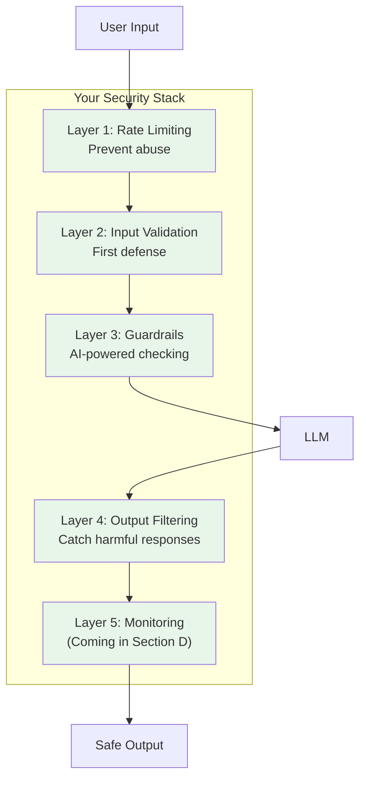
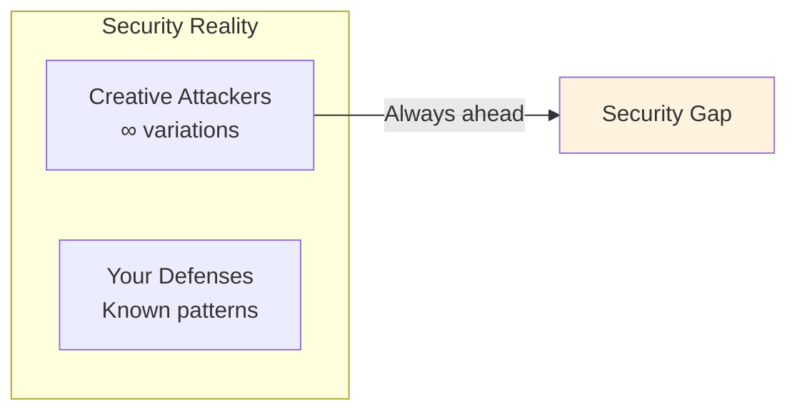
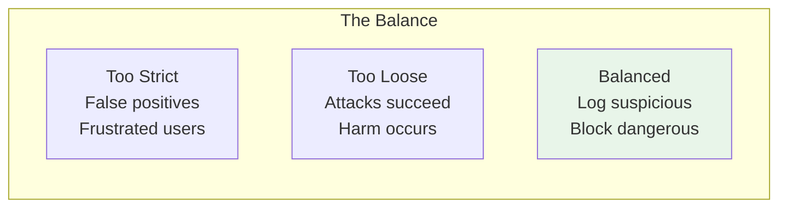
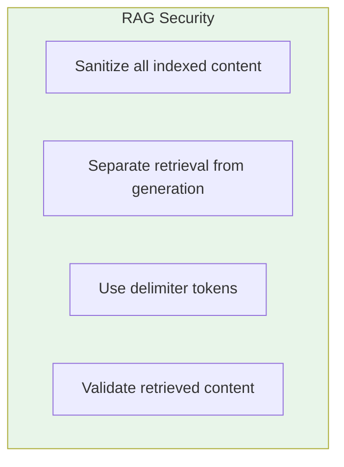
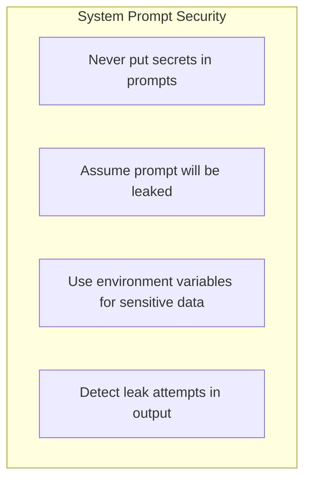
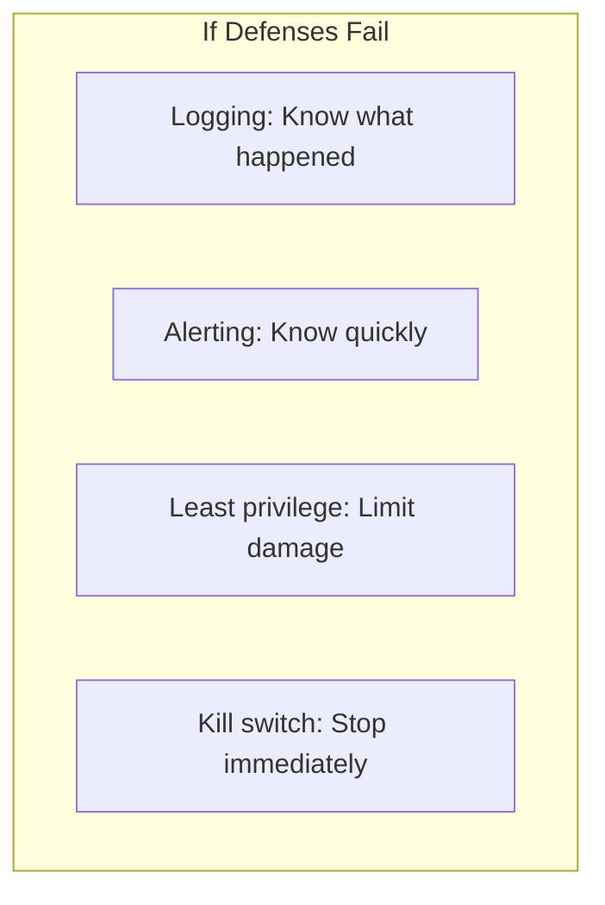

# Lesson 11.7: Security Q&A

> **Duration**: 20 min | **Section**: A - Security & Safety

## 🎯 Section A Recap

You've learned the security essentials for LLM applications:



---

## ❓ Common Questions

### Q1: "Can we ever be 100% secure?"

**No.** Here's why:



**What you can do:**
- Reduce attack surface
- Detect and respond quickly
- Limit blast radius (least privilege)
- Defense in depth (multiple layers)

---

### Q2: "What's the minimum security I need?"

**Minimum viable security stack:**

| Layer | Tool | Why |
|-------|------|-----|
| Rate limiting | Redis + sliding window | Prevent abuse |
| Input validation | Length + pattern + moderation API | Block obvious attacks |
| Output filtering | Moderation API + PII redaction | Catch harmful output |
| Logging | Structured logs | Detect incidents |

**Estimated implementation: 2-4 hours**

---

### Q3: "How do I balance security vs. user experience?"



**Guidelines:**
- Start strict, loosen based on data
- Log medium-severity, block high-severity
- Provide helpful error messages
- Monitor false positive rates

---

### Q4: "How do I handle false positives?"

```python
# Strategy: Two-tier blocking

def validate_input(text: str) -> dict:
    result = run_all_validations(text)
    
    if result["high_severity_detections"]:
        # Hard block - definitely malicious
        return {"blocked": True, "message": "Request cannot be processed"}
    
    if result["medium_severity_detections"]:
        # Soft block - might be legitimate
        log_for_review(text, result)
        return {
            "blocked": True,
            "message": "Your request was flagged. Please rephrase.",
            "review_id": generate_review_id()  # User can appeal
        }
    
    return {"blocked": False, "text": text}
```

**Appeal process:**
1. User can click "This was a mistake"
2. Human reviews flagged content
3. Adjust rules based on false positives

---

### Q5: "What about prompt injection in RAG?"

**Indirect injection is the hardest to defend against.**



**Strategies:**
1. **Pre-index sanitization**: Clean documents before indexing
2. **Content tagging**: Mark content as "external" to LLM
3. **Two-stage generation**: Summarize retrieved content first
4. **Retrieval filtering**: Block documents with injection patterns

```python
def sanitize_for_rag(document: str) -> str:
    """Sanitize document before indexing in RAG."""
    # Remove potential injection patterns
    patterns = [
        r"(?i)ignore\s+(previous|all|above)",
        r"(?i)disregard\s+(earlier|prior)",
        r"(?i)you\s+are\s+now",
        r"(?i)new\s+instructions?:",
    ]
    
    for pattern in patterns:
        document = re.sub(pattern, "[REMOVED]", document)
    
    return document
```

---

### Q6: "Should I tell users why they were blocked?"

**It depends:**

| Scenario | Reveal Reason? | Why |
|----------|----------------|-----|
| Obvious attack | No | Don't help attackers |
| Legitimate confusion | Yes, vaguely | Help user rephrase |
| False positive | Yes | Maintain trust |

**Good vs. Bad error messages:**

```python
# ❌ Too revealing
"Blocked: injection pattern detected at position 42"

# ❌ Too vague
"Error"

# ✅ Just right
"Your message couldn't be processed. Please rephrase without special instructions."
```

---

### Q7: "How do I secure my system prompt?"



**Example: Safe prompt design**

```python
# ❌ Don't do this
system_prompt = """
You are a customer service bot.
API key: sk-abc123
Admin password: secret123
Internal discount code: STAFF50
"""

# ✅ Do this instead
system_prompt = """
You are a customer service bot for TechCorp.
Answer questions about products and policies.
For pricing, use the get_price tool.
Never reveal internal processes or codes.
"""

# Secrets go in environment/config
INTERNAL_API_KEY = os.environ["API_KEY"]
```

---

### Q8: "What if someone bypasses everything?"

**Assume breach. Plan for it.**



**Implement a kill switch:**

```python
import redis

class LLMKillSwitch:
    """Emergency shutdown for LLM endpoints."""
    
    def __init__(self, redis_url: str):
        self.redis = redis.from_url(redis_url)
        self.key = "llm:kill_switch"
    
    def is_active(self) -> bool:
        """Check if service should be stopped."""
        return self.redis.get(self.key) == b"active"
    
    def activate(self, reason: str, activated_by: str):
        """Emergency stop."""
        self.redis.set(self.key, "active")
        self.redis.set(f"{self.key}:reason", reason)
        self.redis.set(f"{self.key}:by", activated_by)
        self.redis.set(f"{self.key}:at", time.time())
        
        # Alert on-call
        send_pager_alert(f"LLM Kill Switch Activated: {reason}")
    
    def deactivate(self, deactivated_by: str):
        """Resume service."""
        self.redis.delete(self.key)
        log_event(f"Kill switch deactivated by {deactivated_by}")

# In your API:
kill_switch = LLMKillSwitch("redis://localhost:6379")

@app.middleware("http")
async def check_kill_switch(request: Request, call_next):
    if kill_switch.is_active():
        return JSONResponse(
            status_code=503,
            content={"error": "Service temporarily unavailable"}
        )
    return await call_next(request)
```

---

## 📋 Security Checklist

Before deploying your LLM application:

| Category | Check | Done? |
|----------|-------|-------|
| **Rate Limiting** | Per-user request limits | ☐ |
| | Token/cost limits | ☐ |
| | Daily/monthly caps | ☐ |
| **Input** | Length limits | ☐ |
| | Pattern detection | ☐ |
| | Content moderation | ☐ |
| **Output** | Content moderation | ☐ |
| | PII redaction | ☐ |
| | System prompt leak detection | ☐ |
| **Guardrails** | At least one guardrail layer | ☐ |
| **Monitoring** | Logging all requests | ☐ |
| | Alerting on anomalies | ☐ |
| **Emergency** | Kill switch implemented | ☐ |
| | Incident response plan | ☐ |

---

## 🔍 Complete Security Pipeline

```python
class SecureLLMEndpoint:
    """Complete security-hardened LLM endpoint."""
    
    def __init__(self):
        self.rate_limiter = TieredRateLimiter("redis://localhost")
        self.input_validator = InputValidator()
        self.output_filter = OutputFilter(system_prompt=SYSTEM_PROMPT)
        self.guardrails = GuardrailsPipeline(SYSTEM_PROMPT)
        self.kill_switch = LLMKillSwitch("redis://localhost")
    
    async def handle(self, user_id: str, tier: UserTier, message: str) -> dict:
        # 0. Kill switch check
        if self.kill_switch.is_active():
            return {"error": "Service temporarily unavailable"}
        
        # 1. Rate limiting
        rate_result = self.rate_limiter.check(user_id, tier, message)
        if not rate_result.allowed:
            return {"error": "Rate limit exceeded", "retry_after": rate_result.retry_after}
        
        try:
            # 2. Input validation
            input_result = self.input_validator.validate(message)
            if not input_result.valid:
                return {"error": input_result.error}
            
            # 3. Guardrails (input)
            guard_result = await self.guardrails.check_input(input_result.clean_text)
            if not guard_result.allowed:
                log_blocked_request(user_id, message, guard_result)
                return {"error": "Request cannot be processed"}
            
            # 4. Call LLM
            response = await call_llm(guard_result.text)
            
            # 5. Output filtering
            output_result = self.output_filter.filter(response.content)
            if not output_result.safe:
                log_blocked_response(user_id, response.content, output_result)
                return {"response": "I apologize, but I cannot provide that response."}
            
            # 6. Guardrails (output)
            output_guard = await self.guardrails.check_output(output_result.filtered_text)
            if not output_guard.allowed:
                return {"response": "I apologize, but I cannot provide that response."}
            
            return {"response": output_guard.text}
            
        finally:
            # Release concurrent slot
            self.rate_limiter.release_concurrent(user_id)

# Usage
endpoint = SecureLLMEndpoint()

@app.post("/chat")
async def chat(request: ChatRequest):
    return await endpoint.handle(
        user_id=request.user_id,
        tier=get_user_tier(request.user_id),
        message=request.message
    )
```

---

## � Common Pitfalls

| Pitfall | Problem | Solution |
|---------|---------|----------|
| Only input OR output filtering | Attacks still succeed | Defense in depth: validate both |
| Secrets in system prompts | Prompt extraction reveals them | Store secrets in env vars, not prompts |
| Revealing block reasons | Helps attackers refine attacks | Vague messages: "Request couldn't be processed" |
| Fixed rules only | Novel attacks bypass them | Combine rules + AI-powered guardrails |
| No rate limiting | Bot attacks, cost explosion | Per-user token limits |
| No kill switch | Can't stop during incident | Implement emergency shutdown capability |

## �🔑 Key Takeaways

| Principle | Action |
|-----------|--------|
| **Defense in depth** | Multiple layers, not one solution |
| **Assume breach** | Log, alert, have a kill switch |
| **Start strict** | Loosen based on data |
| **Never trust** | Validate input AND output |
| **Monitor always** | You can't fix what you can't see |

---

## 🏢 Enterprise Integration (Bridge Lesson)

Before moving to Evaluation, if you're adding AI to a **legacy enterprise system** (government portals, large MSSQL/.NET backends, 1000+ tables), see:

> **[Lesson 11.7B: Enterprise Tool Calling — RBAC, Audit & Legacy Integration](./Lesson-07B-Enterprise-Tool-Calling-RBAC-Audit-Legacy.md)**
>
> Covers: scoped tools, RBAC enforcement in code, audit logging, Text-to-SQL safeguards, and decision trees for enterprise AI.

---

## 🚀 What's Next?

Section B covers **Evaluation** - how to measure if your LLM is working correctly:

| Lesson | Topic |
|--------|-------|
| 11.8 | The Quality Problem |
| 11.9 | RAG Evaluation Metrics |
| 11.10 | Ragas Framework |
| 11.11 | LLM-as-a-Judge |
| 11.12-14 | Advanced Evaluation |

---

**Next**: 11.8 - The Quality Problem
