# Lesson 11.8: The Quality Problem

> **Duration**: 5 min | **Section**: B - Evaluation

## 🎯 The Problem

Your RAG system is deployed. Users are asking questions. But:

> "How do you KNOW it's working?"
> 
> "It seems good... mostly."
> 
> **That's not engineering. That's hope.**

---

## 🔍 The Vibes-Based Approach

```mermaid
flowchart LR
    subgraph Vibes["Vibes-Based Development"]
        DEV["Developer"]
        TEST["Try 5 questions"]
        FEEL["'Looks good to me!'"]
        DEPLOY["Deploy to production"]
        PRAY["🙏 Hope it works"]
    end
    
    DEV --> TEST --> FEEL --> DEPLOY --> PRAY
    
    style PRAY fill:#FFEBEE
```



**Problems with vibes:**
- Sample size too small
- No baseline for comparison
- Can't detect regression
- Can't prove improvement
- Stakeholders don't trust "seems good"

---

## 🔍 What Can Go Wrong

| Failure Mode | You Think | Reality |
|--------------|-----------|---------|
| **Wrong retrieval** | "Answer looks right" | Retrieved wrong docs, got lucky |
| **Hallucination** | "Answer is detailed" | Made up facts not in documents |
| **Incomplete** | "Answer is concise" | Missed important information |
| **Off-topic** | "Answer is thorough" | Didn't address the actual question |

---

## 🔍 The Measurement Problem

LLMs are hard to evaluate because:


**You can't:**
- Use simple unit tests (multiple valid answers)
- Check exact string matching
- Trust the LLM to grade itself (bias)
- Manually review every response (scale)

---

## 🔍 What You Need to Measure


---

## 🔍 The Evaluation Framework

What we'll build in Section B:

| Lesson | What You'll Learn | Metrics |
|--------|-------------------|---------|
| 11.9 | Retrieval quality | Precision@k, Recall@k, NDCG |
| 11.10 | Complete RAG evaluation | Ragas framework |
| 11.11 | Automated grading | LLM-as-a-Judge |
| 11.12 | Expert alignment | SME-in-the-Loop |
| 11.13 | Regression testing | Golden Test Sets |

---

## 🔍 From Vibes to Metrics


**With metrics you can:**
- Prove your system works
- Detect regression before users do
- Compare different approaches
- Justify decisions to stakeholders
- Build confidence in deployments

---

## 🔍 The Goal

By the end of Section B, you'll have:

```python
# From this:
def evaluate_rag():
    for question in test_questions:
        answer = rag.ask(question)
        print(f"Q: {question}")
        print(f"A: {answer}")
        print("Looks OK? 🤷")  # The vibes approach

# To this:
def evaluate_rag():
    results = ragas.evaluate(
        questions=test_questions,
        answers=rag_answers,
        contexts=retrieved_contexts,
        ground_truths=expected_answers
    )
    
    print(f"Context Precision: {results['context_precision']:.2f}")
    print(f"Faithfulness: {results['faithfulness']:.2f}")
    print(f"Answer Relevance: {results['answer_relevance']:.2f}")
    
    if results['overall'] < 0.8:
        raise QualityThresholdError("RAG quality below threshold")
```

---

## 🔑 Key Takeaways

| From | To |
|------|----|
| "Seems good" | Measured metrics |
| Manual spot checks | Automated evaluation |
| Deploy and pray | Deploy with confidence |
| Can't detect regression | Automated quality gates |

---

**Next**: 11.9 - RAG Evaluation Metrics (Precision@k, Recall@k, NDCG)
