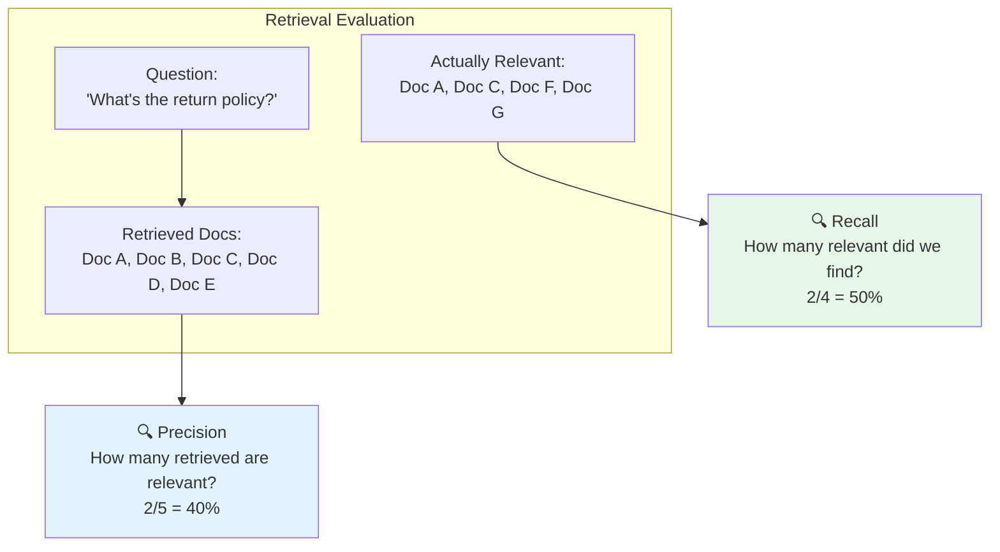
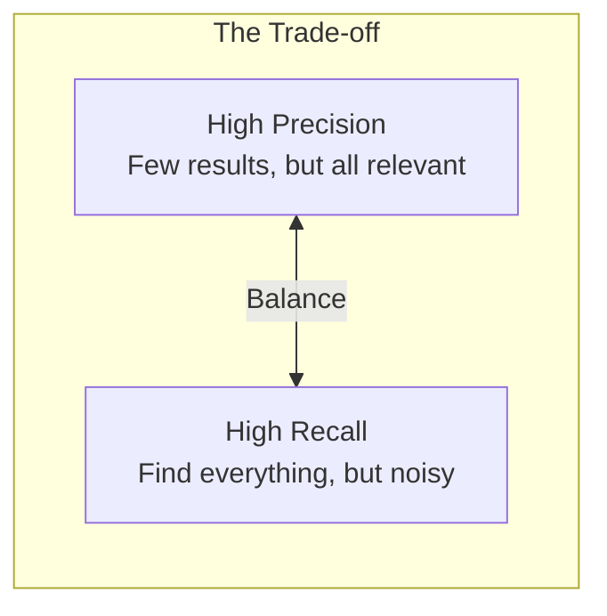
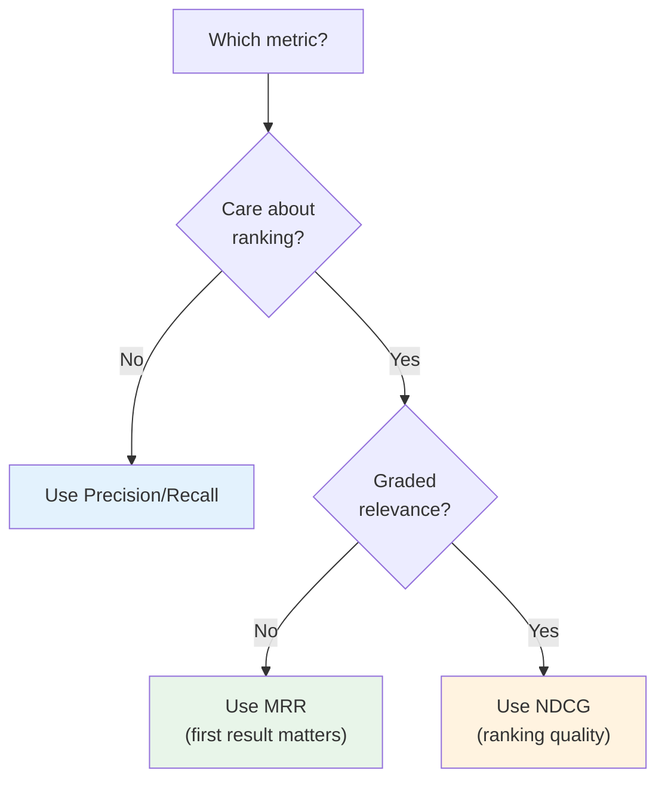

# Lesson 11.9: RAG Evaluation Metrics

> **Duration**: 35 min | **Section**: B - Evaluation

## 🎯 The Problem (3-5 min)

Your RAG retrieves 5 documents for each question. But:

> "How do you know you retrieved the RIGHT 5 documents?"
> "What if the answer was in document #6?"
> "What if 4 of the 5 were irrelevant?"

You need **retrieval metrics**.

---

## 🔍 The Retrieval Challenge



---

## 🔍 Metric 1: Precision@k

**"Of the k documents we retrieved, how many are actually relevant?"**

$$\text{Precision@k} = \frac{\text{Relevant docs in top k}}{\text{k}}$$

```python
def precision_at_k(retrieved_docs: list[str], relevant_docs: set[str], k: int) -> float:
    """Calculate Precision@k."""
    top_k = retrieved_docs[:k]
    relevant_in_top_k = sum(1 for doc in top_k if doc in relevant_docs)
    return relevant_in_top_k / k

# Example
retrieved = ["Doc_A", "Doc_B", "Doc_C", "Doc_D", "Doc_E"]
relevant = {"Doc_A", "Doc_C", "Doc_F", "Doc_G"}

print(f"Precision@3: {precision_at_k(retrieved, relevant, 3):.2f}")  # 2/3 = 0.67
print(f"Precision@5: {precision_at_k(retrieved, relevant, 5):.2f}")  # 2/5 = 0.40
```

### Interpretation

| Score | Meaning |
|-------|---------|
| 1.0 | All retrieved docs are relevant (perfect) |
| 0.5 | Half of retrieved docs are relevant |
| 0.0 | No retrieved docs are relevant (failure) |

---

## 🔍 Metric 2: Recall@k

**"Of all relevant documents, how many did we retrieve in top k?"**

$$\text{Recall@k} = \frac{\text{Relevant docs in top k}}{\text{Total relevant docs}}$$

```python
def recall_at_k(retrieved_docs: list[str], relevant_docs: set[str], k: int) -> float:
    """Calculate Recall@k."""
    top_k = retrieved_docs[:k]
    relevant_in_top_k = sum(1 for doc in top_k if doc in relevant_docs)
    return relevant_in_top_k / len(relevant_docs) if relevant_docs else 0.0

# Example
retrieved = ["Doc_A", "Doc_B", "Doc_C", "Doc_D", "Doc_E"]
relevant = {"Doc_A", "Doc_C", "Doc_F", "Doc_G"}  # 4 total relevant

print(f"Recall@3: {recall_at_k(retrieved, relevant, 3):.2f}")  # 2/4 = 0.50
print(f"Recall@5: {recall_at_k(retrieved, relevant, 5):.2f}")  # 2/4 = 0.50
```

### Interpretation

| Score | Meaning |
|-------|---------|
| 1.0 | Found all relevant docs |
| 0.5 | Found half of relevant docs |
| 0.0 | Found none of relevant docs |

---

## 🔍 Precision vs. Recall Trade-off



**Example scenarios:**

| k | Precision@k | Recall@k | Interpretation |
|---|-------------|----------|----------------|
| 1 | 1.0 | 0.25 | Top result is relevant, but missing others |
| 5 | 0.4 | 0.50 | More results, but diluted with irrelevant |
| 10 | 0.3 | 0.75 | Good coverage, but lots of noise |

---

## 🔍 Metric 3: Mean Reciprocal Rank (MRR)

**"How high is the FIRST relevant document ranked?"**

$$\text{MRR} = \frac{1}{|Q|} \sum_{i=1}^{|Q|} \frac{1}{\text{rank}_i}$$

```python
def reciprocal_rank(retrieved_docs: list[str], relevant_docs: set[str]) -> float:
    """Calculate reciprocal rank for a single query."""
    for i, doc in enumerate(retrieved_docs, 1):
        if doc in relevant_docs:
            return 1.0 / i
    return 0.0

def mean_reciprocal_rank(queries_results: list[tuple[list[str], set[str]]]) -> float:
    """Calculate MRR across multiple queries."""
    rr_scores = [reciprocal_rank(retrieved, relevant) for retrieved, relevant in queries_results]
    return sum(rr_scores) / len(rr_scores) if rr_scores else 0.0

# Example: First relevant doc at position 3
retrieved = ["Doc_B", "Doc_D", "Doc_A", "Doc_C", "Doc_E"]
relevant = {"Doc_A", "Doc_C"}
print(f"RR: {reciprocal_rank(retrieved, relevant):.2f}")  # 1/3 = 0.33
```

### Why MRR Matters

Users typically look at the **first result first**. If the relevant doc is buried, user experience suffers.

| First Relevant Position | RR Score |
|------------------------|----------|
| 1st | 1.0 |
| 2nd | 0.5 |
| 3rd | 0.33 |
| Not found | 0.0 |

---

## 🔍 Metric 4: NDCG (Normalized Discounted Cumulative Gain)

**"Are relevant docs ranked higher than irrelevant ones?"**

NDCG accounts for:
1. **Relevance grades** (not just binary relevant/not)
2. **Position** (top positions matter more)

$$\text{DCG@k} = \sum_{i=1}^{k} \frac{\text{relevance}_i}{\log_2(i+1)}$$

$$\text{NDCG@k} = \frac{\text{DCG@k}}{\text{Ideal DCG@k}}$$

```python
import numpy as np

def dcg_at_k(relevance_scores: list[float], k: int) -> float:
    """Calculate DCG@k."""
    relevance_scores = relevance_scores[:k]
    gains = np.array(relevance_scores)
    discounts = np.log2(np.arange(2, len(relevance_scores) + 2))
    return np.sum(gains / discounts)

def ndcg_at_k(relevance_scores: list[float], k: int) -> float:
    """Calculate NDCG@k."""
    # Actual DCG
    dcg = dcg_at_k(relevance_scores, k)
    
    # Ideal DCG (best possible ordering)
    ideal_order = sorted(relevance_scores, reverse=True)
    idcg = dcg_at_k(ideal_order, k)
    
    return dcg / idcg if idcg > 0 else 0.0

# Example: Graded relevance (0-2)
# Doc A: highly relevant (2), Doc B: not relevant (0), 
# Doc C: somewhat relevant (1), Doc D: not relevant (0)
actual_scores = [2, 0, 1, 0]  # As retrieved
print(f"NDCG@4: {ndcg_at_k(actual_scores, 4):.2f}")

# If we had perfect ordering: [2, 1, 0, 0]
perfect_scores = [2, 1, 0, 0]
print(f"Perfect NDCG@4: {ndcg_at_k(perfect_scores, 4):.2f}")  # 1.0
```

### NDCG Intuition

| Scenario | NDCG |
|----------|------|
| Perfect ranking | 1.0 |
| Relevant docs at bottom | < 1.0 |
| Only irrelevant docs | 0.0 |

---

## 🔍 Metric 5: Hit Rate (Success@k)

**"Is there at least ONE relevant document in the top k?"**

```python
def hit_rate_at_k(retrieved_docs: list[str], relevant_docs: set[str], k: int) -> float:
    """Calculate Hit Rate (Success@k)."""
    top_k = retrieved_docs[:k]
    return 1.0 if any(doc in relevant_docs for doc in top_k) else 0.0

def mean_hit_rate(queries_results: list[tuple[list[str], set[str]]], k: int) -> float:
    """Calculate mean hit rate across queries."""
    hits = [hit_rate_at_k(ret, rel, k) for ret, rel in queries_results]
    return sum(hits) / len(hits)

# Example
retrieved = ["Doc_B", "Doc_D", "Doc_A"]
relevant = {"Doc_A", "Doc_C"}
print(f"Hit@3: {hit_rate_at_k(retrieved, relevant, 3)}")  # 1.0 (Doc_A is in top 3)
```

---

## 🔍 Complete Evaluation Pipeline

```python
from dataclasses import dataclass
from typing import Optional

@dataclass
class RetrievalMetrics:
    precision_at_k: float
    recall_at_k: float
    mrr: float
    ndcg_at_k: float
    hit_rate: float

class RetrievalEvaluator:
    """Evaluate retrieval quality."""
    
    def __init__(self, k: int = 5):
        self.k = k
    
    def evaluate_query(
        self,
        retrieved_docs: list[str],
        relevant_docs: set[str],
        relevance_scores: Optional[list[float]] = None
    ) -> RetrievalMetrics:
        """Evaluate retrieval for a single query."""
        
        # Binary relevance scores if not provided
        if relevance_scores is None:
            relevance_scores = [
                1.0 if doc in relevant_docs else 0.0 
                for doc in retrieved_docs
            ]
        
        return RetrievalMetrics(
            precision_at_k=precision_at_k(retrieved_docs, relevant_docs, self.k),
            recall_at_k=recall_at_k(retrieved_docs, relevant_docs, self.k),
            mrr=reciprocal_rank(retrieved_docs, relevant_docs),
            ndcg_at_k=ndcg_at_k(relevance_scores, self.k),
            hit_rate=hit_rate_at_k(retrieved_docs, relevant_docs, self.k)
        )
    
    def evaluate_dataset(
        self,
        queries: list[dict]  # [{"retrieved": [...], "relevant": {...]}]
    ) -> dict:
        """Evaluate retrieval across a dataset."""
        all_metrics = [
            self.evaluate_query(q["retrieved"], q["relevant"])
            for q in queries
        ]
        
        return {
            "precision_at_k": np.mean([m.precision_at_k for m in all_metrics]),
            "recall_at_k": np.mean([m.recall_at_k for m in all_metrics]),
            "mrr": np.mean([m.mrr for m in all_metrics]),
            "ndcg_at_k": np.mean([m.ndcg_at_k for m in all_metrics]),
            "hit_rate": np.mean([m.hit_rate for m in all_metrics]),
            "num_queries": len(queries)
        }

# Usage
evaluator = RetrievalEvaluator(k=5)

test_queries = [
    {
        "question": "What's the return policy?",
        "retrieved": ["Doc_A", "Doc_B", "Doc_C", "Doc_D", "Doc_E"],
        "relevant": {"Doc_A", "Doc_C"}
    },
    {
        "question": "How to reset password?",
        "retrieved": ["Doc_X", "Doc_Y", "Doc_Z", "Doc_W", "Doc_V"],
        "relevant": {"Doc_Y", "Doc_W"}
    }
]

results = evaluator.evaluate_dataset(test_queries)
print(f"Precision@5: {results['precision_at_k']:.2f}")
print(f"Recall@5: {results['recall_at_k']:.2f}")
print(f"MRR: {results['mrr']:.2f}")
print(f"NDCG@5: {results['ndcg_at_k']:.2f}")
print(f"Hit Rate: {results['hit_rate']:.2f}")
```

---

## 🔍 Which Metric to Use?



| Metric | Use When |
|--------|----------|
| **Precision@k** | Care about quality of retrieved set |
| **Recall@k** | Can't miss any relevant documents |
| **MRR** | First result is most important |
| **NDCG** | Ranking order matters, have graded relevance |
| **Hit Rate** | Just need at least one relevant doc |

---

## 💻 Practice: Evaluate Your RAG

```python
# Exercise: Evaluate your RAG system

def evaluate_rag_retrieval(rag_system, test_cases):
    """
    test_cases format:
    [
        {
            "question": "...",
            "relevant_doc_ids": ["doc1", "doc2"]
        }
    ]
    """
    evaluator = RetrievalEvaluator(k=5)
    queries = []
    
    for case in test_cases:
        # Get retrieved documents
        retrieved_docs = rag_system.retrieve(case["question"])
        retrieved_ids = [doc.id for doc in retrieved_docs]
        
        queries.append({
            "retrieved": retrieved_ids,
            "relevant": set(case["relevant_doc_ids"])
        })
    
    return evaluator.evaluate_dataset(queries)

# Create test cases for your domain
test_cases = [
    # TODO: Add your test cases
]

results = evaluate_rag_retrieval(your_rag, test_cases)
```

---

## 🔑 Key Takeaways

| Metric | Question It Answers |
|--------|---------------------|
| **Precision@k** | "How clean is my result set?" |
| **Recall@k** | "Am I missing relevant docs?" |
| **MRR** | "How quickly do users find relevant docs?" |
| **NDCG** | "Is my ranking order optimal?" |
| **Hit Rate** | "Do I ever find something useful?" |

---

## ❓ Common Questions

| Question | Answer |
|----------|--------|
| What's a good Precision@5? | Depends on domain. 0.6+ is often acceptable. |
| Which k should I use? | Match your retrieval k (usually 3-10). |
| How do I get ground truth? | Expert annotation or user feedback. |
| Can I use multiple metrics? | Yes! They measure different things. |

---

**Next**: 11.10 - Ragas Framework
