# Lesson 11.10: Ragas Framework

> **Duration**: 40 min | **Section**: B - Evaluation

## 🎯 The Problem (3-5 min)

Retrieval metrics (Precision, Recall) only tell part of the story:

> "We retrieved the right documents... but did we USE them correctly?"
> "The answer looks good... but is it actually grounded in the documents?"
> "The response is long... but does it answer the question?"

You need **end-to-end RAG evaluation**.

---

## 🔍 Enter Ragas

**Ragas** (RAG Assessment) is a framework for evaluating the entire RAG pipeline.


---

## 🔍 The Four Core Metrics

| Metric | Question | Range |
|--------|----------|-------|
| **Context Precision** | Are retrieved docs relevant to the question? | 0-1 |
| **Context Recall** | Do retrieved docs contain info needed for ground truth? | 0-1 |
| **Faithfulness** | Is the answer supported by the context? | 0-1 |
| **Answer Relevance** | Does the answer address the question? | 0-1 |

---

## 🔍 Installation

```bash
pip install ragas
```

---

## 🔍 Metric 1: Context Precision

**"Are the retrieved documents actually relevant to the question?"**


### How It Works

For each retrieved document, an LLM judges: "Is this document relevant to answering the question?"

$$\text{Context Precision} = \frac{\sum(\text{relevant docs} \times \text{position weight})}{\text{total docs}}$$

### Example

```python
from ragas.metrics import context_precision
from ragas import evaluate

# Your RAG results
question = "What is the return policy?"
contexts = [
    "Our return policy allows returns within 30 days.",  # Relevant
    "Contact us at support@company.com",  # Not relevant
    "Returns must be in original packaging.",  # Relevant
]

# Context precision = 2/3 (weighted by position)
```

---

## 🔍 Metric 2: Context Recall

**"Do the retrieved documents contain all the information needed?"**


### How It Works

1. Extract claims from the ground truth answer
2. Check if each claim can be attributed to the retrieved context

$$\text{Context Recall} = \frac{\text{Claims attributable to context}}{\text{Total claims in ground truth}}$$

### Example

```python
ground_truth = "Returns are allowed within 30 days and must be in original packaging."

# Claims:
# 1. Returns within 30 days ✓ (found in context)
# 2. Original packaging required ✓ (found in context)

# Context Recall = 2/2 = 1.0
```

---

## 🔍 Metric 3: Faithfulness

**"Is the answer actually supported by the retrieved documents?"**


### The Hallucination Detector

$$\text{Faithfulness} = \frac{\text{Claims supported by context}}{\text{Total claims in answer}}$$

### Example

```python
contexts = ["Return policy: 30 days, original packaging required."]

answer = "Our return policy allows returns within 30 days. Items must be in original packaging. We also offer free shipping on returns."

# Claims:
# 1. Returns within 30 days ✓ (in context)
# 2. Original packaging required ✓ (in context)
# 3. Free shipping on returns ✗ (NOT in context - hallucination!)

# Faithfulness = 2/3 = 0.67
```

**Low faithfulness = hallucination!**

---

## 🔍 Metric 4: Answer Relevance

**"Does the answer actually address the question asked?"**


### How It Works

1. Generate questions that the answer would address
2. Compare semantic similarity to original question

### Example

```python
question = "What is the return policy?"

answer = "The weather is nice today."  # Completely off-topic

# Generated questions from answer: "What's the weather like?"
# Similarity to original question: 0.0

# Answer Relevance = 0.0
```

---

## 🔍 Complete Ragas Evaluation

```python
from ragas import evaluate
from ragas.metrics import (
    context_precision,
    context_recall,
    faithfulness,
    answer_relevancy
)
from datasets import Dataset

# Prepare your evaluation data
eval_data = {
    "question": [
        "What is the return policy?",
        "How do I reset my password?",
    ],
    "answer": [
        "Returns are allowed within 30 days in original packaging.",
        "Go to Settings > Security > Reset Password.",
    ],
    "contexts": [
        ["Our return policy allows returns within 30 days.", "Items must be in original packaging."],
        ["To reset password: Settings > Security > Reset Password.", "Password must be 8+ characters."],
    ],
    "ground_truth": [
        "Returns are accepted within 30 days if in original packaging.",
        "Reset password via Settings > Security > Reset Password.",
    ]
}

# Create Ragas dataset
dataset = Dataset.from_dict(eval_data)

# Run evaluation
results = evaluate(
    dataset,
    metrics=[
        context_precision,
        context_recall,
        faithfulness,
        answer_relevancy
    ]
)

print(results)
# {
#     'context_precision': 0.95,
#     'context_recall': 0.90,
#     'faithfulness': 0.85,
#     'answer_relevancy': 0.92
# }
```

---

## 🔍 Interpreting Results

```mermaid
flowchart TD
    subgraph Diagnosis["What Low Scores Mean"]
        LOW_CP["Low Context Precision<br/>→ Retrieval returning junk"]
        LOW_CR["Low Context Recall<br/>→ Missing relevant docs"]
        LOW_F["Low Faithfulness<br/>→ LLM hallucinating"]
        LOW_AR["Low Answer Relevance<br/>→ Not answering the question"]
    end
    
    subgraph Fixes["How to Fix"]
        FIX_CP["Improve embedding model<br/>Better chunking"]
        FIX_CR["Add more documents<br/>Increase k"]
        FIX_F["Strengthen grounding prompt<br/>Lower temperature"]
        FIX_AR["Better prompt engineering<br/>Add examples"]
    end
    
    LOW_CP --> FIX_CP
    LOW_CR --> FIX_CR
    LOW_F --> FIX_F
    LOW_AR --> FIX_AR
```



| Metric | Low Score | Action |
|--------|-----------|--------|
| Context Precision | < 0.7 | Improve retrieval |
| Context Recall | < 0.7 | Add docs, increase k |
| Faithfulness | < 0.8 | Reduce hallucination |
| Answer Relevance | < 0.8 | Better prompting |

---

## 🔍 Integrating with Your RAG Pipeline

```python
from ragas import evaluate
from ragas.metrics import faithfulness, answer_relevancy
from datasets import Dataset

class RAGEvaluator:
    """Evaluate RAG pipeline with Ragas."""
    
    def __init__(self, rag_pipeline):
        self.rag = rag_pipeline
    
    def evaluate(self, test_questions: list[dict]) -> dict:
        """
        Evaluate RAG on test questions.
        
        test_questions format:
        [
            {"question": "...", "ground_truth": "..."},
            ...
        ]
        """
        questions = []
        answers = []
        contexts = []
        ground_truths = []
        
        for item in test_questions:
            question = item["question"]
            
            # Run your RAG
            result = self.rag.query(question)
            
            questions.append(question)
            answers.append(result.answer)
            contexts.append(result.retrieved_contexts)
            ground_truths.append(item["ground_truth"])
        
        # Create dataset
        dataset = Dataset.from_dict({
            "question": questions,
            "answer": answers,
            "contexts": contexts,
            "ground_truth": ground_truths
        })
        
        # Run Ragas evaluation
        results = evaluate(
            dataset,
            metrics=[faithfulness, answer_relevancy]
        )
        
        return results

# Usage
evaluator = RAGEvaluator(my_rag_pipeline)

test_cases = [
    {"question": "What's the return policy?", "ground_truth": "30 days, original packaging"},
    {"question": "How to contact support?", "ground_truth": "Email support@company.com"},
]

results = evaluator.evaluate(test_cases)
print(f"Faithfulness: {results['faithfulness']:.2f}")
print(f"Answer Relevance: {results['answer_relevancy']:.2f}")
```

---

## 🔍 Automatic Test Generation

Ragas can generate test cases from your documents:

```python
from ragas.testset.generator import TestsetGenerator
from ragas.testset.evolutions import simple, reasoning, multi_context
from langchain_openai import ChatOpenAI, OpenAIEmbeddings
from langchain_community.document_loaders import DirectoryLoader

# Load your documents
loader = DirectoryLoader("./docs", glob="**/*.txt")
documents = loader.load()

# Create generator
generator = TestsetGenerator.from_langchain(
    generator_llm=ChatOpenAI(model="gpt-4o"),
    critic_llm=ChatOpenAI(model="gpt-4o"),
    embeddings=OpenAIEmbeddings()
)

# Generate test cases
testset = generator.generate_with_langchain_docs(
    documents,
    test_size=20,
    distributions={
        simple: 0.5,      # Simple factual questions
        reasoning: 0.3,   # Questions requiring reasoning
        multi_context: 0.2  # Questions needing multiple docs
    }
)

# Convert to DataFrame
test_df = testset.to_pandas()
print(test_df.head())
```

---

## 🔍 CI/CD Integration

```python
# test_rag_quality.py
import pytest
from ragas import evaluate
from ragas.metrics import faithfulness, answer_relevancy

QUALITY_THRESHOLDS = {
    "faithfulness": 0.8,
    "answer_relevancy": 0.8
}

def test_rag_quality():
    """Quality gate for RAG pipeline."""
    # Load test cases
    test_cases = load_test_cases("tests/rag_test_cases.json")
    
    # Run evaluation
    results = evaluate_rag(test_cases)
    
    # Assert quality thresholds
    assert results["faithfulness"] >= QUALITY_THRESHOLDS["faithfulness"], \
        f"Faithfulness {results['faithfulness']:.2f} below threshold"
    
    assert results["answer_relevancy"] >= QUALITY_THRESHOLDS["answer_relevancy"], \
        f"Answer relevancy {results['answer_relevancy']:.2f} below threshold"

# Run in CI/CD:
# pytest test_rag_quality.py --tb=short
```

---

## 💻 Practice: Evaluate Your RAG

```python
# Exercise: Set up Ragas evaluation for your RAG

from ragas import evaluate
from ragas.metrics import context_precision, faithfulness, answer_relevancy

# Step 1: Create test cases for YOUR domain
test_cases = [
    {
        "question": "YOUR_QUESTION_1",
        "ground_truth": "EXPECTED_ANSWER_1"
    },
    {
        "question": "YOUR_QUESTION_2", 
        "ground_truth": "EXPECTED_ANSWER_2"
    },
    # Add 10-20 test cases
]

# Step 2: Run your RAG and collect results
# TODO: Implement

# Step 3: Run Ragas evaluation
# TODO: Implement

# Step 4: Analyze results and identify improvements
# TODO: Implement
```

---

## 🔑 Key Takeaways

| Metric | Measures | Low Score Means |
|--------|----------|-----------------|
| **Context Precision** | Retrieval quality | Junk in retrieved docs |
| **Context Recall** | Retrieval coverage | Missing relevant docs |
| **Faithfulness** | Groundedness | LLM hallucinating |
| **Answer Relevance** | Response quality | Off-topic answers |

---

## ❓ Common Questions

| Question | Answer |
|----------|--------|
| Which metrics are most important? | Faithfulness for accuracy, Answer Relevance for UX |
| What's a good overall score? | 0.8+ for production readiness |
| Do I need ground truth? | Yes for Context Recall, optional for others |
| How many test cases? | 50-100 for meaningful stats |

---

**Next**: 11.11 - LLM-as-a-Judge
