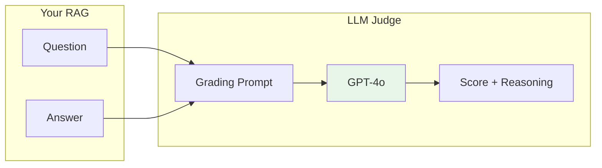
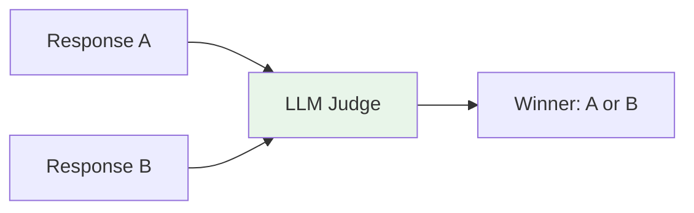
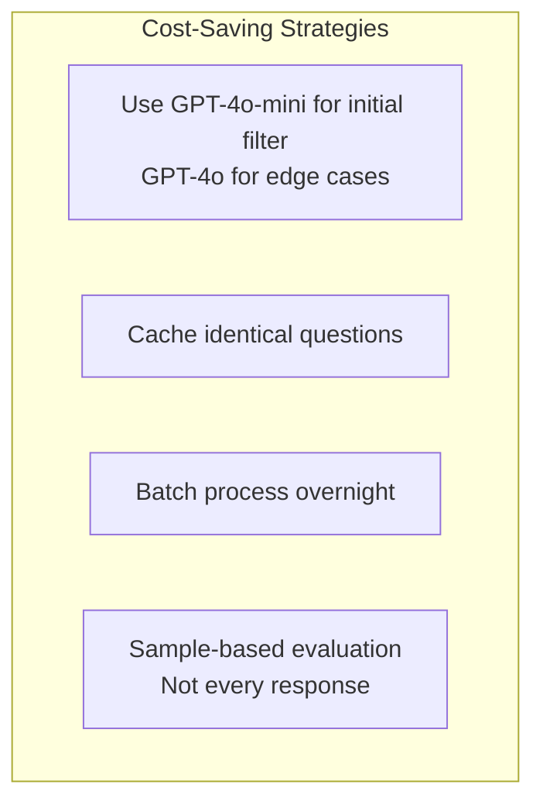

# Lesson 11.11: LLM-as-a-Judge

> **Duration**: 35 min | **Section**: B - Evaluation

## 🎯 The Problem (3-5 min)

You have 10,000 RAG responses to evaluate. Options:

| Approach | Cost | Time | Scalable? |
|----------|------|------|-----------|
| Human review | $$$$$ | Weeks | No |
| Rule-based | $ | Hours | Limited |
| LLM-as-Judge | $$ | Minutes | Yes ✓ |

**LLM-as-Judge**: Use a powerful LLM to grade outputs at scale.

---

## 🔍 How It Works



---

## 🔍 Basic Judge Pattern

```python
from openai import OpenAI

client = OpenAI()

JUDGE_PROMPT = """You are evaluating the quality of an AI assistant's response.

Question: {question}

Response: {response}

Grade the response on a scale of 1-5:
1 = Completely wrong or harmful
2 = Mostly wrong or very incomplete
3 = Partially correct, missing key information
4 = Mostly correct with minor issues
5 = Fully correct and helpful

Provide your rating and a brief explanation.

Output format:
SCORE: [1-5]
REASON: [Your explanation]"""

def llm_judge(question: str, response: str) -> dict:
    """Use LLM to judge response quality."""
    result = client.chat.completions.create(
        model="gpt-4o",
        messages=[
            {"role": "user", "content": JUDGE_PROMPT.format(
                question=question,
                response=response
            )}
        ],
        temperature=0  # Deterministic
    )
    
    output = result.choices[0].message.content
    
    # Parse score and reason
    lines = output.strip().split("\n")
    score = int(lines[0].split(":")[1].strip())
    reason = lines[1].split(":", 1)[1].strip()
    
    return {"score": score, "reason": reason}

# Usage
result = llm_judge(
    question="What's the return policy?",
    response="Returns are allowed within 30 days."
)
print(f"Score: {result['score']}/5")
print(f"Reason: {result['reason']}")
```

---

## 🔍 Judge with Ground Truth

When you have expected answers:

```python
JUDGE_WITH_REFERENCE = """You are evaluating an AI response against a reference answer.

Question: {question}

Reference Answer (Ground Truth): {ground_truth}

AI Response: {response}

Evaluate how well the AI response matches the reference answer.

Consider:
1. Factual accuracy - Does it contain the same facts?
2. Completeness - Does it cover all key points?
3. Correctness - Are there any errors or hallucinations?

Score from 1-5:
1 = Completely wrong
2 = Major errors
3 = Partially correct
4 = Minor omissions
5 = Matches reference

Output:
SCORE: [1-5]
REASON: [Explanation]"""

def judge_with_reference(question: str, response: str, ground_truth: str) -> dict:
    """Judge response against ground truth."""
    result = client.chat.completions.create(
        model="gpt-4o",
        messages=[
            {"role": "user", "content": JUDGE_WITH_REFERENCE.format(
                question=question,
                ground_truth=ground_truth,
                response=response
            )}
        ],
        temperature=0
    )
    
    # Parse output
    output = result.choices[0].message.content
    lines = output.strip().split("\n")
    score = int(lines[0].split(":")[1].strip())
    reason = lines[1].split(":", 1)[1].strip()
    
    return {"score": score, "reason": reason}
```

---

## 🔍 Multi-Criteria Judge

Evaluate multiple dimensions:

```python
MULTI_CRITERIA_PROMPT = """Evaluate this AI response on multiple criteria.

Question: {question}
Response: {response}

Rate each criterion from 1-5:

1. ACCURACY: Are the facts correct?
2. COMPLETENESS: Does it fully answer the question?
3. CLARITY: Is it easy to understand?
4. CONCISENESS: Is it appropriately brief (not rambling)?
5. HELPFULNESS: Would this actually help the user?

Output as JSON:
{{
    "accuracy": {{"score": 1-5, "reason": "..."}},
    "completeness": {{"score": 1-5, "reason": "..."}},
    "clarity": {{"score": 1-5, "reason": "..."}},
    "conciseness": {{"score": 1-5, "reason": "..."}},
    "helpfulness": {{"score": 1-5, "reason": "..."}},
    "overall": {{"score": 1-5, "summary": "..."}}
}}"""

import json

def multi_criteria_judge(question: str, response: str) -> dict:
    """Evaluate response on multiple criteria."""
    result = client.chat.completions.create(
        model="gpt-4o",
        messages=[
            {"role": "user", "content": MULTI_CRITERIA_PROMPT.format(
                question=question,
                response=response
            )}
        ],
        temperature=0,
        response_format={"type": "json_object"}
    )
    
    return json.loads(result.choices[0].message.content)

# Usage
scores = multi_criteria_judge(
    question="How do I reset my password?",
    response="Go to Settings > Security > Reset Password. Enter your current password, then your new password twice."
)

print(f"Accuracy: {scores['accuracy']['score']}/5")
print(f"Completeness: {scores['completeness']['score']}/5")
print(f"Overall: {scores['overall']['score']}/5")
```

---

## 🔍 Pairwise Comparison

Compare two responses (A vs B):



```python
PAIRWISE_PROMPT = """Compare two AI responses and determine which is better.

Question: {question}

Response A:
{response_a}

Response B:
{response_b}

Which response is better? Consider accuracy, completeness, and helpfulness.

Output:
WINNER: [A or B or TIE]
REASON: [Brief explanation]"""

def pairwise_judge(question: str, response_a: str, response_b: str) -> dict:
    """Compare two responses, return winner."""
    result = client.chat.completions.create(
        model="gpt-4o",
        messages=[
            {"role": "user", "content": PAIRWISE_PROMPT.format(
                question=question,
                response_a=response_a,
                response_b=response_b
            )}
        ],
        temperature=0
    )
    
    output = result.choices[0].message.content
    lines = output.strip().split("\n")
    winner = lines[0].split(":")[1].strip()
    reason = lines[1].split(":", 1)[1].strip()
    
    return {"winner": winner, "reason": reason}

# Great for A/B testing prompts!
result = pairwise_judge(
    question="What's our refund policy?",
    response_a="30 day refunds.",
    response_b="We offer full refunds within 30 days of purchase. Items must be unused and in original packaging."
)
print(f"Winner: {result['winner']}")
print(f"Reason: {result['reason']}")
```

---

## 🔍 Prompt Engineering for Judges

### Best Practices

```python
# ❌ Bad: Vague criteria
VAGUE_PROMPT = """Is this response good?
Response: {response}
Answer: Yes or No"""

# ✅ Good: Specific criteria with examples
SPECIFIC_PROMPT = """Evaluate this customer service response.

Response: {response}

Criteria:
1. PROFESSIONAL TONE (1-5)
   - 5: Warm, professional, brand-appropriate
   - 3: Neutral, acceptable
   - 1: Rude, unprofessional

2. SOLUTION PROVIDED (1-5)
   - 5: Complete solution with clear steps
   - 3: Partial solution
   - 1: No solution offered

3. ACCURACY (1-5)
   - 5: All information correct per our policies
   - 3: Minor inaccuracies
   - 1: Major errors or misinformation

Reference Policies:
- Returns: 30 days, original packaging
- Support hours: 9am-5pm EST

Output format:
TONE: [1-5]
SOLUTION: [1-5]
ACCURACY: [1-5]
OVERALL: [1-5]
NOTES: [Brief explanation]"""
```

### Reducing Bias

```python
# ❌ Positional bias (A tends to win)
"""Which is better, A or B?"""

# ✅ Randomize order
import random

def unbiased_pairwise(question: str, response_1: str, response_2: str) -> dict:
    """Pairwise comparison with position randomization."""
    # Randomize which is A vs B
    if random.random() > 0.5:
        a, b = response_1, response_2
        mapping = {"A": "1", "B": "2"}
    else:
        a, b = response_2, response_1
        mapping = {"A": "2", "B": "1"}
    
    result = pairwise_judge(question, a, b)
    
    # Map back to original order
    winner = mapping.get(result["winner"], "TIE")
    
    return {"winner": winner, "reason": result["reason"]}
```

---

## 🔍 Batch Evaluation

Evaluate many responses efficiently:

```python
import asyncio
from openai import AsyncOpenAI

async_client = AsyncOpenAI()

async def judge_single(question: str, response: str) -> dict:
    """Async judge for a single response."""
    result = await async_client.chat.completions.create(
        model="gpt-4o",
        messages=[
            {"role": "user", "content": JUDGE_PROMPT.format(
                question=question,
                response=response
            )}
        ],
        temperature=0
    )
    
    output = result.choices[0].message.content
    lines = output.strip().split("\n")
    score = int(lines[0].split(":")[1].strip())
    reason = lines[1].split(":", 1)[1].strip()
    
    return {"question": question, "score": score, "reason": reason}

async def batch_evaluate(test_cases: list[dict], concurrency: int = 10) -> list[dict]:
    """Evaluate many responses in parallel."""
    semaphore = asyncio.Semaphore(concurrency)
    
    async def limited_judge(case):
        async with semaphore:
            return await judge_single(case["question"], case["response"])
    
    tasks = [limited_judge(case) for case in test_cases]
    results = await asyncio.gather(*tasks)
    
    return results

# Usage
test_cases = [
    {"question": "Q1", "response": "R1"},
    {"question": "Q2", "response": "R2"},
    # ... hundreds more
]

results = asyncio.run(batch_evaluate(test_cases))

# Aggregate
avg_score = sum(r["score"] for r in results) / len(results)
print(f"Average score: {avg_score:.2f}/5")
```

---

## 🔍 Cost Optimization



```python
def tiered_evaluation(question: str, response: str) -> dict:
    """Use cheaper model first, expensive for edge cases."""
    
    # First pass: cheap model
    quick_result = client.chat.completions.create(
        model="gpt-4o-mini",  # Much cheaper
        messages=[{"role": "user", "content": JUDGE_PROMPT.format(
            question=question, response=response
        )}],
        temperature=0
    )
    
    quick_score = parse_score(quick_result)
    
    # If borderline (2-4), use better model
    if 2 <= quick_score <= 4:
        detailed_result = client.chat.completions.create(
            model="gpt-4o",  # More accurate
            messages=[{"role": "user", "content": JUDGE_PROMPT.format(
                question=question, response=response
            )}],
            temperature=0
        )
        return {"score": parse_score(detailed_result), "model": "gpt-4o"}
    
    return {"score": quick_score, "model": "gpt-4o-mini"}
```

---

## 🔍 Validating Your Judge

How do you know your judge is accurate?

```python
def validate_judge_agreement(
    human_labels: list[dict],  # [{"question": ..., "response": ..., "human_score": 1-5}]
    sample_size: int = 100
) -> dict:
    """Compare LLM judge to human labels."""
    
    agreements = 0
    close_agreements = 0  # Within 1 point
    
    for item in human_labels[:sample_size]:
        llm_result = llm_judge(item["question"], item["response"])
        llm_score = llm_result["score"]
        human_score = item["human_score"]
        
        if llm_score == human_score:
            agreements += 1
        if abs(llm_score - human_score) <= 1:
            close_agreements += 1
    
    return {
        "exact_agreement": agreements / sample_size,
        "close_agreement": close_agreements / sample_size,
        "sample_size": sample_size
    }

# Goal: 70%+ close agreement with humans
```

---

## 💻 Practice: Build Your Judge

```python
# Exercise: Create a domain-specific LLM judge

class CustomerServiceJudge:
    """Judge for customer service responses."""
    
    CRITERIA = {
        "empathy": "Does the response acknowledge the customer's feelings?",
        "solution": "Does it provide a clear solution or next steps?",
        "accuracy": "Is the information correct per our policies?",
        "professionalism": "Is the tone appropriate for our brand?"
    }
    
    def __init__(self, policies: str):
        self.policies = policies
    
    def judge(self, question: str, response: str) -> dict:
        """
        TODO: Implement multi-criteria judging
        
        Return: {
            "empathy": {"score": 1-5, "reason": "..."},
            "solution": {"score": 1-5, "reason": "..."},
            "accuracy": {"score": 1-5, "reason": "..."},
            "professionalism": {"score": 1-5, "reason": "..."},
            "overall": {"score": 1-5, "summary": "..."}
        }
        """
        pass

# Test your judge
judge = CustomerServiceJudge(policies="Returns: 30 days...")
result = judge.judge(
    question="I'm frustrated with my broken product!",
    response="Sorry about that. You can return it within 30 days."
)
```

---

## 🔑 Key Takeaways

| Aspect | Recommendation |
|--------|----------------|
| **Model** | GPT-4o for accuracy, GPT-4o-mini for cost |
| **Temperature** | 0 for consistency |
| **Criteria** | Specific, with examples and rubric |
| **Validation** | Compare to human labels |
| **Scale** | Batch + async for throughput |

---

## ❓ Common Questions

| Question | Answer |
|----------|--------|
| Which model as judge? | GPT-4o is most reliable |
| Is LLM-as-Judge biased? | Yes. Validate with human labels. |
| How accurate is it? | 70-85% agreement with humans typical |
| Can I use for all cases? | No. Edge cases need human review. |

---

**Next**: 11.12 - SME-in-the-Loop
