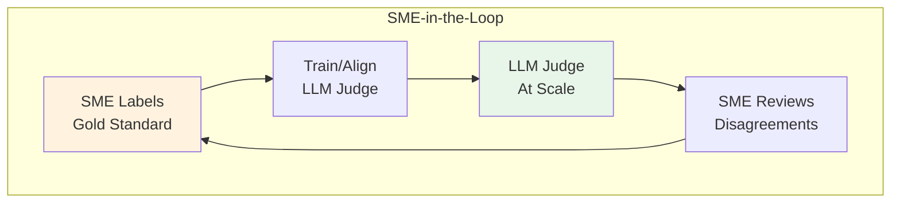
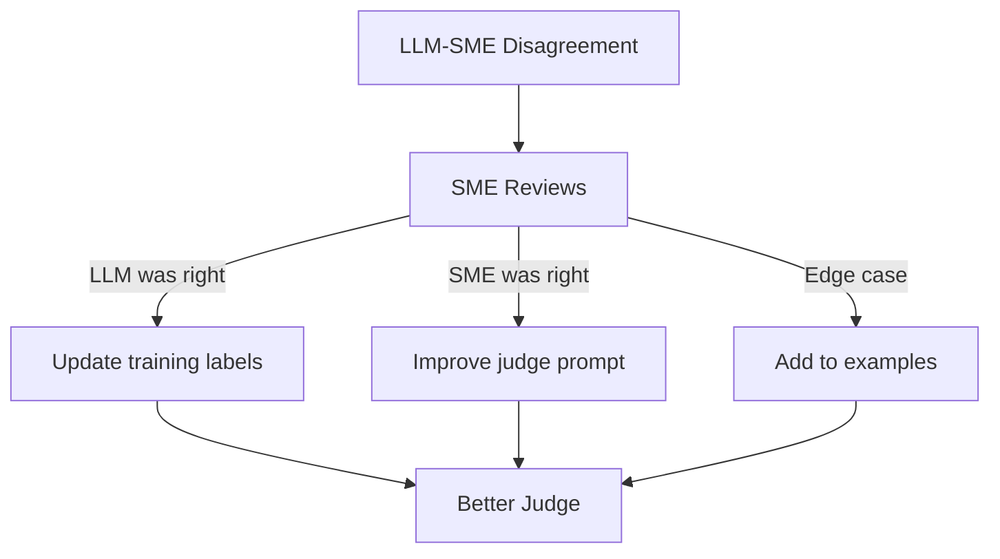

# Lesson 11.12: SME-in-the-Loop

> **Duration**: 30 min | **Section**: B - Evaluation

## 🎯 The Problem (3-5 min)

LLM-as-Judge is fast and scalable, but:

> "How do we know the LLM judge is right?"
> "What about domain-specific knowledge?"
> "Who defines 'good' in the first place?"

**Answer**: Subject Matter Experts (SMEs) establish the ground truth.

---

## 🔍 The Human-AI Evaluation Loop



**The cycle:**
1. SMEs label a sample (ground truth)
2. Train/prompt LLM judge to match SME decisions
3. LLM judges at scale
4. SMEs review where LLM is uncertain
5. Improve LLM judge with new examples

---

## 🔍 Step 1: SME Labeling

Create a labeling interface for experts:

```python
from dataclasses import dataclass
from datetime import datetime
from typing import Optional
import json

@dataclass
class SMELabel:
    """A single SME evaluation."""
    question: str
    response: str
    score: int  # 1-5
    criteria_scores: dict  # {"accuracy": 4, "completeness": 3}
    notes: str
    sme_id: str
    timestamp: datetime

class SMELabelingSession:
    """Manage SME labeling workflow."""
    
    def __init__(self, output_file: str):
        self.output_file = output_file
        self.labels = []
    
    def present_case(self, question: str, response: str, context: str = None):
        """Display case for SME to evaluate."""
        print("=" * 60)
        print("QUESTION:")
        print(question)
        print("\nRESPONSE:")
        print(response)
        if context:
            print("\nCONTEXT (retrieved documents):")
            print(context[:500] + "..." if len(context) > 500 else context)
        print("=" * 60)
    
    def collect_label(self, question: str, response: str, sme_id: str) -> SMELabel:
        """Collect SME evaluation."""
        self.present_case(question, response)
        
        print("\nEvaluate this response:")
        print("1 = Completely wrong")
        print("2 = Major issues")
        print("3 = Partially correct")
        print("4 = Mostly correct")
        print("5 = Fully correct")
        
        score = int(input("\nOverall score (1-5): "))
        
        # Collect criteria scores
        criteria_scores = {}
        for criterion in ["accuracy", "completeness", "helpfulness"]:
            criteria_scores[criterion] = int(input(f"{criterion.title()} (1-5): "))
        
        notes = input("\nNotes (optional): ")
        
        label = SMELabel(
            question=question,
            response=response,
            score=score,
            criteria_scores=criteria_scores,
            notes=notes,
            sme_id=sme_id,
            timestamp=datetime.now()
        )
        
        self.labels.append(label)
        self.save()
        
        return label
    
    def save(self):
        """Save labels to file."""
        data = [
            {
                "question": l.question,
                "response": l.response,
                "score": l.score,
                "criteria_scores": l.criteria_scores,
                "notes": l.notes,
                "sme_id": l.sme_id,
                "timestamp": l.timestamp.isoformat()
            }
            for l in self.labels
        ]
        with open(self.output_file, "w") as f:
            json.dump(data, f, indent=2)

# Usage
session = SMELabelingSession("sme_labels.json")

# Load cases to label
cases = load_cases_for_review()

sme_id = input("Enter your SME ID: ")
for case in cases[:20]:  # Label 20 cases per session
    session.collect_label(case["question"], case["response"], sme_id)
```

---

## 🔍 Step 2: Calculate Inter-Rater Reliability

Multiple SMEs should agree:

```python
from collections import defaultdict
import numpy as np

def cohen_kappa(rater1_scores: list[int], rater2_scores: list[int]) -> float:
    """Calculate Cohen's Kappa for inter-rater reliability."""
    # Convert to numpy arrays
    r1 = np.array(rater1_scores)
    r2 = np.array(rater2_scores)
    
    # Observed agreement
    po = np.mean(r1 == r2)
    
    # Expected agreement by chance
    categories = set(r1) | set(r2)
    pe = sum(
        (np.mean(r1 == c) * np.mean(r2 == c))
        for c in categories
    )
    
    # Kappa
    kappa = (po - pe) / (1 - pe) if pe < 1 else 1.0
    
    return kappa

def analyze_sme_agreement(labels: list[dict]) -> dict:
    """Analyze agreement between SMEs."""
    # Group by question (same question labeled by multiple SMEs)
    by_question = defaultdict(list)
    for label in labels:
        by_question[label["question"]].append(label)
    
    # Find questions with multiple raters
    multi_rated = {q: lbls for q, lbls in by_question.items() if len(lbls) >= 2}
    
    if not multi_rated:
        return {"error": "No questions with multiple raters"}
    
    # Calculate agreement
    agreements = []
    for question, lbls in multi_rated.items():
        scores = [l["score"] for l in lbls]
        # Are all raters within 1 point?
        spread = max(scores) - min(scores)
        agreements.append(spread <= 1)
    
    return {
        "num_multi_rated": len(multi_rated),
        "close_agreement_rate": sum(agreements) / len(agreements),
        "questions_with_disagreement": [
            q for q, lbls in multi_rated.items()
            if max(l["score"] for l in lbls) - min(l["score"] for l in lbls) > 1
        ]
    }

# Usage
labels = json.load(open("sme_labels.json"))
agreement = analyze_sme_agreement(labels)
print(f"Agreement rate: {agreement['close_agreement_rate']:.1%}")
```

### Kappa Interpretation

| Kappa | Agreement Level |
|-------|-----------------|
| < 0.20 | Poor |
| 0.20-0.40 | Fair |
| 0.40-0.60 | Moderate |
| 0.60-0.80 | Substantial |
| > 0.80 | Almost perfect |

---

## 🔍 Step 3: Align LLM Judge with SME Labels

```python
from openai import OpenAI

client = OpenAI()

def create_aligned_judge_prompt(sme_examples: list[dict]) -> str:
    """Create judge prompt using SME examples."""
    
    # Format examples
    examples_text = ""
    for ex in sme_examples[:5]:  # Use 5 best examples
        examples_text += f"""
Example:
Question: {ex['question']}
Response: {ex['response']}
SME Score: {ex['score']}/5
SME Reasoning: {ex['notes']}
---
"""
    
    prompt = f"""You are evaluating AI responses as a Subject Matter Expert would.

Here are examples of how our SMEs evaluate responses:

{examples_text}

Now evaluate this new case using the same standards:

Question: {{question}}
Response: {{response}}

Score from 1-5 following the SME examples above.

SCORE: [1-5]
REASON: [Your explanation matching SME style]"""
    
    return prompt

class AlignedJudge:
    """LLM Judge aligned with SME decisions."""
    
    def __init__(self, sme_examples: list[dict]):
        self.prompt_template = create_aligned_judge_prompt(sme_examples)
    
    def judge(self, question: str, response: str) -> dict:
        """Judge response using SME-aligned prompt."""
        result = client.chat.completions.create(
            model="gpt-4o",
            messages=[
                {"role": "user", "content": self.prompt_template.format(
                    question=question,
                    response=response
                )}
            ],
            temperature=0
        )
        
        output = result.choices[0].message.content
        lines = output.strip().split("\n")
        score = int(lines[0].split(":")[1].strip())
        reason = lines[1].split(":", 1)[1].strip()
        
        return {"score": score, "reason": reason}

# Usage
sme_examples = json.load(open("sme_labels.json"))
judge = AlignedJudge(sme_examples)

result = judge.judge("What's the return policy?", "30 days returns.")
print(f"Score: {result['score']}/5")
```

---

## 🔍 Step 4: Measure Judge Alignment

```python
def measure_alignment(
    sme_labels: list[dict],
    judge: AlignedJudge,
    test_split: float = 0.2
) -> dict:
    """Measure how well LLM judge aligns with SME labels."""
    
    # Split into train/test
    n_test = int(len(sme_labels) * test_split)
    test_labels = sme_labels[-n_test:]
    
    # Judge test cases
    exact_matches = 0
    close_matches = 0  # Within 1 point
    total = 0
    
    disagreements = []
    
    for label in test_labels:
        result = judge.judge(label["question"], label["response"])
        
        llm_score = result["score"]
        sme_score = label["score"]
        
        if llm_score == sme_score:
            exact_matches += 1
        if abs(llm_score - sme_score) <= 1:
            close_matches += 1
        else:
            disagreements.append({
                "question": label["question"],
                "response": label["response"],
                "sme_score": sme_score,
                "llm_score": llm_score,
                "llm_reason": result["reason"]
            })
        
        total += 1
    
    return {
        "exact_agreement": exact_matches / total,
        "close_agreement": close_matches / total,
        "disagreements": disagreements
    }

# Usage
alignment = measure_alignment(sme_labels, judge)
print(f"Exact agreement: {alignment['exact_agreement']:.1%}")
print(f"Close agreement: {alignment['close_agreement']:.1%}")
print(f"Cases to review: {len(alignment['disagreements'])}")
```

---

## 🔍 Step 5: SME Review of Disagreements



```python
class DisagreementReviewer:
    """Review cases where LLM and SME disagree."""
    
    def __init__(self, disagreements: list[dict]):
        self.disagreements = disagreements
        self.resolutions = []
    
    def review_case(self, case: dict) -> dict:
        """SME reviews a disagreement case."""
        print("=" * 60)
        print("DISAGREEMENT CASE")
        print(f"\nQuestion: {case['question']}")
        print(f"\nResponse: {case['response']}")
        print(f"\nOriginal SME Score: {case['sme_score']}")
        print(f"LLM Score: {case['llm_score']}")
        print(f"LLM Reasoning: {case['llm_reason']}")
        print("=" * 60)
        
        print("\nWho was correct?")
        print("1 = SME was correct")
        print("2 = LLM was correct")
        print("3 = Both have merit (edge case)")
        
        choice = int(input("\nChoice (1-3): "))
        
        resolution = {
            "case": case,
            "choice": choice,
            "correct_score": None,
            "notes": ""
        }
        
        if choice == 1:
            resolution["correct_score"] = case["sme_score"]
        elif choice == 2:
            resolution["correct_score"] = case["llm_score"]
        else:
            resolution["correct_score"] = int(input("What should the score be? "))
        
        resolution["notes"] = input("Notes: ")
        
        self.resolutions.append(resolution)
        return resolution
    
    def review_all(self):
        """Review all disagreements."""
        for case in self.disagreements:
            self.review_case(case)
        
        return self.get_summary()
    
    def get_summary(self) -> dict:
        """Summarize resolutions."""
        sme_correct = sum(1 for r in self.resolutions if r["choice"] == 1)
        llm_correct = sum(1 for r in self.resolutions if r["choice"] == 2)
        edge_cases = sum(1 for r in self.resolutions if r["choice"] == 3)
        
        return {
            "sme_correct": sme_correct,
            "llm_correct": llm_correct,
            "edge_cases": edge_cases,
            "total": len(self.resolutions)
        }
```

---

## 🔍 Complete SME-in-the-Loop Pipeline

```python
class SMEInTheLoop:
    """Complete SME-in-the-loop evaluation system."""
    
    def __init__(self):
        self.sme_labels = []
        self.judge = None
    
    def phase1_initial_labeling(self, cases: list[dict], sme_id: str, n: int = 50):
        """Phase 1: SMEs label initial sample."""
        print(f"Phase 1: Labeling {n} cases...")
        
        session = SMELabelingSession("initial_labels.json")
        for case in cases[:n]:
            session.collect_label(case["question"], case["response"], sme_id)
        
        self.sme_labels = session.labels
        print(f"Collected {len(self.sme_labels)} labels")
    
    def phase2_train_judge(self):
        """Phase 2: Train LLM judge on SME labels."""
        print("Phase 2: Training aligned judge...")
        
        # Convert labels to examples
        examples = [
            {
                "question": l.question,
                "response": l.response,
                "score": l.score,
                "notes": l.notes
            }
            for l in self.sme_labels
        ]
        
        self.judge = AlignedJudge(examples)
        print("Judge trained on SME examples")
    
    def phase3_measure_alignment(self) -> dict:
        """Phase 3: Measure judge alignment with held-out SME labels."""
        print("Phase 3: Measuring alignment...")
        
        examples = [
            {
                "question": l.question,
                "response": l.response,
                "score": l.score
            }
            for l in self.sme_labels
        ]
        
        alignment = measure_alignment(examples, self.judge)
        print(f"Close agreement: {alignment['close_agreement']:.1%}")
        
        return alignment
    
    def phase4_scale_evaluation(self, cases: list[dict]) -> list[dict]:
        """Phase 4: Use aligned judge at scale."""
        print(f"Phase 4: Evaluating {len(cases)} cases at scale...")
        
        results = []
        for case in cases:
            result = self.judge.judge(case["question"], case["response"])
            results.append({
                "question": case["question"],
                "response": case["response"],
                "score": result["score"],
                "reason": result["reason"]
            })
        
        avg_score = sum(r["score"] for r in results) / len(results)
        print(f"Average score: {avg_score:.2f}/5")
        
        return results
    
    def phase5_continuous_improvement(self, new_sme_labels: list[dict]):
        """Phase 5: Incorporate new SME feedback."""
        print("Phase 5: Updating with new SME labels...")
        
        # Add new labels
        self.sme_labels.extend(new_sme_labels)
        
        # Retrain judge
        self.phase2_train_judge()
        
        # Measure new alignment
        return self.phase3_measure_alignment()

# Usage
pipeline = SMEInTheLoop()

# Initial setup
cases = load_all_cases()
pipeline.phase1_initial_labeling(cases, sme_id="expert_001", n=50)
pipeline.phase2_train_judge()
alignment = pipeline.phase3_measure_alignment()

# Scale up
all_results = pipeline.phase4_scale_evaluation(cases)

# Periodically get more SME labels and improve
# new_labels = collect_more_sme_labels()
# pipeline.phase5_continuous_improvement(new_labels)
```

---

## 💻 Practice: Set Up SME Workflow

```python
# Exercise: Create SME labeling for your domain

# Step 1: Define your criteria
CRITERIA = {
    "accuracy": "Is the information factually correct?",
    "completeness": "Does it fully answer the question?",
    # Add your domain-specific criteria
}

# Step 2: Create example cases for SME labeling
# TODO: Get 50+ real question-answer pairs from your RAG

# Step 3: Collect SME labels
# TODO: Have 2+ SMEs label the cases

# Step 4: Calculate agreement
# TODO: Ensure SMEs agree (Kappa > 0.6)

# Step 5: Train aligned judge
# TODO: Use SME labels to create judge prompt

# Step 6: Measure and iterate
# TODO: Target 70%+ close agreement
```

---

## 🔑 Key Takeaways

| Phase | Goal | Output |
|-------|------|--------|
| SME Labeling | Establish ground truth | 50-100 labeled examples |
| Inter-rater | Ensure consistency | Kappa > 0.6 |
| Judge Training | Align LLM with SME | Calibrated judge |
| Scale | Evaluate everything | Automated scores |
| Review | Continuous improvement | Updated examples |

---

## ❓ Common Questions

| Question | Answer |
|----------|--------|
| How many SME labels do I need? | 50-100 for initial training |
| How many SMEs? | 2+ for reliability measurement |
| How often to refresh? | Monthly or after system changes |
| What if SMEs disagree? | Discuss, create guidelines, add examples |

---

**Next**: 11.13 - Golden Test Sets
