# Lesson 11.13: Golden Test Sets

> **Duration**: 30 min | **Section**: B - Evaluation

## 🎯 The Problem (3-5 min)

You update your prompt, change chunking, or swap models. How do you know you didn't break anything?

> "The old prompt worked for refund questions... does the new one?"
> "We improved retrieval, but did it hurt anything?"
> "How do we catch regressions before users do?"

**Answer**: Golden Test Sets—regression testing for AI.

---

## 🔍 What Are Golden Test Sets?

```mermaid
flowchart LR
    subgraph Golden["Golden Test Set"]
        Q1["Q: Return policy?<br/>A: 30 days"]
        Q2["Q: Reset password?<br/>A: Settings > Security"]
        Q3["Q: Support hours?<br/>A: 9am-5pm"]
        QN["...50+ cases"]
    end
    
    Golden --> RAG["Your RAG"]
    RAG --> COMPARE["Compare to<br/>Expected Answers"]
    COMPARE --> PASS["✅ Pass: 95%"]
    COMPARE --> FAIL["❌ Fail: Regression!"]
    
    style PASS fill:#E8F5E9
    style FAIL fill:#FFEBEE
```



**Golden Test Set = curated question-answer pairs that define expected behavior**

---

## 🔍 Anatomy of a Golden Test Case

```python
from dataclasses import dataclass
from typing import Optional
from enum import Enum

class TestCategory(Enum):
    FACTUAL = "factual"           # Specific facts
    PROCEDURAL = "procedural"     # How-to questions
    POLICY = "policy"             # Rules and policies
    EDGE_CASE = "edge_case"       # Tricky scenarios
    NEGATIVE = "negative"         # What NOT to answer

@dataclass
class GoldenTestCase:
    """A single golden test case."""
    id: str
    question: str
    expected_answer: str
    category: TestCategory
    required_keywords: list[str]          # Must appear in answer
    forbidden_keywords: list[str]         # Must NOT appear
    min_score: float                      # Minimum acceptable score (0-1)
    metadata: Optional[dict] = None       # Additional context
    
    def to_dict(self) -> dict:
        return {
            "id": self.id,
            "question": self.question,
            "expected_answer": self.expected_answer,
            "category": self.category.value,
            "required_keywords": self.required_keywords,
            "forbidden_keywords": self.forbidden_keywords,
            "min_score": self.min_score,
            "metadata": self.metadata
        }
```

---

## 🔍 Building Your Golden Test Set

### Step 1: Collect Questions

```python
# Sources for golden test questions:

QUESTION_SOURCES = {
    "support_tickets": "Real questions users asked",
    "sme_curated": "Experts wrote important questions",
    "edge_cases": "Tricky scenarios that failed before",
    "documentation": "Questions documentation should answer",
    "compliance": "Questions with regulatory requirements"
}

# Example: Load from various sources
def collect_questions() -> list[dict]:
    questions = []
    
    # From support tickets
    tickets = load_support_tickets()
    questions.extend([
        {"question": t["question"], "source": "support"}
        for t in tickets
    ])
    
    # From SME curation
    sme_questions = load_sme_questions()
    questions.extend([
        {"question": q["question"], "source": "sme"}
        for q in sme_questions
    ])
    
    return questions
```

### Step 2: Define Expected Answers

```python
import json

def create_golden_test_set(
    questions: list[dict],
    sme_id: str
) -> list[GoldenTestCase]:
    """Interactive golden test set creation with SME."""
    
    golden_tests = []
    
    for i, q in enumerate(questions):
        print(f"\n{'='*60}")
        print(f"Question {i+1}/{len(questions)}")
        print(f"Q: {q['question']}")
        print(f"Source: {q['source']}")
        
        # Get expected answer from SME
        expected = input("\nExpected answer: ")
        
        # Get required keywords
        keywords_input = input("Required keywords (comma-separated): ")
        required = [k.strip() for k in keywords_input.split(",") if k.strip()]
        
        # Get forbidden keywords
        forbidden_input = input("Forbidden keywords (comma-separated): ")
        forbidden = [k.strip() for k in forbidden_input.split(",") if k.strip()]
        
        # Get category
        print("\nCategories: factual, procedural, policy, edge_case, negative")
        category = TestCategory(input("Category: "))
        
        # Create test case
        test = GoldenTestCase(
            id=f"golden_{i+1}",
            question=q["question"],
            expected_answer=expected,
            category=category,
            required_keywords=required,
            forbidden_keywords=forbidden,
            min_score=0.8,  # Default
            metadata={"source": q["source"], "created_by": sme_id}
        )
        
        golden_tests.append(test)
    
    return golden_tests

# Save to file
def save_golden_tests(tests: list[GoldenTestCase], path: str):
    data = [t.to_dict() for t in tests]
    with open(path, "w") as f:
        json.dump(data, f, indent=2)
```

---

## 🔍 Test Set Categories


| Category | Description | Examples |
|----------|-------------|----------|
| **Factual** | Specific facts to retrieve | "What's the price of X?" |
| **Procedural** | How-to instructions | "How do I reset password?" |
| **Policy** | Rules and conditions | "What's the return policy?" |
| **Edge Case** | Tricky scenarios | "Can I return opened items?" |
| **Negative** | Should NOT answer | "Tell me competitor prices" |

---

## 🔍 Running Golden Tests

```python
from dataclasses import dataclass
from typing import List

@dataclass
class TestResult:
    """Result of a single golden test."""
    test_id: str
    passed: bool
    actual_answer: str
    score: float
    issues: list[str]

class GoldenTestRunner:
    """Run golden tests against RAG system."""
    
    def __init__(self, rag_pipeline, judge):
        self.rag = rag_pipeline
        self.judge = judge
    
    def run_single(self, test: GoldenTestCase) -> TestResult:
        """Run a single golden test."""
        issues = []
        
        # Get RAG response
        response = self.rag.query(test.question)
        actual = response.answer
        
        # Check required keywords
        for keyword in test.required_keywords:
            if keyword.lower() not in actual.lower():
                issues.append(f"Missing required keyword: {keyword}")
        
        # Check forbidden keywords
        for keyword in test.forbidden_keywords:
            if keyword.lower() in actual.lower():
                issues.append(f"Contains forbidden keyword: {keyword}")
        
        # Score with LLM judge
        judge_result = self.judge.judge_with_reference(
            question=test.question,
            response=actual,
            ground_truth=test.expected_answer
        )
        score = judge_result["score"] / 5.0  # Normalize to 0-1
        
        # Determine pass/fail
        passed = (
            score >= test.min_score and
            len([i for i in issues if "required" in i]) == 0 and
            len([i for i in issues if "forbidden" in i]) == 0
        )
        
        if score < test.min_score:
            issues.append(f"Score {score:.2f} below threshold {test.min_score}")
        
        return TestResult(
            test_id=test.id,
            passed=passed,
            actual_answer=actual,
            score=score,
            issues=issues
        )
    
    def run_all(self, tests: list[GoldenTestCase]) -> dict:
        """Run all golden tests, return summary."""
        results = []
        
        for test in tests:
            result = self.run_single(test)
            results.append(result)
            
            # Progress indicator
            status = "✅" if result.passed else "❌"
            print(f"{status} {test.id}: {result.score:.2f}")
        
        # Summary
        passed = sum(1 for r in results if r.passed)
        total = len(results)
        
        return {
            "passed": passed,
            "failed": total - passed,
            "total": total,
            "pass_rate": passed / total,
            "results": results,
            "failures": [r for r in results if not r.passed]
        }

# Usage
runner = GoldenTestRunner(my_rag, my_judge)

# Load golden tests
tests = load_golden_tests("golden_tests.json")

# Run tests
summary = runner.run_all(tests)
print(f"\n{'='*60}")
print(f"Pass rate: {summary['pass_rate']:.1%} ({summary['passed']}/{summary['total']})")

if summary["failures"]:
    print(f"\n⚠️ Failures:")
    for failure in summary["failures"]:
        print(f"  - {failure.test_id}: {failure.issues}")
```

---

## 🔍 Regression Detection

```mermaid
flowchart TD
    CHANGE["Code/Prompt Change"]
    RUN["Run Golden Tests"]
    COMPARE["Compare to Baseline"]
    
    CHANGE --> RUN --> COMPARE
    
    COMPARE -->|"Same or Better"| DEPLOY["✅ Safe to Deploy"]
    COMPARE -->|"Worse"| BLOCK["❌ Regression Detected"]
    
    style DEPLOY fill:#E8F5E9
    style BLOCK fill:#FFEBEE
```



```python
class RegressionDetector:
    """Detect regressions between versions."""
    
    def __init__(self, baseline_file: str):
        self.baseline = self.load_baseline(baseline_file)
    
    def load_baseline(self, path: str) -> dict:
        """Load baseline results."""
        with open(path) as f:
            return json.load(f)
    
    def save_baseline(self, results: dict, path: str):
        """Save new baseline."""
        with open(path, "w") as f:
            json.dump(results, f, indent=2)
    
    def compare(self, new_results: dict) -> dict:
        """Compare new results to baseline."""
        regressions = []
        improvements = []
        
        baseline_by_id = {r["test_id"]: r for r in self.baseline["results"]}
        
        for new in new_results["results"]:
            test_id = new.test_id
            
            if test_id in baseline_by_id:
                old = baseline_by_id[test_id]
                
                # Compare scores
                old_score = old.get("score", 0)
                new_score = new.score
                
                if new_score < old_score - 0.1:  # 10% threshold
                    regressions.append({
                        "test_id": test_id,
                        "old_score": old_score,
                        "new_score": new_score,
                        "delta": new_score - old_score
                    })
                elif new_score > old_score + 0.1:
                    improvements.append({
                        "test_id": test_id,
                        "old_score": old_score,
                        "new_score": new_score,
                        "delta": new_score - old_score
                    })
        
        return {
            "regressions": regressions,
            "improvements": improvements,
            "has_regression": len(regressions) > 0,
            "overall_delta": new_results["pass_rate"] - self.baseline["pass_rate"]
        }

# Usage
detector = RegressionDetector("baseline_results.json")

# After making changes, run tests
new_results = runner.run_all(tests)

# Compare to baseline
comparison = detector.compare(new_results)

if comparison["has_regression"]:
    print("❌ REGRESSION DETECTED")
    for reg in comparison["regressions"]:
        print(f"  - {reg['test_id']}: {reg['old_score']:.2f} → {reg['new_score']:.2f}")
    raise Exception("Regression detected, blocking deployment")
else:
    print("✅ No regressions detected")
    # Optionally update baseline
    # detector.save_baseline(new_results, "baseline_results.json")
```

---

## 🔍 CI/CD Integration

```yaml
# .github/workflows/rag-tests.yml
name: RAG Golden Tests

on:
  push:
    branches: [main]
  pull_request:
    branches: [main]

jobs:
  golden-tests:
    runs-on: ubuntu-latest
    
    steps:
      - uses: actions/checkout@v4
      
      - name: Set up Python
        uses: actions/setup-python@v5
        with:
          python-version: '3.11'
      
      - name: Install dependencies
        run: |
          pip install -r requirements.txt
      
      - name: Run golden tests
        env:
          OPENAI_API_KEY: ${{ secrets.OPENAI_API_KEY }}
        run: |
          python -m pytest tests/test_golden.py -v --tb=short
      
      - name: Check for regressions
        run: |
          python scripts/check_regression.py
```

```python
# tests/test_golden.py
import pytest
from golden_tests import GoldenTestRunner, load_golden_tests

@pytest.fixture
def runner():
    rag = create_rag_pipeline()
    judge = create_judge()
    return GoldenTestRunner(rag, judge)

@pytest.fixture
def golden_tests():
    return load_golden_tests("tests/golden_tests.json")

def test_golden_pass_rate(runner, golden_tests):
    """Ensure golden test pass rate meets threshold."""
    results = runner.run_all(golden_tests)
    
    assert results["pass_rate"] >= 0.90, \
        f"Pass rate {results['pass_rate']:.1%} below 90% threshold"

def test_no_critical_failures(runner, golden_tests):
    """Critical tests must all pass."""
    critical_tests = [t for t in golden_tests if t.metadata.get("critical")]
    results = runner.run_all(critical_tests)
    
    assert results["failed"] == 0, \
        f"{results['failed']} critical tests failed"

@pytest.mark.parametrize("category", ["policy", "factual", "procedural"])
def test_category_pass_rate(runner, golden_tests, category):
    """Each category must meet threshold."""
    category_tests = [t for t in golden_tests if t.category.value == category]
    results = runner.run_all(category_tests)
    
    assert results["pass_rate"] >= 0.85, \
        f"{category} pass rate {results['pass_rate']:.1%} below 85%"
```

---

## 🔍 Maintaining Golden Tests

```python
class GoldenTestMaintenance:
    """Maintain and update golden test set."""
    
    def __init__(self, tests_path: str):
        self.tests_path = tests_path
        self.tests = load_golden_tests(tests_path)
    
    def add_from_failure(self, question: str, expected: str, metadata: dict = None):
        """Add new test from a production failure."""
        new_test = GoldenTestCase(
            id=f"golden_{len(self.tests) + 1}",
            question=question,
            expected_answer=expected,
            category=TestCategory.EDGE_CASE,
            required_keywords=[],
            forbidden_keywords=[],
            min_score=0.8,
            metadata={**(metadata or {}), "source": "production_failure"}
        )
        self.tests.append(new_test)
        self.save()
        print(f"Added new test: {new_test.id}")
    
    def retire_test(self, test_id: str, reason: str):
        """Retire an outdated test."""
        for test in self.tests:
            if test.id == test_id:
                test.metadata = test.metadata or {}
                test.metadata["retired"] = True
                test.metadata["retired_reason"] = reason
                break
        self.save()
        print(f"Retired test: {test_id}")
    
    def update_expected(self, test_id: str, new_expected: str):
        """Update expected answer (policy changed, etc.)."""
        for test in self.tests:
            if test.id == test_id:
                test.expected_answer = new_expected
                test.metadata = test.metadata or {}
                test.metadata["last_updated"] = datetime.now().isoformat()
                break
        self.save()
        print(f"Updated test: {test_id}")
    
    def get_active_tests(self) -> list[GoldenTestCase]:
        """Get non-retired tests."""
        return [t for t in self.tests if not t.metadata.get("retired")]
    
    def save(self):
        """Save tests to file."""
        save_golden_tests(self.tests, self.tests_path)

# Usage
maintenance = GoldenTestMaintenance("golden_tests.json")

# Add test from production bug
maintenance.add_from_failure(
    question="Can I return a gift without receipt?",
    expected="Yes, gifts can be returned for store credit without receipt",
    metadata={"ticket": "SUPPORT-1234"}
)

# Retire outdated test
maintenance.retire_test("golden_15", reason="Policy changed - no longer applicable")
```

---

## 💻 Practice: Build Your Golden Test Set

```python
# Exercise: Create golden tests for your RAG

# Step 1: Gather 50+ questions from various sources
questions = []
# TODO: Add from support tickets, documentation, SME input

# Step 2: Define expected answers with SME
# TODO: For each question, define the "correct" answer

# Step 3: Categorize and set thresholds
# TODO: Assign categories and min_scores

# Step 4: Run baseline
# TODO: Establish baseline pass rate

# Step 5: Integrate into CI/CD
# TODO: Block deploys on regression
```

---

## 🔑 Key Takeaways

| Aspect | Recommendation |
|--------|----------------|
| **Size** | 50-200 test cases |
| **Categories** | Mix of factual, procedural, edge cases |
| **Pass threshold** | 90%+ for production readiness |
| **Maintenance** | Review quarterly, add from failures |
| **CI/CD** | Block deploys on regression |

---

## ❓ Common Questions

| Question | Answer |
|----------|--------|
| How many tests? | 50-200 depending on domain complexity |
| How often to update? | After policy changes, monthly review |
| What pass rate? | 90%+ for production, 95%+ ideal |
| Who maintains? | SME + engineering collaboration |

---

**Next**: 11.14 - Evaluation Q&A
