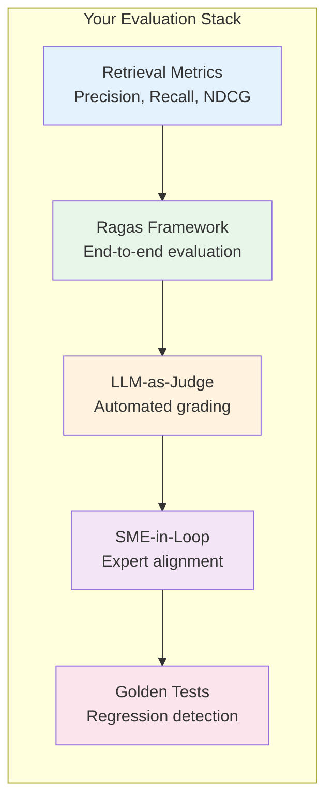
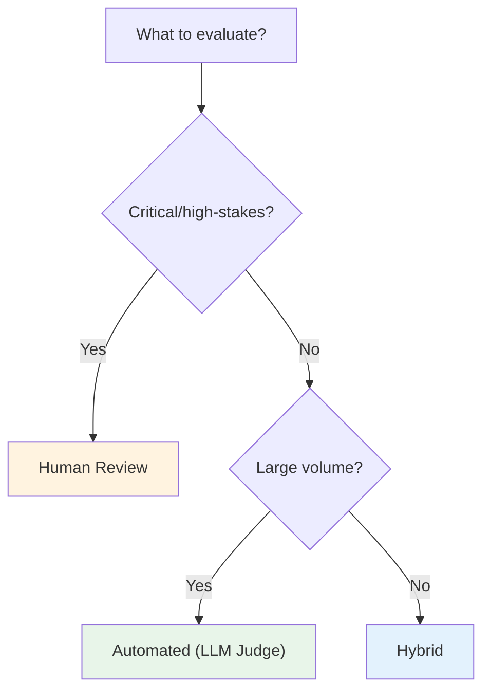
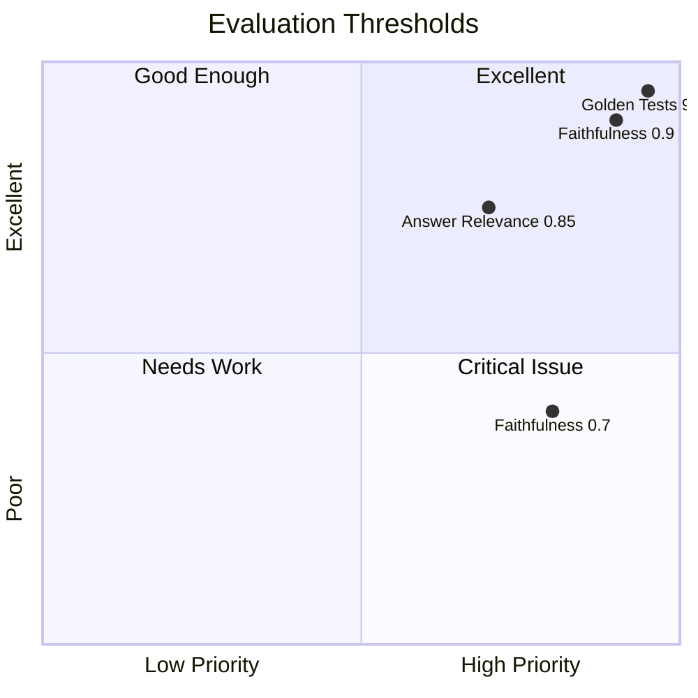
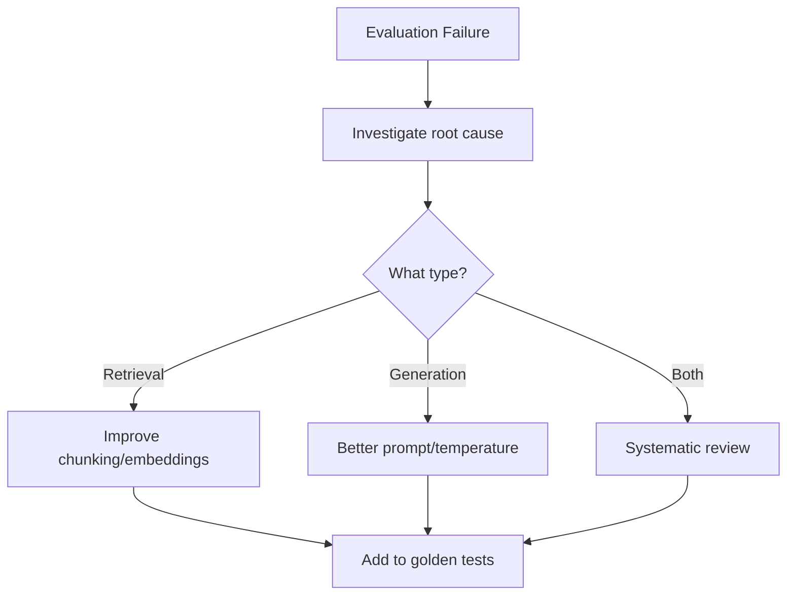

# Lesson 11.14: Evaluation Q&A

> **Duration**: 10 min | **Section**: B - Evaluation

## 🎯 Section B Recap

You've learned how to measure and ensure RAG quality:



---

## ❓ Common Questions

### Q1: "Human eval vs. automated eval—which do I use?"



| Scenario | Use |
|----------|-----|
| **Production monitoring (1000s/day)** | Automated |
| **New feature validation** | Hybrid (auto + SME spot-check) |
| **Critical failures** | Human review |
| **Baseline creation** | Human (SME) |
| **Regression testing** | Automated with golden tests |

---

### Q2: "Which Ragas metrics should I focus on?"

**Start with these two:**

| Metric | Why It's Critical |
|--------|-------------------|
| **Faithfulness** | Catches hallucinations |
| **Answer Relevance** | Ensures user gets what they asked |

**Add these when ready:**
- Context Precision → retrieval quality
- Context Recall → missing information

```python
# Minimum viable Ragas setup
from ragas.metrics import faithfulness, answer_relevancy

results = evaluate(dataset, metrics=[faithfulness, answer_relevancy])

# Threshold check
assert results["faithfulness"] > 0.8, "Too many hallucinations!"
assert results["answer_relevancy"] > 0.8, "Not answering questions!"
```

---

### Q3: "How often should I run evaluations?"

| Trigger | What to Run |
|---------|-------------|
| **Every deploy** | Golden tests (automated) |
| **Weekly** | Full Ragas evaluation on sample |
| **Monthly** | SME review of edge cases |
| **After major changes** | Complete evaluation suite |

```python
# CI/CD: Every deploy
def pre_deploy_check():
    results = run_golden_tests()
    assert results["pass_rate"] >= 0.90

# Weekly cron job
def weekly_evaluation():
    sample = get_random_sample(n=200)
    ragas_results = run_ragas_evaluation(sample)
    log_metrics_to_dashboard(ragas_results)
    
    if ragas_results["faithfulness"] < 0.75:
        alert_team("Faithfulness dropped below threshold!")
```

---

### Q4: "What's a good score for production?"



| Metric | Minimum | Target | Excellent |
|--------|---------|--------|-----------|
| **Faithfulness** | 0.75 | 0.85 | 0.95+ |
| **Answer Relevance** | 0.75 | 0.85 | 0.90+ |
| **Context Precision** | 0.70 | 0.80 | 0.90+ |
| **Golden Tests** | 85% | 90% | 95%+ |

---

### Q5: "How do I evaluate without ground truth?"

**Options:**

| Approach | How It Works |
|----------|--------------|
| **Reference-free metrics** | Faithfulness, Answer Relevance don't need ground truth |
| **LLM-as-Judge (no reference)** | Judge quality without expected answer |
| **User feedback** | Thumbs up/down as proxy |
| **A/B testing** | Compare variants |

```python
# Reference-free Ragas evaluation
from ragas.metrics import faithfulness, answer_relevancy

# These DON'T require ground truth!
dataset = Dataset.from_dict({
    "question": questions,
    "answer": answers,
    "contexts": contexts,
    # NO ground_truth needed for these metrics
})

results = evaluate(dataset, metrics=[faithfulness, answer_relevancy])
```

---

### Q6: "How do I handle edge cases and failures?"



**Turn failures into tests:**

```python
def handle_failure(question: str, bad_response: str, correct_response: str):
    """Turn a failure into a golden test."""
    
    # 1. Log the failure
    log_failure(question, bad_response)
    
    # 2. Add to golden tests
    maintenance.add_from_failure(
        question=question,
        expected=correct_response,
        metadata={"failure_date": datetime.now().isoformat()}
    )
    
    # 3. Categorize for analysis
    categorize_failure(question, bad_response)
```

---

### Q7: "LLM-as-Judge is expensive. How do I reduce cost?"

```python
# Strategy 1: Use cheaper model for most cases
def tiered_judge(question: str, response: str) -> dict:
    # First: cheap model
    quick = gpt_4o_mini_judge(question, response)
    
    # Only escalate borderline cases
    if 2 <= quick["score"] <= 4:
        return gpt_4o_judge(question, response)
    
    return quick

# Strategy 2: Sample-based evaluation
def sample_evaluation(responses: list, sample_rate: float = 0.1):
    sample = random.sample(responses, int(len(responses) * sample_rate))
    return evaluate_batch(sample)

# Strategy 3: Cache identical questions
from functools import lru_cache

@lru_cache(maxsize=10000)
def cached_judge(question: str, response: str) -> str:
    return llm_judge(question, response)
```

---

## 📋 Evaluation Checklist

Before declaring your RAG "production-ready":

| Category | Check | Done? |
|----------|-------|-------|
| **Retrieval** | Precision@k > 0.7 | ☐ |
| | Recall@k > 0.7 | ☐ |
| **Ragas** | Faithfulness > 0.8 | ☐ |
| | Answer Relevance > 0.8 | ☐ |
| **Golden Tests** | 50+ test cases created | ☐ |
| | Pass rate > 90% | ☐ |
| | CI/CD integration | ☐ |
| **SME** | Initial labels collected | ☐ |
| | LLM judge aligned | ☐ |
| **Monitoring** | Weekly evaluation scheduled | ☐ |

---

## 🔍 Complete Evaluation Pipeline

```python
class RAGEvaluationPipeline:
    """Complete evaluation pipeline for RAG systems."""
    
    def __init__(self, rag_pipeline, config: dict):
        self.rag = rag_pipeline
        self.config = config
        self.golden_tests = load_golden_tests(config["golden_tests_path"])
        self.judge = create_aligned_judge(config["sme_labels_path"])
    
    def pre_deploy_evaluation(self) -> dict:
        """Run before every deployment."""
        # 1. Golden tests
        golden_results = run_golden_tests(self.rag, self.golden_tests)
        
        if golden_results["pass_rate"] < self.config["min_pass_rate"]:
            raise RegressionError(f"Golden tests: {golden_results['pass_rate']:.1%}")
        
        return {"golden_tests": golden_results}
    
    def weekly_evaluation(self, sample_size: int = 200) -> dict:
        """Run weekly for monitoring."""
        # Get production sample
        sample = get_production_sample(sample_size)
        
        # Run Ragas evaluation
        ragas_results = run_ragas_evaluation(sample)
        
        # Run LLM judge evaluation
        judge_results = run_judge_evaluation(sample, self.judge)
        
        # Log to dashboard
        log_to_dashboard({
            "ragas": ragas_results,
            "judge": judge_results,
            "timestamp": datetime.now()
        })
        
        # Alert on issues
        if ragas_results["faithfulness"] < self.config["faithfulness_threshold"]:
            alert_team("Faithfulness below threshold!")
        
        return {
            "ragas": ragas_results,
            "judge": judge_results
        }
    
    def monthly_review(self) -> dict:
        """Monthly deep dive with SME."""
        # Get failures and edge cases
        failures = get_month_failures()
        
        # Flag for SME review
        for failure in failures:
            create_sme_review_task(failure)
        
        # Update golden tests
        new_tests = prompt_sme_for_new_tests()
        update_golden_tests(new_tests)
        
        return {
            "failures_flagged": len(failures),
            "new_tests_added": len(new_tests)
        }

# Usage
pipeline = RAGEvaluationPipeline(
    rag_pipeline=my_rag,
    config={
        "golden_tests_path": "tests/golden.json",
        "sme_labels_path": "data/sme_labels.json",
        "min_pass_rate": 0.90,
        "faithfulness_threshold": 0.80
    }
)

# Before deploy
pipeline.pre_deploy_evaluation()

# Weekly (cron)
pipeline.weekly_evaluation()

# Monthly
pipeline.monthly_review()
```

---

## � Common Pitfalls

| Pitfall | Problem | Solution |
|---------|---------|----------|
| No ground truth | Can't measure accuracy | Use reference-free metrics (Faithfulness) |
| Only automated eval | Misses nuance, edge cases | Combine with periodic SME reviews |
| Static golden tests | Tests become stale | Regularly add new failure cases |
| LLM judge not calibrated | Scores don't match human judgment | Align judge with SME-labeled examples |
| Evaluating too rarely | Regressions go unnoticed | Run golden tests on every deploy |
| Ignoring context quality | Generation can't compensate | Measure retrieval metrics (Precision@k) separately |

## �🔑 Key Takeaways

| Principle | Action |
|-----------|--------|
| **Measure, don't guess** | Every RAG needs evaluation |
| **Automate for scale** | LLM-as-Judge for volume |
| **Align with experts** | SME labels define "good" |
| **Test for regression** | Golden tests in CI/CD |
| **Monitor continuously** | Weekly evaluation runs |

---

## 🚀 What's Next?

Section C covers **Token Economics**—how to manage costs:

| Lesson | Topic |
|--------|-------|
| 11.15 | The Cost Problem |
| 11.16 | The ROI Hierarchy |
| 11.17 | Semantic Caching |
| 11.18 | Token Budgets |
| 11.19 | Cost Q&A |

---

**Next**: 11.15 - The Cost Problem
