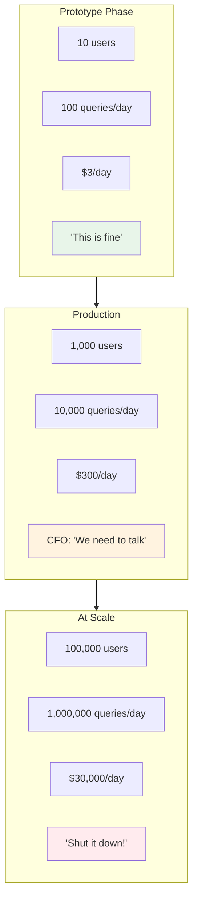
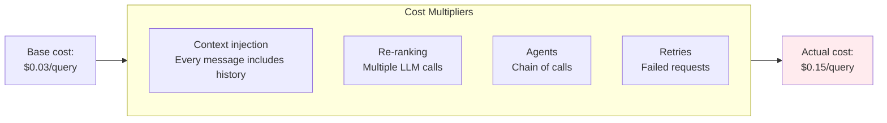
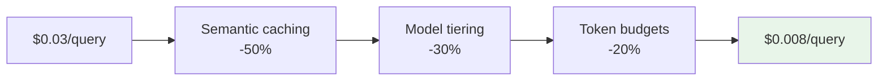
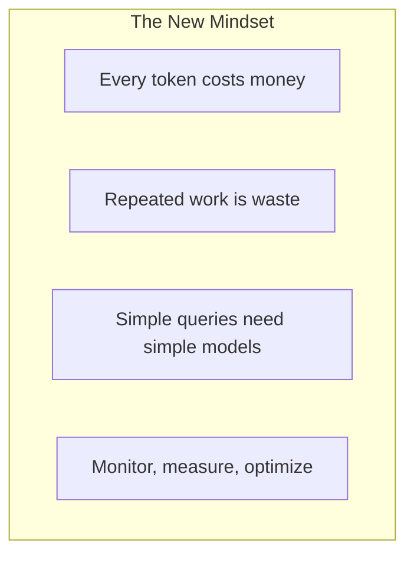

# Lesson 11.15: The Cost Problem

> **Duration**: 5 min | **Section**: C - Token Economics

## 🎯 The Problem

Your prototype works great. Users love it. Then finance calls:

> "Each API call costs $0.03. You're making 10,000 calls per day."
> 
> **"That's $300/day. $9,000/month. $108,000/year."**
> 
> "The CFO is NOT happy."

---

## 🔍 The Cost Explosion



---

## 🔍 Where the Money Goes

| Component | Cost Driver | Example |
|-----------|-------------|---------|
| **Input tokens** | Long prompts, large context | 4K tokens × $0.01/1K = $0.04 |
| **Output tokens** | Long responses | 500 tokens × $0.03/1K = $0.015 |
| **Embeddings** | Every chunk embedded | 1M chunks × $0.0001 = $100 |
| **Re-computation** | Same question, same answer | 1000 duplicates = wasted $ |

---

## 🔍 The Hidden Multipliers



### Real Example: Agent Loop

```python
# Single "query" triggers 5 LLM calls:
# 1. Understand intent
# 2. Choose tools
# 3. Execute tool 1
# 4. Execute tool 2
# 5. Generate final response

# You think: $0.03 per query
# Reality: $0.15 per query (5x multiplier)
```

---

## 🔍 The Math of Failure

| Scenario | Queries/Month | Cost/Query | Monthly Cost |
|----------|---------------|------------|--------------|
| **Prototype** | 3,000 | $0.03 | $90 |
| **Launch** | 300,000 | $0.03 | $9,000 |
| **Growth** | 3,000,000 | $0.03 | $90,000 |
| **Viral moment** | 30,000,000 | $0.03 | $900,000 |

> **Without optimization, success can bankrupt you.**

---

## 🔍 The Good News



**With the right optimizations, you can reduce costs by 70-90%.**

---

## 🔍 What We'll Cover in Section C

| Lesson | Topic | Savings |
|--------|-------|---------|
| 11.16 | ROI Hierarchy | Prioritization framework |
| 11.17 | Semantic Caching | 40-60% reduction |
| 11.18 | Token Budgets | Prevent runaway costs |
| 11.19 | Cost Q&A | Complete strategy |

---

## 🔍 The Token Economics Mindset



**Think like a cloud architect:**
- Every API call has a cost
- Cache what you can
- Use the cheapest option that works
- Budget and limit usage

---

## 🔑 Key Takeaways

| Reality | Action |
|---------|--------|
| Costs scale with users | Build cost optimization from day 1 |
| Hidden multipliers exist | Measure actual cost per query |
| 70-90% reduction possible | Implement caching + tiering |
| Success can kill you | Set budgets and alerts |

---

**Next**: 11.16 - The ROI Hierarchy
