# Lesson 11.16: The ROI Hierarchy

> **Duration**: 30 min | **Section**: C - Token Economics

## 🎯 The Problem (3-5 min)

You have limited time to optimize costs. Where do you start?

> "Should I implement caching? Token limits? Model tiering?"
> "What gives the biggest bang for the buck?"

You need a **prioritization framework**.

---

## 🔍 The ROI Hierarchy

```mermaid
flowchart TD
    subgraph ROI["TOKEN ECONOMICS ROI HIERARCHY"]
        L1["1. SEMANTIC CACHING<br/>Cache similar queries<br/>💰 Highest ROI, implement first"]
        L2["2. MODEL TIERING<br/>GPT-4o for complex, GPT-4o-mini for simple<br/>💰 High ROI, smart routing"]
        L3["3. PROMPT OPTIMIZATION<br/>Shorter prompts, less context<br/>💰 Medium ROI, engineering effort"]
        L4["4. TOKEN BUDGETS<br/>Per-user/session quotas<br/>💰 Medium ROI, prevent abuse"]
    end
    
    L1 --> L2 --> L3 --> L4
    
    style L1 fill:#2E7D32,color:#fff
    style L2 fill:#43A047,color:#fff
    style L3 fill:#66BB6A,color:#000
    style L4 fill:#81C784,color:#000
```



**Implement in this order for maximum impact.**

---

## 🔍 Level 1: Semantic Caching (Highest ROI)

**The insight**: Many users ask the same or similar questions.


### Why It's #1

| Metric | Impact |
|--------|--------|
| **Typical cache hit rate** | 30-60% of queries |
| **Cost reduction** | 30-60% |
| **Latency improvement** | 10-100x faster |
| **Implementation effort** | Medium |

### Quick Implementation

```python
from openai import OpenAI
import numpy as np
from typing import Optional

client = OpenAI()

class SemanticCache:
    """Simple semantic cache using embeddings."""
    
    def __init__(self, similarity_threshold: float = 0.95):
        self.cache = []  # [(embedding, question, response)]
        self.threshold = similarity_threshold
    
    def _embed(self, text: str) -> list[float]:
        result = client.embeddings.create(
            model="text-embedding-3-small",
            input=text
        )
        return result.data[0].embedding
    
    def _cosine_similarity(self, a: list[float], b: list[float]) -> float:
        a, b = np.array(a), np.array(b)
        return np.dot(a, b) / (np.linalg.norm(a) * np.linalg.norm(b))
    
    def get(self, question: str) -> Optional[str]:
        """Check cache for similar question."""
        query_embedding = self._embed(question)
        
        for cached_embedding, cached_question, cached_response in self.cache:
            similarity = self._cosine_similarity(query_embedding, cached_embedding)
            
            if similarity >= self.threshold:
                print(f"Cache hit! Similarity: {similarity:.3f}")
                return cached_response
        
        return None
    
    def set(self, question: str, response: str):
        """Add to cache."""
        embedding = self._embed(question)
        self.cache.append((embedding, question, response))

# Usage
cache = SemanticCache(similarity_threshold=0.92)

def query_with_cache(question: str) -> str:
    # Check cache first
    cached = cache.get(question)
    if cached:
        return cached  # Free!
    
    # Cache miss - call LLM
    response = call_llm(question)
    
    # Store for future
    cache.set(question, response)
    
    return response

# First call - cache miss, costs $0.03
query_with_cache("What's the return policy?")

# Second call - cache hit, costs $0.0001 (embedding only)
query_with_cache("What is your return policy?")
```

---

## 🔍 Level 2: Model Tiering (High ROI)

**The insight**: Not every query needs GPT-4o.


### Tiering Strategy

| Query Type | Model | Cost (input) |
|------------|-------|--------------|
| Simple Q&A | GPT-4o-mini | $0.15/1M |
| Summarization | GPT-4o-mini | $0.15/1M |
| Complex reasoning | GPT-4o | $2.50/1M |
| Code generation | GPT-4o | $2.50/1M |
| Creative writing | GPT-4o-mini | $0.15/1M |

### Implementation

```python
class QueryRouter:
    """Route queries to appropriate model."""
    
    def __init__(self):
        self.simple_patterns = [
            "what is", "when is", "where is",
            "how do i", "tell me about",
            "summarize", "list"
        ]
    
    def classify(self, query: str) -> str:
        """Classify query complexity."""
        query_lower = query.lower()
        
        # Simple heuristics
        if len(query) < 50:
            return "simple"
        
        if any(p in query_lower for p in self.simple_patterns):
            return "simple"
        
        # Complex indicators
        complex_indicators = [
            "analyze", "compare", "explain why",
            "what would happen if", "code", "implement"
        ]
        
        if any(p in query_lower for p in complex_indicators):
            return "complex"
        
        return "simple"  # Default to cheaper
    
    def get_model(self, query: str) -> str:
        complexity = self.classify(query)
        
        return {
            "simple": "gpt-4o-mini",
            "complex": "gpt-4o"
        }[complexity]

# Usage
router = QueryRouter()

def smart_query(question: str) -> str:
    model = router.get_model(question)
    
    response = client.chat.completions.create(
        model=model,
        messages=[{"role": "user", "content": question}]
    )
    
    return response.choices[0].message.content

# Simple query → cheap model
smart_query("What's the return policy?")  # Uses gpt-4o-mini

# Complex query → powerful model
smart_query("Analyze the trade-offs between...")  # Uses gpt-4o
```

### Savings Example

| Without Tiering | With Tiering |
|-----------------|--------------|
| 100% GPT-4o | 70% GPT-4o-mini, 30% GPT-4o |
| $2.50/1M tokens | ~$0.86/1M tokens |
| **Savings: 65%** | |

---

## 🔍 Level 3: Prompt Optimization (Medium ROI)

**The insight**: Shorter prompts = fewer tokens = less cost.


### Optimization Techniques

| Technique | Before | After | Savings |
|-----------|--------|-------|---------|
| **Shorten system prompt** | 500 tokens | 200 tokens | 300 |
| **Remove examples** | 3 examples | 1 example | 400 |
| **Trim history** | Last 10 msgs | Last 3 msgs | 1000 |
| **Compress context** | Raw docs | Summaries | 500 |

### Example

```python
# ❌ Bloated prompt (2000 tokens)
BLOATED_PROMPT = """
You are an incredibly helpful, friendly, and knowledgeable customer service 
representative for TechCorp, a leading technology company that specializes 
in creating innovative solutions for businesses and consumers alike. Your 
role is to assist customers with their inquiries, provide accurate information 
about our products and services, and ensure they have a positive experience...

[500 more words of instructions]

Here are some examples of how you should respond:

Example 1:
Customer: "What's your return policy?"
You: "Thank you for reaching out! I'd be happy to help you with information 
about our return policy. At TechCorp, we offer a generous 30-day return 
policy on all products..."

[2 more examples]
"""

# ✅ Optimized prompt (400 tokens)
OPTIMIZED_PROMPT = """You are TechCorp's customer service bot.

Rules:
- Be concise and helpful
- Only answer about TechCorp products
- For refunds/returns: 30 days, original packaging required
- For technical issues: collect product name, issue description

If unsure, say "Let me connect you with a specialist."
"""

# Savings: 1600 tokens per query × $0.0025/1K = $0.004 per query
# At 100K queries/month = $400/month saved
```

---

## 🔍 Level 4: Token Budgets (Medium ROI)

**The insight**: Prevent runaway costs by setting limits.


### Budget Types

| Budget Type | Purpose |
|-------------|---------|
| **Per-request** | Max tokens per single query |
| **Per-session** | Max tokens per conversation |
| **Per-user/day** | Daily quota per user |
| **Per-tenant/month** | Monthly quota per customer |

### Implementation

```python
import redis
from datetime import datetime

class TokenBudgetManager:
    """Manage token budgets per user."""
    
    def __init__(self, redis_url: str):
        self.redis = redis.from_url(redis_url)
    
    def check_and_deduct(
        self, 
        user_id: str, 
        estimated_tokens: int,
        daily_limit: int = 10000
    ) -> tuple[bool, int]:
        """Check if user has budget, deduct if yes."""
        key = f"budget:{user_id}:{datetime.now().strftime('%Y-%m-%d')}"
        
        # Get current usage
        current = int(self.redis.get(key) or 0)
        
        if current + estimated_tokens > daily_limit:
            remaining = max(0, daily_limit - current)
            return False, remaining
        
        # Deduct
        self.redis.incrby(key, estimated_tokens)
        self.redis.expire(key, 86400 * 2)  # 2 day expiry
        
        return True, daily_limit - current - estimated_tokens
    
    def get_usage(self, user_id: str) -> dict:
        """Get user's current usage."""
        key = f"budget:{user_id}:{datetime.now().strftime('%Y-%m-%d')}"
        current = int(self.redis.get(key) or 0)
        
        return {
            "used": current,
            "limit": 10000,
            "remaining": max(0, 10000 - current)
        }

# Usage
budget = TokenBudgetManager("redis://localhost")

def query_with_budget(user_id: str, question: str) -> dict:
    # Estimate tokens
    estimated = len(question.split()) * 1.5 + 500  # rough estimate
    
    # Check budget
    allowed, remaining = budget.check_and_deduct(user_id, int(estimated))
    
    if not allowed:
        return {
            "error": "Daily token limit reached",
            "remaining": remaining
        }
    
    # Process query
    response = call_llm(question)
    
    return {"response": response, "remaining": remaining}
```

---

## 🔍 Combined Strategy

```python
class CostOptimizedRAG:
    """RAG with all cost optimizations."""
    
    def __init__(self):
        self.cache = SemanticCache(similarity_threshold=0.92)
        self.router = QueryRouter()
        self.budget = TokenBudgetManager("redis://localhost")
    
    def query(self, user_id: str, question: str) -> dict:
        # 1. Check budget first
        estimated_tokens = len(question.split()) * 1.5 + 500
        allowed, remaining = self.budget.check_and_deduct(user_id, int(estimated_tokens))
        
        if not allowed:
            return {"error": "Token limit reached", "remaining": remaining}
        
        # 2. Check semantic cache
        cached = self.cache.get(question)
        if cached:
            return {
                "response": cached,
                "source": "cache",
                "cost": 0.0001  # Just embedding cost
            }
        
        # 3. Route to appropriate model
        model = self.router.get_model(question)
        
        # 4. Call LLM with optimized prompt
        response = call_llm(question, model=model)
        
        # 5. Cache for future
        self.cache.set(question, response)
        
        # Calculate cost
        cost = 0.03 if model == "gpt-4o" else 0.003
        
        return {
            "response": response,
            "source": model,
            "cost": cost,
            "remaining_budget": remaining
        }

# Result:
# - 40% queries hit cache (cost: ~$0)
# - 40% queries use cheap model (cost: $0.003)
# - 20% queries use expensive model (cost: $0.03)
# Average cost: 0.4×0 + 0.4×0.003 + 0.2×0.03 = $0.0072
# Compared to $0.03 baseline = 76% savings!
```

---

## 💻 Practice: Implement ROI Hierarchy

```python
# Exercise: Add cost optimization to your RAG

# Step 1: Implement semantic caching
# TODO: Set up cache with appropriate threshold

# Step 2: Implement model routing
# TODO: Classify queries and route to appropriate model

# Step 3: Optimize your prompt
# TODO: Reduce system prompt size

# Step 4: Add token budgets
# TODO: Set up per-user quotas

# Measure:
# - Before: cost per query
# - After: cost per query
# - Target: 50%+ reduction
```

---

## 🔑 Key Takeaways

| Level | Optimization | Typical Savings |
|-------|--------------|-----------------|
| 1 | Semantic Caching | 30-60% |
| 2 | Model Tiering | 30-50% |
| 3 | Prompt Optimization | 20-40% |
| 4 | Token Budgets | Prevents abuse |
| **Combined** | | **70-90%** |

---

## ❓ Common Questions

| Question | Answer |
|----------|--------|
| Which to implement first? | Caching—highest ROI |
| How accurate is model routing? | Start with heuristics, refine with data |
| Will cheaper models hurt quality? | For simple queries, no difference |
| How tight should budgets be? | Start loose, tighten based on data |

---

**Next**: 11.17 - Semantic Caching (Deep Dive)
