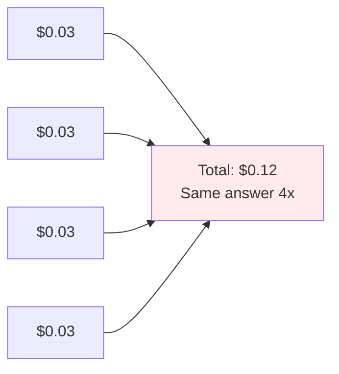
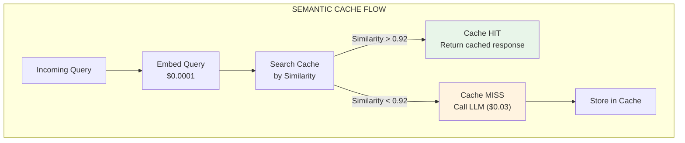
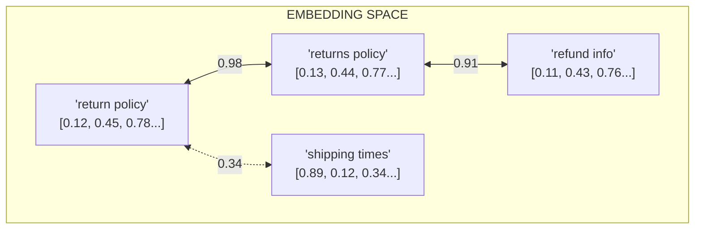
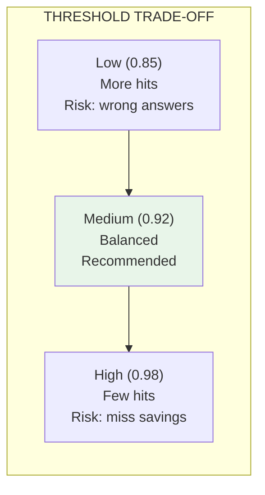
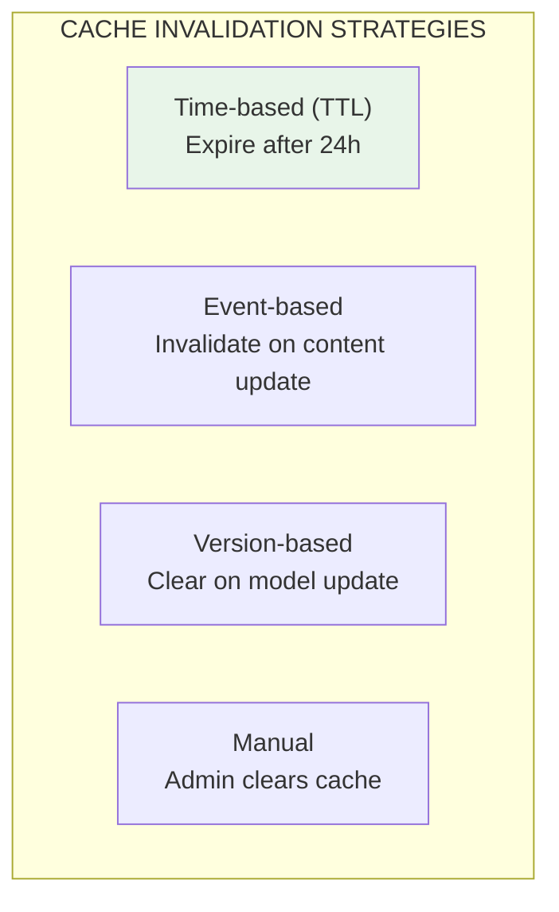

# Lesson 11.17: Semantic Caching Deep Dive

> **Duration**: 35 min | **Section**: C - Token Economics

## 🎯 The Problem (3-5 min)

Users keep asking variations of the same question:

```
User A: "What's the return policy?"
User B: "What is your return policy?"
User C: "Returns policy please"
User D: "How do I return something?"
```

You pay for **four LLM calls** that produce the **same answer**.



**Semantic caching**: Pay once, serve infinitely.

---

## 🔍 Under the Hood: How Semantic Caching Works



### Key Insight

- **Exact matching**: "return policy" ≠ "returns policy"
- **Semantic matching**: "return policy" ≈ "returns policy" (0.98 similarity)

---

## 🔍 The Embedding Space



Similar questions cluster together. Different topics are far apart.

---

## 🔍 Production Implementation

### Option 1: In-Memory (Development)

```python
import numpy as np
from dataclasses import dataclass
from openai import OpenAI
from typing import Optional
import hashlib

client = OpenAI()

@dataclass
class CacheEntry:
    """Single cache entry."""
    question: str
    embedding: list[float]
    response: str
    hit_count: int = 0
    
class InMemorySemanticCache:
    """Development-grade semantic cache."""
    
    def __init__(
        self, 
        similarity_threshold: float = 0.92,
        max_entries: int = 10000
    ):
        self.threshold = similarity_threshold
        self.max_entries = max_entries
        self.cache: dict[str, CacheEntry] = {}
        self.embeddings_matrix = None  # For batch similarity
    
    def _embed(self, text: str) -> list[float]:
        """Get embedding for text."""
        result = client.embeddings.create(
            model="text-embedding-3-small",
            input=text
        )
        return result.data[0].embedding
    
    def _cosine_similarity(self, a: list[float], b: list[float]) -> float:
        """Compute cosine similarity."""
        a, b = np.array(a), np.array(b)
        return float(np.dot(a, b) / (np.linalg.norm(a) * np.linalg.norm(b)))
    
    def _find_similar(self, embedding: list[float]) -> Optional[CacheEntry]:
        """Find most similar cached entry."""
        best_match = None
        best_similarity = 0.0
        
        for entry in self.cache.values():
            similarity = self._cosine_similarity(embedding, entry.embedding)
            
            if similarity > best_similarity:
                best_similarity = similarity
                best_match = entry
        
        if best_similarity >= self.threshold:
            return best_match
        
        return None
    
    def get(self, question: str) -> Optional[str]:
        """Get cached response for similar question."""
        embedding = self._embed(question)
        
        entry = self._find_similar(embedding)
        
        if entry:
            entry.hit_count += 1
            return entry.response
        
        return None
    
    def set(self, question: str, response: str):
        """Cache question-response pair."""
        # Evict if at capacity
        if len(self.cache) >= self.max_entries:
            self._evict_lru()
        
        embedding = self._embed(question)
        key = hashlib.md5(question.encode()).hexdigest()
        
        self.cache[key] = CacheEntry(
            question=question,
            embedding=embedding,
            response=response
        )
    
    def _evict_lru(self):
        """Remove least recently used entry."""
        if not self.cache:
            return
        
        # Remove entry with lowest hit count
        min_key = min(self.cache, key=lambda k: self.cache[k].hit_count)
        del self.cache[min_key]
    
    def stats(self) -> dict:
        """Get cache statistics."""
        return {
            "entries": len(self.cache),
            "max_entries": self.max_entries,
            "total_hits": sum(e.hit_count for e in self.cache.values())
        }
```

### Option 2: Redis + Vector Search (Production)

```python
import redis
import json
import numpy as np
from redis.commands.search.field import VectorField, TextField
from redis.commands.search.indexDefinition import IndexDefinition, IndexType
from redis.commands.search.query import Query

class RedisSemanticCache:
    """Production-grade semantic cache with Redis."""
    
    def __init__(
        self,
        redis_url: str,
        similarity_threshold: float = 0.92,
        index_name: str = "semantic_cache"
    ):
        self.redis = redis.from_url(redis_url)
        self.threshold = similarity_threshold
        self.index_name = index_name
        self._ensure_index()
    
    def _ensure_index(self):
        """Create vector index if not exists."""
        try:
            self.redis.ft(self.index_name).info()
        except:
            # Create index
            schema = (
                TextField("question"),
                TextField("response"),
                VectorField(
                    "embedding",
                    "FLAT",
                    {
                        "TYPE": "FLOAT32",
                        "DIM": 1536,
                        "DISTANCE_METRIC": "COSINE"
                    }
                )
            )
            
            self.redis.ft(self.index_name).create_index(
                schema,
                definition=IndexDefinition(
                    prefix=["cache:"],
                    index_type=IndexType.HASH
                )
            )
    
    def _embed(self, text: str) -> list[float]:
        """Get embedding."""
        result = client.embeddings.create(
            model="text-embedding-3-small",
            input=text
        )
        return result.data[0].embedding
    
    def get(self, question: str) -> Optional[str]:
        """Search for similar cached question."""
        embedding = self._embed(question)
        
        # Vector search query
        query = (
            Query(f"*=>[KNN 1 @embedding $vec AS score]")
            .return_fields("question", "response", "score")
            .dialect(2)
        )
        
        results = self.redis.ft(self.index_name).search(
            query,
            query_params={
                "vec": np.array(embedding, dtype=np.float32).tobytes()
            }
        )
        
        if results.docs:
            doc = results.docs[0]
            score = float(doc.score)
            similarity = 1 - score  # Cosine distance to similarity
            
            if similarity >= self.threshold:
                return doc.response
        
        return None
    
    def set(self, question: str, response: str):
        """Store in cache."""
        embedding = self._embed(question)
        key = f"cache:{hashlib.md5(question.encode()).hexdigest()}"
        
        self.redis.hset(key, mapping={
            "question": question,
            "response": response,
            "embedding": np.array(embedding, dtype=np.float32).tobytes()
        })
        
        # Optional: set TTL
        self.redis.expire(key, 86400 * 7)  # 7 days
```

### Option 3: AI Gateway (Easiest)

```python
# Using Portkey AI Gateway (built-in semantic caching)
import portkey

portkey.config(
    api_key="pk-xxx",
    cache_enabled=True,
    cache_type="semantic",
    cache_ttl=86400
)

# Automatically caches semantically similar queries
response = portkey.chat.completions.create(
    model="gpt-4o",
    messages=[{"role": "user", "content": "What's the return policy?"}]
)

# Second call with similar question - served from cache
response = portkey.chat.completions.create(
    model="gpt-4o",
    messages=[{"role": "user", "content": "Return policy please?"}]
)  # Cache hit!
```

---

## 🔍 Tuning the Similarity Threshold



### Finding the Right Threshold

```python
def analyze_threshold(test_pairs: list[tuple[str, str, bool]]):
    """
    Test different thresholds.
    test_pairs: [(question1, question2, should_match)]
    """
    cache = InMemorySemanticCache()
    
    for threshold in [0.85, 0.88, 0.90, 0.92, 0.95, 0.98]:
        cache.threshold = threshold
        
        true_positives = 0
        false_positives = 0
        false_negatives = 0
        
        for q1, q2, should_match in test_pairs:
            # Cache q1
            cache.cache.clear()
            cache.set(q1, "Response to " + q1)
            
            # Check if q2 matches
            hit = cache.get(q2) is not None
            
            if hit and should_match:
                true_positives += 1
            elif hit and not should_match:
                false_positives += 1
            elif not hit and should_match:
                false_negatives += 1
        
        print(f"Threshold {threshold}:")
        print(f"  True positives: {true_positives}")
        print(f"  False positives: {false_positives}")
        print(f"  False negatives: {false_negatives}")

# Test data
test_pairs = [
    ("What's the return policy?", "Return policy?", True),
    ("What's the return policy?", "What is your return policy?", True),
    ("What's the return policy?", "How do I return an item?", True),
    ("What's the return policy?", "What's the shipping cost?", False),
    ("What's the return policy?", "Can I get a refund?", True),  # Edge case
]

analyze_threshold(test_pairs)
```

### Recommended Starting Points

| Use Case | Threshold | Rationale |
|----------|-----------|-----------|
| FAQ bot | 0.90 | Many similar phrasings |
| Technical docs | 0.94 | Precision matters |
| Customer service | 0.92 | Balanced |
| Code assistant | 0.96 | Context-sensitive |

---

## 🔍 Cache Invalidation



### Implementation

```python
class CacheWithInvalidation:
    """Semantic cache with invalidation support."""
    
    def __init__(self, redis_url: str):
        self.redis = redis.from_url(redis_url)
        self.version = "v1"  # Bump on model changes
    
    def _key(self, question: str) -> str:
        return f"cache:{self.version}:{hashlib.md5(question.encode()).hexdigest()}"
    
    def set_with_ttl(self, question: str, response: str, ttl_seconds: int = 86400):
        """Cache with time-to-live."""
        # ... store response
        self.redis.expire(self._key(question), ttl_seconds)
    
    def set_with_tags(self, question: str, response: str, tags: list[str]):
        """Cache with tags for group invalidation."""
        key = self._key(question)
        # ... store response
        
        # Track tags
        for tag in tags:
            self.redis.sadd(f"tag:{tag}", key)
    
    def invalidate_by_tag(self, tag: str):
        """Invalidate all entries with tag."""
        keys = self.redis.smembers(f"tag:{tag}")
        
        if keys:
            self.redis.delete(*keys)
            self.redis.delete(f"tag:{tag}")
    
    def bump_version(self, new_version: str):
        """Invalidate all cache by version bump."""
        self.version = new_version
        # Old keys become orphaned and expire naturally

# Usage
cache = CacheWithInvalidation("redis://localhost")

# Tag entries by topic
cache.set_with_tags(
    "What's the return policy?",
    "Our return policy is...",
    tags=["returns", "policies"]
)

# When return policy changes:
cache.invalidate_by_tag("returns")
```

---

## 🔍 Monitoring Cache Performance

```python
from dataclasses import dataclass
from datetime import datetime
import statistics

@dataclass
class CacheMetrics:
    """Track cache performance."""
    hits: int = 0
    misses: int = 0
    latencies_ms: list = None
    
    def __post_init__(self):
        if self.latencies_ms is None:
            self.latencies_ms = []
    
    @property
    def hit_rate(self) -> float:
        total = self.hits + self.misses
        return self.hits / total if total > 0 else 0.0
    
    @property
    def avg_latency_ms(self) -> float:
        return statistics.mean(self.latencies_ms) if self.latencies_ms else 0.0
    
    @property
    def cost_savings(self) -> float:
        """Estimated cost savings."""
        # Cache hit costs ~$0.0001 (embedding only)
        # Cache miss costs ~$0.03 (full LLM call)
        return self.hits * (0.03 - 0.0001)
    
    def to_dict(self) -> dict:
        return {
            "hits": self.hits,
            "misses": self.misses,
            "hit_rate": f"{self.hit_rate:.1%}",
            "avg_latency_ms": f"{self.avg_latency_ms:.1f}",
            "cost_savings": f"${self.cost_savings:.2f}"
        }

class MonitoredCache:
    """Cache with built-in monitoring."""
    
    def __init__(self, cache: InMemorySemanticCache):
        self.cache = cache
        self.metrics = CacheMetrics()
    
    def get(self, question: str) -> Optional[str]:
        start = datetime.now()
        
        result = self.cache.get(question)
        
        latency = (datetime.now() - start).total_seconds() * 1000
        self.metrics.latencies_ms.append(latency)
        
        if result:
            self.metrics.hits += 1
        else:
            self.metrics.misses += 1
        
        return result
    
    def set(self, question: str, response: str):
        self.cache.set(question, response)
    
    def report(self) -> dict:
        return self.metrics.to_dict()

# Usage
cache = MonitoredCache(InMemorySemanticCache())

# After running for a while...
print(cache.report())
# {
#     "hits": 4500,
#     "misses": 5500,
#     "hit_rate": "45.0%",
#     "avg_latency_ms": "12.3",
#     "cost_savings": "$134.55"
# }
```

---

## 💻 Practice: Build a Semantic Cache

```python
# Exercise: Implement production semantic caching

# Requirements:
# 1. Similarity threshold of 0.92
# 2. TTL of 24 hours
# 3. Tag-based invalidation
# 4. Metrics tracking

# Starter code:
class YourSemanticCache:
    def __init__(self):
        # TODO: Initialize
        pass
    
    def get(self, question: str) -> Optional[str]:
        # TODO: Search cache
        pass
    
    def set(self, question: str, response: str, tags: list[str] = None):
        # TODO: Store with TTL and tags
        pass
    
    def invalidate(self, tag: str):
        # TODO: Clear by tag
        pass
    
    def metrics(self) -> dict:
        # TODO: Return hit rate, savings
        pass

# Test with:
test_questions = [
    "What's the return policy?",
    "What is your return policy?",
    "Returns policy",
    "How do I return something?",
    "What's the shipping cost?",  # Different topic
]
```

---

## 🔑 Key Takeaways

| Concept | Value |
|---------|-------|
| **Semantic caching** | Cache by meaning, not exact text |
| **Typical hit rate** | 30-60% for FAQ-style queries |
| **Cost per hit** | ~$0.0001 (embedding only) |
| **Recommended threshold** | 0.92 (adjust based on use case) |
| **Invalidation** | Use TTL + tags for control |

---

## ❓ Common Questions

| Question | Answer |
|----------|--------|
| What if cached answer is wrong? | Use lower threshold or TTL |
| How big can cache get? | Redis handles millions of vectors |
| Multi-language support? | Embeddings work across languages |
| Cache warming? | Pre-populate with common queries |

---

**Next**: 11.18 - Token Budgets (Per-User Quotas)
