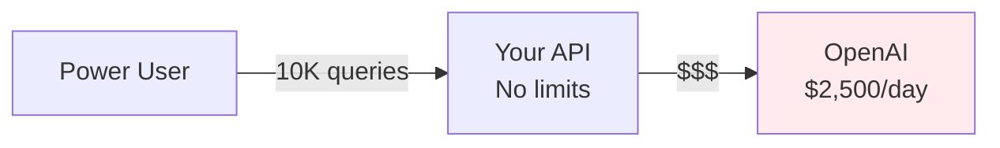
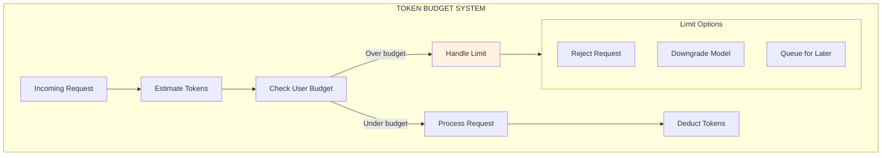
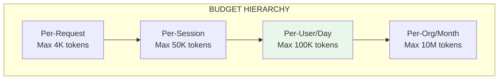
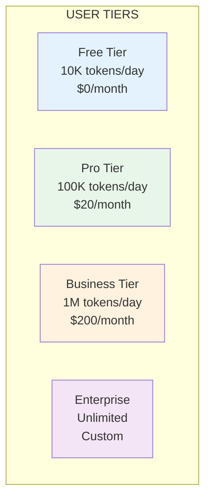
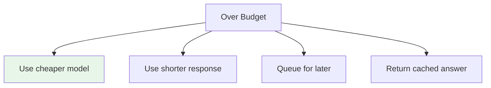

# Lesson 11.18: Token Budgets

> **Duration**: 30 min | **Section**: C - Token Economics

## 🎯 The Problem (3-5 min)

One power user discovers your AI chatbot.

```
Monday:    100 queries
Tuesday:   500 queries  
Wednesday: 2,000 queries
Thursday:  10,000 queries
```

Your monthly bill explodes.



**Token budgets**: Fair usage, predictable costs.

---

## 🔍 Under the Hood: Budget Architecture



---

## 🔍 Budget Types



### When to Use Each

| Budget Type | Purpose | Example Limit |
|-------------|---------|---------------|
| **Per-request** | Prevent single huge queries | 4,000 tokens |
| **Per-session** | Prevent long conversations | 50,000 tokens |
| **Per-user/day** | Fair daily usage | 100,000 tokens |
| **Per-org/month** | Billing/SLA limits | 10,000,000 tokens |

---

## 🔍 Implementation: Redis-Based Budgets

```python
import redis
from datetime import datetime, timedelta
from dataclasses import dataclass
from enum import Enum
from typing import Optional

class BudgetPeriod(Enum):
    HOURLY = "hourly"
    DAILY = "daily"
    MONTHLY = "monthly"

@dataclass
class BudgetConfig:
    """Budget configuration for a tier."""
    per_request_limit: int = 4000
    per_session_limit: int = 50000
    daily_limit: int = 100000
    monthly_limit: int = 1000000

@dataclass
class BudgetResult:
    """Result of budget check."""
    allowed: bool
    remaining: int
    limit: int
    reset_at: Optional[datetime] = None
    message: str = ""

class TokenBudgetManager:
    """Comprehensive token budget management."""
    
    def __init__(self, redis_url: str):
        self.redis = redis.from_url(redis_url)
    
    def _get_key(self, user_id: str, period: BudgetPeriod) -> str:
        """Generate Redis key for budget tracking."""
        now = datetime.now()
        
        if period == BudgetPeriod.HOURLY:
            suffix = now.strftime("%Y-%m-%d-%H")
            ttl = 7200  # 2 hours
        elif period == BudgetPeriod.DAILY:
            suffix = now.strftime("%Y-%m-%d")
            ttl = 172800  # 2 days
        else:  # MONTHLY
            suffix = now.strftime("%Y-%m")
            ttl = 2764800  # 32 days
        
        return f"budget:{period.value}:{user_id}:{suffix}", ttl
    
    def check_budget(
        self,
        user_id: str,
        estimated_tokens: int,
        config: BudgetConfig
    ) -> BudgetResult:
        """Check if user has budget for request."""
        
        # Check per-request limit
        if estimated_tokens > config.per_request_limit:
            return BudgetResult(
                allowed=False,
                remaining=0,
                limit=config.per_request_limit,
                message=f"Request exceeds max {config.per_request_limit} tokens"
            )
        
        # Check daily limit
        daily_key, ttl = self._get_key(user_id, BudgetPeriod.DAILY)
        daily_used = int(self.redis.get(daily_key) or 0)
        
        if daily_used + estimated_tokens > config.daily_limit:
            return BudgetResult(
                allowed=False,
                remaining=config.daily_limit - daily_used,
                limit=config.daily_limit,
                reset_at=self._next_reset(BudgetPeriod.DAILY),
                message="Daily token limit reached"
            )
        
        # Check monthly limit
        monthly_key, _ = self._get_key(user_id, BudgetPeriod.MONTHLY)
        monthly_used = int(self.redis.get(monthly_key) or 0)
        
        if monthly_used + estimated_tokens > config.monthly_limit:
            return BudgetResult(
                allowed=False,
                remaining=config.monthly_limit - monthly_used,
                limit=config.monthly_limit,
                reset_at=self._next_reset(BudgetPeriod.MONTHLY),
                message="Monthly token limit reached"
            )
        
        return BudgetResult(
            allowed=True,
            remaining=config.daily_limit - daily_used - estimated_tokens,
            limit=config.daily_limit
        )
    
    def deduct(self, user_id: str, actual_tokens: int):
        """Deduct tokens from all applicable budgets."""
        # Deduct from daily
        daily_key, daily_ttl = self._get_key(user_id, BudgetPeriod.DAILY)
        self.redis.incrby(daily_key, actual_tokens)
        self.redis.expire(daily_key, daily_ttl)
        
        # Deduct from monthly
        monthly_key, monthly_ttl = self._get_key(user_id, BudgetPeriod.MONTHLY)
        self.redis.incrby(monthly_key, actual_tokens)
        self.redis.expire(monthly_key, monthly_ttl)
    
    def get_usage(self, user_id: str, config: BudgetConfig) -> dict:
        """Get current usage for user."""
        daily_key, _ = self._get_key(user_id, BudgetPeriod.DAILY)
        monthly_key, _ = self._get_key(user_id, BudgetPeriod.MONTHLY)
        
        daily_used = int(self.redis.get(daily_key) or 0)
        monthly_used = int(self.redis.get(monthly_key) or 0)
        
        return {
            "daily": {
                "used": daily_used,
                "limit": config.daily_limit,
                "remaining": config.daily_limit - daily_used,
                "percentage": round(daily_used / config.daily_limit * 100, 1)
            },
            "monthly": {
                "used": monthly_used,
                "limit": config.monthly_limit,
                "remaining": config.monthly_limit - monthly_used,
                "percentage": round(monthly_used / config.monthly_limit * 100, 1)
            }
        }
    
    def _next_reset(self, period: BudgetPeriod) -> datetime:
        """Calculate next reset time."""
        now = datetime.now()
        
        if period == BudgetPeriod.DAILY:
            return datetime(now.year, now.month, now.day) + timedelta(days=1)
        else:
            next_month = now.month + 1 if now.month < 12 else 1
            next_year = now.year if now.month < 12 else now.year + 1
            return datetime(next_year, next_month, 1)
```

---

## 🔍 Tiered Limits



### Implementation

```python
from enum import Enum

class UserTier(Enum):
    FREE = "free"
    PRO = "pro"
    BUSINESS = "business"
    ENTERPRISE = "enterprise"

# Tier configurations
TIER_CONFIGS = {
    UserTier.FREE: BudgetConfig(
        per_request_limit=2000,
        per_session_limit=20000,
        daily_limit=10000,
        monthly_limit=100000
    ),
    UserTier.PRO: BudgetConfig(
        per_request_limit=4000,
        per_session_limit=50000,
        daily_limit=100000,
        monthly_limit=1000000
    ),
    UserTier.BUSINESS: BudgetConfig(
        per_request_limit=8000,
        per_session_limit=200000,
        daily_limit=1000000,
        monthly_limit=10000000
    ),
    UserTier.ENTERPRISE: BudgetConfig(
        per_request_limit=16000,
        per_session_limit=500000,
        daily_limit=10000000,
        monthly_limit=100000000
    )
}

def get_user_tier(user_id: str) -> UserTier:
    """Look up user's tier from database."""
    # In production, query your database
    return UserTier.PRO

def query_with_budget(user_id: str, question: str) -> dict:
    """Query with budget enforcement."""
    budget_manager = TokenBudgetManager("redis://localhost")
    
    # Get user's tier and config
    tier = get_user_tier(user_id)
    config = TIER_CONFIGS[tier]
    
    # Estimate tokens (rough: 1.3 tokens per word + expected response)
    estimated_tokens = int(len(question.split()) * 1.3) + 500
    
    # Check budget
    result = budget_manager.check_budget(user_id, estimated_tokens, config)
    
    if not result.allowed:
        return {
            "error": result.message,
            "remaining": result.remaining,
            "reset_at": result.reset_at.isoformat() if result.reset_at else None,
            "upgrade_url": f"/pricing?tier={tier.value}"
        }
    
    # Process request
    response = call_llm(question)
    
    # Get actual tokens used
    actual_tokens = response.usage.total_tokens
    
    # Deduct from budget
    budget_manager.deduct(user_id, actual_tokens)
    
    return {
        "response": response.choices[0].message.content,
        "tokens_used": actual_tokens,
        "remaining": result.remaining - actual_tokens
    }
```

---

## 🔍 Graceful Degradation

Instead of hard rejection, offer alternatives:



### Implementation

```python
class GracefulBudgetHandler:
    """Handle over-budget scenarios gracefully."""
    
    def __init__(self, budget_manager: TokenBudgetManager):
        self.budget = budget_manager
    
    def handle_request(
        self,
        user_id: str,
        question: str,
        config: BudgetConfig
    ) -> dict:
        """Handle request with graceful degradation."""
        estimated = int(len(question.split()) * 1.3) + 500
        
        # Check full budget
        result = self.budget.check_budget(user_id, estimated, config)
        
        if result.allowed:
            return self._full_response(user_id, question, estimated)
        
        # Over budget - try degradation strategies
        
        # Strategy 1: Use cached response
        cached = self._check_cache(question)
        if cached:
            return {
                "response": cached,
                "degraded": True,
                "reason": "Served from cache (budget exceeded)"
            }
        
        # Strategy 2: Use cheaper model with shorter response
        if result.remaining > 500:  # Some budget left
            return self._degraded_response(user_id, question, result.remaining)
        
        # Strategy 3: Queue for later
        if self._can_queue(user_id):
            return self._queue_request(user_id, question)
        
        # No options left
        return {
            "error": "Daily limit reached",
            "remaining": 0,
            "reset_at": result.reset_at.isoformat()
        }
    
    def _full_response(self, user_id: str, question: str, tokens: int) -> dict:
        """Full quality response."""
        response = call_llm(question, model="gpt-4o")
        self.budget.deduct(user_id, response.usage.total_tokens)
        return {"response": response.choices[0].message.content}
    
    def _degraded_response(
        self, 
        user_id: str, 
        question: str, 
        max_tokens: int
    ) -> dict:
        """Reduced quality response."""
        response = call_llm(
            question,
            model="gpt-4o-mini",  # Cheaper model
            max_tokens=min(max_tokens, 200)  # Shorter response
        )
        
        self.budget.deduct(user_id, response.usage.total_tokens)
        
        return {
            "response": response.choices[0].message.content,
            "degraded": True,
            "reason": "Budget low - using efficient mode"
        }
    
    def _check_cache(self, question: str) -> Optional[str]:
        """Check semantic cache."""
        # ... implementation
        pass
    
    def _can_queue(self, user_id: str) -> bool:
        """Check if user can queue requests."""
        return True  # Implement queue logic
    
    def _queue_request(self, user_id: str, question: str) -> dict:
        """Queue request for later processing."""
        # Add to queue
        return {
            "queued": True,
            "message": "Request queued for when budget resets",
            "estimated_processing": "Tomorrow 00:00 UTC"
        }
```

---

## 🔍 Budget Alerts

```python
from dataclasses import dataclass
from typing import Callable

@dataclass
class BudgetAlert:
    """Budget alert configuration."""
    threshold_percent: int  # 80 = 80%
    callback: Callable[[str, dict], None]
    
class BudgetAlertManager:
    """Send alerts when approaching limits."""
    
    def __init__(self, budget_manager: TokenBudgetManager):
        self.budget = budget_manager
        self.alerts = [
            BudgetAlert(50, self._send_50_percent_alert),
            BudgetAlert(80, self._send_80_percent_alert),
            BudgetAlert(100, self._send_limit_reached_alert)
        ]
        self.sent_alerts: set = set()  # Track sent alerts
    
    def check_and_alert(self, user_id: str, config: BudgetConfig):
        """Check usage and send alerts if thresholds crossed."""
        usage = self.budget.get_usage(user_id, config)
        daily_percent = usage["daily"]["percentage"]
        
        for alert in self.alerts:
            alert_key = f"{user_id}:{alert.threshold_percent}:{usage['daily']['used']}"
            
            if daily_percent >= alert.threshold_percent:
                if alert_key not in self.sent_alerts:
                    alert.callback(user_id, usage)
                    self.sent_alerts.add(alert_key)
    
    def _send_50_percent_alert(self, user_id: str, usage: dict):
        """Send 50% usage alert."""
        send_email(
            user_id,
            subject="You've used 50% of your daily token budget",
            body=f"Used: {usage['daily']['used']:,} / {usage['daily']['limit']:,} tokens"
        )
    
    def _send_80_percent_alert(self, user_id: str, usage: dict):
        """Send 80% warning."""
        send_email(
            user_id,
            subject="⚠️ 80% of daily token budget used",
            body="Consider upgrading your plan for higher limits."
        )
    
    def _send_limit_reached_alert(self, user_id: str, usage: dict):
        """Send limit reached alert."""
        send_email(
            user_id,
            subject="🚫 Daily token limit reached",
            body=f"Limit resets at midnight UTC. Upgrade for higher limits."
        )
```

---

## 🔍 Usage Dashboard API

```python
from fastapi import FastAPI, Depends
from datetime import datetime

app = FastAPI()

@app.get("/api/usage")
async def get_usage(user_id: str = Depends(get_current_user)):
    """Get user's token usage."""
    budget = TokenBudgetManager("redis://localhost")
    tier = get_user_tier(user_id)
    config = TIER_CONFIGS[tier]
    
    usage = budget.get_usage(user_id, config)
    
    return {
        "tier": tier.value,
        "usage": usage,
        "limits": {
            "per_request": config.per_request_limit,
            "daily": config.daily_limit,
            "monthly": config.monthly_limit
        },
        "cost_estimate": {
            "daily": round(usage["daily"]["used"] * 0.00003, 2),  # $0.03/1K
            "monthly": round(usage["monthly"]["used"] * 0.00003, 2)
        },
        "reset_times": {
            "daily": datetime.now().replace(
                hour=0, minute=0, second=0
            ).isoformat() + "+1 day",
            "monthly": "1st of next month"
        }
    }

@app.get("/api/usage/history")
async def get_usage_history(
    user_id: str = Depends(get_current_user),
    days: int = 7
):
    """Get usage history."""
    budget = TokenBudgetManager("redis://localhost")
    
    history = []
    for i in range(days):
        date = datetime.now() - timedelta(days=i)
        key = f"budget:daily:{user_id}:{date.strftime('%Y-%m-%d')}"
        used = int(budget.redis.get(key) or 0)
        history.append({
            "date": date.strftime("%Y-%m-%d"),
            "tokens_used": used
        })
    
    return {"history": history}
```

---

## 💻 Practice: Implement Token Budgets

```python
# Exercise: Build a complete budget system

# Requirements:
# 1. Per-request limit: 4000 tokens
# 2. Daily limit: 100,000 tokens
# 3. Tiered limits (free, pro, business)
# 4. Graceful degradation when over budget
# 5. Usage alerts at 80%

class YourBudgetSystem:
    def __init__(self, redis_url: str):
        # TODO: Initialize
        pass
    
    def check(self, user_id: str, estimated_tokens: int) -> BudgetResult:
        # TODO: Check all budget types
        pass
    
    def deduct(self, user_id: str, actual_tokens: int):
        # TODO: Deduct from budgets
        pass
    
    def get_usage(self, user_id: str) -> dict:
        # TODO: Return usage stats
        pass
    
    def handle_over_budget(self, user_id: str, question: str) -> dict:
        # TODO: Graceful degradation
        pass

# Test scenarios:
# 1. Normal usage - should process
# 2. Single large request - should reject
# 3. Many small requests - should hit daily limit
# 4. Over budget - should degrade gracefully
```

---

## 🔑 Key Takeaways

| Budget Type | Purpose | Typical Limit |
|-------------|---------|---------------|
| **Per-request** | Prevent abuse | 4K tokens |
| **Daily** | Fair usage | 100K tokens |
| **Monthly** | Billing | 1M tokens |
| **Tiered** | Monetization | Varies |

---

## ❓ Common Questions

| Question | Answer |
|----------|--------|
| How to estimate tokens? | `len(text.split()) * 1.3 + response_buffer` |
| Should limits be hard or soft? | Soft (degrade) for UX, hard for billing |
| How to handle spikes? | Allow burst with rate limiting |
| Reset time? | Midnight UTC for global consistency |

---

**Next**: 11.19 - Token Economics Q&A (Section Recap)
