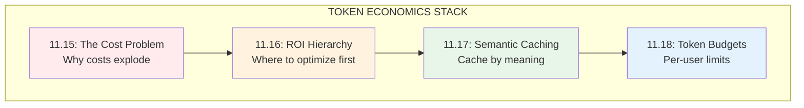
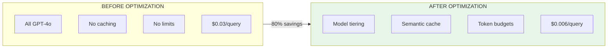

# Lesson 11.19: Token Economics Q&A

> **Duration**: 15 min | **Section**: C - Token Economics (Recap)

## 📋 Section C Summary

You learned to control LLM costs in production.



---

## 🎯 What You Can Now Build

| Capability | Implementation |
|------------|----------------|
| **Cost prediction** | Estimate costs before launch |
| **Semantic caching** | Cache similar queries (30-60% savings) |
| **Model routing** | Cheap models for simple queries |
| **Token budgets** | Per-user quotas with tiers |
| **Graceful degradation** | Degrade instead of reject |

---

## 📊 Cost Optimization Cheat Sheet



---

## 🔑 Key Formulas

### Cost Estimation

```python
def estimate_monthly_cost(
    daily_users: int,
    queries_per_user: float,
    avg_tokens_per_query: int,
    input_cost_per_1k: float = 0.0025,
    output_cost_per_1k: float = 0.01
) -> float:
    """Estimate monthly LLM costs."""
    
    # Daily queries
    daily_queries = daily_users * queries_per_user
    
    # Monthly queries (30 days)
    monthly_queries = daily_queries * 30
    
    # Token costs (assuming 60% input, 40% output)
    input_tokens = monthly_queries * avg_tokens_per_query * 0.6
    output_tokens = monthly_queries * avg_tokens_per_query * 0.4
    
    input_cost = (input_tokens / 1000) * input_cost_per_1k
    output_cost = (output_tokens / 1000) * output_cost_per_1k
    
    return input_cost + output_cost

# Example: 10K daily users, 5 queries each, 1500 tokens avg
cost = estimate_monthly_cost(10000, 5.0, 1500)
print(f"Estimated monthly cost: ${cost:,.2f}")
# Output: Estimated monthly cost: $6,750.00
```

### Savings Calculator

```python
def calculate_savings(
    baseline_cost: float,
    cache_hit_rate: float = 0.40,
    cheap_model_rate: float = 0.50,
    cheap_model_discount: float = 0.94  # 94% cheaper
) -> dict:
    """Calculate cost after optimizations."""
    
    # After caching: X% queries are free
    cost_after_cache = baseline_cost * (1 - cache_hit_rate)
    
    # After model tiering: Y% use cheap model
    expensive_portion = cost_after_cache * (1 - cheap_model_rate)
    cheap_portion = cost_after_cache * cheap_model_rate * (1 - cheap_model_discount)
    cost_after_tiering = expensive_portion + cheap_portion
    
    return {
        "baseline": baseline_cost,
        "after_caching": cost_after_cache,
        "after_tiering": cost_after_tiering,
        "total_savings": baseline_cost - cost_after_tiering,
        "savings_percent": (1 - cost_after_tiering / baseline_cost) * 100
    }

# Example
savings = calculate_savings(6750)
print(f"After optimization: ${savings['after_tiering']:,.2f}")
print(f"Savings: {savings['savings_percent']:.1f}%")
# Output:
# After optimization: $2,228.00
# Savings: 67.0%
```

---

## ❓ Frequently Asked Questions

### Semantic Caching

| Question | Answer |
|----------|--------|
| What similarity threshold to use? | Start at 0.92, tune based on accuracy |
| How to handle cache invalidation? | TTL (24h) + event-based for content updates |
| Cache warming? | Pre-populate with top 100 FAQs |
| Multi-tenant caching? | Separate cache per tenant or tag entries |

### Model Tiering

| Question | Answer |
|----------|--------|
| How to classify query complexity? | Start with heuristics, refine with ML |
| What if cheap model gives bad answer? | Fallback to expensive, log for training |
| How much cheaper is GPT-4o-mini? | ~17x cheaper per input token |
| Should I use Claude vs GPT? | Test both, compare quality/cost ratio |

### Token Budgets

| Question | Answer |
|----------|--------|
| Hard or soft limits? | Soft for UX, hard for billing |
| How to estimate tokens? | `words × 1.3 + response_buffer` |
| Reset time? | Midnight UTC for consistency |
| Burst handling? | Allow 2x burst with sliding window |

---

## 🏗️ Complete Cost Optimization Pipeline

```python
from dataclasses import dataclass
from typing import Optional

@dataclass
class OptimizedQuery:
    """Result of cost-optimized query."""
    response: str
    source: str  # "cache", "gpt-4o-mini", "gpt-4o"
    tokens_used: int
    cost: float
    cached: bool
    degraded: bool

class CostOptimizedPipeline:
    """Complete cost optimization pipeline."""
    
    def __init__(
        self,
        redis_url: str,
        cache_threshold: float = 0.92
    ):
        self.cache = SemanticCache(threshold=cache_threshold)
        self.router = QueryRouter()
        self.budget = TokenBudgetManager(redis_url)
        self.tier_configs = TIER_CONFIGS
    
    def query(
        self,
        user_id: str,
        question: str,
        context: Optional[str] = None
    ) -> OptimizedQuery:
        """Process query with all optimizations."""
        
        # 1. Get user's tier
        tier = get_user_tier(user_id)
        config = self.tier_configs[tier]
        
        # 2. Estimate tokens
        estimated = self._estimate_tokens(question, context)
        
        # 3. Check budget
        budget_result = self.budget.check_budget(user_id, estimated, config)
        
        if not budget_result.allowed:
            return self._handle_over_budget(user_id, question, context)
        
        # 4. Check semantic cache
        cache_key = f"{question}:{context[:100] if context else ''}"
        cached_response = self.cache.get(cache_key)
        
        if cached_response:
            return OptimizedQuery(
                response=cached_response,
                source="cache",
                tokens_used=0,
                cost=0.0001,  # Embedding cost only
                cached=True,
                degraded=False
            )
        
        # 5. Route to appropriate model
        model = self.router.get_model(question)
        
        # 6. Call LLM
        response = self._call_llm(question, context, model)
        
        # 7. Cache response
        self.cache.set(cache_key, response.content)
        
        # 8. Deduct from budget
        self.budget.deduct(user_id, response.tokens)
        
        # 9. Calculate cost
        cost = self._calculate_cost(model, response.tokens)
        
        return OptimizedQuery(
            response=response.content,
            source=model,
            tokens_used=response.tokens,
            cost=cost,
            cached=False,
            degraded=False
        )
    
    def _estimate_tokens(self, question: str, context: Optional[str]) -> int:
        """Estimate tokens for request."""
        words = len(question.split())
        if context:
            words += len(context.split())
        return int(words * 1.3) + 500  # Buffer for response
    
    def _handle_over_budget(
        self,
        user_id: str,
        question: str,
        context: Optional[str]
    ) -> OptimizedQuery:
        """Graceful degradation when over budget."""
        # Try cache first
        cached = self.cache.get(f"{question}:{context[:100] if context else ''}")
        if cached:
            return OptimizedQuery(
                response=cached,
                source="cache",
                tokens_used=0,
                cost=0,
                cached=True,
                degraded=True
            )
        
        # Short response with cheapest model
        response = self._call_llm(question, None, "gpt-4o-mini", max_tokens=100)
        
        return OptimizedQuery(
            response=response.content + "\n\n[Shorter response due to usage limits]",
            source="gpt-4o-mini",
            tokens_used=response.tokens,
            cost=self._calculate_cost("gpt-4o-mini", response.tokens),
            cached=False,
            degraded=True
        )
    
    def _calculate_cost(self, model: str, tokens: int) -> float:
        """Calculate cost for model/tokens."""
        # Per 1K tokens (blended input/output)
        costs = {
            "gpt-4o": 0.03,
            "gpt-4o-mini": 0.002,
            "gpt-3.5-turbo": 0.001
        }
        return (tokens / 1000) * costs.get(model, 0.03)
    
    def _call_llm(
        self,
        question: str,
        context: Optional[str],
        model: str,
        max_tokens: int = 1000
    ):
        """Call LLM API."""
        # Implementation details...
        pass

    def get_stats(self, user_id: str) -> dict:
        """Get optimization stats for user."""
        tier = get_user_tier(user_id)
        config = self.tier_configs[tier]
        
        return {
            "cache": self.cache.stats(),
            "budget": self.budget.get_usage(user_id, config),
            "tier": tier.value
        }
```

---

## ✅ Section C Checklist

Before moving on, verify you can:

| Task | Status |
|------|--------|
| Estimate costs for your use case | ⬜ |
| Implement semantic caching | ⬜ |
| Set up model routing | ⬜ |
| Configure token budgets | ⬜ |
| Handle over-budget gracefully | ⬜ |
| Monitor cache hit rate | ⬜ |
| Set up usage alerts | ⬜ |

---

## 🧠 Quick Quiz

1. **What's the ROI hierarchy order?**
   - Answer: Caching → Model Tiering → Prompt Optimization → Token Budgets

2. **What similarity threshold for semantic cache?**
   - Answer: 0.92 (balanced precision/recall)

3. **How much cheaper is GPT-4o-mini vs GPT-4o?**
   - Answer: ~17x cheaper for input tokens

4. **What should happen when user exceeds budget?**
   - Answer: Graceful degradation (cache, cheaper model, shorter response)

5. **How to estimate tokens from text?**
   - Answer: `words × 1.3` (rough approximation)

---

## � Common Pitfalls

| Pitfall | Problem | Solution |
|---------|---------|----------|
| Cache threshold too low | False positives, wrong answers | Start at 0.92, tune based on accuracy |
| No cache invalidation | Stale responses after content changes | TTL + event-based invalidation |
| Cheap model for everything | Quality drops on complex queries | Route based on query complexity |
| Hard budget limits | Frustrated users mid-conversation | Soft limits with graceful degradation |
| No cost monitoring | Surprise bills | Set up billing alerts immediately |
| Ignoring output tokens | They cost 4x more than input | Include in budget calculations |

## 🔑 Key Takeaways

| Principle | Action |
|-----------|--------|
| **Measure first** | Know your baseline cost before optimizing |
| **Cache aggressively** | 30-60% savings from semantic caching |
| **Tier by complexity** | Simple queries → cheap models |
| **Budget gracefully** | Degrade, don't reject |
| **Monitor continuously** | Track cache hit rate, cost per query |

---

## �🚀 What's Next?

**Section D: Observability** - Now that you've optimized costs, you need visibility:

| Lesson | Topic |
|--------|-------|
| 11.20 | The Observability Problem |
| 11.21 | LangSmith (Tracing) |
| 11.22 | Langfuse (Open Source) |
| 11.23 | A/B Testing Prompts |
| 11.24 | Observability Q&A |

---

**Next**: 11.20 - The Observability Problem
