# Lesson 11.20: The Observability Problem

> **Duration**: 20 min | **Section**: D - Observability

## 🎯 The Problem (3-5 min)

Your AI assistant is in production. Users complain:

> "The bot gave me wrong information about returns."

You check the logs:

```
2024-01-15 14:32:15 INFO: User query processed
2024-01-15 14:32:16 INFO: Response sent
```

**That's it.** No trace of:
- What the user actually asked
- What context was retrieved
- What the LLM was prompted with
- Why it gave that answer

You're flying blind.

---

## 🔍 Under the Hood: The Black Box Problem


**Traditional logging doesn't capture**:
- Multi-step reasoning
- Retrieval decisions
- Token usage per step
- Latency breakdown
- LLM call parameters

---

## 🔍 What You Can't Debug

```mermaid
flowchart TD
    subgraph Issues["PRODUCTION ISSUES"]
        I1["❓ Why did it retrieve wrong docs?"]
        I2["❓ Why did it hallucinate?"]
        I3["❓ Why was it slow (5s)?"]
        I4["❓ Why did costs spike?"]
        I5["❓ Which prompt version works better?"]
    end
    
    style Issues fill:#FFEBEE
```



Without observability, you're guessing.

---

## 🔍 The LLM Observability Stack


---

## 🔍 What Good Observability Looks Like


**Now you can answer**:
- Why wrong docs? → Check relevance scores
- Why slow? → LLM call took 0.9s
- Why expensive? → Large context (1,200 tokens)

---

## 🔍 Key Observability Concepts

### 1. Traces

A **trace** is one complete request through your system.

```python
# Trace structure
trace = {
    "id": "trace_abc123",
    "timestamp": "2024-01-15T14:32:15Z",
    "duration_ms": 1200,
    "user_id": "user_456",
    "input": "What's the return policy?",
    "output": "You can return items within 30 days...",
    "spans": [...]  # Steps within the trace
}
```

### 2. Spans

A **span** is one step within a trace.

```python
# Spans within a trace
spans = [
    {
        "name": "retrieval",
        "duration_ms": 300,
        "input": "return policy",
        "output": ["doc1", "doc2", "doc3"],
        "metadata": {"top_k": 3, "scores": [0.85, 0.82, 0.79]}
    },
    {
        "name": "llm_call",
        "duration_ms": 900,
        "input": "You are a helpful assistant...",
        "output": "You can return items...",
        "metadata": {
            "model": "gpt-4o",
            "tokens_in": 1200,
            "tokens_out": 145,
            "cost": 0.045
        }
    }
]
```

### 3. Metrics

Aggregated data over time.

```python
metrics = {
    "latency_p50": 800,  # ms
    "latency_p99": 2500,
    "tokens_per_request": 1345,
    "cost_per_day": 450.00,
    "error_rate": 0.02,  # 2%
    "cache_hit_rate": 0.45
}
```

---

## 🔍 Observability Tools Comparison

| Tool | Type | Best For | Pricing |
|------|------|----------|---------|
| **LangSmith** | SaaS | LangChain users | Free tier + paid |
| **Langfuse** | Open source | Self-hosted control | Free (self-host) |
| **Weights & Biases** | SaaS | ML teams | Free tier + paid |
| **Phoenix** | Open source | Local development | Free |
| **Helicone** | SaaS | Simple logging | Free tier + paid |

---

## 🔍 Basic Observability Implementation

```python
import time
import uuid
from dataclasses import dataclass, field
from typing import Any, Optional
from datetime import datetime

@dataclass
class Span:
    """Single step in a trace."""
    name: str
    start_time: datetime = field(default_factory=datetime.now)
    end_time: Optional[datetime] = None
    input: Any = None
    output: Any = None
    metadata: dict = field(default_factory=dict)
    error: Optional[str] = None
    
    @property
    def duration_ms(self) -> float:
        if self.end_time:
            return (self.end_time - self.start_time).total_seconds() * 1000
        return 0

@dataclass
class Trace:
    """Complete request trace."""
    id: str = field(default_factory=lambda: str(uuid.uuid4()))
    start_time: datetime = field(default_factory=datetime.now)
    user_id: Optional[str] = None
    input: str = ""
    output: str = ""
    spans: list[Span] = field(default_factory=list)
    metadata: dict = field(default_factory=dict)
    
    def add_span(self, name: str) -> Span:
        span = Span(name=name)
        self.spans.append(span)
        return span
    
    @property
    def duration_ms(self) -> float:
        if self.spans:
            return sum(s.duration_ms for s in self.spans)
        return 0
    
    def to_dict(self) -> dict:
        return {
            "id": self.id,
            "timestamp": self.start_time.isoformat(),
            "duration_ms": self.duration_ms,
            "user_id": self.user_id,
            "input": self.input,
            "output": self.output,
            "spans": [
                {
                    "name": s.name,
                    "duration_ms": s.duration_ms,
                    "input": str(s.input)[:500],  # Truncate
                    "output": str(s.output)[:500],
                    "metadata": s.metadata,
                    "error": s.error
                }
                for s in self.spans
            ],
            "metadata": self.metadata
        }

class TracingContext:
    """Context manager for tracing."""
    
    def __init__(self, trace: Trace, span_name: str):
        self.trace = trace
        self.span_name = span_name
        self.span = None
    
    def __enter__(self) -> Span:
        self.span = self.trace.add_span(self.span_name)
        return self.span
    
    def __exit__(self, exc_type, exc_val, exc_tb):
        self.span.end_time = datetime.now()
        if exc_type:
            self.span.error = str(exc_val)

# Usage
def rag_query(question: str, user_id: str) -> str:
    trace = Trace(user_id=user_id, input=question)
    
    # Trace retrieval
    with TracingContext(trace, "retrieval") as span:
        span.input = question
        docs = retrieve_documents(question)
        span.output = [d.id for d in docs]
        span.metadata = {"count": len(docs)}
    
    # Trace LLM call
    with TracingContext(trace, "llm_call") as span:
        prompt = build_prompt(question, docs)
        span.input = prompt
        response = call_llm(prompt)
        span.output = response.content
        span.metadata = {
            "model": "gpt-4o",
            "tokens_in": response.usage.prompt_tokens,
            "tokens_out": response.usage.completion_tokens
        }
    
    trace.output = response.content
    
    # Log trace
    log_trace(trace)
    
    return response.content

def log_trace(trace: Trace):
    """Send trace to observability backend."""
    import json
    print(json.dumps(trace.to_dict(), indent=2))
    # In production: send to LangSmith, Langfuse, etc.
```

---

## 🔍 What to Capture

| Data | Why |
|------|-----|
| **User input** | Understand query patterns |
| **Retrieved documents** | Debug relevance issues |
| **Full prompt** | Reproduce issues |
| **Model parameters** | Compare configurations |
| **Token counts** | Cost analysis |
| **Latency breakdown** | Performance optimization |
| **User feedback** | Quality signals |
| **Errors** | Bug fixing |

---

## 💻 Practice: Add Basic Tracing

```python
# Exercise: Add tracing to your RAG pipeline

# Step 1: Create trace at request start
# Step 2: Add span for each step (retrieval, LLM, etc.)
# Step 3: Capture inputs, outputs, metadata
# Step 4: Calculate duration
# Step 5: Log or send to backend

class YourTracedRAG:
    def query(self, question: str) -> dict:
        # TODO: Create trace
        # TODO: Add spans for each step
        # TODO: Return response with trace_id
        pass

# Test with:
rag = YourTracedRAG()
result = rag.query("What's the return policy?")
print(f"Trace ID: {result['trace_id']}")
print(f"Duration: {result['duration_ms']}ms")
```

---

## 🔑 Key Takeaways

| Concept | Description |
|---------|-------------|
| **Trace** | Complete request journey |
| **Span** | Single step within trace |
| **Metrics** | Aggregated statistics |
| **Debugging** | Requires full context |

---

## ❓ Common Questions

| Question | Answer |
|----------|--------|
| Do I need a paid tool? | Start with logging, add tools as you scale |
| What about PII in traces? | Mask sensitive data before logging |
| How long to retain traces? | 30 days for debugging, aggregate for long-term |
| Performance overhead? | Minimal (< 1%) with async logging |

---

**Next**: 11.21 - LangSmith (Tracing & Debugging)
